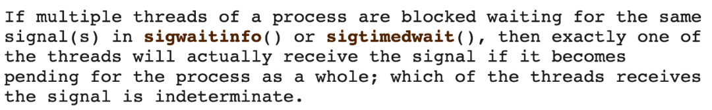

# ANR 监控

Android M(6.0) 版本之后，应用侧无法直接通过监听 `data/anr/trace` 文件，监控是否发生 ANR，那么又有什么其它手段去判定 ANR 呢？目前了解到的方案(思路)主要有下面 2 种：

## 1. 主线程 watchdog 机制

核心思想是在应用层定期向主线程设置探测消息，并在异步设置超时监测，如在规定的时间内没有收到发送的探测消息状态更新，则判定可能发生 ANR，为什么是可能发生 ANR？因为还需要进一步从系统服务获取相关数据(可通过`ActivityManagerService.getProcessesInErrorState()`方法获取进程的ANR信息)，进一步判定是否真的发生 ANR。

[ANR-WatchDog](https://github.com/SalomonBrys/ANR-WatchDog/)就是使用该这个方案, 核心代码如下：

```java

private final Handler _uiHandler = new Handler(Looper.getMainLooper());
private final int _timeoutInterval;
private volatile long _tick = 0;
private volatile boolean _reported = false;

private final Runnable _ticker = new Runnable() {
    @Override public void run() {
        _tick = 0;
        _reported = false;
    }
};

@Override
public void run() {
    setName("|ANR-WatchDog|");

    //_timeoutInterval为设定的超时时长
    long interval = _timeoutInterval;
    while (!isInterrupted()) {
        //_tick为标志，主线程执行了下面发送的_ticker这个Runnable, 那么_tick就会被置为0
        boolean needPost = _tick == 0;
        //在子线程里面需要把标志改为非0，待会儿主线程执行了才知道
        _tick += interval;
        if (needPost) {
            //发个消息给主线程
            _uiHandler.post(_ticker);
        }

        //子线程睡一段时间，起来的时候要是标志位_tick没有被改成0，说明主线程太忙了，或者卡顿了，没来得及执行该消息
        try {
            Thread.sleep(interval);
        } catch (InterruptedException e) {
            _interruptionListener.onInterrupted(e);
            return ;
        }

        // If the main thread has not handled _ticker, it is blocked. ANR.
        if (_tick != 0 && !_reported) {
            //noinspection ConstantConditions
            //排除debug的情况
            if (!_ignoreDebugger && (Debug.isDebuggerConnected() || Debug.waitingForDebugger())) {
                Log.w("ANRWatchdog", "An ANR was detected but ignored because the debugger is connected (you can prevent this with setIgnoreDebugger(true))");
                _reported = true;
                continue ;
            }

            //可以自定义一个Interceptor告诉watchDog，当前上下文环境是否可以进行上报
            interval = _anrInterceptor.intercept(_tick);
            if (interval > 0) {
                continue;
            }

            //上报线程堆栈
            final ANRError error;
            if (_namePrefix != null) {
                error = ANRError.New(_tick, _namePrefix, _logThreadsWithoutStackTrace);
            } else {
                error = ANRError.NewMainOnly(_tick);
            }
            //回调
            _anrListener.onAppNotResponding(error);
            interval = _timeoutInterval;
            _reported = true;
        }
    }
}
```

## 2. 监听 SIGNALQUIT 信号

我们在[ANR原理](https://blog.adison.top/perf-opt/Android/anr/anr)提到了虚拟机是通过注册和监听 SIGNALQUIT 信号的方式执行请求的，我们也可以在应用层参考此方式注册相同信号去监听。只要我们能监控到系统发送的SIGQUIT信号，也就能够监控到发生了ANR。

当接收到该信号时，过滤场景，确定是发生用户可感知的 ANR 之后，从 Java 层获取各线程堆栈，或通过反射方式获取到虚拟机内部 Dump 线程堆栈的接口，在内存映射的函数地址，强制调用该接口，并将数据重定向输出到本地。

**该方案从思路上来说优于第一种方案，并且遵循系统信息获取方式，获取的线程信息及虚拟机信息更加全面，但缺点是对性能影响比较大，对于复杂的 App 来说，统计其耗时，部分场景一次 Dump 耗时可能要超过 10S。**

Linux系统提供了两种监听信号的方法，一种是SignalCatcher线程使用的*sigwait*方法进行同步、阻塞地监听，另一种是使用*sigaction*方法注册signal handler进行异步监听，我们都来试试。

### 2.1 sigwait

```c++
static void *mySigQuitCatcher(void* args) {
    while (true) {
        int sig;
        sigset_t sigSet;
        sigemptyset(&sigSet);
        sigaddset(&sigSet, SIGQUIT);
        sigwait(&sigSet, &sig);
        if (sig == SIGQUIT) {
            //Got SIGQUIT
        }
    }
}
pthread_t pid;
pthread_create(&pid, nullptr, mySigQuitCatcher, nullptr);
pthread_detach(pid);
```

这个时候就有了两个不同的线程*sigwait*同一个SIGQUIT，具体会走到哪个呢，我们在*sigwait*的文档中找到了这样的描述（*sigwait*方法是由*sigwaitinfo*方法实现的）



原来 **当有两个线程通过*sigwait*方法监听同一个信号时，具体是哪一个线程收到信号时不能确定的**。不确定可不行，当然不满足我们的需求


