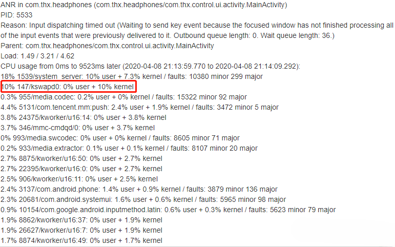
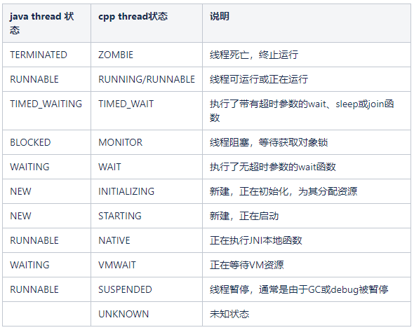

# ANR 分析

## 1. 导致ANR的原因

很多开发者认为，那就是耗时操作导致ANR，全部是app应用层的问题。实际上，线上环境大部分ANR由系统原因导致。

### 1.1 应用层导致ANR（耗时操作）

* **主线程耗时**：如死循环、主线程IO、处理大数据

* **锁出错**：主线程等待子线程的锁

* **内存紧张**：系统分配给一个应用的内存是有上限的，长期处于内存紧张，会导致频繁内存交换，进而导致应用的一些操作超时

### 1.2 系统导致ANR

* **CPU被抢占**：一般来说，前台在玩游戏，可能会导致你的后台广播被抢占CPU

* **系统服务无法及时响应**：比如获取系统联系人等，系统的服务都是Binder机制，服务能力也是有限的，有可能系统服务长时间不响应导致ANR

* **其他应用占用的大量内存**

## 2. ANR分析

### 2.1 CPU 负载

发生ANR时， 在`Logcat`中搜索`ANR in`关键词

```shell
Load: 2.62 / 2.55 / 2.25
CPU usage from 0ms to 1987ms later (2020-03-10 08:31:55.169 to 2020-03-10 08:32:17.156):
  41% 2080/system_server: 28% user + 12% kernel / faults: 76445 minor 180 major
  26% 9378/com.xiaomi.store: 20% user + 6.8% kernel / faults: 68408 minor 68 major
........省略N行.....
66% TOTAL: 20% user + 15% kernel + 28% iowait + 0.7% irq + 0.7% softirq
```

- 第一行：1、5、15 分钟内正在使用和等待使用CPU 的活动进程的平均数
- 第二行：表明负载信息抓取在ANR发生之后的0~1987ms。同时也指明了ANR的时间点：2020-03-10 08:31:55.169
- 中间部分：各个进程占用的CPU的详细情况
- 最后一行：各个进程合计占用的CPU信息。

**名词解释：**

* user:用户态,kernel:内核态

* faults:内存缺页，minor——轻微的，major——重度，需要从磁盘拿数据

* iowait:IO使用（等待）占比

* irq:硬中断，softirq:软中断

**注意：**

- iowait占比很高，意味着有很大可能，是io耗时导致ANR，具体进一步查看有没有进程`faults major`比较多。
- 单进程CPU的负载并不是以100%为上限，而是有几个核，就有百分之几百，如4核上限为400%。

> CPU 负载高现象也会体现在log日志中，搜索`slow_operation`, 如果存在，可能CPU负载过高，系统进程的调度也会受到影响。

### 2.2 内存信息

#### 2.2.1 trace文件

发生ANR的时候，系统会产生一份anr日志文件（手机的`data/anr/trace` 或者`data/system/dropbox`目录下，文件名称可能各厂商不一样，业内大多称呼为trace文件。

要是从上面得不到trace文件，也可以通过`adb bugreport`尝试获取。trace文件中有应用内存信息，如下：

```java
----- pid 8034 at 2023-01-02 10:11:04 -----
Cmd line: com.adison.notes
....
//省略N行
....

//已分配堆内存大小8762KB,其中3570KB已用，总分配89339个对象
Heap: 59% free, 3570KB/8762KB; 89339 objects
....
//省略N行
....
// 进程创建到现在一共创建了多少对象
Total number of allocations 127155 
//进程创建到现在一共申请了多少内存
Total bytes allocated 6162KB
//进程创建到现在一共释放了多少内存
Total bytes freed 2591KB
//不扩展堆的情况下可用的内存
Free memory 5191KB
//GC前的可用内存
Free memory until GC 5191KB
//OOM之前的可用内存
Free memory until OOME 252MB
//当前总内存（已用+可用）
Total memory 8762KB
//进程最多能申请的内存
Max memory 256MB
....
//省略N行
....

suspend all histogram:	Sum: 275us 99% C.I. 2us-92.160us Avg: 17.187us Max: 94us
//当前进程共15个线程
DALVIK THREADS (15):
"main" prio=5 tid=1 Runnable
  | group="main" sCount=0 dsCount=0 flags=0 obj=0x723b3830 self=0xe3540e10
  | sysTid=8034 nice=-10 cgrp=default sched=0/0 handle=0xed7bd474
  | state=R schedstat=( 27494067641 658836178 2642 ) utm=2723 stm=25 core=7 HZ=100
  | stack=0xff1e5000-0xff1e7000 stackSize=8192KB
  | held mutexes= "mutator lock"(shared held)
  at com.adison.notes.anr.ANRTest.makeMainThreadAnr(ANRTest.kt:21)
  at java.lang.reflect.Method.invoke(Native method)
  at androidx.appcompat.app.AppCompatViewInflater$DeclaredOnClickListener.onClick(AppCompatViewInflater.java:409)
  at android.view.View.performClick(View.java:8160)
  at android.widget.TextView.performClick(TextView.java:16222)
  at com.google.android.material.button.MaterialButton.performClick(MaterialButton.java:1119)
  at android.view.View.performClickInternal(View.java:8137)
  at android.view.View.access$3700(View.java:888)
  at android.view.View$PerformClick.run(View.java:30236)
  at android.os.Handler.handleCallback(Handler.java:938)
  at android.os.Handler.dispatchMessage(Handler.java:99)
  at android.os.Looper.loop(Looper.java:246)
  at android.app.ActivityThread.main(ActivityThread.java:8512)
  at java.lang.reflect.Method.invoke(Native method)
  at com.android.internal.os.RuntimeInit$MethodAndArgsCaller.run(RuntimeInit.java:602)
  at com.android.internal.os.ZygoteInit.main(ZygoteInit.java:1130)
```

从含义可以得出结论：**Free memory until OOME** 的值很小的时候，已经处于内存紧张状态。应用可能是占用了过多内存

#### 2.2.2 Logcat

我们知道通常内存紧张的时候，kswapd线程会活跃起来进行回收内存。查看CPU 负载时要是 **kswapd的CPU占据排进top3的话，这个问题受系统低内存影响比较大**。




另外这个时候，搜索`lowmemorykiller`关键词，如果存在则查看发生时间和ANR时间是否大致对应，相差无几的话, 可以看到问题时间区域会有较多的查杀进程行为，我们通常会关注下"lowmemorykiller"这一行杀的进程adj值，adj值越低，说明当前系统内存越吃紧。

#### 2.2.3 eventlog

另外，除了trace文件中有内存信息，普通的`eventlog`日志中，也有内存信息

```shell
04-02 22:00:08.195  1531  1544 I am_meminfo: [350937088,41086976,492830720,427937792,291887104]
```

以上四个值分别指的是：

- Cached
- Free,
- Zram,
- Kernel,Native

Cached+Free的内存代表着当前整个手机的可用内存，如果值很小，意味着处于内存紧张状态。一般低内存的判定阈值为：4G 内存手机以下阀值：350MB，以上阀值则为：450MB

> 如果ANR时间点前后，日志里有打印onTrimMemory，也可以作为内存紧张的一个参考判断


在开发调试中可以通过如下命令查看EventLog信息：

```shell
adb logcat -b events
```
!!! notes "EventLog"

	在平时开发和处理bug的过程中经常会和EventLog打交到，通过EventLog来分析Activity、	Process、CPU、Window等相关信息。
	
	在开发调试中可以通过如下命令查看EventLog信息：
	```shell
	adb logcat -b events
	```
	
	那么会输出大量类似这样的信息：
	```shell
	06-01 13:44:55.518  7361  8289 I am_create_service: 				[0,111484394,.StatService,10094,7769]
	06-01 13:44:55.540  7361  8343 I am_proc_bound: 			[0,3976,com.android.providers.calendar]
	06-01 13:44:55.599  7361  8033 I am_create_service: 	[0,61349752,.UpdateService,10034,1351]
	06-01 13:44:55.625  7361  7774 I am_destroy_service: [0,61349752,1351]
	...
	```
	
	从EventLog中我们可以获取到不少有用的信息，下面列举下部分字段含义：
	
	* am_low_memory：位于AMS.killAllBackgroundProcesses或者AMS.appDiedLocked，记录当前Lru进程队列长度。
	* am_pss：位于AMS.recordPssSampleLocked(
	* am_meminfo：位于AMS.dumpApplicationMemoryUsage
	* am_proc_start:位于AMS.startProcessLocked，启动进程
	* am_proc_bound:位于AMS.attachApplicationLocked
	* am_kill: 位于ProcessRecord.kill，杀掉进程
	* **am_anr**: 位于AMS.appNotResponding ，可以根据时间戳，找到anr文件夹下对应的trace文件
	* am_crash:位于AMS.handleApplicationCrashInner
	* am_wtf:位于AMS.handleApplicationWtf
	* am_activity_launch_time：位于ActivityRecord.reportLaunchTimeLocked()，后面两个参数分别是thisTime和 totalTime.
	* am_activity_fully_drawn_time:位于ActivityRecord.reportFullyDrawnLocked, 后面两个参数分别是thisTime和 totalTime
	
	详细参见[Android EventLog含义](http://gityuan.com/2016/05/15/event-log/)

### 2.3 堆栈消息

堆栈信息是最重要的一个信息，展示了ANR发生的进程当前所有线程的状态。

```shell
suspend all histogram:  Sum: 2.834s 99% C.I. 5.738us-7145.919us Avg: 607.155us Max: 41543us
DALVIK THREADS (248):
"Signal Catcher" daemon prio=5 tid=4 Runnable
  | group="system" sCount=0 dsCount=0 flags=0 obj=0x18c84570 self=0x7252417800
  | sysTid=7772 nice=0 cgrp=default sched=0/0 handle=0x725354ad50
  | state=R schedstat=( 16273959 1085938 5 ) utm=0 stm=1 core=4 HZ=100
  | stack=0x7253454000-0x7253456000 stackSize=991KB
  | held mutexes= "mutator lock"(shared held)
  native: #00 pc 000000000042f8e8  /apex/com.android.runtime/lib64/libart.so (art::DumpNativeStack(std::__1::basic_ostream<char, std::__1::char_traits<char>>&, int, BacktraceMap*, char const*, art::ArtMethod*, void*, bool)+140)
  native: #01 pc 0000000000523590  /apex/com.android.runtime/lib64/libart.so (art::Thread::DumpStack(std::__1::basic_ostream<char, std::__1::char_traits<char>>&, bool, BacktraceMap*, bool) const+508)
  native: #02 pc 000000000053e75c  /apex/com.android.runtime/lib64/libart.so (art::DumpCheckpoint::Run(art::Thread*)+844)
  native: #03 pc 000000000053735c  /apex/com.android.runtime/lib64/libart.so (art::ThreadList::RunCheckpoint(art::Closure*, art::Closure*)+504)
  native: #04 pc 0000000000536744  /apex/com.android.runtime/lib64/libart.so (art::ThreadList::Dump(std::__1::basic_ostream<char, std::__1::char_traits<char>>&, bool)+1048)
  native: #05 pc 0000000000536228  /apex/com.android.runtime/lib64/libart.so (art::ThreadList::DumpForSigQuit(std::__1::basic_ostream<char, std::__1::char_traits<char>>&)+884)
  native: #06 pc 00000000004ee4d8  /apex/com.android.runtime/lib64/libart.so (art::Runtime::DumpForSigQuit(std::__1::basic_ostream<char, std::__1::char_traits<char>>&)+196)
  native: #07 pc 000000000050250c  /apex/com.android.runtime/lib64/libart.so (art::SignalCatcher::HandleSigQuit()+1356)
  native: #08 pc 0000000000501558  /apex/com.android.runtime/lib64/libart.so (art::SignalCatcher::Run(void*)+268)
  native: #09 pc 00000000000cf7c0  /apex/com.android.runtime/lib64/bionic/libc.so (__pthread_start(void*)+36)
  native: #10 pc 00000000000721a8  /apex/com.android.runtime/lib64/bionic/libc.so (__start_thread+64)
  (no managed stack frames)

"main" prio=5 tid=1 Sleeping
  | group="main" sCount=1 dsCount=0 flags=1 obj=0x73907540 self=0x725f010800
  | sysTid=7761 nice=-10 cgrp=default sched=1073741825/2 handle=0x72e60080d0
  | state=S schedstat=( 281909898 5919799 311 ) utm=20 stm=7 core=4 HZ=100
  | stack=0x7fca180000-0x7fca182000 stackSize=8192KB
  | held mutexes=
  at java.lang.Thread.sleep(Native method)
  - sleeping on <0x00f895d9> (a java.lang.Object)
  at java.lang.Thread.sleep(Thread.java:443)
  - locked <0x00f895d9> (a java.lang.Object)
  at java.lang.Thread.sleep(Thread.java:359)
  at android.os.SystemClock.sleep(SystemClock.java:131)
  at com.xfhy.watchsignaldemo.MainActivity.makeAnr(MainActivity.kt:35)
  at java.lang.reflect.Method.invoke(Native method)
  at androidx.appcompat.app.AppCompatViewInflater$DeclaredOnClickListener.onClick(AppCompatViewInflater.java:441)
  at android.view.View.performClick(View.java:7317)
  at com.google.android.material.button.MaterialButton.performClick(MaterialButton.java:1219)
  at android.view.View.performClickInternal(View.java:7291)
  at android.view.View.access$3600(View.java:838)
  at android.view.View$PerformClick.run(View.java:28247)
  at android.os.Handler.handleCallback(Handler.java:900)
  at android.os.Handler.dispatchMessage(Handler.java:103)
  at android.os.Looper.loop(Looper.java:219)
  at android.app.ActivityThread.main(ActivityThread.java:8668)
  at java.lang.reflect.Method.invoke(Native method)
  at com.android.internal.os.RuntimeInit$MethodAndArgsCaller.run(RuntimeInit.java:513)
  at com.android.internal.os.ZygoteInit.main(ZygoteInit.java:1109)

  ... //此处省略剩余的N个线程
```


#### 2.3.1. 参数解读

```java
"Signal Catcher" daemon prio=5 tid=4 Runnable
  | group="system" sCount=0 dsCount=0 flags=0 obj=0x18c84570 self=0x7252417800
  | sysTid=7772 nice=0 cgrp=default sched=0/0 handle=0x725354ad50
  | state=R schedstat=( 16273959 1085938 5 ) utm=0 stm=1 core=4 HZ=100
  | stack=0x7253454000-0x7253456000 stackSize=991KB
  | held mutexes= "mutator lock"(shared held)
```

**第1行：**

```shell
"Signal Catcher" daemon prio=5 tid=4 Runnable
```

- "Signal Catcher" daemon ： 线程名，有daemon表示守护线程

- prio：线程优先级

- tid：线程内部id

- **线程状态：Runnable**

  

下图为线程状态对应关系表。



> 一般来说：main线程处于 BLOCK、WAITING、TIMEWAITING状态，那基本上是函数阻塞导致ANR；
>
> 如果main线程无异常，则应该排查CPU负载和内存环境。


**第2行：**

```shell
| group="system" sCount=0 dsCount=0 flags=0 obj=0x18c84570 self=0x7252417800
```

- group：线程所属的线程组
- sCount：线程挂起次数
- dsCount：用于调试的线程挂起次数
- obj：当前线程关联的Java线程对象
- self：当前线程地址

**第3行：**

```shell
| sysTid=7772 nice=0 cgrp=default sched=0/0 handle=0x725354ad50
```

- sysTid：线程真正意义上的tid
- nice：调度优先级，nice的取值范围为-20到19。通常来说nice的值越大，进程的优先级就越低，获得CPU调用的机会越少，nice值越小，进程的优先级则越高，获得CPU调用的机会越多。
- cgrp：进程所属的进程调度组
- sched：调度策略
- handle：函数处理地址

**第4行：**

```shell
| state=R schedstat=( 16273959 1085938 5 ) utm=0 stm=1 core=4 HZ=100
```

- state：线程状态
- schedstat：CPU调度时间统计（schedstat括号中的3个数字依次是Running、Runable、Switch，Running时间：CPU运行的时间，单位ns，Runable时间：RQ队列的等待时间，单位ns，Switch次数：CPU调度切换次数）
- utm/stm：用户态/内核态的CPU时间，线程的cpu耗时是两者相加(utm+stm)，utm,stm 单位换算成时间单位为 1 比 10ms。
- core：数字表示的跑在哪个核上，core=4表示打印这段日志时该线程跑在CPU4上
- HZ：时钟频率

**第5行：**

```shell
| stack=0x7253454000-0x7253456000 stackSize=991KB
```

- stack：线程栈的地址区间
- stackSize：栈的大小

**第6行：**

```shell
| held mutexes= "mutator lock"(shared held)
```

- mutex：所持有mutex类型，有独占锁exclusive和共享锁shared两类


## 3. ANR 案例分析

### 3.1 主线程耗时

```java
"main" prio=5 tid=1 Runnable
  | group="main" sCount=0 dsCount=0 flags=0 obj=0x72deb848 self=0x7748c10800
  | sysTid=8968 nice=-10 cgrp=default sched=0/0 handle=0x77cfa75ed0
  | state=R schedstat=( 24783612979 48520902 756 ) utm=2473 stm=5 core=5 HZ=100
  | stack=0x7fce68b000-0x7fce68d000 stackSize=8192KB
  | held mutexes= "mutator lock"(shared held)
  at com.example.test.MainActivity$onCreate$2.onClick(MainActivity.kt:20)——关键行！！！
  at android.view.View.performClick(View.java:7187)
  at android.view.View.performClickInternal(View.java:7164)
  at android.view.View.access$3500(View.java:813)
  at android.view.View$PerformClick.run(View.java:27640)
  at android.os.Handler.handleCallback(Handler.java:883)
  at android.os.Handler.dispatchMessage(Handler.java:100)
  at android.os.Looper.loop(Looper.java:230)
  at android.app.ActivityThread.main(ActivityThread.java:7725)
  at java.lang.reflect.Method.invoke(Native method)
  at com.android.internal.os.RuntimeInit$MethodAndArgsCaller.run(RuntimeInit.java:526)
  at com.android.internal.os.ZygoteInit.main(ZygoteInit.java:1034)
```

上述日志表明，主线程正处于执行状态，看堆栈信息可知不是处于空闲状态，发生ANR可能是因为一处click监听函数里执行了耗时操作。

### 3.2 主线程无卡顿，处于正常状态堆栈

```java
"main" prio=5 tid=1 Native
  | group="main" sCount=1 dsCount=0 flags=1 obj=0x74b38080 self=0x7ad9014c00
  | sysTid=23081 nice=0 cgrp=default sched=0/0 handle=0x7b5fdc5548
  | state=S schedstat=( 284838633 166738594 505 ) utm=21 stm=7 core=1 HZ=100
  | stack=0x7fc95da000-0x7fc95dc000 stackSize=8MB
  | held mutexes=
  kernel: __switch_to+0xb0/0xbc
  kernel: SyS_epoll_wait+0x288/0x364
  kernel: SyS_epoll_pwait+0xb0/0x124
  kernel: cpu_switch_to+0x38c/0x2258
  native: #00 pc 000000000007cd8c  /system/lib64/libc.so (__epoll_pwait+8)
  native: #01 pc 0000000000014d48  /system/lib64/libutils.so (android::Looper::pollInner(int)+148)
  native: #02 pc 0000000000014c18  /system/lib64/libutils.so (android::Looper::pollOnce(int, int*, int*, void**)+60)
  native: #03 pc 00000000001275f4  /system/lib64/libandroid_runtime.so (android::android_os_MessageQueue_nativePollOnce(_JNIEnv*, _jobject*, long, int)+44)
  at android.os.MessageQueue.nativePollOnce(Native method)
  at android.os.MessageQueue.next(MessageQueue.java:330)
  at android.os.Looper.loop(Looper.java:169)
  at android.app.ActivityThread.main(ActivityThread.java:7073)
  at java.lang.reflect.Method.invoke(Native method)
  at com.android.internal.os.RuntimeInit$MethodAndArgsCaller.run(RuntimeInit.java:536)
  at com.android.internal.os.ZygoteInit.main(ZygoteInit.java:876)
```

比如这个主线程堆栈，看起来很正常，主线程是空闲的，因为它正处于nativePollOnce，正在等待新消息。处于这个状态，那还发生了ANR，可能有2个原因：

1. dump堆栈时机太晚了，ANR已经发生过了，才去dump堆栈，此时主线程已经恢复正常了
2. CPU抢占或者内存紧张等其他因素引起

遇到这种情况，要先去分析CPU、内存的使用情况。其次可以关注抓取日志的时间和ANR发生的时间是否相隔太久，时间太久这个堆栈就没有分析的意义了。


### 3.3 主线程被锁阻塞

```java
"main" prio=5 tid=1 Blocked
  | group="main" sCount=1 dsCount=0 flags=1 obj=0x72deb848 self=0x7748c10800
  | sysTid=22838 nice=-10 cgrp=default sched=0/0 handle=0x77cfa75ed0
  | state=S schedstat=( 390366023 28399376 279 ) utm=34 stm=5 core=1 HZ=100
  | stack=0x7fce68b000-0x7fce68d000 stackSize=8192KB
  | held mutexes=
  at com.example.test.MainActivity$onCreate$1.onClick(MainActivity.kt:15)
  - waiting to lock <0x01aed1da> (a java.lang.Object) held by thread 3 ——————关键行！！！
  at android.view.View.performClick(View.java:7187)
  at android.view.View.performClickInternal(View.java:7164)
  at android.view.View.access$3500(View.java:813)
  at android.view.View$PerformClick.run(View.java:27640)
  at android.os.Handler.handleCallback(Handler.java:883)
  at android.os.Handler.dispatchMessage(Handler.java:100)
  at android.os.Looper.loop(Looper.java:230)
  at android.app.ActivityThread.main(ActivityThread.java:7725)
  at java.lang.reflect.Method.invoke(Native method)
  at com.android.internal.os.RuntimeInit$MethodAndArgsCaller.run(RuntimeInit.java:526)
  at com.android.internal.os.ZygoteInit.main(ZygoteInit.java:1034)
   
  ........省略N行.....
   
  "WQW TEST" prio=5 tid=3 TimeWating
  | group="main" sCount=1 dsCount=0 flags=1 obj=0x12c44230 self=0x772f0ec000
  | sysTid=22938 nice=0 cgrp=default sched=0/0 handle=0x77391fbd50
  | state=S schedstat=( 274896 0 1 ) utm=0 stm=0 core=1 HZ=100
  | stack=0x77390f9000-0x77390fb000 stackSize=1039KB
  | held mutexes=
  at java.lang.Thread.sleep(Native method)
  - sleeping on <0x043831a6> (a java.lang.Object)
  at java.lang.Thread.sleep(Thread.java:440)
  - locked <0x043831a6> (a java.lang.Object)
  at java.lang.Thread.sleep(Thread.java:356)
  at com.example.test.MainActivity$onCreate$2$thread$1.run(MainActivity.kt:22)
  - locked <0x01aed1da> (a java.lang.Object)————————————————————关键行！！！
  at java.lang.Thread.run(Thread.java:919)
```

这是一个典型的主线程被锁阻塞的例子；

```java
waiting to lock <0x01aed1da> (a java.lang.Object) held by thread 3
```

其中等待的锁是`<0x01aed1da>`，这个锁的持有者是线程 3。进一步搜索 “tid=3” 找到线程3， 发现它正在TimeWating。

那么ANR的原因找到了：线程3持有了一把锁，并且自身长时间不释放，主线程等待这把锁发生超时。在线上环境中，常见因锁而ANR的场景是**SharePreference写入**。

### 3.4  CPU被抢占

```java
CPU usage from 0ms to 10625ms later (2020-03-09 14:38:31.633 to 2020-03-09 14:38:42.257):
  543% 2045/com.alibaba.android.rimet: 54% user + 89% kernel / faults: 4608 minor 1 major ————关键行！！！
  99% 674/android.hardware.camera.provider@2.4-service: 81% user + 18% kernel / faults: 403 minor
  24% 32589/com.wang.test: 22% user + 1.4% kernel / faults: 7432 minor 1 major
  ........省略N行.....
```

如上日志，第二行是钉钉的进程，占据CPU高达543%，抢占了大部分CPU资源，因而导致发生ANR。

### 3.5 内存紧张导致ANR

如果有一份日志，CPU和堆栈都很正常，仍旧发生ANR，考虑是内存紧张。

从CPU第一行信息可以发现，ANR的时间点是`2020-10-31 22:38:58.468—CPU usage from 0ms to 21752ms later (2020-10-31 22:38:58.468 to 2020-10-31 22:39:20.220)`

接着去系统日志里搜索`am_meminfo`、onTrimMemory或者`GC`信息， `am_meminfo`要是没有搜索到可以从`Eventlog`中搜。以`onTrimMemory`为例：

```shell
10-31 22:37:19.749 20733 20733 E Runtime : onTrimMemory level:80,pid:com.xxx.xxx:Launcher0
10-31 22:37:33.458 20733 20733 E Runtime : onTrimMemory level:80,pid:com.xxx.xxx:Launcher0
10-31 22:38:00.153 20733 20733 E Runtime : onTrimMemory level:80,pid:com.xxx.xxx:Launcher0
10-31 22:38:58.731 20733 20733 E Runtime : onTrimMemory level:80,pid:com.xxx.xxx:Launcher0
10-31 22:39:02.816 20733 20733 E Runtime : onTrimMemory level:80,pid:com.xxx.xxx:Launcher
```

可以看出，在发生ANR的时间点前后，内存都处于紧张状态，level等级是80，查看Android API 文档；

```java
/**
    * Level for {@link #onTrimMemory(int)}: the process is nearing the end
    * of the background LRU list, and if more memory isn't found soon it will
    * be killed.
    */
   static final int TRIM_MEMORY_COMPLETE = 80;
```

可知80这个等级是很严重的，应用马上就要被杀死，被杀死的这个应用从名字可以看出来是桌面，连桌面都快要被杀死，那普通应用能好到哪里去呢？

一般来说，发生内存紧张，会导致多个应用发生ANR，**所以在日志中如果发现有多个应用一起ANR了，可以初步判定，此ANR与你的应用无关。**


### 3.6 系统服务超时(Binder阻塞等待)导致ANR

系统服务超时一般会包含**BinderProxy.transactNative**关键字，请看如下日志：

```java
"main" prio=5 tid=1 Native
  | group="main" sCount=1 dsCount=0 obj=0x73ee6470 self=0xb4d76500
  | sysTid=22831 nice=0 cgrp=default sched=0/0 handle=0xb6f4bc00
  | state=S schedstat=( 0 0 0 ) utm=22 stm=22 core=0 HZ=100
  | stack=0xbe283000-0xbe285000 stackSize=8MB
  | held mutexes=
  native: #00 pc 000410ac  /system/lib/libc.so (__ioctl+8)
  native: #01 pc 000477e5  /system/lib/libc.so (ioctl+14)
  native: #02 pc 0001e7c5  /system/lib/libbinder.so (android::IPCThreadState::talkWithDriver(bool)+132)
  native: #03 pc 0001ee17  /system/lib/libbinder.so (android::IPCThreadState::waitForResponse(android::Parcel*, int*)+38)
  native: #04 pc 0001efcd  /system/lib/libbinder.so (android::IPCThreadState::transact(int, unsigned int, android::Parcel const&, android::Parcel*, unsigned int)+124)
  native: #05 pc 00019fb7  /system/lib/libbinder.so (android::BpBinder::transact(unsigned int, android::Parcel const&, android::Parcel*, unsigned int)+30)
  native: #06 pc 00086de9  /system/lib/libandroid_runtime.so (???)
  native: #07 pc 00d94629  /data/dalvik-cache/arm/system@framework@boot.oat (Java_android_os_BinderProxy_transactNative__ILandroid_os_Parcel_2Landroid_os_Parcel_2I+140)
  at android.os.BinderProxy.transactNative(Native method)
  at android.os.BinderProxy.transact(Binder.java:503)
  at android.net.INetworkPolicyManager$Stub$Proxy.getNetworkPolicies(INetworkPolicyManager.java:410)
  at android.net.NetworkPolicyManager.getNetworkPolicies(NetworkPolicyManager.java:174)
  at com.android.settings.net.NetworkPolicyEditor.read(NetworkPolicyEditor.java:57)
	........省略N行.....
  at com.android.internal.os.ZygoteInit$MethodAndArgsCaller.run(ZygoteInit.java:762)
  at com.android.internal.os.ZygoteInit.main(ZygoteInit.java:652)
 
 ........省略N行.....   
  "Binder_4" prio=5 tid=56 Blocked
  | group="main" sCount=1 dsCount=0 obj=0x1321a0a0 self=0xad31e200
  | sysTid=2491 nice=0 cgrp=default sched=0/0 handle=0x9fd00930
  | state=S schedstat=( 0 0 0 ) utm=46441 stm=46582 core=1 HZ=100
  | stack=0x9fc04000-0x9fc06000 stackSize=1014KB
  | held mutexes=
  at com.android.server.net.NetworkPolicyManagerService.getNetworkPolicies(NetworkPolicyManagerService.java:1696)
  - waiting to lock <0x07439315> (a java.lang.Object) held by thread 35
  at android.net.INetworkPolicyManager$Stub.onTransact(INetworkPolicyManager.java:145)
  at android.os.Binder.execTransact(Binder.java:453
 
  ........省略N行.....   
  "NetworkPolicy" prio=5 tid=35 TimedWaiting
  | group="main" sCount=1 dsCount=0 obj=0x12d98940 self=0x9f91f700
  | sysTid=2415 nice=0 cgrp=default sched=0/0 handle=0xa0f33930
  | state=S schedstat=( 0 0 0 ) utm=7681 stm=7783 core=0 HZ=100
  | stack=0xa0e31000-0xa0e33000 stackSize=1038KB
  | held mutexes=
  at java.lang.Object.wait!(Native method)
  - waiting on <0x02580c1b> (a java.lang.Object)
  at java.lang.Thread.parkFor$(Thread.java:1220)
  - locked <0x02580c1b> (a java.lang.Object)
  at sun.misc.Unsafe.park(Unsafe.java:299)
  at java.util.concurrent.locks.LockSupport.parkNanos(LockSupport.java:198)
  at java.util.concurrent.locks.AbstractQueuedSynchronizer$ConditionObject.awaitNanos(AbstractQueuedSynchronizer.java:2053)
  at java.util.concurrent.ArrayBlockingQueue.poll(ArrayBlockingQueue.java:372)
  at com.android.server.NativeDaemonConnector$ResponseQueue.remove(NativeDaemonConnector.java:634)
  at com.android.server.NativeDaemonConnector.executeForList(NativeDaemonConnector.java:426)
  at com.android.server.NativeDaemonConnector.execute(NativeDaemonConnector.java:345)
  at com.android.server.NativeDaemonConnector.execute(NativeDaemonConnector.java:340)
  at com.android.server.NetworkManagementService.setInterfaceQuota(NetworkManagementService.java:1712)
  - locked <0x0b0f91b8> (a java.lang.Object)
  at com.android.server.net.NetworkPolicyManagerService.setInterfaceQuota(NetworkPolicyManagerService.java:2421)
  at com.android.server.net.NetworkPolicyManagerService.updateNetworkRulesLocked(NetworkPolicyManagerService.java:1232)
  at com.android.server.net.NetworkPolicyManagerService$14.onReceive(NetworkPolicyManagerService.java:1060)
  - locked <0x07439315> (a java.lang.Object)
  at android.app.LoadedApk$ReceiverDispatcher$Args.run(LoadedApk.java:881)
  at android.os.Handler.handleCallback(Handler.java:739)
  at android.os.Handler.dispatchMessage(Handler.java:95)
  at android.os.Looper.loop(Looper.java:148)
  at android.os.HandlerThread.run(HandlerThread.java:61)

```

我们分析下上面堆栈：

```shell
  at android.os.BinderProxy.transactNative(Native method)
  at android.os.BinderProxy.transact(Binder.java:503)
  at android.net.INetworkPolicyManager$Stub$Proxy.getNetworkPolicies(INetworkPolicyManager.java:410)
```

 主线程被Binder对端block，而对端是在systemserver中的NetworkPolicyManager。

  接下来继续去查NetworkPolicyManager为何会被block。
  通常情况下，可以搜索getNetworkPolicies，一般的对端的函数并不会修改函数名：

  可以看到我们的对端`Binder_4` 被Tid=35的人拿住了一把锁`（0x07439315）`，那么继续看tid=35是谁，有两种方法：
1. 搜索tid=35
2. 搜索0x07439315，找到  `- locked <0x07439315> (a java.lang.Object)`

可以看到，`NetworkPolicy（tid=35`）在通过NativeDaemonConnector和netd通信（setInterfaceQuota）

  我们结合log来看下是否有有用信息，按照之前的经验，netd在执行完cmd的时候，会打印出`slow operation`。
  在发生ANR的前后，查找netd相关的打印：

```shell
  06-19 15:29:00.997  1235  1270 I am_anr  : [0,22831,com.android.settings,818429509,Input dispatching timed out (Waiting because no window has focus but there is a focused application that may eventually add a window when it finishes starting up.)]
  06-19 15:29:05.683  1235  2415 E NetdConnector: NDC Command {55445 bandwidth setiquota seth_w0 9223372036854775807} took too long (4755ms
  06-19 15:29:05.723  1235  2491 I dvm_lock_sample: [system_server,1,Binder_4,4919,NetworkPolicyManagerService.java,1696,-,1056,100]
```

  从eventslog中还可以发现，settings出现了两次连续的ANR，而上下文中都有类似上面的`dvm_lock_sample NetworkPolicyManagerService`相关的告警。  
  因此虽然15:28的这次ANR并没有打出有用的栈，但是我们还是可以猜测出这两次ANR的原因都是netd的cmd耗时太久导致的（在主线程的调用路径上存在必然的block）
  那么，在netd可能无法修改的情况下，我们应该如何去resolve这个问题呢。

**将可能存在block的操作放到非UI线程中去做。**


>  NETD是Android一个专门管理网络链接, 路由/带宽/防火墙策略以及iptables的系统Daemon进程
>
> Eventlog中的dvm_lock_sample ：在同步锁发生content的时候，虚拟机会将这个竞争记录在eventlog中：
>
> ```shell
>  dvm_lock_sample: [system_server,1,Binder_7, 22, ActivityManagerService.java,15921,-,9628,4]
> ```
>
> * system_server: 进程名  
> * Binder_7:被block线程
> * 22:block时间（ms）
> * ActivityManagerService.java,15921: 被block的行号
> * 9628: 持有者行号			                                          
>
> 如果主线程是被binder对端、被同步锁block，那么eventlog中就很有可能会有dvm_lock_sample的打印。

### 3.7 Binder线程池耗尽

我们知道应用最多支持16个binder 线程，SystemServer支持最多32个binder 线程。

我们实际项目上，不时会遇到对端Binder 线程池耗尽导致不能响应的案例。

**什么情况下会出现Binder 池耗尽的情况呢？**

举个例子，进程A短时间内发送很多Binder 请求给进程B，这种情况下就有可能会导致在短时间内，接收端进程B的Binder 线程池中的16个Binder线程，都用来响应进程A的Binder请求。

也就是我们常说的Binder线程池耗尽的情况，此时进程B无法处理进程A发过来的新的Binder请求。

```java
      
"main" prio=5 tid=1 NATIVE 
  | group="main" sCount=1 dsCount=0 obj=0x4155acc0 self=0x414943f0
  | sysTid=3287 nice=-1 sched=0/0 cgrp=apps handle=1074065748
  | state=S schedstat=( 0 0 0 ) utm=1241 stm=340 core=0
  #00  pc 00021764  /system/lib/libc.so (epoll_wait+12)
  #01  pc 000105e3  /system/lib/libutils.so (android::Looper::pollInner(int)+94)
  #02  pc 00010811  /system/lib/libutils.so (android::Looper::pollOnce(int, int*, int*, void**)+92)
  #03  pc 0006b345  /system/lib/libandroid_runtime.so (android::NativeMessageQueue::pollOnce(_JNIEnv*, int)+22)
  #04  pc 0001e70c  /system/lib/libdvm.so (dvmPlatformInvoke+112)
  #05  pc 0004dc43  /system/lib/libdvm.so (dvmCallJNIMethod(unsigned int const*, JValue*, Method const*, Thread*)+398)
  #06  pc 00027778  /system/lib/libdvm.so
  #07  pc 0002e410  /system/lib/libdvm.so (dvmMterpStd(Thread*)+76)
  #08  pc 0002bac8  /system/lib/libdvm.so (dvmInterpret(Thread*, Method const*, JValue*)+156)
  #09  pc 00060259  /system/lib/libdvm.so (dvmInvokeMethod(Object*, Method const*, ArrayObject*, ArrayObject*, ClassObject*, bool)+392)
  #10  pc 000683eb  /system/lib/libdvm.so
  #11  pc 00027778  /system/lib/libdvm.so
  #12  pc 0002e410  /system/lib/libdvm.so (dvmMterpStd(Thread*)+76)
  #13  pc 0002bac8  /system/lib/libdvm.so (dvmInterpret(Thread*, Method const*, JValue*)+156)
  #14  pc 0005ff77  /system/lib/libdvm.so (dvmCallMethodV(Thread*, Method const*, Object*, bool, JValue*, std::__va_list)+338)
  #15  pc 0004982b  /system/lib/libdvm.so
  #16  pc 0004de13  /system/lib/libandroid_runtime.so
  #17  pc 0004ecdd  /system/lib/libandroid_runtime.so (android::AndroidRuntime::start(char const*, char const*)+532)
  #18  pc 00001423  /system/bin/app_process
  #19  pc 0000e403  /system/lib/libc.so (__libc_init+50)
  #20  pc 00000f34  /system/bin/app_process
  at android.os.MessageQueue.nativePollOnce(Native Method)
  at android.os.MessageQueue.next(MessageQueue.java:138)
  at android.os.Looper.loop(Looper.java:123)
  at android.app.ActivityThread.main(ActivityThread.java:5294)
  at java.lang.reflect.Method.invokeNative(Native Method)
  at java.lang.reflect.Method.invoke(Method.java:515)
  at com.android.internal.os.ZygoteInit$MethodAndArgsCaller.run(ZygoteInit.java:932)
  at com.android.internal.os.ZygoteInit.main(ZygoteInit.java:748)
  at dalvik.system.NativeStart.main(Native Method)
  

"Binder_D" prio=5 tid=21 WAIT
  | group="main" sCount=1 dsCount=0 obj=0x41d6f468 self=0x555f4898
  | sysTid=3344 nice=0 sched=0/0 cgrp=apps handle=1442108096
  | state=S schedstat=( 0 0 0 ) utm=0 stm=0 core=3
  at java.lang.Object.wait(Native Method)
  - waiting on <0x41d6f4c0> (a java.lang.VMThread) held by tid=21 (Binder_D)
  at java.lang.Thread.parkFor(Thread.java:1205)
  at sun.misc.Unsafe.park(Unsafe.java:325)
  at java.util.concurrent.locks.LockSupport.park(LockSupport.java:157)
  at java.util.concurrent.locks.AbstractQueuedSynchronizer.parkAndCheckInterrupt(AbstractQueuedSynchronizer.java:813)
  at java.util.concurrent.locks.AbstractQueuedSynchronizer.acquireQueued(AbstractQueuedSynchronizer.java:846)
  at java.util.concurrent.locks.AbstractQueuedSynchronizer.acquire(AbstractQueuedSynchronizer.java:1175)
  at java.util.concurrent.locks.ReentrantLock$NonfairSync.lock(ReentrantLock.java:180)
  at java.util.concurrent.locks.ReentrantLock.lock(ReentrantLock.java:256)
  at android.view.SurfaceView$MyWindow.resized(SurfaceView.java:655)
  at android.view.IWindow$Stub.onTransact(IWindow.java:108)
  at android.os.Binder.execTransact(Binder.java:427)
  at dalvik.system.NativeStart.run(Native Method)

"Binder_F" prio=5 tid=23 WAIT
  | group="main" sCount=1 dsCount=0 obj=0x41d4e600 self=0x55cb63f8
  | sysTid=3351 nice=0 sched=0/0 cgrp=apps handle=1435714912
  | state=S schedstat=( 0 0 0 ) utm=1 stm=1 core=0
  at java.lang.Object.wait(Native Method)
  - waiting on <0x41d4e658> (a java.lang.VMThread) held by tid=23 (Binder_F)
  at java.lang.Thread.parkFor(Thread.java:1205)
  at sun.misc.Unsafe.park(Unsafe.java:325)
  at java.util.concurrent.locks.LockSupport.park(LockSupport.java:157)
  at java.util.concurrent.locks.AbstractQueuedSynchronizer.parkAndCheckInterrupt(AbstractQueuedSynchronizer.java:813)
  at java.util.concurrent.locks.AbstractQueuedSynchronizer.acquireQueued(AbstractQueuedSynchronizer.java:846)
  at java.util.concurrent.locks.AbstractQueuedSynchronizer.acquire(AbstractQueuedSynchronizer.java:1175)
  at java.util.concurrent.locks.ReentrantLock$NonfairSync.lock(ReentrantLock.java:180)
  at java.util.concurrent.locks.ReentrantLock.lock(ReentrantLock.java:256)
  at android.view.SurfaceView$MyWindow.resized(SurfaceView.java:655)
  at android.view.IWindow$Stub.onTransact(IWindow.java:108)
  at android.os.Binder.execTransact(Binder.java:427)
  at dalvik.system.NativeStart.run(Native Method)
```

从上面堆栈查看主线程的栈，发现主线程在IDLE状态。然后发现第二个线程是Binder10 且在block状态，通常情况下，一个不是非常繁忙的需要对外提供服务的app是不需要16个binder线程的。 

于是接着查看是否其他binder也存在异常，结果发现所有的binder线程均处于同样的调用栈。

在这种Binder满的情况下，systemserver和app之间的通信是被block的，我们可以推断出
ANR的直接原因就是此处不合常理的Binder被占满。
首先通过代码可以看到，surfaceView中这行对应的代码为如下：

```java
@Override
public void resized(Rect frame, Rect overscanInsets, Rect contentInsets,
                    Rect visibleInsets, boolean reportDraw, Configuration newConfig) {
  SurfaceView surfaceView = mSurfaceView.get();
  if (surfaceView != null) {
    if (DEBUG) Log.v(
      "SurfaceView", surfaceView + " got resized: w=" + frame.width()

      + " h=" + frame.height() + ", cur w=" + mCurWidth + " h=" + mCurHeight);
    Lock.lock();
    try {
      if (reportDraw) {
        surfaceView.mUpdateWindowNeeded = true;
        surfaceView.mReportDrawNeeded = true;
        surfaceView.mHandler.sendEmptyMessage(UPDATE_WINDOW_MSG);
      } else if (surfaceView.mWinFrame.width() != frame.width()
                 || surfaceView.mWinFrame.height() != frame.height()) {
        surfaceView.mUpdateWindowNeeded = true;
        surfaceView.mHandler.sendEmptyMessage(UPDATE_WINDOW_MSG);
      }
    } finally {
      surfaceView.mSurfaceLock.unlock();
    }
  }
}
```

我们可以在所有会lock和unlock的地方都加上log，再复现一次来得到真相。于是乎发现是在SingleTouchPointTest pass的时候忘记unlockCanvs导致。


### 3.8 无效堆栈

在我们的实际项目上，经常会遇到这样的情况，日志提供的是完整的，可堆栈看起来却不像"作案"堆栈，即出现的堆栈并不像是真正的凶手。

常见的一种情况: **堆栈落在nativePollOnce上。**

这种情况通常说明当前主线程的消息队列是空闲的，此时在等待处理下一个msg，打印日志时真正的block消息已经走完了。

我们以下面这个计算器的anr为例

```
01-29 06:24:46.618452  1210  5962 I AnrManager: ANR in com.journeyui.calculator (com.journeyui.calculator/.Calculator), time=260439862
01-29 06:24:46.618452  1210  5962 I AnrManager: Reason: Input dispatching timed out (ActivityRecord{51e27ca u0 com.journeyui.calculator/.Calculator t1837} does not have a focused window)
01-29 06:24:46.618452  1210  5962 I AnrManager: Load: 31.7 / 33.43 / 30.98
01-29 06:24:46.618452  1210  5962 I AnrManager: Android time :[2022-01-29 06:24:46.60] [260451.594]
01-29 06:24:46.618452  1210  5962 I AnrManager: CPU usage from 167270ms to 0ms ago (2022-01-29 06:21:47.589 to 2022-01-29 06:24:34.860) with 99% awake:
01-29 06:24:46.618452  1210  5962 I AnrManager:   226% 1210/system_server: 173% user + 52% kernel / faults: 1026822 minor 8 major
01-29 06:24:46.618452  1210  5962 I AnrManager:   125% 459/logd: 16% user + 109% kernel / faults: 408 minor
01-29 06:24:46.618452  1210  5962 I AnrManager:   29% 21567/com.journeyui.globalsearch: 18% user + 10% kernel / faults: 45071 minor 25 major
01-29 06:24:46.618452  1210  5962 I AnrManager:   26% 639/surfaceflinger: 18% user + 8.6% kernel / faults: 4704 minor
01-29 06:24:46.618452  1210  5962 I AnrManager:   26% 20889/com.yulong.android.gamecenter: 16% user + 9.3% kernel / faults: 21143 minor
01-29 06:24:46.618452  1210  5962 I AnrManager:   24% 29706/com.sohu.inputmethod.sogou:home: 16% user + 8.6% kernel / faults: 21832 minor
01-29 06:24:46.618452  1210  5962 I AnrManager:   24% 545/com.android.messaging: 15% user + 9% kernel / faults: 26023 minor 2 major
//...
01-29 06:24:46.618452  1210  5962 I AnrManager:   1.7% 3589/com.journeyui.calculator: 1% user + 0.6% kernel / faults: 3365 minor 5 major
//...
01-29 06:24:46.618480  1210  5962 I AnrManager: 75% TOTAL: 42% user + 33% kernel + 0% iowait + 0% softirq


```

首先看下是否受系统环境影响


从上面的日志片段可以看出，整机负载较高达到了75%，但是前台进程com.journeyui.calculator占用并不高只有1.7%。

top中没有kswapd身影，排除低内存的影响，所以这个问题在一定程度上受整机高负载的影响。


>  ANR发生时SystemServer占据稍高可能是正常的，因为Dump Trace时需要获取系统整体及各进程 CPU 使用情况，短时间内会造成SystemServer升高。


接着event日志中搜索"am_anr"关键字

```
01-29 06:24:34.907471 1210 5962 I am_anr : [0,3589,com.journeyui.calculator,684244549,
Input dispatching timed out (ActivityRecord{51e27ca u0 com.journeyui.calculator/
.Calculator t1837} does not have a focused window)]
```


根据时间戳找到对应的anr文件

.png)


此时我们注意到堆栈落在了nativePollOnce上，前面说过落在nativePollOnce上，说明应用此时已经处于idle状态了。


对于这种情况，说明耗时消息已埋没在历史消息中，历史消息的耗时可能存在下面的几种情况

1. 应用主线程历史调度中存在严重耗时的消息

2. 应用主线程历史调度中存在多个耗时的消息

3. 应用主线程历史调度中存在大量消息比如高频发送消息

4. 应用主线程本身并不耗时，而是受到系统环境因素影响(IO/低内存/高负载等)

   

那么历史调度中的耗时消息我们应该如何得知呢？


通常手机厂商会做日志增强，常见的思路如下:

1. 对于主线程的binder transaction 耗时情况， 超出设定阈值则输出调用信息。
2. 当线程等锁时间超出设定阈值，则输出当前的持锁状态。
3. 主线程的生命周期回调方法执行时间超出设定阈值，则输出相应信息。
4. 对于非异步Binder调用耗时超出设定阈值的时候，输出Binder信息。


对于一些头部应用厂商如字节跳动有自研的Raster消息监控平台，和手机厂商做的日志增强目的是一样的，都是为了尽可能多的收集线索。

除了落在nativePollOnce的情况，还有一种情况则更加隐蔽，容易将我们带偏分析的方向。那就是堆栈打印出来的确实是应用自身的堆栈。

但是根据堆栈找到对应代码后发现这段代码不可能会出现耗时，说明这段堆栈可能只是充当了"替罪羊"的角色，而真正的"凶手"早已藏身在了历史消息中。

## 参考

[干货：ANR日志分析全面解析](https://zhuanlan.zhihu.com/p/378902923)

[ANR问题分析指北](https://zhuanlan.zhihu.com/p/22272957)

[一文带你不再惧怕ANR ](https://mp.weixin.qq.com/s?__biz=MzAxMTg2MjA2OA==&mid=2649878760&idx=1&sn=7c0f9e85a56b305fe48a423f937d1e9e&chksm=83bff9b3b4c870a57f1b076b42c7b761d854312dc80f094d209edee263ac7eb91176a7b07176&scene=90&subscene=93&sessionid=1660099661&clicktime=1660099662&enterid=1660099662&ascene=56&fasttmpl_type=0&fasttmpl_fullversion=6278901-zh_CN-zip&fasttmpl_flag=0&realreporttime=1660099662259&devicetype=android-29&version=2800193b&nettype=3gnet&abtest_cookie=AAACAA%3D%3D&lang=zh_CN&session_us=gh_28bf22ba9ab4&exportkey=AUOz5hFRsMH%2Fe%2BYf089egPM%3D&pass_ticket=okF3V9XADlQbSEaY458xUdoLzLucuBjRn1Jqsoeamu6gVuvLNeDRioZVO3zc0zyz&wx_header=3)

