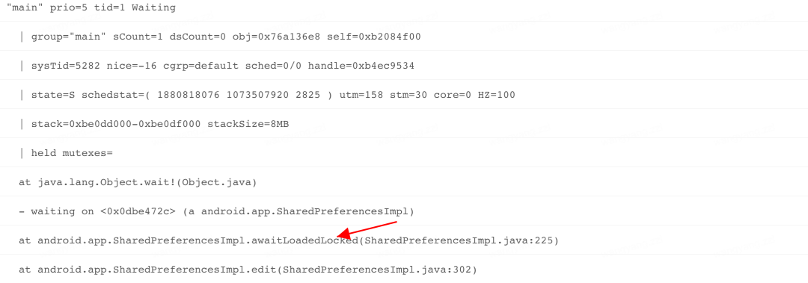
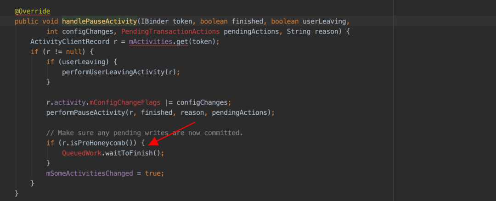
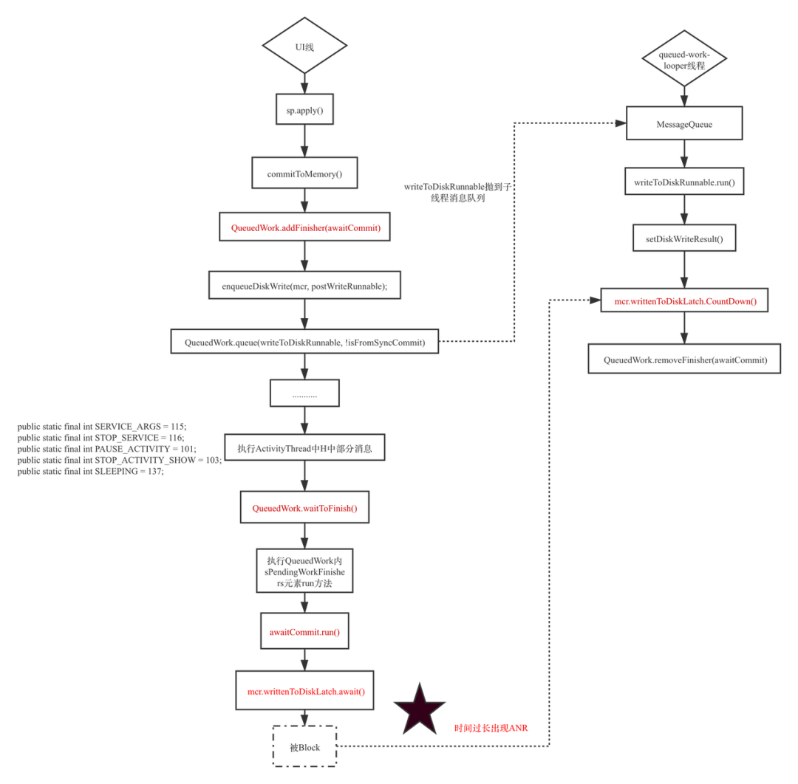
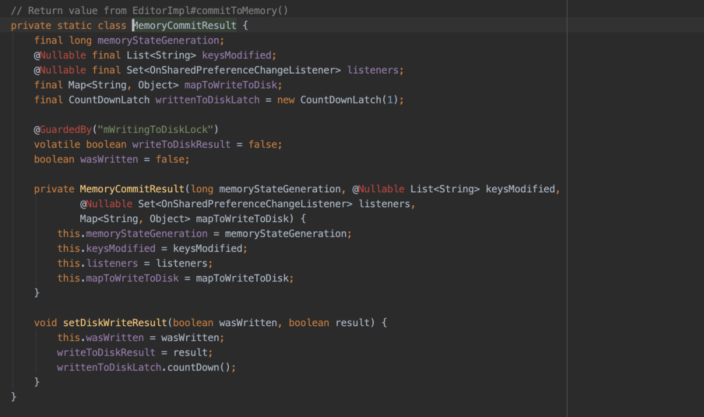
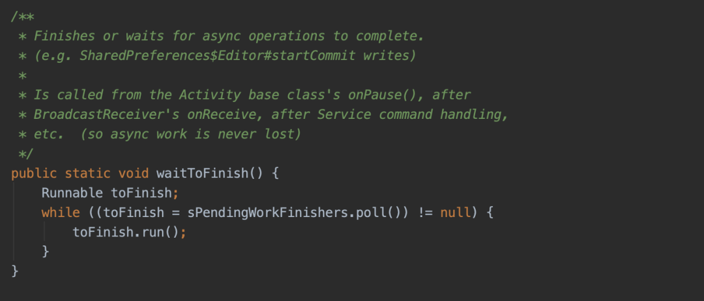

#  告别 SharedPreference 等待

Google 在设计之初为了方便开发者，实现了一套轻量级的数据持久化方案——SharedPreference（以下简称 sp），因为其简便的 API，方便的使用方式，得到开发者的青睐，对其依赖越来越重。在应用版本不断迭代的过程中发现 Google 说的轻量级的数据存储是有原因的，越是重量级的应用出现的 ANR 问题越严重。本文从源码层面分析在加载和写入过程中，导致 ANR 问题的原因以及相关的优化解决方案。


## 1. SP 导致 ANR 原因分析

经常会遇到两类关于 SharedPreference 问题，以下分别介绍导致这两类 ANR 问题的原因和优化方案。

**问题一**：sp 文件创建以后，会单独的使用一个线程来加载解析对应的 sp 文件。但是当 UI 线程尝试访问 sp 中内容时，如果 sp 文件还未被完全加载解析到内存，此时 UI 线程会被 block，直到 SP 文件被完全加载到内存中为止。具体 ANR 线程堆栈如下：



主要原因是 SP 文件未被加载或解析到内存中，此时无法直接使用 sp 提供的接口。sp 被创建的时候会同时启动一个线程加载对应的 sp 文件，执行 `startLoadFromDisk();`

```java
SharedPreferencesImpl(File file, int mode) {
  mFile = file;
  mBackupFile = makeBackupFile(file);
  mMode = mode;
  mLoaded = false;
  mMap = null;
  mThrowable = null;
  startLoadFromDisk();
}
```

在 startLoadFromDisk()时，标记 sp 不可使用状态，后期无论是尝试读数据或者写数据，读写线程都会被 block，直到 sp 文件被全部加载解析完毕。

```java
private void startLoadFromDisk() {
  synchronized (mLock) {
    mLoaded = false; //标记 sp 不可使用状态
  }
  new Thread("SharedPreferencesImpl-load") {
    public void run() {
      loadFromDisk();
    }
  }.start();
}
```

线程在读或写时，都会走到 `awaitLoadedLocked()`逻辑，在上面的 `mLoaded 为 false` 即 sp 文件尚未加载解析到内存，此时读写线程会直接被 block 到 mLock 锁上，直到 loadFromDisk()方法执行完毕。

```java
private void awaitLoadedLocked() {
  if (!mLoaded) {
    // Raise an explicit StrictMode onReadFromDisk for this
    // thread, since the real read will be in a different
    // thread and otherwise ignored by StrictMode.
    BlockGuard.getThreadPolicy().onReadFromDisk();
  }
  while (!mLoaded) {
    try {
      mLock.wait(); // block
    } catch (InterruptedException unused) {
    }
  }
  if (mThrowable != null) {
    throw new IllegalStateException(mThrowable);
  }
}

@Override
public Map<String, ?> getAll() {
  synchronized (mLock) {
    awaitLoadedLocked(); 
    //noinspection unchecked
    return new HashMap<String, Object>(mMap);
  }
}

@Override
@Nullable
public String getString(String key, @Nullable String defValue) {
  synchronized (mLock) {
    awaitLoadedLocked();
    String v = (String)mMap.get(key);
    return v != null ? v : defValue;
  }
}
```

**问题二**：Google 系统为了确保数据的跨进程完整性，前期应用可以使用 sp 来做跨进程通信，在组件销毁或其他生命周期的同时为了确保当前这个写入任务必须在当前这个组件的生命周期完成写入，此时主线程会在组件销毁或者组件暂停的生命周期内等待 sp 完全写入到对应的文件中，如下图 UI 线程被 block 在了 `QueuedWork.waitToFinish()`处，接下来基于源码从 apply 开始到最后写入文件整体流程梳理找出问题根源。



具体需要等待文件写入的消息在 AcitivtyThread 的 H 中，具体消息类型如下：

```java
public static final int SERVICE_ARGS = 115;
public static final int STOP_SERVICE = 116;
public static final int PAUSE_ACTIVITY = 101;
public static final int STOP_ACTIVITY_SHOW = 103;
public static final int SLEEPING  = 137;
```

由于 Google 官方设计之初是轻量级的数据存储方式，这种等待行为不会有什么问题，但是实际使用过程中由于 sp 过度使用，这个等待的时间被不可控的拉长，直到最后出现 ANR，这种问题越在业务繁重的应用上体现越明显。具体问题堆栈如下，全是系统堆栈，接下来从 waitToFinish 入手分析，剖析这个 ANR 的根源。具体 ANR 堆栈如下：


前期 sp 接口只有 commit 接口，接口同步写入文件，这个接口直接影响开发者使用，于是 Google 官方对外提供了异步的 apply 接口，由于开发者认为这个异步是真正意义上的异步，大规模的使用 sp 的 appy 接口，就是这种 apply 的实现方式导致了业务量大的 APP 深受这个 apply 设计缺陷导致的 ANR 问题影响。

apply 接口整体的详细设计思路如下图（基于 Android8.0 及以下版本分析）：



整体的思路简单梳理如下：

1. sp.apply()，写入内存同时得到需要同步写入文件的数据集合 MemoryCommitResult：

   

2. 将 MemoryCommitResult 封装成 Runnable 抛到子线程 queued-work-looper 中；

3. 在子线程中将 MemoryCommitResult 中的 mapToWriteToDisk 对应的 key-value 写入到文件中去；

4. 文件写入完成以后，会执行 MemoryCommitResult 的 setDiskWriteResult 方法，关键的步骤 **writtenToDiskLatch.countDown()** 出现了；

5. 如下当主线中执行到 QueuedWork.waitToFinish()的时候；

   

6. 主线程到底在干什么，这个时候得从 QueuedWork.add(Runnable finisher)入手，具体 Runnable 如下图，这个地方就是啥也没干，直接等在了 mcr.writtenToDiskLatch.await()上，这里大家应该有点印象，就是步骤 4 中子线程在写完文件以后直接释放的那个锁

   

**结论：** 尽管整体 API 的流程分析异常的复杂，把一个 runnable 封装了一层又一层，从这个线程抛到那个线程，子线程执行完写入文件以后会释放锁，主线程执行到某些地方得等待子线程把写入文件的行为执行完毕，但是整体的思路还是比较简单的。**造成这个问题的根源就是太多 pending 的 apply 行为没有写入到文件，主线程在执行到指定消息的时候会有等待行为，等待时间过长就会出现 ANR。**

尽管 Google 官方在 Android 8.0 及以后版本对 sp 写入逻辑进行优化，期望是在上述步骤 6 中 UI 线程不是傻傻的等，而是帮助子线程一起写入，但是由于是保守协助，并没有很好的解决这个问题。


## 2 .解决方案

**问题一：**针对加载很慢的问题，一般使用的比较多的是采用预加载的方式来触发到这个 sp 文件的加载和解析，这样在真正使用的时候大概率 sp 已经加载解析完毕了；真正需要处理的是核心场景的 sp 一定不能太大，Google 官方的声明还是有必要遵守一下，轻量级的数据持久化存储方式，不要存太多数据，避免文件过大，导致前期的加载解析耗时过久。

**问题二：**至于 Google 为什么要这么设计，提出了自己的几个猜想：

1. Google 希望做到数据可能尽可能及时的写入文件，但是这样等待没有任何意义，主线程直接等待并不会提升写入的效率；
2. 期望 sp 实时写入文件，以方便跨进程的时候可以实时的访问到 sp 内的文件，这种异步写入方式本身就没办法确保实时性；
3. 可能是在组件发生状态切换的时候，这个时候如果进程内没有啥组件，进程的优先级可能降低，存在进程会在系统资源吃紧的时候被系统干掉，这种概率极低，几乎可以忽略不计；
4. 感觉最大的可能性就是 Google 官方当时是为了从 commit 无缝的切换到 apply，依然模拟原来的 commit 行为，只是将原来的每次写入文件一次改成多次 commit 行为最后一次性 apply 在主线程等待所有的写入行为一次性全部写入。

通过以上假设，发现这里的主线程等待子线程写入根本没有什么意义，因此希望可以通过一些必要的手段跳过这种无用的等待行为，在研究了所有的 SharedPreference 相关的逻辑后找到以下入手点。以下是 8.0 以下版本的优化策略，8.0 及以上版本处理方式类似



如果需要主线程在 waitToFinish 的时候直接跳过去，让 toTinish.run()执行完毕，显然不可能，如果能让 sPendingWorkFinishers.poll()返回为 null，则这里的等待行为直接就跳过去了，sPendingWorkFinishers 是个 ConcurrentLinkedQueue 集合，可以直接动态代理这个集合，复写 poll 方法，让其永远返回 null，这个时候 UI 永远不会等待子线程写入文件完毕。事实证明这种方式简单有效。


针对这种写入等待的 ANR 问题，还有一种就是全局替换写入方式，通过插桩的方式，替换所有的 API 实现，采用其他的存储方式，这种方式修复成本和风险较大，但是后期可以随机的替换存储方式，使用比较灵活。

> Google 新增加了一个新 Jetpack 的成员 DataStore，主要用来替换 SharedPreferences， DataStore 应该是开发者期待已久的库，DataStore 是基于 Flow 实现的，一种新的数据存储方案。


## 参考

摘自 https://mp.weixin.qq.com/s/kfF83UmsGM5w43rDCH544g