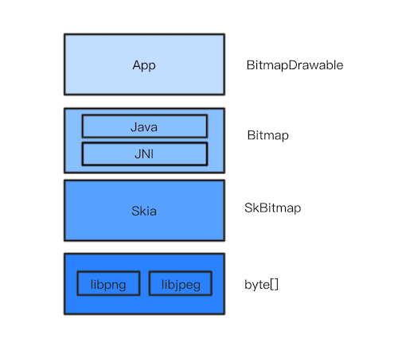
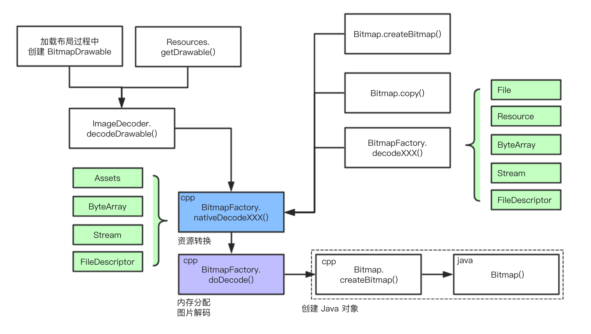
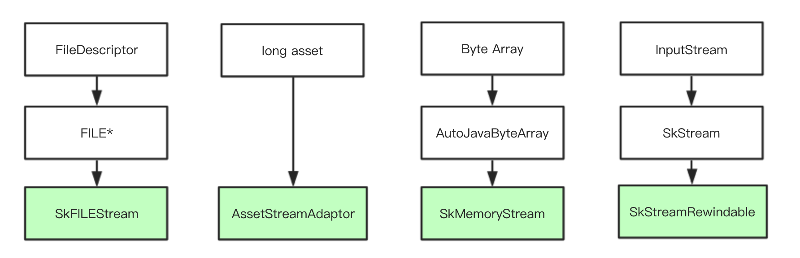
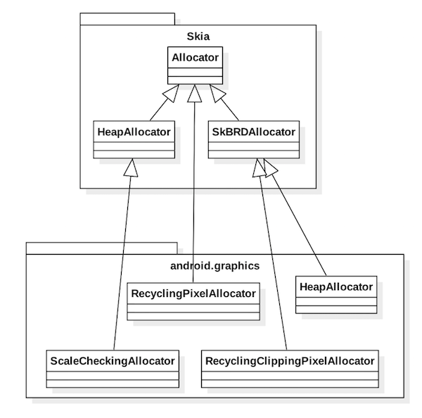
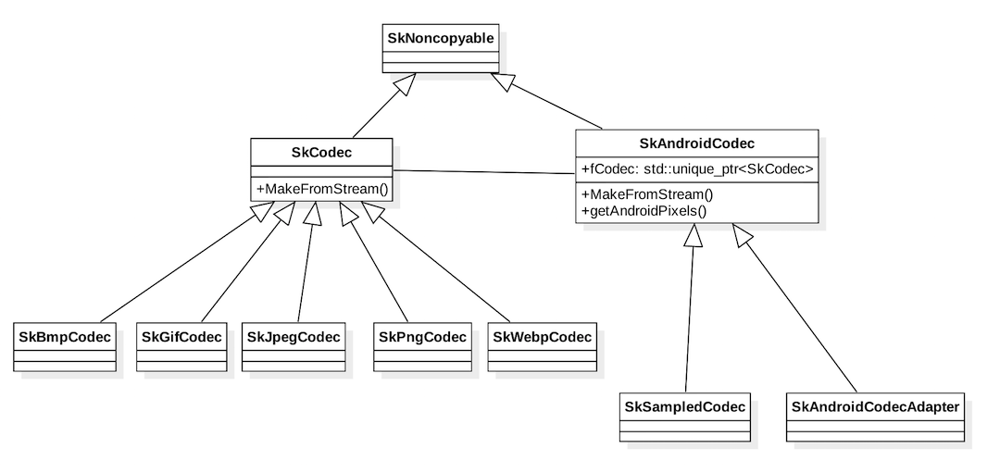
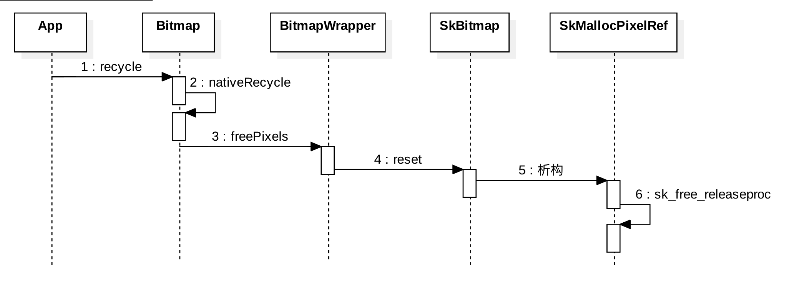
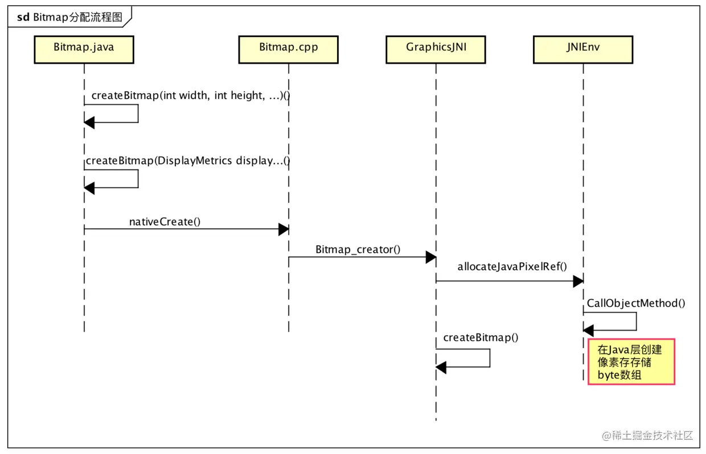

# Bitmap: 从出生到死亡
## 1. 基本概念

* **像素（`Pixel`）**： 指可以表现亮度甚至色彩变化的一个点，是构成数字图像的最小单位。像素具有大小相同、明暗和颜色的变化。特点是有固定的位置和特定的颜色值。

* **`color depth`、`bit depth`**：每个像素RBG若各用8位表示，`bit depth`就是8bit，那么这个像素就用24位表示，`color depth`就是24bit。一个像素`color depth`越深，像素表达的颜色和亮度的位数越多，文件就越大。一个`color depth`中每个`channel`的深度就是`bit depth`。用32位表示一个像素的话，RBG占用24位，还有8位称为`alpha channel`。

* **`alpha composite`、`alpha blend`、`alpha channel`**： 渲染图片的时候，图片有时有很多图层，然后再将多个图层组合起来，这叫做`alpha composite`。在这个过程中，多个图层每个对应像素合成的过程叫做`alpha blend`。透过看到下一图层，就需要记录一些哪里透明、哪里不透明的信息，这些信息就被存在一个`alpha channel`中了。

* **图片分辨率**：计算机显示的图像是由像素点组成的，图片尺寸为640 x 480，代表图片水平有640个像素点，垂直有480像素点。

> 各种图片格式目的是在网络传输和存储的时候使用更少的字节，即起到压缩的作用，或者支持多张图片组合成一张动态图。在图片格式解码后，无论哪种图片的格式，图片数据都是像素数组。

* **Bitmap**：位图，又称为点阵图像、像素图或栅格图像，是由像素（图片元素）的单个点组成。这些点可以进行不同的排列和染色以构成图样。Bitmap的承载容器是`jpg`、`png`等格式的文件，是对bitmap的压缩。当jpg、png等文件需要展示在手机上的控件时，就会解析成Bitmap并绘制到view上。
> Bitmap同时也表示一种数据结构，用一个bit位来标记某个元素对应的Value， 而Key即是该元素。由于采用了Bit为单位来存储数据，因此在存储空间方面，可以大大节省。具体参见[什么是Bit-map](https://wizardforcel.gitbooks.io/the-art-of-programming-by-july/content/06.07.html)


## 2. Bitmap 总览
App开发不可避免的要和图片打交道，由于其占用内存非常大，管理不当很容易导致内存不足，最后OOM，图片的背后其实是Bitmap，Bitmap 占内存多是因为其像素数据(pixels)大。Bitmap 像素数据的存储在不同 Android 版本之间有所不同，具体来说

| 版本                         |                           内存分布                           |
| :--------------------------- | :----------------------------------------------------------: |
| ~ Android 2.3.3(API 10)      | 1. 位图的后备像素数据存储在 Native 堆中。Native 内存中的像素数据并不以可预测的方式释放，可能会导致应用短暂超出其内存限制并崩溃。 2. Android 2.2(API 8) 无并发垃圾回收功能, 当发生垃圾回收时，应用的线程会停止。这会导致延迟，从而降低性能。 3. Android 2.3 添加了并发垃圾回收功能，这意味着系统不再引用位图后，很快就会回收内存 |
| 3.0（API 11）~ 7.1（API 25） |      像素数据会与关联的位图一起存储在 Dalvik/ART 堆上。      |
| 8.0（API 26）~               | 位图像素数据存储在 Native 堆中。配合 NativeAllocationRegistry 进行垃圾回收 |

 **没有特殊说明，下面涉及的内容都是基于8.0之后的版本。**

先从整体上看一下 Bitmap。


- 用户在手机屏幕上看到的是一张张图片
- App 中这些图片实际上是 BitmapDrawable
- BitmapDrawable 是对 Bitmap 的包装
- Bitmap 是对 SkBitmap 的包装。具体说来， Bitmap 的具体实现包括 Java 层和 JNI 层，JNI 层依赖 [Skia](https://github.com/google/skia)。
- SkBitmap 本质上可简单理解为内存中的一个字节数组
  所以说 Bitmap 其实是一个字节数组, 本质上就是内存中的一块数据。所谓创建 Bitmap，不过是调用 malloc() 分配一块内存。而回收 Bitmap，不过是调用 free() 将之前的内存释放掉。


**为什么 Android 2.3.3 中 Native 的内存释放不可预测？在 Java 对象的 finalize 被调用时直接释放的方案有何不妥?Android 8.0 的 NativeAllocationRegistry 的引入是为了解决什么问题?**

带着疑问，我们去了解下Bitmap其内存是如何被分配和销毁以及学习一下`NativeAllocationRegistry`的技术。

## 3. Bitmap 创建
创建 Bitmap 的方式很多，

+ 可以通过 SDK 提供的 API 来创建 Bitmap
+ 加载某些布局或资源时会创建 Bitmap
+ [Glide](https://github.com/bumptech/glide) 等第三方图片库会创建 Bitmap

先说通过 API 创建 Bitmap。SDK 中创建 Bitmap 的 API 很多，分成三大类：

- **创建** Bitmap - `Bitmap.createBitmap()` 方法在内存中从无到有地创建 Bitmap
- **拷贝** Bitmap - `Bitmap.copy()` 从已有的 Bitmap 拷贝出一个新的 Bitmap
- **解码** - 从文件或字节数组等资源解码得到 Bitmap，这是最常见的创建方式
- BitmapFactory.decodeResource()
- [ImageDecoder.decodeBitmap](https://developer.android.com/reference/android/graphics/ImageDecoder)。ImageDecoder 是 Android 9.0 新加的类

假如 `resId` 对应的是一张图片。加载如下布局文件时会创建一个 Bitmap：

```
<ImageView android:src="@drawable/resId">
```

代码中加载资源也会创建出一个 Bitmap：

```
Drawable drawable = Resources.getDrawable(resId)
```

实际项目中往往不是直接调用 API 来创建 Bitmap，而是使用 [Glide](https://github.com/bumptech/glide) 或 [Picosso](https://github.com/square/picasso) 等第三方图片库。这些库成熟稳定，接口易用，开发中处理 Bitmap 变得轻松。

```
Glide.with(this).load("http://goo.gl/gEgYUd").into(imageView);
```

以 Glide 为例，只要一行代码可以很方便地从网络上加载一张图片。但另一方面，Glide 也让 Bitmap 的创建更加多样和复杂。

太多的创建 Bitmap 的方式，简直让人头大。但好在无论哪种创建方式，最终殊途同归。见下图：



Java 层的创建 Bitmap 的 **所有 API** 进入到 Native 层后，全都会走这四个步骤：

+ 资源转换 - 这一步将 Java 层传来的不同类型的资源转换成解码器可识别的数据类型
+ 内存分配 - 这一步是分配内存，分配时会是否复用 Bitmap 等因素
+ 图片解码 - 实际的解码工作由第三方库，解码结果填在上一步分配的内存中。注，`Bitmap.createBitmap()` 和 `Bitmap.copy()` 创建的 Bitmap 不需要进行图片解码
+ 创建对象 - 这一步创建 Java 对象，将包含解码数据的内存块包装成 Java 层的 `android.graphics.Bitmap` 对象

从上面可以 [BitmapFactory.doDecode()](https://android.googlesource.com/platform/frameworks/base/+/refs/heads/oreo-release/core/jni/android/graphics/BitmapFactory.cpp#233) 函数是创建 Bitmap 的核心，它负责内存分配和图片解码，其关键步骤包括：

1. Update with options supplied by the client.
2. Create the codec.
3. Handle sampleSize. (跟 BitmapFactory.Options.inSampleSize 参数相关)
4. Set the decode colorType.
5. Handle scale. (跟 BitmapFactory.Options.inScaled 参数相关)
6. Handle reuseBitmap (跟 BitmapFactory.Options.inBitmap 参数相关)
7. Choose decodeAllocator
8. Construct a color table
9. AllocPixels
10. Use SkAndroidCodec to perform the decode.
11. Create the java bitmap


我们以`BitmapFactory#decodeFile`为例，简单看看bitmap创建过程。

```java

  public static Bitmap decodeFile(String pathName, Options opts) {
         ...
        try {
            stream = new FileInputStream(pathName);
            bm = decodeStream(stream, null, opts);
        } catch (Exception e) {
            ...
        return bm;
    }

  public static Bitmap decodeStream(@Nullable InputStream is, @Nullable Rect outPadding,
            @Nullable Options opts) {
       ...
           if (is instanceof AssetManager.AssetInputStream) {
                final long asset = ((AssetManager.AssetInputStream) is).getNativeAsset();
                bm = nativeDecodeAsset(asset, outPadding, opts, Options.nativeInBitmap(opts),
                    Options.nativeColorSpace(opts));
            } else {
             // 假设是普通文件，调用到这里
                bm = decodeStreamInternal(is, outPadding, opts);
            }
        ...

        return bm;
    }
     private static Bitmap decodeStreamInternal(@NonNull InputStream is,
            @Nullable Rect outPadding, @Nullable Options opts) {
        // ASSERT(is != null);
        byte [] tempStorage = null;
        if (opts != null) tempStorage = opts.inTempStorage;
        if (tempStorage == null) tempStorage = new byte[DECODE_BUFFER_SIZE];
        return nativeDecodeStream(is, tempStorage, outPadding, opts,
                Options.nativeInBitmap(opts),
                Options.nativeColorSpace(opts));
    }
    
```
[BitmapFactory.cpp](https://android.googlesource.com/platform/frameworks/base/+/refs/heads/oreo-release/core/jni/android/graphics/BitmapFactory.cpp#596)
```cpp
static jobject nativeDecodeStream(JNIEnv* env, jobject clazz, jobject is, jbyteArray storage,
        jobject padding, jobject options) {
    jobject bitmap = NULL;
    // 1. 资源转换 Stream->SkStream->SkStreamRewindable
    std::unique_ptr<SkStream> stream(CreateJavaInputStreamAdaptor(env, is, storage));
    if (stream.get()) {
        std::unique_ptr<SkStreamRewindable> bufferedStream(
                SkFrontBufferedStream::Create(stream.release(), SkCodec::MinBufferedBytesNeeded()));
        SkASSERT(bufferedStream.get() != NULL);
        bitmap = doDecode(env, bufferedStream.release(), padding, options);
    }
    return bitmap;
}


static jobject doDecode(JNIEnv* env, std::unique_ptr<SkStreamRewindable> stream,
                        jobject padding, jobject options) {

    ...                    
    // 2.根据stream特点创建解码器
    NinePatchPeeker peeker;
    std::unique_ptr<SkAndroidCodec> codec;
    {
        SkCodec::Result result;
        std::unique_ptr<SkCodec> c = SkCodec::MakeFromStream(std::move(stream), &result,
                                                             &peeker);
        if (!c) {
            SkString msg;
            msg.printf("Failed to create image decoder with message '%s'",
                       SkCodec::ResultToString(result));
            return nullObjectReturn(msg.c_str());
        }

        codec = SkAndroidCodec::MakeFromCodec(std::move(c));
        if (!codec) {
            return nullObjectReturn("SkAndroidCodec::MakeFromCodec returned null");
        }
    }
  ...
     // 3. 创建内存分配器

    HeapAllocator defaultAllocator;
    RecyclingPixelAllocator recyclingAllocator(reuseBitmap, existingBufferSize);
    ScaleCheckingAllocator scaleCheckingAllocator(scale, existingBufferSize);
    SkBitmap::HeapAllocator heapAllocator;
    SkBitmap::Allocator* decodeAllocator;
    if (javaBitmap != nullptr && willScale) {
        // This will allocate pixels using a HeapAllocator, since there will be an extra
        // scaling step that copies these pixels into Java memory.  This allocator
        // also checks that the recycled javaBitmap is large enough.
        decodeAllocator = &scaleCheckingAllocator;
    } else if (javaBitmap != nullptr) {
        decodeAllocator = &recyclingAllocator;
    } else if (willScale || isHardware) {
        // This will allocate pixels using a HeapAllocator,
        // for scale case: there will be an extra scaling step.
        // for hardware case: there will be extra swizzling & upload to gralloc step.
        decodeAllocator = &heapAllocator;
    } else {
        decodeAllocator = &defaultAllocator;
    }
   ...
    // 4. 分配内存
    SkBitmap decodingBitmap;
    if (!decodingBitmap.setInfo(bitmapInfo) ||
            !decodingBitmap.tryAllocPixels(decodeAllocator)) {
       
        return nullptr;
    }
    ...
   // 5. 图片解码
    SkCodec::Result result = codec->getAndroidPixels(decodeInfo, decodingBitmap.getPixels(),
            decodingBitmap.rowBytes(), &codecOptions);
    switch (result) {
        case SkCodec::kSuccess:
        case SkCodec::kIncompleteInput:
            break;
        default:
            return nullObjectReturn("codec->getAndroidPixels() failed.");
    }

   ...
    // 6. 创建java对象
    return bitmap::createBitmap(env, defaultAllocator.getStorageObjAndReset(),
            bitmapCreateFlags, ninePatchChunk, ninePatchInsets, -1);
}


```

**下面详细展开描述下**

### 3.1. 资源转换

在 JNI 层将Java 层的待解码资源（包含`File`,`Resource`,`ByteArray`,`Stream`,`FileDescriptor`）重新划分成四种，包括：`DecodeFileDescriptor`,`DecodeStream`,`DecodeByteArray`,`DecodeAsset`

`BitmapFactory` 提供四个方法对资源进行转换，所有的资源都会转换成与 `SkStreamRewindable` 兼容的数据

```cpp
nativeDecodeFileDescriptor()
nativeDecodeStream()
nativeDecodeByteArray()
nativeDecodeAsset()
```



最后，[BitmapFactory.doDecode()](https://android.googlesource.com/platform/frameworks/base/+/refs/heads/oreo-release/core/jni/android/graphics/BitmapFactory.cpp#233) 统一解码处理 `SkStreamRewindable`。

### 3.2. 内存分配
解码前的第二项工作是内存分配。

首先是选择 `decodeAllocator` (见上文提到的 `BitmapFactory.doDecode()` 的第7步)。有以下几种 Allocator 可供选择：



选择 Allocator 时考虑的因素包括：是否复用已有 Bitmap，是否会缩放 Bitmap，是否是 Hardware Bitmap。选择策略总结如下：

|是否复用已有 Bitmap|是否会缩放 Bitmap|是否是 Hardware Bitmap|Allocator类型|
|--------------|--------------|-------------|------------|
|是            |是            |-            |[ScaleCheckingAllocator](https://android.googlesource.com/platform/frameworks/base/+/refs/heads/oreo-release/core/jni/android/graphics/BitmapFactory.cpp#144)|
|是            |否            |-            |[RecyclingPixelAllocator](https://android.googlesource.com/platform/frameworks/base/+/refs/heads/oreo-release/core/jni/android/graphics/GraphicsJNI.h#171)|
|否            |是            |是           |[SkBitmap::HeapAllocator](https://github.com/google/skia/blob/master/include/core/SkBitmap.h#L1119)|
|-             |-            |-            |[HeapAllocator](https://android.googlesource.com/platform/frameworks/base/+/refs/heads/oreo-release/core/jni/android/graphics/GraphicsJNI.h#125) (缺省的Allocator)|

接下来，使用选定的 Allocator 分配内存。

```
BitmapFactory.doDecode() ->
	SkBitmap.tryAllocPixels() ->
    		Allocator.allocPixelRef()
```

代码如下：

```cpp
// BitmapFactory.cpp
static jobject doDecode() {
    ...
    SkBitmap decodingBitmap;
    if (!decodingBitmap.setInfo(bitmapInfo) ||
            !decodingBitmap.tryAllocPixels(decodeAllocator, colorTable.get())) {
        // SkAndroidCodec should recommend a valid SkImageInfo, so setInfo()
        // should only only fail if the calculated value for rowBytes is too
        // large.
        // tryAllocPixels() can fail due to OOM on the Java heap, OOM on the
        // native heap, or the recycled javaBitmap being too small to reuse.
        return nullptr;
    }
    ...
}

// SkBitmap.cpp https://github.com/google/skia/blob/master/src/core/SkBitmap.cpp#L213
bool SkBitmap::tryAllocPixels(Allocator* allocator) {
    HeapAllocator stdalloc;

    if (nullptr == allocator) {
        allocator = &stdalloc;
    }
    return allocator->allocPixelRef(this);
}
```

Allocator 的类型有四种，我们只看其中的两种。

* **先看 `SkBitmap::HeapAllocator` 作为 Allocator 进行内存分配的流程。**

1. [SkBitmap::tryAllocPixels](https://github.com/google/skia/blob/master/src/core/SkBitmap.cpp#L213)
2. [SkBitmap::HeapAllocator::allocPixelRef](https://github.com/google/skia/blob/master/src/core/SkBitmap.cpp#L368)
3. [SkMallocPixelRef::MakeAllocate](https://github.com/google/skia/blob/master/src/core/SkMallocPixelRef.cpp#L57)
4. [sk_calloc_canfail](https://github.com/google/skia/blob/master/include/private/SkMalloc.h#L66)
5. [sk_malloc_flags](https://github.com/google/skia/blob/master/src/ports/SkMemory_malloc.cpp#L66)

对应的代码如下(可以看到最终会调用 `malloc()` 分配指定大小的内存)：

```cpp
// SkMallocPixelRef.cpp
sk_sp<SkPixelRef> SkMallocPixelRef::MakeAllocate(const SkImageInfo& info, size_t rowBytes) {
    ...
    void* addr = sk_calloc_canfail(size);
	...
}

// SkMalloc.h
static inline void* sk_calloc_canfail(size_t size) {
#if defined(IS_FUZZING_WITH_LIBFUZZER)
    // The Libfuzzer environment is very susceptible to OOM, so to avoid those
    // just pretend we can't allocate more than 200kb.
    if (size > 200000) {
        return nullptr;
    }
#endif
    return sk_malloc_flags(size, SK_MALLOC_ZERO_INITIALIZE);
}

// SkMemory_malloc.cpp
void* sk_malloc_flags(size_t size, unsigned flags) {
    void* p;
    if (flags & SK_MALLOC_ZERO_INITIALIZE) {
        p = calloc(size, 1);
    } else {
        p = malloc(size);
    }
    if (flags & SK_MALLOC_THROW) {
        return throw_on_failure(size, p);
    } else {
        return p;
    }
}

/** We explicitly use the same allocator for our pixels that SkMask does,
 so that we can freely assign memory allocated by one class to the other.
 */
bool SkBitmap::HeapAllocator::allocPixelRef(SkBitmap* dst) {
    const SkImageInfo info = dst->info();
    if (kUnknown_SkColorType == info.colorType()) {
//        SkDebugf("unsupported config for info %d\n", dst->config());
        return false;
    }

    sk_sp<SkPixelRef> pr = SkMallocPixelRef::MakeAllocate(info, dst->rowBytes());
    if (!pr) {
        return false;
    }

    dst->setPixelRef(std::move(pr), 0, 0);
    SkDEBUGCODE(dst->validate();)
    return true;
}

void SkBitmap::setPixelRef(sk_sp<SkPixelRef> pr, int dx, int dy) {
    ...
    fPixelRef = kUnknown_SkColorType != this->colorType() ? std::move(pr) : nullptr;
    void* p = nullptr;
    size_t rowBytes = this->rowBytes();
    // ignore dx,dy if there is no pixelref
    if (fPixelRef) {
        rowBytes = fPixelRef->rowBytes();
        // TODO(reed):  Enforce that PixelRefs must have non-null pixels.
        p = fPixelRef->pixels();
        if (p) {
            p = (char*)p + dy * rowBytes + dx * this->bytesPerPixel();
        }
    }
    SkPixmapPriv::ResetPixmapKeepInfo(&fPixmap, p, rowBytes);
    ...
}
```

* **再来看 `HeapAllocator` 作为 Allocator 进行内存分配的流程。**

1. [SkBitmap::tryAllocPixels](https://github.com/google/skia/blob/master/src/core/SkBitmap.cpp#L213)
2. [HeapAllocator::allocPixelRef](https://android.googlesource.com/platform/frameworks/base/+/refs/heads/oreo-release/core/jni/android/graphics/Graphics.cpp#616)
3. [android::Bitmap::allocateHeapBitmap](https://android.googlesource.com/platform/frameworks/base/+/master/libs/hwui/hwui/Bitmap.cpp#79)

对应的代码如下：

```cpp
// GraphicsJNI.h https://android.googlesource.com/platform/frameworks/base/+/refs/heads/oreo-release/core/jni/android/graphics/GraphicsJNI.h#125
class HeapAllocator : public SkBRDAllocator {
public:
   HeapAllocator() { };
    ~HeapAllocator() { };
    virtual bool allocPixelRef(SkBitmap* bitmap, SkColorTable* ctable) override;
    /**
     * Fetches the backing allocation object. Must be called!
     */
    android::Bitmap* getStorageObjAndReset() {
        return mStorage.release();
    };
    SkCodec::ZeroInitialized zeroInit() const override { return SkCodec::kYes_ZeroInitialized; }
private:
    sk_sp<android::Bitmap> mStorage;
};

// Graphics.cpp https://android.googlesource.com/platform/frameworks/base/+/refs/heads/oreo-release/core/jni/android/graphics/Graphics.cpp#616
bool HeapAllocator::allocPixelRef(SkBitmap* bitmap, SkColorTable* ctable) {
   // 创建 Native Bitmap 对象，并将指针记录到 HeapAllocator#mStorage 字段中
    mStorage = android::Bitmap::allocateHeapBitmap(bitmap, ctable);
    return !!mStorage;
}

// Bitmap.cpp https://android.googlesource.com/platform/frameworks/base/+/refs/heads/oreo-release/libs/hwui/hwui/Bitmap.cpp#86
static sk_sp<Bitmap> allocateHeapBitmap(size_t size, const SkImageInfo& info, size_t rowBytes) {
   // 使用库函数 calloc 分配 size*1 的连续空间
    void* addr = calloc(size, 1);
    if (!addr) {
        return nullptr;
    }
   // 创建 Native Bitmap 对象
    return sk_sp<Bitmap>(new Bitmap(addr, size, info, rowBytes));
}

Bitmap::Bitmap(void* address, size_t size, const SkImageInfo& info, size_t rowBytes, SkColorTable* ctable)
            : SkPixelRef(info)
            , mPixelStorageType(PixelStorageType::Heap) {
    // 指向像素数据的内存指针
    mPixelStorage.heap.address = address;
    // 像素数据大小
    mPixelStorage.heap.size = size;
    reconfigure(info, rowBytes, ctable);
}


```

对于 `RecyclingPixelAllocator` 和 `ScaleCheckingAllocator` 的情况，读者可以自行分析。

无论哪种 Allocator，最终要么调用 `malloc()` 分配内存，要么复用之前分配的内存。分配/复用完成后，由 `SkBitmap` 来持有。

注：

+ 准确来说，`SkBitmap::HeapAllocator` 分配内存由 [SkBitmap 的 SkPixmap](https://github.com/google/skia/blob/master/src/core/SkPixmap.cpp) 持有，而不是 SkBitmap 持有。忽略这个细节
+ 准确来说，`HeapAllocator` 分配的内存是由 `android::Bitmap.mStorage` 持有，而不是 SkBitmap 持有。但 `android::Bitmap` 与 SkBitmap 有某种关联，所以可以忽略这个细节


### 3.3. 图片解码
在 Skia 中 `SkCodec` 代表解码器，解码器的类层次结构如下：



Skia 将实际的解码工作交由第三方库，不同图片格式有各自对应的解码器。比如 PNG 图片由 `SkPngCodec` 解码，而 `SkPngCodec` 实际上是对 libpng 的封装。

前面提到 `BitmapFactory.doDecode()` 的第2步是创建解码器，第10步是调用该解码器进行解码。

+ [SkCodec::MakeFromStream()](https://github.com/google/skia/blob/master/src/codec/SkCodec.cpp#L70) 根据图片格式选择一个合适的 `SkCodec`，比如为 PNG 图片选择 `SkPngCodec`
+ [SkAndroidCodec::MakeFromStream()](https://github.com/google/skia/blob/master/src/codec/SkAndroidCodec.cpp#L78) 创建 `SkAndroidCodec`， 它是上一步创建的 `SkCodec` 的代理。`SkAndroidCodec` 的具体类型跟图片格式有关。PNG，JPEG，GIF，BMP 等格式时其类型是 `SkSampledCodec`，WEBP 格式时是 `SkAndroidCodecAdapter`
+ 调用 [SkAndroidCodec.getAndroidPixels()](https://github.com/google/skia/blob/master/src/codec/SkAndroidCodec.cpp#L357) 解码

代码如下：

```cpp
static jobject doDecode() {
    ...
    SkCodec::Result result = codec->getAndroidPixels(decodeInfo, decodingBitmap.getPixels(),
            decodingBitmap.rowBytes(), &codecOptions);
                
    ...
}
```

以 PNG 图片为例来分析。

首先，对于 PNG 图片 `codec` 是 `SkSampledCodec`， `SkSampledCodec` 使用的解码器是 `SkPngCodec` (见 `SkAndroidCodec.fCodec` 字段)。


第一步是调用 `codec->getAndroidPixels()` 方法。注意第二个参数正是上一步分配的内存地址。

接下来是一系列函数调用。注意传入的内存地址参数 `dst` 即可，其他细节忽略。

然后会执行到 `SkPngCodec.onGetPixels()` 方法。它使用 [libpng 库](http://www.libpng.org/pub/png/libpng.html)解码 PNG 图片。

```cpp
SkCodec::Result SkPngCodec::onGetPixels(const SkImageInfo& dstInfo, void* dst,
                                        size_t rowBytes, const Options& options,
                                        int* rowsDecoded) {
    Result result = this->initializeXforms(dstInfo, options);
    if (kSuccess != result) {
        return result;
    }

    if (options.fSubset) {
        return kUnimplemented;
    }

    this->allocateStorage(dstInfo);
    this->initializeXformParams();
    return this->decodeAllRows(dst, rowBytes, rowsDecoded);
}
```

最终，解码结果保存在 `dst` 指针指向的内存。

### 3.4. 创建Java对象
解码完成后得到 Native 层的 `SkBitmap` 对象，最后一步工作是将其封装成 Java 层可以使用的 `Bitmap` 对象。

这一步的过程相对简单，分为三步：

```
BitmapFactory.doDecode() ->
	Bitmap.createBitmap() ->
    		Java Bitmap 的构造方法中保存 `mNativePtr` (像素数据内存块的地址)
```

对应的代码如下：

```cpp
// BitmapFactory.cpp
static jobject doDecode() {
    SkBitmap decodingBitmap;    
    ...
    SkCodec::Result result = ...
    SkBitmap outputBitmap;
    outputBitmap.swap(decodingBitmap);                
    ...
    // now create the java bitmap
    return bitmap::createBitmap(env, defaultAllocator.getStorageObjAndReset(),
            bitmapCreateFlags, ninePatchChunk, ninePatchInsets, -1);    
}

// Bitmap.cpp
jobject createBitmap(JNIEnv* env, Bitmap* bitmap,
        int bitmapCreateFlags, jbyteArray ninePatchChunk, jobject ninePatchInsets,
        int density) {
    bool isMutable = bitmapCreateFlags & kBitmapCreateFlag_Mutable;
    bool isPremultiplied = bitmapCreateFlags & kBitmapCreateFlag_Premultiplied;
    // The caller needs to have already set the alpha type properly, so the
    // native SkBitmap stays in sync with the Java Bitmap.
    assert_premultiplied(bitmap->info(), isPremultiplied);
    BitmapWrapper* bitmapWrapper = new BitmapWrapper(bitmap);
    jobject obj = env->NewObject(gBitmap_class, gBitmap_constructorMethodID,
            reinterpret_cast<jlong>(bitmapWrapper), bitmap->width(), bitmap->height(), density,
            isMutable, isPremultiplied, ninePatchChunk, ninePatchInsets);
    if (env->ExceptionCheck() != 0) {
        ALOGE("*** Uncaught exception returned from Java call!\n");
        env->ExceptionDescribe();
    }
    return obj;
}
```

```java
// Bitmap.java
public final class Bitmap implements Parcelable {
    // Convenience for JNI access
    private final long mNativePtr;    
    /**
     * Private constructor that must received an already allocated native bitmap
     * int (pointer).
     */
    // called from JNI
    Bitmap(long nativeBitmap, int width, int height, int density,
            boolean isMutable, boolean requestPremultiplied,
            byte[] ninePatchChunk, NinePatch.InsetStruct ninePatchInsets) {
        if (nativeBitmap == 0) {
            throw new RuntimeException("internal error: native bitmap is 0");
        }
        ...
        mNativePtr = nativeBitmap;
        ...        
    }
}
```

至此，Java 层的 `Bitmap` 对象创建完毕，它在内存中大致是这样的：


## 4. 销毁

Java 层的 Bitmap 对象有点特别，特别之处在于其像素数据保存在 native heap。我们知道， native heap 并不被 JVM 管理，那如何保证 Bitmap 对象本身被 GC 后 native heap 中的内存也能正确回收呢？

### 4.1. recycle
首先想到的是在代码主动调用 [Bitmap.recycle()](https://developer.android.com/reference/android/graphics/Bitmap.html) 方法来释放 native 内存。

流程如下：



来看具体代码。

```java
    /**
     * Free the native object associated with this bitmap, and clear the
     * reference to the pixel data. This will not free the pixel data synchronously;
     * it simply allows it to be garbage collected if there are no other references.
     * The bitmap is marked as "dead", meaning it will throw an exception if
     * getPixels() or setPixels() is called, and will draw nothing. This operation
     * cannot be reversed, so it should only be called if you are sure there are no
     * further uses for the bitmap. This is an advanced call, and normally need
     * not be called, since the normal GC process will free up this memory when
     * there are no more references to this bitmap.
     */
    public void recycle() {
        if (!mRecycled && mNativePtr != 0) {
            if (nativeRecycle(mNativePtr)) {
                // return value indicates whether native pixel object was actually recycled.
                // false indicates that it is still in use at the native level and these
                // objects should not be collected now. They will be collected later when the
                // Bitmap itself is collected.
                mNinePatchChunk = null;
            }
            mRecycled = true;
        }
    }
```

```cpp
// Bitmap.cpp https://android.googlesource.com/platform/frameworks/base/+/refs/heads/oreo-release/core/jni/android/graphics/Bitmap.cpp#872
static jboolean Bitmap_recycle(JNIEnv* env, jobject, jlong bitmapHandle) {
    LocalScopedBitmap bitmap(bitmapHandle);
    bitmap->freePixels();
    return JNI_TRUE;
}

// Convenience class that does not take a global ref on the pixels, relying
// on the caller already having a local JNI ref
class LocalScopedBitmap {
public:
    explicit LocalScopedBitmap(jlong bitmapHandle)
            : mBitmapWrapper(reinterpret_cast<BitmapWrapper*>(bitmapHandle)) {}
    BitmapWrapper* operator->() {
        return mBitmapWrapper;
    }
    void* pixels() {
        return mBitmapWrapper->bitmap().pixels();
    }
    bool valid() {
        return mBitmapWrapper && mBitmapWrapper->valid();
    }
private:
    BitmapWrapper* mBitmapWrapper;
};

class BitmapWrapper {
public:
    BitmapWrapper(Bitmap* bitmap)
        : mBitmap(bitmap) { }
    void freePixels() {
        mInfo = mBitmap->info();
        mHasHardwareMipMap = mBitmap->hasHardwareMipMap();
        mAllocationSize = mBitmap->getAllocationByteCount();
        mRowBytes = mBitmap->rowBytes();
        mGenerationId = mBitmap->getGenerationID();
        mIsHardware = mBitmap->isHardware();
        mBitmap.reset();
    }
}
```

```cpp
    /** Resets to its initial state; all fields are set to zero, as if SkBitmap had
        been initialized by SkBitmap().
        Sets width, height, row bytes to zero; pixel address to nullptr; SkColorType to
        kUnknown_SkColorType; and SkAlphaType to kUnknown_SkAlphaType.
        If SkPixelRef is allocated, its reference count is decreased by one, releasing
        its memory if SkBitmap is the sole owner.
    */
    void reset() {
        fPixelRef = nullptr;  // Free pixels.
        fPixmap.reset();
        fFlags = 0;        
    }
```

+ 首先，App 主动调用 `Bitmap.recycle()` 方法
+ 接下来，`Bitmap.recycle()` 调用对应的 native 方法 `Bitmap_recycle()`
+ 然后会进入到 `BitmapWrapper.freePixels()` 方法
+ 最后，[SkBitmap.reset()](https://github.com/google/skia/blob/master/include/core/SkBitmap.h#L334) 将 `fPixelRef` 置空。注：之前分配内存过程中可以看到 `fPixelRef` 是如何被赋值的

`fPixelRef` 原本指向一个 `SkMallocPixelRef` 对象。将 `fPixelRef` 置空后，该对象引用数变成0时，`~SkMallocPixelRef()` 析构方法被调用，并触发 [sk_free_releaseproc()](https://github.com/google/skia/blob/master/src/core/SkMallocPixelRef.cpp#L33) 方法执行，回收内存。

注意这里的 `sk_free_releaseproc`。 它是方法地址，在之前的分配内存过程中作为 `SkMallocPixelRef()` 构造方法的 `SkMallocPixelRef::ReleaseProc` 参数被传进来的。`sk_free_releaseproc` 指向的方法负责最终的内存回收。

```cpp
// SkMemory_malloc.cpp https://github.com/google/skia/blob/master/src/ports/SkMemory_malloc.cpp#L66
void sk_free(void* p) {
    if (p) {
        free(p);
    }
}

// SkMallocPixelRef.cpp https://github.com/google/skia/blob/master/src/core/SkMallocPixelRef.cpp#L33
// assumes ptr was allocated via sk_malloc
static void sk_free_releaseproc(void* ptr, void*) {
    sk_free(ptr);
}

// SkMallocPixelRef.cpp https://github.com/google/skia/blob/master/src/core/SkMallocPixelRef.cpp#L57
sk_sp<SkPixelRef> SkMallocPixelRef::MakeAllocate(const SkImageInfo& info, size_t rowBytes) {
    ... 
    void* addr = sk_calloc_canfail(size);
    if (nullptr == addr) {
        return nullptr;
    }

    return sk_sp<SkPixelRef>(new SkMallocPixelRef(info, addr, rowBytes,
                                                  sk_free_releaseproc, nullptr));
}

// SkMallocPixelRef.cpp https://github.com/google/skia/blob/master/src/core/SkMallocPixelRef.cpp#L133
SkMallocPixelRef::~SkMallocPixelRef() {
    if (fReleaseProc != nullptr) {
        fReleaseProc(this->pixels(), fReleaseProcContext);
    }
}
```

### 4.2. 自动释放
实际上现在的 Android 应用中多数场景代码不主动调用 `recycle()`， native 内存也能正确回收。这是为何？秘密在于 [NativeAllocationRegistry](https://android.googlesource.com/platform/libcore/+/master/luni/src/main/java/libcore/util/NativeAllocationRegistry.java)。

> NativeAllocationRegistry 用于将 native 内存跟 Java 对象关联，并将它们注册到 Java 运行时。注册 Java 对象关联的 native 内存有几个好处：
>
> + Java 运行时在 GC 调度时可考虑 native 内存状态
> + Java 运行时在 Java 对象变得不可达时可以使用用户提供的函数来自动清理 native 内存

来看代码。

```java
     // Bitmap 对象无法直接 new, 其创建流程, 我们已经分析过了
    Bitmap(long nativeBitmap, int width, int height, int density,
            boolean isMutable, boolean requestPremultiplied,
            byte[] ninePatchChunk, NinePatch.InsetStruct ninePatchInsets) {
        if (nativeBitmap == 0) {
            throw new RuntimeException("internal error: native bitmap is 0");
        }

        mWidth = width;
        mHeight = height;
        mIsMutable = isMutable;
        mRequestPremultiplied = requestPremultiplied;

        mNinePatchChunk = ninePatchChunk;
        mNinePatchInsets = ninePatchInsets;
        if (density >= 0) {
            mDensity = density;
        }

        // 1. 保存 Native 层对应的 SkiaBitmap 的句柄值
        mNativePtr = nativeBitmap;
        long nativeSize = NATIVE_ALLOCATION_SIZE + getAllocationByteCount();
        // 2. nativeGetNativeFinalizer 获取 Native 的 Finalizer.
        // 3. 创建 NativeAllocationRegistry 对象
        NativeAllocationRegistry registry = new NativeAllocationRegistry(
            Bitmap.class.getClassLoader(), nativeGetNativeFinalizer(), nativeSize);
        // 4. 注册这个 java 对象和 native 对象
        registry.registerNativeAllocation(this, nativeBitmap);
        ......
    }

    // 获取 Native 的 Finalizer
    private static native long nativeGetNativeFinalizer();      
```

Bitmap 创建之后, 其构造函数内部的操作如下

- nativeGetNativeFinalizer 获取 native 层的 Finalizer
- 实例化 NativeAllocationRegistry
- 通过 NativeAllocationRegistry.registerNativeAllocation 监听这个 Java 和 Native 对象

当 Java 层 Bitmap 对象不可达后关联的 native 内存会由 `nativeGetNativeFinalizer()` 指定的方法来回收，流程如下：


* **获取 native 层的 Finalizer**

  ```C++
  namespace android {
  
   namespace bitmap {
    static void Bitmap_destruct(BitmapWrapper* bitmap) {
        delete bitmap;
    }
  
    // 这里把 Bitmap_destruct 函数地址转为 long 类型的句柄值返回给 Java 层
    static jlong Bitmap_getNativeFinalizer(JNIEnv*, jobject) {
        return static_cast<jlong>(reinterpret_cast<uintptr_t>(&Bitmap_destruct));
    }
   }
  
  }
  ```

native 层的 Finalizer 即 Bitmap_destruct 函数, 有了这个函数, 我们便可以快速的回收 native 的 BitmapWrapper 内存了

* **NativeAllocationRegistry 的创建**

  ```
  public class NativeAllocationRegistry {
  
      private final ClassLoader classLoader;
      private final long freeFunction;
      private final long size;
  
      public NativeAllocationRegistry(ClassLoader classLoader, long freeFunction, long size) {
          if (size < 0) {
              throw new IllegalArgumentException("Invalid native allocation size: " + size);
          }
          this.classLoader = classLoader;
          this.freeFunction = freeFunction;
          this.size = size;
      }
  
  }
  ```

NativeAllocationRegistry 的构造函数, 即将形参保存到了成员变量, 并没有做多余的初始化操作, 下面看看它的 registerNativeAllocation 方法


```
public class NativeAllocationRegistry {

   public Runnable registerNativeAllocation(Object referent, long nativePtr) {
          ......
          CleanerThunk thunk;
          CleanerRunner result;
          try {
              // 1. 创建 native 内存块清理器 CleanerThunk
              thunk = new CleanerThunk();
              // 2. 创建清理者, 持有 Java 引用和 thunk
              Cleaner cleaner = Cleaner.create(referent, thunk);
              // 3 .创建 Runner 交由外界主动触发清理操作
              result = new CleanerRunner(cleaner);
              // 4.1 通知 Runtime 分配了 size 大小的内存空间
              registerNativeAllocation(this.size);
          } catch (VirtualMachineError vme /* probably OutOfMemoryError */) {
              // 4.2 注册失败, 释放 native 的内存
              applyFreeFunction(freeFunction, nativePtr);
              throw vme;
          } // Other exceptions are impossible.
          // 5. 让 ClearThunk 绑定 Native 的对象的句柄
          thunk.setNativePtr(nativePtr);
          return result;
      }

      private class CleanerThunk implements Runnable {
          private long nativePtr;

          public CleanerThunk() {
              this.nativePtr = 0;
          }

          public void run() {
              if (nativePtr != 0) {
                  // 释放 Native 对象
                  applyFreeFunction(freeFunction, nativePtr);
                  // 通知 Runtime 释放了 size 大小的 Native 内存
                  registerNativeFree(size);
              }
          }

          public void setNativePtr(long nativePtr) {
              this.nativePtr = nativePtr;
          }
      }

      private static class CleanerRunner implements Runnable {
          private final Cleaner cleaner;

          public CleanerRunner(Cleaner cleaner) {
              this.cleaner = cleaner;
          }

          public void run() {
              // 执行 cleaner 的 clean 操作
              cleaner.clean();
          }
      }

      // 通知 Runtime 分配了 size 大小的 Native 内存
      private static void registerNativeAllocation(long size) {
          VMRuntime.getRuntime().registerNativeAllocation((int)Math.min(size, Integer.MAX_VALUE));
      }

      // 通知 Runtime 释放了 size 大小的 Native 内存
      private static void registerNativeFree(long size) {
          VMRuntime.getRuntime().registerNativeFree((int)Math.min(size, Integer.MAX_VALUE));
      }

      // 通过构造时传入的 freeFunction 释放内存
      public static native void applyFreeFunction(long freeFunction, long nativePtr);
}
```

可以看到 registerNativeAllocation 方法中主要操作如下

- 创建 Native 内存清理器 CleanerThunk
  - 持有 native 对象指针和 freeFunction
- 创建清理者 Cleaner 它负责监听 Java 对象引用状态, 被 GC 时自动触发 CleanerThunk 的内存释放
  - 有些类似于之前我们在对象的 finalize 中释放 Native 内存
- 创建成功, 调用 VMRuntime.registerNativeAllocation, 注册 Native 分配的内存大小
- 创建失败, 直接通过 applyFreeFunction 释放 Native 对象

这里我们主要关注一下 Cleaner 是如何自动处理 Native 对象释放的, 以及 Runtime.registerNativeAllocation 的操作

* **Cleaner 的创建**

```
  public class Cleaner
      extends PhantomReference<Object>
  {

      // 虚引用的引用队列无实际意义, 用于构造函数传入
      private static final ReferenceQueue<Object> dummyQueue = new ReferenceQueue<>();

      // 双向链表的头结点
      static private Cleaner first = null;

      // 前驱&后继指针
      private Cleaner
          next = null,
          prev = null;

      //
      private static synchronized Cleaner add(Cleaner cl) {
          if (first != null) {
              cl.next = first;
              first.prev = cl;
          }
          first = cl;
          return cl;
      }

      private static synchronized boolean remove(Cleaner cl) {

          // If already removed, do nothing
          if (cl.next == cl)
              return false;

          // Update list
          if (first == cl) {
              if (cl.next != null)
                  first = cl.next;
              else
                  first = cl.prev;
          }          if (cl.next != null)
              cl.next.prev = cl.prev;
          if (cl.prev != null)
              cl.prev.next = cl.next;

          // Indicate removal by pointing the cleaner to itself
          cl.next = cl;
          cl.prev = cl;
          return true;

      }

      // 清理回调
      private final Runnable thunk;

      // 构造
      private Cleaner(Object referent, Runnable thunk) {
          super(referent, dummyQueue);
          this.thunk = thunk;
      }

      /**
       * Creates a new cleaner.
       *
       * @param  ob the referent object to be cleaned
       * @param  thunk
       *         The cleanup code to be run when the cleaner is invoked.  The
       *         cleanup code is run directly from the reference-handler thread,
       *         so it should be as simple and straightforward as possible.
       *
       * @return  The new cleaner
       */
      public static Cleaner create(Object ob, Runnable thunk) {
          if (thunk == null)
              return null;
          return add(new Cleaner(ob, thunk));
      }

      /**
       * Runs this cleaner, if it has not been run before.
       */
      public void clean() {
          if (!remove(this))
              return;
          try {
              thunk.run();
          } catch (final Throwable x) {
              AccessController.doPrivileged(new PrivilegedAction<Void>() {
                      public Void run() {
                          if (System.err != null)
                              new Error("Cleaner terminated abnormally", x)
                                  .printStackTrace();
                          System.exit(1);
                          return null;
                      }});
          }
      }

  }
```

Cleaner 对象是一个双向链表的结点, 最终在内存中组成一个 Cleaner 双向链表, 通过 Cleaner.clean 方法, 会触发 Cleaner 的 thunk.run 执行真正的清理操作

Cleaner 的构造函数中有如下的注释

The cleanup code is run directly from the reference-handler thread, so it should be as simple and straightforward as possible.

从注释中可以看出, 这个 Cleaner.clean 方法由 引用处理线程 直接回调的, 并且提示我们不要让 thunk.run 执行耗时操作

**看到这里我们大概就能够明白, 为什么 Bitmap 中找不到 finalize 方法, 也能释放 Native 内存了, 因为一个 Bitmap 对象会被包装成 Cleaner, 成为 Cleaner 链表中的一员, 它的清理操作由 引用处理线程 直接回调 Cleaner.clean 执行数据清理, 同样能够及时释放内存**

* **VMRuntime.registerNativeAllocation**

```
public final class VMRuntime {
      /**
       * Holds the VMRuntime singleton.
       */
      private static final VMRuntime THE_ONE = new VMRuntime();

      /**
       * Returns the object that represents the VM instance's Dalvik-specific
       * runtime environment.
       *
       * @return the runtime object
       */
      public static VMRuntime getRuntime() {
          return THE_ONE;
      }

      /**
       * Registers a native allocation so that the heap knows about it and performs GC as required.
       * If the number of native allocated bytes exceeds the native allocation watermark, the
       * function requests a concurrent GC. If the native bytes allocated exceeds a second higher
       * watermark, it is determined that the application is registering native allocations at an
       * unusually high rate and a GC is performed inside of the function to prevent memory usage
       * from excessively increasing.
       */
      public native void registerNativeAllocation(int bytes);
}
```

这里的 registerNativeAllocation 是一个 native 方法, 它的实现定义在 dalvik_system_VMRuntime.cc 中下面我们看看它的实现

```C++
// android-9.0.0_r3/art/runtime/native/dalvik_system_VMRuntime.cc
namespace art {
  ......
  static void VMRuntime_registerNativeAllocation(JNIEnv* env, jobject, jint bytes) {
    if (UNLIKELY(bytes < 0)) {
      ScopedObjectAccess soa(env);
      ThrowRuntimeException("allocation size negative %d", bytes);
      return;
    }
    // 将记录 Native 分配的内存的操作, 交由 ART 的 Heap 执行
    Runtime::Current()->GetHeap()->RegisterNativeAllocation(env, static_cast<size_t>(bytes));
  }
  ......
}

// android-9.0.0_r3/art/runtime/gc/heap.cc
namespace art {

namespace gc {
  ......
  void Heap::RegisterNativeAllocation(JNIEnv* env, size_t bytes) {
    // 交由 new_native_bytes_allocated_ 原子类累加 Native 对象分配的内存
    size_t old_value = new_native_bytes_allocated_.FetchAndAddRelaxed(bytes);
    // 判断 Native 分配的内存是否触发了 GC 阈值, 超过了则进行 GC 操作释放 Java 和 Native 内存
    if (old_value > NativeAllocationGcWatermark() * HeapGrowthMultiplier() &&
               !IsGCRequestPending()) {
      // Trigger another GC because there have been enough native bytes
      // allocated since the last GC.
      if (IsGcConcurrent()) {
        RequestConcurrentGC(ThreadForEnv(env), kGcCauseForNativeAlloc, /*force_full*/true);
      } else {
        CollectGarbageInternal(NonStickyGcType(), kGcCauseForNativeAlloc, false);
      }
    }
  }
  ......
}

}
```

Native 层的实现比较简单, 它将 Native 分配的内存进行累加, 当 Java 对象持有的 Native 内存超过了阈值, 则进行 GC 操作

这里看到阈值的是由 **NativeAllocationGcWatermark() \* HeapGrowthMultiplier()** 组成, 下面探究一下 Native 内存 GC 阈值的值

* **注册 Native 内存触发虚拟机 GC 的阈值计算**

```C++
// android-9.0.0_r3/art/runtime/gc/heap.h
class Heap {
 public:
  // 计算 Native 分配内存的乘数
  double foreground_heap_growth_multiplier_;

  // 计算 Native 内存阈值
  size_t max_free_;
  ALWAYS_INLINE size_t NativeAllocationGcWatermark() const {
    return max_free_;
  }
}

// android-9.0.0_r3/art/runtime/gc/heap.cc
double Heap::HeapGrowthMultiplier() const {
  // 不考虑后台暂停时长, 乘数则直接返回 1.0, 这样 Native 触发 GC 的阈值较少, GC 会更频繁
  if (!CareAboutPauseTimes()) {
    return 1.0;
  }
  // 默认使用 foreground_heap_growth_multiplier_
  return foreground_heap_growth_multiplier_;
}
```

这里并没有具体的赋值, Heap 的创建是在 Runtime::Init 中执行的, 我们看看这个两个数据注入的是多少

```C++
// android-9.0.0_r3/art/runtime/runtime.cc
static constexpr double kExtraDefaultHeapGrowthMultiplier = kUseReadBarrier ? 1.0 : 0.0;

bool Runtime::Init(RuntimeArgumentMap&& runtime_options_in) {
  ......
 float foreground_heap_growth_multiplier;
 if (is_low_memory_mode_ && !runtime_options.Exists(Opt::ForegroundHeapGrowthMultiplier)) {
   // 若为低内存设备, 乘数为 1.0
   foreground_heap_growth_multiplier = 1.0f;
 } else {
   // 从 runtime_options 取值
   foreground_heap_growth_multiplier =
       runtime_options.GetOrDefault(Opt::ForegroundHeapGrowthMultiplier) +
           kExtraDefaultHeapGrowthMultiplier;
 }
  heap_ = new gc::Heap(runtime_options.GetOrDefault(Opt::MemoryInitialSize),
                         runtime_options.GetOrDefault(Opt::HeapGrowthLimit),
                         runtime_options.GetOrDefault(Opt::HeapMinFree),
                         // 这里注入了 max_free_
                         runtime_options.GetOrDefault(Opt::HeapMaxFree),
                         runtime_options.GetOrDefault(Opt::HeapTargetUtilization),
                         // 阈值乘数
                         foreground_heap_growth_multiplier,
                         runtime_options.GetOrDefault(Opt::MemoryMaximumSize),
                         runtime_options.GetOrDefault(Opt::NonMovingSpaceCapacity),
                         runtime_options.GetOrDefault(Opt::Image),
                         runtime_options.GetOrDefault(Opt::ImageInstructionSet),
                         // Override the collector type to CC if the read barrier config.
                         kUseReadBarrier ? gc::kCollectorTypeCC : xgc_option.collector_type_,
                         kUseReadBarrier ? BackgroundGcOption(gc::kCollectorTypeCCBackground)
                                         : runtime_options.GetOrDefault(Opt::BackgroundGc),
                         runtime_options.GetOrDefault(Opt::LargeObjectSpace),
                         runtime_options.GetOrDefault(Opt::LargeObjectThreshold),
                         runtime_options.GetOrDefault(Opt::ParallelGCThreads),
                         runtime_options.GetOrDefault(Opt::ConcGCThreads),
                         runtime_options.Exists(Opt::LowMemoryMode),
                         runtime_options.GetOrDefault(Opt::LongPauseLogThreshold),
                         runtime_options.GetOrDefault(Opt::LongGCLogThreshold),
                         runtime_options.Exists(Opt::IgnoreMaxFootprint),
                         runtime_options.GetOrDefault(Opt::UseTLAB),
                         xgc_option.verify_pre_gc_heap_,
                         xgc_option.verify_pre_sweeping_heap_,
                         xgc_option.verify_post_gc_heap_,
                         xgc_option.verify_pre_gc_rosalloc_,
                         xgc_option.verify_pre_sweeping_rosalloc_,
                         xgc_option.verify_post_gc_rosalloc_,
                         xgc_option.gcstress_,
                         xgc_option.measure_,
                         runtime_options.GetOrDefault(Opt::EnableHSpaceCompactForOOM),
                         runtime_options.GetOrDefault(Opt::HSpaceCompactForOOMMinIntervalsMs));
  ......
}
```

可以看到这里的参数是从 runtime_options 中取到的, 他们的定义如下

```def
// android-9.0.0_r3/art/runtime/runtime_options.def
RUNTIME_OPTIONS_KEY (MemoryKiB, HeapMaxFree, gc::Heap::kDefaultMaxFree)
RUNTIME_OPTIONS_KEY (double, ForegroundHeapGrowthMultiplier gc::Heap::kDefaultHeapGrowthMultiplier)
```

可以看到这里最终又会回到 heap.h 中, 下面看看这个 Native 内存阈值到底是多少

```
// android-9.0.0_r3/art/runtime/gc/heap.h
class Heap {
 public:
  // If true, measure the total allocation time.
  static constexpr size_t kDefaultMaxFree = 2 * MB;
  static constexpr double kDefaultHeapGrowthMultiplier = 2.0;
  ......
}
```

故 Native 内存分配超过 4MB, 便会尝试触发虚拟机 GC


**通过源码分析可以发现, 原来向 ART 虚拟机注册 Native 分配大小, 是为了让 Native 分配的内存也成为虚拟机 GC 的权重之一, 当 Java 对应的 Native 对象内存分配总和超过 4MB, 便会尝试触发虚拟机的 GC**

## 5. 总结
通过一步步分析，最终不难发现 Bitmap 本质上就是内存中的一块数据。所谓创建 Bitmap，不过是调用 `malloc()` 分配一块内存。而回收 Bitmap，不过是调用 `free()` 将之前的内存释放掉。

为什么 2.3.3 ~ 7.0 要放到 Java 堆? 直接放到 Native 中, 然后在 Java 对象 finalize 调用的时候释放不行吗?

- Java 层的 Bitmap 对象是一个壳, 非常小, 因此有可能会出现 Native 堆快到了 3G, Java 堆才 10 MB, 10MB 是无法触发 Dalvik GC 的, 因此这个 java 对象的 finalize 并非那么容易调用, 因此可能会出现 Native 堆 OOM 的情况, 故需要我们手动 recycle
- 像素数据直接放置到 Java 堆, Java 堆就能直接统计到真正的内存数据, 能够根据内存使用情况准确触发 GC 回收数据
  - 隐患便是 Java 堆内存空间比较小, 容器造成 Java 堆的 OOM

为什么 8.0 又放置到了 Native 堆中?

- 使用 NativeAllocationRegistry 解决了这个问题, 触发 ART 堆 GC 的条件不仅仅是堆占用不足, 通过 VMRuntime.registerNativeAllocation 注册的 Native 内存累计超过了阈值(4MB)之后时也会触发 GC
- 而且 ART 的 GC 性能比 Dalvik 好的多, 不会轻易造成主线程卡顿

## 6. 8.0之前Bitmap内存分配原理

Bitmap中有个byte[] mBuffer，其实就是用来存储像素数据的，很明显它位于java heap中

```java
public final class Bitmap implements Parcelable {
    private static final String TAG = "Bitmap";
     ...
    private byte[] mBuffer;
     ...
    }
```

我们以`Bitmap#createBitmap`方法为例，整体流程如下：



详细分析可参考[Android Bitmap变迁与原理解析](https://juejin.cn/post/6844903608887017485)


## 参考
- [Bitmap 位图内存的演进流程](https://sharrychoo.github.io/blog/android-source/bitmap-memory-evolution)
- [Bitmap: 从出生到死亡](https://github.com/410063005/10years/blob/3ef9f15ca85154de2d701b159f5deadbaf5594c4/android/bitmap/bitmap-from-birth-to-death.md)

