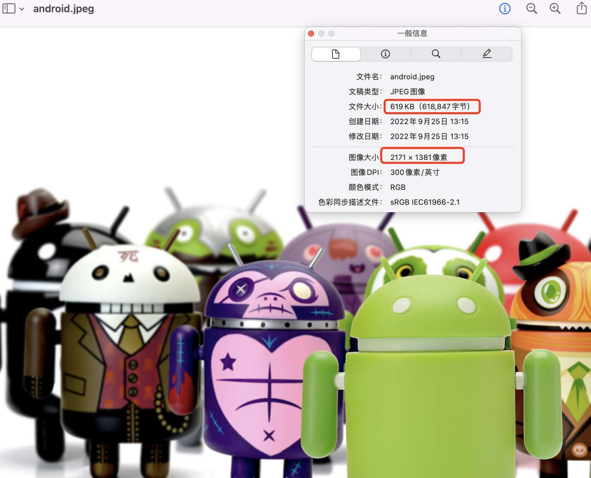
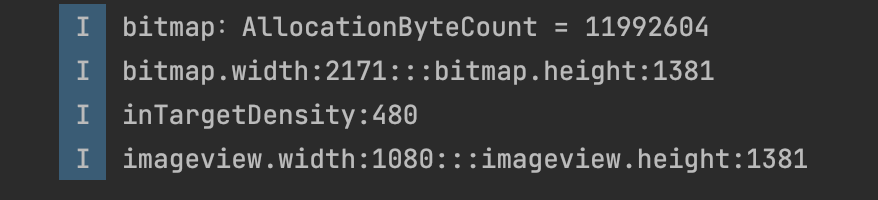
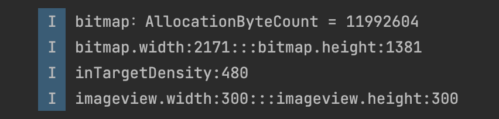
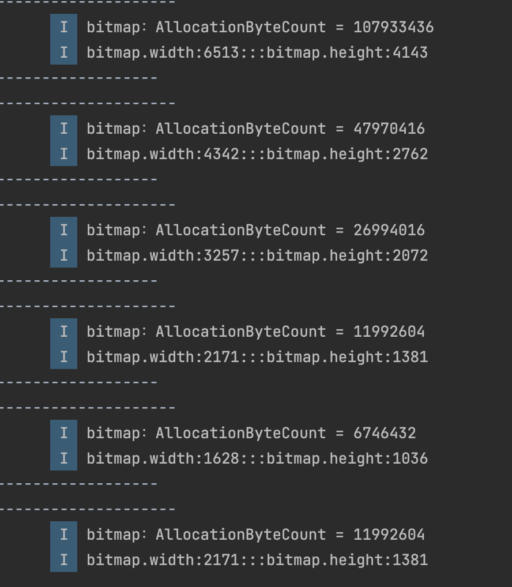
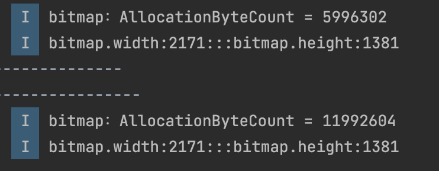
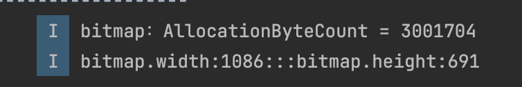

#Bitamp 内存占用分析

## 1. 前言
阅读本篇之前，先来想一些问题：

* Q1：一张图片的文件大小和其内存占用大小有关系吗？
* Q3：一张图片，分别放在drawable-nodpi,drawable-mdpi,drawable-hdpi, drawable-xxhdpi,drawable-xxxhdpi这几个资源目录中，加载后占用内存相同吗？
* Q4：一张图片放在ImageView中，占用内存大小和ImageView的大小有关系吗？

围绕上述问题，我们探讨下Bitmap的内存占用问题。
## 2. 基础概念
这里先要搞清楚 DisplayMetrics 的两个变量，摘录官方文档的解释：

- **density**：The logical density of the display. This is a scaling factor for the Density Independent Pixel unit, where one DIP is one pixel on an approximately 160 dpi screen (for example a 240x320, 1.5”x2” screen), providing the baseline of the system’s display. Thus on a 160dpi screen this density value will be 1; on a 120 dpi screen it would be .75; etc. This value does not exactly follow the real screen size (as given by xdpi and ydpi, but rather is used to scale the size of the overall UI in steps based on gross changes in the display dpi. For example, a 240x320 screen will have a density of 1 even if its width is 1.8”, 1.3”, etc. However, if the screen resolution is increased to 320x480 but the screen size remained 1.5”x2” then the density would be increased (probably to 1.5).
- **densityDpi**：The screen density expressed as dots-per-inch.

简单来说，可以理解为 density 的数值是 1dp=density px；densityDpi 是屏幕每英寸对应多少个点（不是像素点），它们之间公式是 `px = dp * (densityDpi / 160)`，也就是`density = 160/densityDpi`，在 DisplayMetrics 当中，这两个的关系是线性的：

| densityDpi(密度值) | 160  | 240  | 320  | 480   | 640  |
| :---------        | :--- | :--- | :--- | :--- | :--- | 
| density(密度)    | 1    | 1.5  | 2    | 3     | 4    |
| 资源目录    | mdpi    | hdpi | xhdpi    | xxhdpi    | xxxhdpi  |
| 代表分辨率 | 320x480  |480x800  | 720x1280  | 1080x1920  | 1440x2560  |

为了不引起混淆，本文所有提到的密度除非特别说明，都指的是 densityDpi，当然如果你愿意，也可以用 density 来说明问题。

另外，本文的依据主要来自 android 9.0 的源码，其他版本可能略有出入。

## 3. 正文

### 3.1 实践

下面，我们做几个实验，看看图片内存究竟跟什么因素有关

> 如无特殊说明，测试机器为 华为P30，分辨率1080x2340，屏幕密度480
>
> 关于分辨率可以通过  `adb shell wm size` 获取， 屏幕密度可以通过 `adb shell wm density` 获取


这是一张普通的图片，来看看它的具体信息：



图片的分辨率是 2171*1381，而我们在电脑上看到的这张 png 图片大小有 619KB，那么问题来了：

**我们看到的一张大小为 619KB 的  图片，它在内存中占有的大小也是 619KB 吗？**

#### 实验一：


把图片放到`drawable-nodpi`底下，新建一个布局文件添加一个`ImageView`

**布局如下**

```xml
<?xml version="1.0" encoding="utf-8"?>
<androidx.constraintlayout.widget.ConstraintLayout xmlns:android="http://schemas.android.com/apk/res/android"
    xmlns:app="http://schemas.android.com/apk/res-auto"
    xmlns:tools="http://schemas.android.com/tools"
    android:layout_width="match_parent"
    android:layout_height="match_parent"
    android:orientation="vertical">

    <androidx.appcompat.widget.AppCompatImageView
        android:id="@+id/testIv"
        android:layout_width="wrap_content"
        android:layout_height="wrap_content"
        android:layout_gravity="center_horizontal"
        app:layout_constraintBottom_toBottomOf="parent"
        app:layout_constraintEnd_toEndOf="parent"
        app:layout_constraintHorizontal_bias="0.5"
        app:layout_constraintStart_toStartOf="parent"
        app:layout_constraintTop_toTopOf="parent"
        app:layout_constraintVertical_bias="0.5" />

</androidx.constraintlayout.widget.ConstraintLayout>
```

**测试代码**

```kotlin
override fun onCreate(savedInstanceState: Bundle?) {
  super.onCreate(savedInstanceState)
  setContentView(R.layout.activity_bitmap_test)
  val imageView = findViewById<ImageView>(R.id.testIv)
  loadResImage(imageView);
}

private fun loadResImage(imageView: ImageView) {
  val options = BitmapFactory.Options()
  val bitmap = BitmapFactory.decodeResource(resources, R.drawable.android, options)
  imageView.setImageBitmap(bitmap)
  imageView.post {
    Log.i(TAG, "bitmap：AllocationByteCount = " + bitmap.allocationByteCount)
    Log.i(TAG, "bitmap.width:" + bitmap.width + ":::bitmap.height:" + bitmap.height)
    Log.i(TAG, "inTargetDensity:" + options.inTargetDensity)
    Log.i(TAG, "imageview.width:" + imageView.width + ":::imageview.height:" + imageView.height)
  }
}
```

**输入如下**



可以看到虽然bitmap的宽高和原图宽高一致，但是其占用内容约为11M，**跟图片文件大小并没关系**

所以，我们需要搞清楚一个概念：我们在电脑上看到图片是经过相对应的压缩算法将原图每个像素点信息转换用另一种数据格式表示，以此达到压缩目的，减少图片文件大小。[详细可查看](https://blog.adison.top/perf-opt/Android/bitmap/imge-format/)

而当我们通过代码，将这张图片加载进内存时，会先解析图片文件本身的数据格式，然后还原为位图，也就是 Bitmap 对象，**Bitmap 的大小跟图片文件大小无关**。

#### 实验二：

修改ImageView宽高如下：

```xml
    <androidx.appcompat.widget.AppCompatImageView
        android:id="@+id/testIv"
        android:layout_width="100dp"
        android:layout_height="100dp"
        android:layout_gravity="center_horizontal"
        app:layout_constraintBottom_toBottomOf="parent"
        app:layout_constraintEnd_toEndOf="parent"
        app:layout_constraintHorizontal_bias="0.5"
        app:layout_constraintStart_toStartOf="parent"
        app:layout_constraintTop_toTopOf="parent"
        app:layout_constraintVertical_bias="0.5" />
```



可以看到图片在设备上虽然显示比较小，但是其内存占用却没有变化；所以 **ImageView的大小和图片占用内存大小无关**

#### 实验三：

把图片分别放到`mdpi`,`hdpi`,`xhdpi`,`xxhdpi`,`xxxhdpi`,`nodpi`, 查看其内存,结果如下：



**可以看到放在不同的资源目录，其bitmap大小和占用内存是不一样的**，

**nodpi和xxhdpi的bimap的大小是一致的，而机器密度刚好是480，所以bitmap占用内存大小和机器屏幕密度是有一定内在联系**，这个我们下面再深究。

### 实验三：

修改Bitmap的色彩模式：分别设置测试

```kotlin
//Bitmap.Config.RGB_565
options.inPreferredConfig = Bitmap.Config.RGB_565
// Bitmap.Config.ARGB_8888
options.inPreferredConfig = Bitmap.Config.ARGB_8888
```

**输出如下**



**可以使用不同的色彩模式，其bitmap大小一样，但占用内存是不一样的**，RGB_565占用内存是ARGB_8888的一半

在上面实验基础上，我们设置一下`Bitmap的inSampleSize`如下

```java
 options.inSampleSize = 2
```



**可以设置inSampleSize为2之后，其bitmap宽高约变成原来的一半，占用内存约变成原来的1/4**

#### 小结

通过前面的实验，我们就不难知道，影响Bitmap 内存占用的大小可能有以下因素：

- **原始文件存放的资源目录**
- **目标屏幕的密度**
- **Bitmap Config：色彩格式、采样率等**

### 3.3 源码分析

下面从源码角度论证下上面实验是否正确。

#### 3.3.1 内存计算公式

对于Bitmap占用多少内存，Android 提供了一个方便的API：

```java
public final int getAllocationByteCount() {
  if (mRecycled) {
    Log.w(TAG, "Called getAllocationByteCount() on a recycle()'d bitmap! "
          + "This is undefined behavior!");
    return 0;
  }
  return nativeGetAllocationByteCount(mNativePtr);
}

private static native int nativeGetAllocationByteCount(long nativeBitmap)
```

在Android 4.4以前，我们一般会使用下面的API：

```java
public final int getByteCount() {
  if (mRecycled) {
    Log.w(TAG, "Called getByteCount() on a recycle()'d bitmap! "
          + "This is undefined behavior!");
    return 0;
  }
  // int result permits bitmaps up to 46,340 x 46,340
  return getRowBytes() * getHeight();
}
```

!!! question "那么这两个计算公式有什么区别呢？"
		Android 4.4之后如果设置了` BitmapFactory.Options.inBitmap` 字段，那么采用 Options 对象的解码方法会在加载内容时尝试重复使用现有位图, 只要保证旧Bitmap的大小是大于等于新Bitmap大小即可。那么这时候bitmap占用内存大小`(getAllocationByteCount)`还是保持为被复用Bitmap的大小，会比其本身占用内存大小`(getByteCount)`要大
		

		Android 4.4之后使用`(getAllocationByteCount)`获取图片占用内存会更准确


从上面可知，最终计算bitmap的方法是`nativeGetAllocationByteCount`,我们找到其在native中定义

[base\core\jni\android\graphics\Bitmap.cpp](https://android.googlesource.com/platform/frameworks/base/+/35ef567/core/jni/android/graphics/Bitmap.cpp)

```CPP
static const JNINativeMethod gBitmapMethods[] = {
    ···
    {   "nativeGetAllocationByteCount", "(J)I", (void*)Bitmap_getAllocationByteCount },
    ···
};

static jint Bitmap_getAllocationByteCount(JNIEnv* env, jobject, jlong bitmapPtr) {
    LocalScopedBitmap bitmapHandle(bitmapPtr);
    return static_cast<jint>(bitmapHandle->getAllocationByteCount());
}
```

继续往下跟到`BitmapWrapper#getAllocationByteCount()`，如下

```cpp
size_t getAllocationByteCount() const {
  if (mBitmap) {
    return mBitmap->getAllocationByteCount();
  }
  return mAllocationSize;
}
```

[base\libs\hwui\hwui\Bitmap.cpp](https://android.googlesource.com/platform/frameworks/base/+/master/libs/hwui/hwui/Bitmap.cpp)

```cpp
size_t Bitmap::getAllocationByteCount() const {
    switch (mPixelStorageType) {
        case PixelStorageType::Heap:
            return mPixelStorage.heap.size;
        default:
            return rowBytes() * height();
    }
}
```

从[Bitmap: 从出生到死亡](https://blog.adison.top/perf-opt/Android/bitmap/bitmap-from-birth-to-death/#32)可知，Android 8.0之后Bitmap内存一般由[HeapAllocator](https://android.googlesource.com/platform/frameworks/base/+/refs/heads/oreo-release/core/jni/android/graphics/GraphicsJNI.h#125)来分配

```cpp
bool HeapAllocator::allocPixelRef(SkBitmap* bitmap, SkColorTable* ctable) {
    mStorage = android::Bitmap::allocateHeapBitmap(bitmap, ctable);
    return !!mStorage;
}
```
[base\libs\hwui\hwui\Bitmap.cpp](https://android.googlesource.com/platform/frameworks/base/+/master/libs/hwui/hwui/Bitmap.cpp)

```cpp
static sk_sp<Bitmap> allocateBitmap(SkBitmap* bitmap, AllocPixelRef alloc) {
    const SkImageInfo& info = bitmap->info(); // info：图片参数
    if (info.colorType() == kUnknown_SkColorType) {
        LOG_ALWAYS_FATAL("unknown bitmap configuration");
        return nullptr;
    }

    size_t size; // size：像素数据内存大小 亦即是上述mPixelStorage.heap.size

    // we must respect the rowBytes value already set on the bitmap instead of
    // attempting to compute our own.
    const size_t rowBytes = bitmap->rowBytes(); // rowBytes：一行占用的内存大小
    // 计算像素数据内存大小，并将结果赋值到 size 变量上
    if (!computeAllocationSize(rowBytes, bitmap->height(), &size)) {
        return nullptr;
    }

    auto wrapper = alloc(size, info, rowBytes);
    if (wrapper) {
        wrapper->getSkBitmap(bitmap);
    }
    return wrapper;
}

static bool computeAllocationSize(size_t rowBytes, int height, size_t* size) {
    int32_t rowBytes32 = SkToS32(rowBytes);
    int64_t bigSize = (int64_t)height * rowBytes32;
    if (rowBytes32 < 0 || !sk_64_isS32(bigSize)) {
        return false;  // allocation will be too large
    }

    *size = sk_64_asS32(bigSize);
    return true;
}
```
所以 `bitmapInRam = rowBytes*bitmapHeight`

跟踪下rowBytes的实现

[SkPixelRef.h](https://chromium.googlesource.com/external/skia/include/+/master/core/SkPixelRef.h)

```cpp
size_t rowBytes() const { return fRowBytes; }
```
看下fRowBytes在哪里赋值：

[SkPixelRef.cpp](https://github.com/google/skia/blob/main/src/core/SkPixelRef.cpp#46)

```cpp
void SkPixelRef::android_only_reset(int width, int height, size_t rowBytes) { 
    fWidth = width; 
    fHeight = height; 
    fRowBytes = rowBytes; 
    this->notifyPixelsChanged(); }
```

再看下android_only_reset的调用链路，

[base\libs\hwui\hwui\Bitmap.cpp](https://android.googlesource.com/platform/frameworks/base/+/master/libs/hwui/hwui/Bitmap.cpp)

```cpp
void Bitmap::reconfigure(const SkImageInfo& newInfo, size_t rowBytes) {
    mInfo = validateAlpha(newInfo);

    // Dirty hack is dirty
    // TODO: Figure something out here, Skia's current design makes this
    // really hard to work with. Skia really, really wants immutable objects,
    // but with the nested-ref-count hackery going on that's just not
    // feasible without going insane trying to figure it out
    this->android_only_reset(mInfo.width(), mInfo.height(), rowBytes);
}
```

再看下 reconfigure 的调用链路，如下：

```javascript
void Bitmap::reconfigure(const SkImageInfo& info) { 
    reconfigure(info, info.minRowBytes()); 
}
```

发现rowBytes()最终是 SkImageInfo 中的 minRowBytes() 计算的，继续跟踪[SkImageInfo.h](https://chromium.googlesource.com/external/skia/include/+/f2e084053cd1dbd21fa3cece80d70045b2b0b83b/core/SkImageInfo.h)：

```cpp
size_t minRowBytes() const {
  return (size_t)this->minRowBytes64();
}

uint64_t minRowBytes64() const {
  return sk_64_mul(fWidth, this->bytesPerPixel());
}

int bytesPerPixel() const {
  return SkColorTypeBytesPerPixel(fColorType);
}


static int SkColorTypeBytesPerPixel(SkColorType ct) {
    static const uint8_t gSize[] = {
        0,  // Unknown
        1,  // Alpha_8
        2,  // RGB_565
        2,  // ARGB_4444
        4,  // RGBA_8888
        4,  // BGRA_8888
        1,  // kIndex_8
    };
    SK_COMPILE_ASSERT(SK_ARRAY_COUNT(gSize) == (size_t)(kLastEnum_SkColorType + 1),
                      size_mismatch_with_SkColorType_enum);
    SkASSERT((size_t)ct < SK_ARRAY_COUNT(gSize));
    return gSize[ct];
}
```
[SkMath.h](https://github.com/google/skia/blob/main/include/core/SkMath.h)
```cpp
static inline int64_t sk_64_mul(int64_t a, int64_t b) {
    return a * b;
}
```

跟踪到这里，我们发现 ARGB_8888（也就是我们最常用的 Bitmap 的格式）的一个像素占用 4byte，那么 rowBytes 实际上就是 4*width bytes。

可以得知 `rowBytes(一行占用的内存大小) =  bitmapWidth*每个像素占用大小`

从这可以得出初步结论，一张 ARGB_8888 的 Bitmap 占用内存的计算公式

**bitmapInRam = bitmapWidth\*bitmapHeight \*4 bytes**

至此，我们论证了图片占用内存和色彩格式的关系，但 **bitmap宽高不一定等于图片本身宽高**，下面我们以实验用到的方法`BitmapFactory.decodeResource`看下bitmap宽高和图片本身宽高的关系

#### BitmapFactory.decodeResource

[BitmapFactory.java](https://android.googlesource.com/platform/frameworks/base/+/5b0971801fdfdd7b6600b03bec3191c9709d0285/graphics/java/android/graphics/BitmapFactory.java)

```java
   public static Bitmap decodeResource(Resources res, int id, Options opts) {
        validate(opts);
        Bitmap bm = null;
        InputStream is = null; 
        
        try {
            final TypedValue value = new TypedValue();
           //openRawResource会根据资源缩放的位置对TypedValue的inDensity赋值，如xxhdpi， 就是480
            is = res.openRawResource(id, value);

            bm = decodeResourceStream(res, value, is, null, opts);
        } catch (Exception e) {
            /*  do nothing.
                If the exception happened on open, bm will be null.
                If it happened on close, bm is still valid.
            */
        } finally {
            try {
                if (is != null) is.close();
            } catch (IOException e) {
                // Ignore
            }
        }

        if (bm == null && opts != null && opts.inBitmap != null) {
            throw new IllegalArgumentException("Problem decoding into existing bitmap");
        }

        return bm;
    }

   public static Bitmap decodeResourceStream(@Nullable Resources res, @Nullable TypedValue value,
            @Nullable InputStream is, @Nullable Rect pad, @Nullable Options opts) {
        validate(opts);
        if (opts == null) {
            opts = new Options();
        }

        if (opts.inDensity == 0 && value != null) {
            final int density = value.density;
            if (density == TypedValue.DENSITY_DEFAULT) {
                opts.inDensity = DisplayMetrics.DENSITY_DEFAULT;
            } else if (density != TypedValue.DENSITY_NONE) {
                opts.inDensity = density; //这里density的值如果对应资源目录为xxhdpi的话，就是480
            }
        }
        
        if (opts.inTargetDensity == 0 && res != null) {
          //请注意，inTargetDensity就是当前的显示密度，比如华为P30时就是480
            opts.inTargetDensity = res.getDisplayMetrics().densityDpi;
        }
        
        return decodeStream(is, pad, opts);
    }

```

> **inDensity 就是原始资源的 density，inTargetDensity 就是屏幕的 density**。

最终调用到`nativeDecodeStream`

```java
 private static native Bitmap nativeDecodeStream(InputStream is, byte[] storage,
            Rect padding, Options opts);
```

[BitmapFactory.cpp](https://android.googlesource.com/platform/frameworks/base/+/7b2f8b8/core/jni/android/graphics/BitmapFactory.cpp)

```cpp
static jobject nativeDecodeStream(JNIEnv* env, jobject clazz, jobject is, jbyteArray storage,
        jobject padding, jobject options) {

				...
        ...
        bitmap = doDecode(env, std::move(bufferedStream), padding, options);
    }
    return bitmap;
}


static jobject doDecode(JNIEnv* env, std::unique_ptr<SkStreamRewindable> stream,
                        jobject padding, jobject options) {
    ···
    int sampleSize = 1;
    float scale = 1.0f;

		···
    if (options != NULL) {
       // 获取inSampleSize
        sampleSize = env->GetIntField(options, gOptions_sampleSizeFieldID);
        // 修正sampleSize
        if (sampleSize <= 0) {
            sampleSize = 1;
        }

        if (env->GetBooleanField(options, gOptions_scaledFieldID)) {
        	// 获取inDensity
            const int density = env->GetIntField(options, gOptions_densityFieldID);
            // 获取targetDensity
            const int targetDensity = env->GetIntField(options, gOptions_targetDensityFieldID);
            // 获取inScreenDensity，默认等于0
            const int screenDensity = env->GetIntField(options, gOptions_screenDensityFieldID);
            if (density != 0 && targetDensity != 0 && density != screenDensity) {
                // 得到 缩放因子scale
                scale = (float) targetDensity / density;
            }
        }
    }

		···
    // Determine the output size.
    SkISize size = codec->getSampledDimensions(sampleSize);

    // 经过采样之后的尺寸
    int scaledWidth = size.width();
    int scaledHeight = size.height();
    bool willScale = false;


		···
    // 根据前面的density和targetDensity计算出的scale,再次计算缩放的宽高
    if (scale != 1.0f) {
        willScale = true;
        scaledWidth = static_cast<int>(scaledWidth * scale + 0.5f);
        scaledHeight = static_cast<int>(scaledHeight * scale + 0.5f);
    }
		···
    SkBitmap decodingBitmap;
    if (!decodingBitmap.setInfo(bitmapInfo) ||
            !decodingBitmap.tryAllocPixels(decodeAllocator)) {
        // SkAndroidCodec should recommend a valid SkImageInfo, so setInfo()
        // should only only fail if the calculated value for rowBytes is too
        // large.
        // tryAllocPixels() can fail due to OOM on the Java heap, OOM on the
        // native heap, or the recycled javaBitmap being too small to reuse.
        return nullptr;
    }
		···
    // Use SkAndroidCodec to perform the decode.
    SkAndroidCodec::AndroidOptions codecOptions;
    codecOptions.fZeroInitialized = decodeAllocator == &defaultAllocator ?
            SkCodec::kYes_ZeroInitialized : SkCodec::kNo_ZeroInitialized;
    codecOptions.fSampleSize = sampleSize;
    SkCodec::Result result = codec->getAndroidPixels(decodeInfo, decodingBitmap.getPixels(),
            decodingBitmap.rowBytes(), &codecOptions);
    switch (result) {
        case SkCodec::kSuccess:
        case SkCodec::kIncompleteInput:
            break;
        default:
            return nullObjectReturn("codec->getAndroidPixels() failed.");
    }
	···
    // 缩放比例
    const float scaleX = scaledWidth / float(decodingBitmap.width());
    const float scaleY = scaledHeight / float(decodingBitmap.height());

    SkBitmap outputBitmap;
    if (willScale) {
        // Set the allocator for the outputBitmap.
        SkBitmap::Allocator* outputAllocator;
        if (javaBitmap != nullptr) {
            outputAllocator = &recyclingAllocator;
        } else {
            outputAllocator = &defaultAllocator;
        }

        SkColorType scaledColorType = decodingBitmap.colorType();
        // FIXME: If the alphaType is kUnpremul and the image has alpha, the
        // colors may not be correct, since Skia does not yet support drawing
        // to/from unpremultiplied bitmaps.
        outputBitmap.setInfo(
                bitmapInfo.makeWH(scaledWidth, scaledHeight).makeColorType(scaledColorType));
        if (!outputBitmap.tryAllocPixels(outputAllocator)) {
            // This should only fail on OOM.  The recyclingAllocator should have
            // enough memory since we check this before decoding using the
            // scaleCheckingAllocator.
            return nullObjectReturn("allocation failed for scaled bitmap");
        }

     		
        SkCanvas canvas(outputBitmap, SkCanvas::ColorBehavior::kLegacy);
        // Canvas 放大 scale 倍，相当于把这张 bitmap 放大了 scale 倍
        canvas.scale(scaleX, scaleY);
        canvas.drawBitmap(decodingBitmap, 0.0f, 0.0f, &paint);
    } 
		···
    return bitmap::createBitmap(env, defaultAllocator.getStorageObjAndReset(),
            bitmapCreateFlags, ninePatchChunk, ninePatchInsets, -1);
}


```

至此，可知Bitmap尺寸公式为

```java
bitmapWidth = 图片宽度/inSampleSize*inTargetDensity/inDensity
bitmapHeight = 图片高度/inSampleSize*inTargetDensity/inDensity
```

所以，Bitmap内存占用公式为

**bitmapInRam = bitmapWidth\* bitmapHeight\*每个像素占用大小**

----------------

再看下我们的实验三，一张 **2171\*1381** 的图片，我把它放到 **drawable-xhdpi** 目录下，在 **华为P30** 上加载，占用内存`26994016B`，其中 density 对应 xhdpi 为320，targetDensity 对应华为P30的密度为480：

**2171\*480/320 \* 1381\*480 /320  \* 4 = 26983359B**

会发现我们计算和系统获取到的数值不一样

这是因为精度问题，由上面源码可知

```java
if (scale != 1.0f) {
  willScale = true;
  scaledWidth = static_cast<int>(scaledWidth * scale + 0.5f);
  scaledHeight = static_cast<int>(scaledHeight * scale + 0.5f);
}
```

在我们的例子中，

```java
scaledWidth = int(2171 * (480 / 320f) + 0.5)= int(3257.0) = 3257
scaledHeight = int( 1381 * (480 / 320f) + 0.5) = int(2072.0) = 2072
```

**3257  * 2072 *  4 = 26994016** 

和API得到的数值一致，至此，Bitmap的内存占用分析完毕！！！

## 参考

[你的 Bitmap 究竟占多大内存？](https://cloud.tencent.com/developer/article/1071001)
