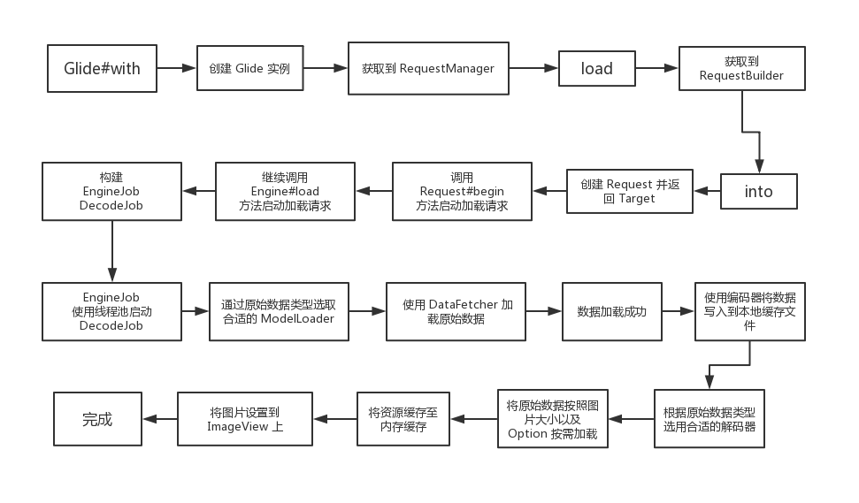

# Glide 核心原理速读
> 不陷于茫茫源码之中，只取其核心

## 总览

一般来说，我们使用如下代码加载一张网络图片：
``` java
Glide.with(this).load(url).into(imgView);
 ```       
流程大概如下：



### Glide 特点

一般来说，一个优秀的图片加载库，都会有以下几个特点：
* 支持多种图片格式，如：`jpg`、`png`、`webp`、`gif` 等
* 支持多种数据源，如：`网络`、`本地`、`assets` 等
* 支持多种缓存策略，如：`内存`、`磁盘`、`网络` 等

而Glide处理具备以上特点外，还有以下特点：

- 生命周期感知（根据Activity或者Fragment的生命周期管理图片加载请求）
- 高效处理Bitmap（bitmap的复用和主动回收，减少系统回收压力）
- 更高效的缓存策略，加载速度快且内存开销小

## 核心原理

### Glide是如何感知生命周期的

1. 传入Activity/Fragment/Context
**`Glide#with`** 
``` java
 public static RequestManager with(@NonNull Activity activity) {
    return getRetriever(activity).get(activity); #1
  }
```
2. 关联生命周期
**`RequestManagerRetriever#get`**
```java
  public RequestManager get(@NonNull Activity activity) {
    if (Util.isOnBackgroundThread()) {
      return get(activity.getApplicationContext());
    } else if (activity instanceof FragmentActivity) {
      return get((FragmentActivity) activity);  #2
    } else {
      ....
    }
  }

    @NonNull
  public RequestManager get(@NonNull FragmentActivity activity) {
    ...
    //Glide 终于支持官方的lyfecycle方案了，虽然是实验性的，但不影响分析，就以这个为例吧
    if (useLifecycleInsteadOfInjectingFragments()) {
      Context context = activity.getApplicationContext();
      Glide glide = Glide.get(context);
      #4
      return lifecycleRequestManagerRetriever.getOrCreate(
          context,
          glide
          activity.getLifecycle(),
          activity.getSupportFragmentManager(),
          isActivityVisible);
    } else {
      ...
    }
  }
```
**`LifecycleRequestManagerRetriever#getOrCreate`**
```java
  RequestManager getOrCreate(
      Context context,
      Glide glide,
      final Lifecycle lifecycle,
      FragmentManager childFragmentManager,
      boolean isParentVisible) {
    Util.assertMainThread();
    RequestManager result = getOnly(lifecycle);
    if (result == null) {
      
      //LifecycleLifecycle 是关联Activity生命周期和RequestManager的桥梁
      #5 
      LifecycleLifecycle glideLifecycle = new LifecycleLifecycle(lifecycle);
      // 这里会构建RequestManager并且和Lifecycle关联
      #6
      result =
          factory.build(
              glide,
              glideLifecycle,
              new SupportRequestManagerTreeNode(childFragmentManager),
              context);
      ...
    }
    return result;
  }
```
2. 感知生命周期
**`RequestManager`**
```java
  RequestManager(
      Glide glide,
      Lifecycle lifecycle,
      RequestManagerTreeNode treeNode,
      RequestTracker requestTracker,
      ConnectivityMonitorFactory factory,
      Context context) {
   ...
    // 关联生命周期
    #7
      lifecycle.addListener(this);
   ...
  }

  // 感知生命周期处理请求.
  @Override
  public synchronized void onStart() {
    resumeRequests();
    targetTracker.onStart();
  }
  // 感知生命周期处理请求.
  @Override
  public synchronized void onStop() {
    pauseRequests();
    targetTracker.onStop();
  }
// 感知生命周期处理请求.
  @Override
  public synchronized void onDestroy() {
    targetTracker.onDestroy();
    for (Target<?> target : targetTracker.getAll()) {
      clear(target);
    }
    targetTracker.clear();
    requestTracker.clearRequests();
    lifecycle.removeListener(this);
    lifecycle.removeListener(connectivityMonitor);
    Util.removeCallbacksOnUiThread(addSelfToLifecycle);
    glide.unregisterRequestManager(this);
  }
```

**`LifecycleLifecycle`** 是关联Activity生命周期和RequestManager的桥梁

```java
final class LifecycleLifecycle implements Lifecycle, LifecycleObserver {
  @NonNull
  private final Set<LifecycleListener> lifecycleListeners = new HashSet<LifecycleListener>();

  @NonNull private final androidx.lifecycle.Lifecycle lifecycle;
  //这里是#4的 activity.getLifecycle()
  LifecycleLifecycle(androidx.lifecycle.Lifecycle lifecycle) {
    this.lifecycle = lifecycle;
    // LifecycleLifecycle 作为 LifecycleObserver 注册到 Activity Lifecycle
    lifecycle.addObserver(this);
  }

  @OnLifecycleEvent(Event.ON_START)
  public void onStart(@NonNull LifecycleOwner owner) {
    for (LifecycleListener lifecycleListener : Util.getSnapshot(lifecycleListeners)) {
      lifecycleListener.onStart();
    }
  }

  @OnLifecycleEvent(Event.ON_STOP)
  public void onStop(@NonNull LifecycleOwner owner) {
    for (LifecycleListener lifecycleListener : Util.getSnapshot(lifecycleListeners)) {
      lifecycleListener.onStop();
    }
  }

  @OnLifecycleEvent(Event.ON_DESTROY)
  public void onDestroy(@NonNull LifecycleOwner owner) {
    for (LifecycleListener lifecycleListener : Util.getSnapshot(lifecycleListeners)) {
      lifecycleListener.onDestroy();
    }
    owner.getLifecycle().removeObserver(this);
  }
  // RequestManager 作为 LifecycleListener 注册到 LifecycleLifecycle，从而间接注册到 Activity Lifecycle
  @Override
  public void addListener(@NonNull LifecycleListener listener) {
    lifecycleListeners.add(listener);

    if (lifecycle.getCurrentState() == State.DESTROYED) {
      listener.onDestroy();
    } else if (lifecycle.getCurrentState().isAtLeast(State.STARTED)) {
      listener.onStart();
    } else {
      listener.onStop();
    }
  }

  @Override
  public void removeListener(@NonNull LifecycleListener listener) {
    lifecycleListeners.remove(listener);
  }
}
```
#### 小结
1.获取对应Activity的`Lifecycle`, 把`LifecycleLifecycle`作为 LifecycleObserver 注册到 `Activity Lifecycle`；
2.在创建`RequestManager`时，RequestManager 作为 `LifecycleListener` 注册到 LifecycleLifecycle，从而间接注册到 Activity Lifecycle;
3.这样当Activity生命周期变化的时候，就能通过接口回调去通知RequestManager处理请求.

> 以上是Glide支持官方的lyfecycle方案的处理流程，其实默认Glide是自己实现了一套生命周期感知方案，这里不做分析，感兴趣的可以自己去看源码或者查看网上相关文章。

### 缓存策略
Glide的缓存分为两种，一种是内存缓存，一种是磁盘缓存。其中内存缓存又分为活动资源和LRU内存缓存，磁盘缓存又分为原始数据缓存和转换后的数据缓存。默认情况下，Glide 会在开始一个新的图片请求之前检查以下多级的缓存：

1. 活动资源 (`Active Resources`) - 现在是否有另一个 View 正在展示这张图片？
2. 内存缓存 (`Memory cache`) - 该图片是否最近被加载过并仍存在于内存中？
3. 资源类型（`Resource`） - 该图片是否之前曾被解码、转换并写入过磁盘缓存？
4. 数据来源 (`Data`) - 构建这个图片的资源是否之前曾被写入过文件缓存？

前两步检查图片是否在内存中，如果是则直接返回图片。后两步则检查图片是否在磁盘上，以便快速但异步地返回图片。

如果四个步骤都未能找到图片，则Glide会返回到原始资源以取回数据（原始文件，Uri, Url等）。

#### 内存缓存
1. 先从活动资源缓存中获取，如果获取到则直接返回
2. 不在活动资源缓存，则尝试从LRU内存缓中获取，如果获取到则返回，从Lru缓存删除并将其加入活动资源缓存

具体代码如下
**`Engine#loadFromMemory`**
```Java
  private EngineResource<?> loadFromMemory(
      EngineKey key, boolean isMemoryCacheable, long startTime) {
    if (!isMemoryCacheable) {
      return null;
    }
    #1 从活动资源缓存中获取
    EngineResource<?> active = loadFromActiveResources(key);
    if (active != null) {
      if (VERBOSE_IS_LOGGABLE) {
        logWithTimeAndKey("Loaded resource from active resources", startTime, key);
      }
      return active;
    }
     #2 从LRU内存缓中获取
    EngineResource<?> cached = loadFromCache(key);
    if (cached != null) {
      if (VERBOSE_IS_LOGGABLE) {
        logWithTimeAndKey("Loaded resource from cache", startTime, key);
      }
      return cached;
    }

    return null;
  }

 private EngineResource<?> loadFromActiveResources(Key key) {
    // 从 ActiveResources 中加载缓存数据
    EngineResource<?> active = activeResources.get(key);
    if (active != null) {
      //活动引用计数+1
      active.acquire();
    }

    return active;
  }
  
   private EngineResource<?> loadFromCache(Key key) {
    EngineResource<?> cached = getEngineResourceFromCache(key);
    if (cached != null) {
      //活动引用计数+1
      cached.acquire();
      // 加入活动缓存，注意，这里已经从 LRU 缓存中移除了
      activeResources.activate(key, cached);
    }
    return cached;
  }

   private EngineResource<?> getEngineResourceFromCache(Key key) {
    // cache是LruResourceCache的实现
    // 从 LruResourceCache 中加载缓存数据，并移除
    Resource<?> cached = cache.remove(key);

    final EngineResource<?> result;
    if (cached == null) {
      result = null;
    } else if (cached instanceof EngineResource) {
      // Save an object allocation if we've cached an EngineResource (the typical case).
      result = (EngineResource<?>) cached;
    } else {
      result =
          new EngineResource<>(
              cached, /*isMemoryCacheable=*/ true, /*isRecyclable=*/ true, key, /*listener=*/ this);
    }
    return result;
  }
```
3. 当请求被取消或者Request接收到生命周期调用onDestroy页面销毁的时候会通知Request请求释放活动资源，从而将活动资源从活动资源缓存中移除，同时将活动资源加入到LRU内存缓存中

**`SingleRequest#clear`**
```java
  @Override
  public void clear() {
    
    ...
    engine.release(toRelease);
    ...
  }
```

**`Engine#release`**
```java
  public void release(Resource<?> resource) {
    ...
   ((EngineResource<?>) resource).release();
   ...
  }
```
**`EngineResource#release`**
```java
  void release() {
      ...
      if (--acquired == 0) {
        // 引用计数归0
        release = true;
      }
    if (release) {
      //Engine 实现了ResourceListener
      listener.onResourceReleased(key, this);
    }
  }
```
**`Engine#onResourceReleased`**
```java
 public void onResourceReleased(Key cacheKey, EngineResource<?> resource) {
    // 从活动缓存中移除
    activeResources.deactivate(cacheKey);
    if (resource.isMemoryCacheable()) {
       // 加入 LRU 缓存
      cache.put(cacheKey, resource);
    } else {
      resourceRecycler.recycle(resource, /*forceNextFrame=*/ false);
    }
  }
```
!!! notes "为什么要有活动资源缓存?"
    1. **降低内存压力，防止内存泄漏**
    ActiveResources 中的 HashMap 是弱引用维护的，而 LruCache 中的 LinkedHashMap 用的是强引用。因为弱引用对象会随时被 gc 回收，所以可以防止内存泄漏
    2. **提高缓存效率**
    如果过没有活动资源缓存，每一次使用的资源都加入内存缓存，极有可能因为放入Lru缓存的数据过多，导致正在使用资源从Lru缓存中移除，等到下次来进行加载的时候因为没有对应的引用关系，找不到原来内存中正在使用的那个资源，从而需要再次从文件或者网络进行数据加载。

#### 磁盘缓存
首先了解一下磁盘缓存策略

* `DiskCacheStrategy.NONE`： 表示不缓存任何内容。
* `DiskCacheStrategy.RESOURCE`： 只缓存转换过后的图片。
* `DiskCacheStrategy.DATA`： 只缓存原始图片。
* `DiskCacheStrategy.ALL` ： 既缓存原始图片，也缓存转换过后的图片。
* `DiskCacheStrategy.AUTOMATIC`：默认策略，它会尝试对本地和远程图片使用最佳的策略。如果是远程图片，则只缓存原始图片；因为下载远程数据相比调整磁盘上已经存在的数据要昂贵得多. 如果是本地图片，那么只缓存转换过后的图片, 因为即使你需要再次生成另一个尺寸或类型的图片，取回原始数据也很容易。

以`RESOURCE`为例，核心代码如下

`ResourceCacheGenerator#startNext`
```java
  public boolean startNext() {
    ... 
        currentKey =
            new ResourceCacheKey( // NOPMD AvoidInstantiatingObjectsInLoops
                helper.getArrayPool(),
                sourceId,
                helper.getSignature(),
                helper.getWidth(),
                helper.getHeight(),
                transformation,
                resourceClass,
                helper.getOptions());
        // 从磁盘缓存中获取 ，DiskCache是DiskLruCacheWrapper的实例，对应的是DiskLruCache的封装
        cacheFile = helper.getDiskCache().get(currentKey);
        if (cacheFile != null) {
          sourceKey = sourceId;
          modelLoaders = helper.getModelLoaders(cacheFile);
          modelLoaderIndex = 0;
        }
      ...

      loadData =
            modelLoader.buildLoadData(
                cacheFile, helper.getWidth(), helper.getHeight(), helper.getOptions());
        if (loadData != null && helper.hasLoadPath(loadData.fetcher.getDataClass())) {
          started = true;
          loadData.fetcher.loadData(helper.getPriority(), this);
        }
        ...
  }
```
从磁盘缓存加载完之后也会加入到活动资源缓存, 这里是通过`EngineJobListener#onEngineJobComplete`回调完成

```java
 public synchronized void onEngineJobComplete(
      EngineJob<?> engineJob, Key key, EngineResource<?> resource) {
    if (resource != null && resource.isMemoryCacheable()) {
      // 加入活动资源缓存
      activeResources.activate(key, resource);
    }
    ...
  }
```

!!! notes " 为什么需要两种磁盘缓存"
    1. **可以根据不同来源在占用空间和效率上选择最佳方案**
    如果是远程图片，则只缓存原始图片；因为下载远程数据相比调整磁盘上已经存在的数据要昂贵得多. 如果是本地图片，那么只缓存转换过后的图片, 因为即使你需要再次生成另一个尺寸或类型的图片，取回原始数据也很容易。
    2. **提高缓存效率**
    举个例子，同一张图片，我们先在`100*100`的View是展示，再在`200*200`的View上展示, 如果不缓存变换后的类型相当于每次都要进行一次变换操作，如果不缓存原始数据则每次都要去重新下载数据


### 内存优化


