# 图片文件技术原理
## 计算机存储本质
计算机所有的文件均为二进制文件，包括文本文件（它是特殊的二进制文件，为什么特殊？因为它里面全部可直接翻译为字符），这些二进制文件就是一群0101集合（特定软件能打开就能看到），他们的读取与写入，过程完全相同：

* **读入内存**：文件-->二进制流-->-->按格式 **解码**-->应用程序内存数据
* **写出文件**：应用程序内存数据-->按格式 **编码**-->二进制流-->文件

> 所有文件的读写过程都是这样的，只是 **解码** 与 **编码** 的格式不同而已。

## 显示原理
**先用一句话总结显示原理**：
计算机中的文字和图像都是以像素的形式显示的。显示字符的本质也是显示图像——每一个汉字、英文字符都是以像素的形式在屏幕上输出。

在日常生活中，以像素形式组成图形和文字的不仅仅是计算机，还包括我们经常见到的「十字绣」，做工精细的多色十字绣几乎可以模拟照片的视觉效果。


与静态的十字绣不同，计算机的显示器要解决的问题是它要显示的内容是动态的、变化的。

先从显示器说起。
### 发光二极管显示器
如果说手机、电脑的显示屏由于像素太小了导致我们看不出它的工作原理，那么下面的显示屏你一定见过并且看得懂。

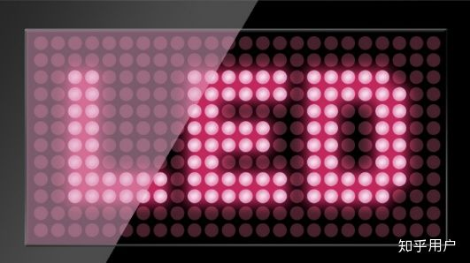

这种显示屏称为「发光二极管显示屏」，这种单色显示屏由一种颜色的发光二极管组成，由驱动电路决定每一个二极管的亮或灭，每一个二极管可以被称为一个「像素」。
单色显示屏的颜色由发光二极管的颜色决定，人们当然不可能满足单色显示，怎样才可以实现一个发光二极管发出各种颜色的光呢？最简单的方式就是把三种颜色的发光二极管做到一起，这三种颜色就是三原色——红色、绿色和蓝色。这三个二极管以不同的亮度发光，就可以组合成多种颜色，在现实中这三个二极管被组合到一起：


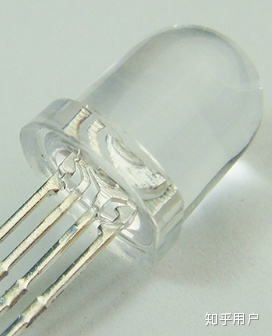

我们看到的大型户外广告屏很多就是采用这种显示原理的，这种显示屏上采用的发光二极管单个体积越小、数量越多，显示的图形效果就越细腻和丰富：

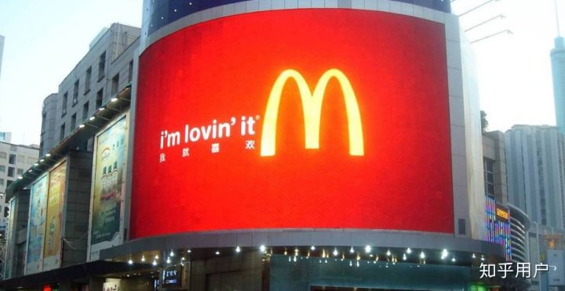

### OLED显示屏

那么，如果把发光二极管做的很小、很薄，是不是就可以用于手机和电脑屏幕呢？
是的，近年来一些手机（如iPhone X）就采用了被称为OLED的显示技术，所不同的是采用了「有机发光二极管」（Organic Light-Emitting Diode，缩写OLED），这种发光二极管可以做的很小、很薄，下图是iPhone X的OLED屏幕：

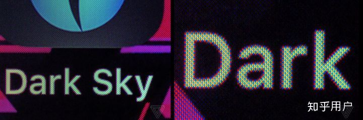

OLED屏幕上每一个像素都由三个发光二极管组成，它们像灯泡一样会老化，老化的发光二极管的亮度会发生衰减；如果一个显示屏长期显示一副画面，则屏幕上的发光二极管老化程度会不一样。这就带来OLED显示屏的硬伤——俗称「烧屏」，有时也称它为「残影」（如下图的iPhone X）。好在这种情况多出现在一些长时间、高亮度显示同一个画面的手机上。

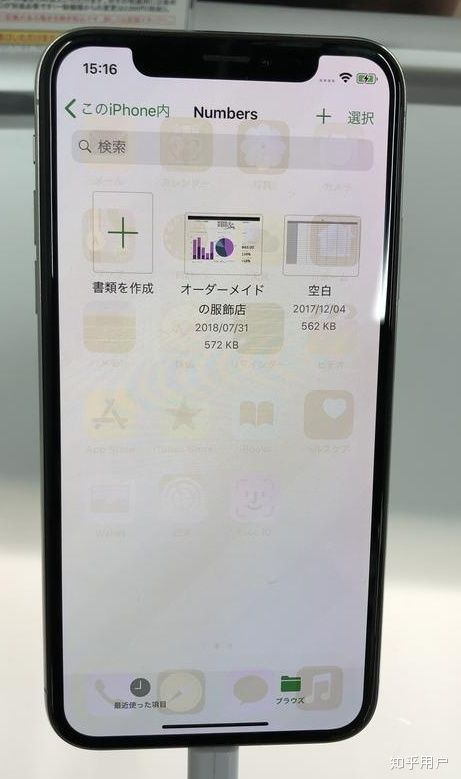

此外，由于OLED显示屏是主动发光的，因此它可以做成透明的。

### LCD显示屏
OLED是最近一些年才出现的新技术，还存在成本高、工艺不成熟的缺点。因此我们现在使用的电视机、显示器主要还是以LCD为主。
LCD的全称是「液晶显示器」（Liquid-Crystal Display，缩写：LCD）。与OLED不同的是在显示屏本身不发光，而是有一个白色的背光光源。LCD显示屏通过薄膜晶体管控制液晶的偏转角度，进而能控制透过它的背光亮度；透过液晶层的背光再通过彩色滤光片，就变成三种颜色、强弱不同的颜色，进而组合成各种颜色。

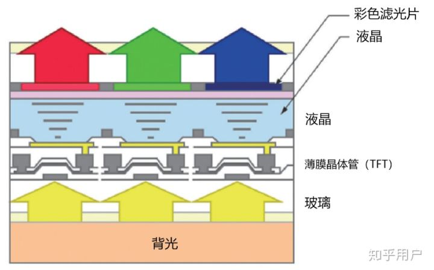

每一个液晶显示器都由数百万个这样的三色单元组成，最终成为我们在屏幕上看到的图像。

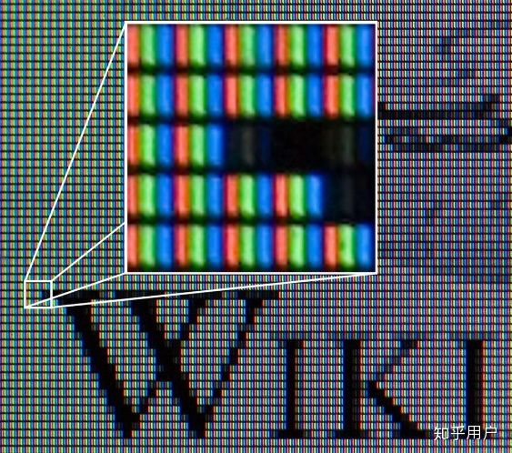

LCD显示器也有老化的问题，不过它的老化通常是背光光源的老化，是均匀的而不是局部的，因此不会出现OLED显示器的残影问题。一些显示屏用的时间长了颜色不鲜艳、屏幕发黄就是老化的表现。
到这里，我们知道了无论何种类型的显示器，它的每一个像素都是由三种颜色的点组成，这三种颜色分别是红色（Red）、绿色（Green）和蓝色（Blue）。
理论上，这三种颜色的亮度被设置为0-255级，这样一来三种颜色的不同亮度可以有256×256×256种组合，也就是说每一个点可以组合成一千六百七十七万七千二百一十六种颜色，这实际上已经超过了人眼对颜色的分辨力。

### 显示驱动电路
显示器里有一块被称为「驱动板」的电路，它一方面控制着显示面板上的每一个子像素的亮灭，另一方面通过VGAHDMIDVI这些接口与主机的显卡连接，接受主机输出的显示信号。

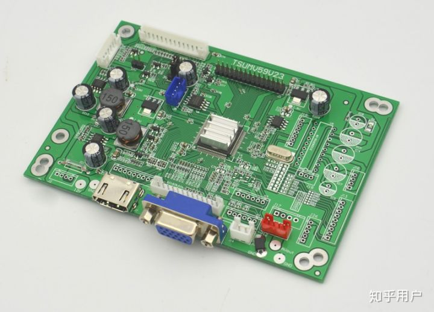

与大多数人想象的不一样的是——显示器并不是一次性控制显示面板上所有像素的颜色，而是一次控制“一行”，自上至下地控制显示面板上每一行像素，周而复始。由于刷新的速度很快（一秒钟60次），因此你不会看到屏幕在闪烁，这样做是为了降低硬件设计的复杂度。
如果你用较快的快门速度拍摄老式CRT显示器，你会发现它真的“一行行地”显示图像（液晶显示器不会出现这种情况，但它也是逐行扫描的）

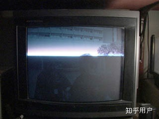

### 显示适配器（显卡）
显卡的职能是将要显示的图形或文本转换成可以驱动显示器的电信号，它有三个重要的组成部分：
* 显存
* 显卡BIOS
* GPU
  下图是一个比较老的AGP显卡，我之所以选择这个插图是一些新的显卡往往有庞大的散热片遮挡住了下面的元件。

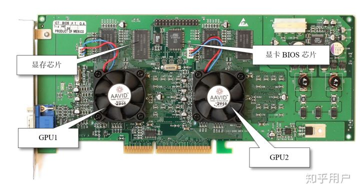


#### 显存

显存是显卡上的独立存储器，和主板上的内存一样是一种随机存储器，它用来存储即将要显示的数据。你可以这样理解，程序员负责将要显示的字符或图像数据送入显存，接下来的工作交给GPU和相关的外围电路就可以了。

#### 字符的显示
例如要显示英文字符，程序员可以将字符的编码和显示格式直接送入显存——要在屏幕最左上方显示一个Z, 把它的ASCII编码90送入显存的第一个字节即可（接下来的第二个字节用于控制显示格式）,例如下面的C程序的作用是在屏幕左上角显示字符Z:

```c
char far *vBuffer=(char far*)0xB8000000;  
*vBuffer=90;  
vBuffer++;
*vBuffer=7;
```
那么问题来了，送进去的是90，为什么会在屏幕上显示一个Z呢？因为在显卡的BIOS中存储了每一个ASCII字符的图形数据（像素信息），GPU会根据编码取出这个字符像素信息，将其转换成屏幕上显示的电信号：

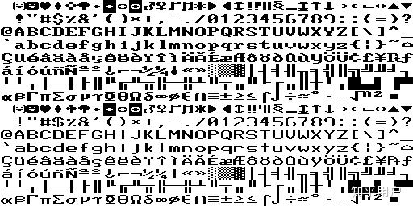

####  图像的显示
与显示字符时直接向显存送字符编码不同，图像的显示要麻烦一点，但本质仍然是向显存送数据。
送的数据是每一个像素的颜色值，例如下面的照片，每一个像素都可以理解成为三种不同颜色的组合，你只需要将每一个像素的RGB值送入显存，GPU会负责将其转换成电信号并输出给显示器：

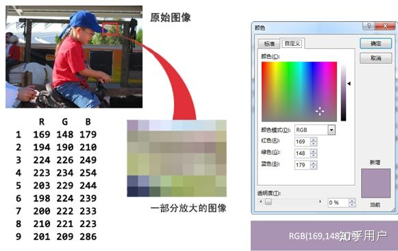

另外，程序也可以直接对GPU发送指令，用以进行一些复杂的3D显示或者其它计算。
## 图像基础知识
### 图像压缩技术
#### 无损压缩（Lossless Compression）：

** 指数据经过压缩后，信息不受损失，还能完全恢复到压缩前的原样**

如行程编码（RLE）（.BMP .TIFF及AVI等格式文件压缩采用此算法）
现实中有许多这样的图像，在一幅图像中具有许多颜色相同的图块。在这些图块中，许多行上都具有相同的颜色，或者在一行上有许多连续的像素都具有相同的颜色值。在这种情况下就不需要存储每一个像素的颜色值，而仅仅存储一个像素的颜色值，以及具有相同颜色的像素数目就可以，或者存储像素的颜色值，以及具有相同颜色值的行数。
这种压缩编码称为行程编码(run length encoding，RLE)，具有相同颜色并且是连续的像素数目称为行程长度。
举例

>  压缩前
000000003333333333
222222222226666666
压缩后
(0,8) (3,10)
(2,11) (6,7)

#### 有损压缩（lossy compression）

** 有损压缩算法是一种数据压缩方法，经过此方法压缩、解压的数据会与原始数据不同但是非常接近。它是与无损数据压缩相对的压缩方法。有损数据压缩又称破坏性资料压缩、有损压缩、有损压缩、不可逆压缩**

其原理是借由将次要的信息数据舍弃，牺牲一些质量来减少数据量、提高压缩比。

如图像相邻的色块，颜色其实是差不多的，比如(0,200,0)和(0,201,0)
人其实感觉不出来，那么我们就可以把它们统一用(0,200,0)表示，在上面这种RLE算法基础上，又可以进一步压缩


### 索引色 & 直接色

**索引色**：

索引颜色是一种以有限的方式管理数字图像颜色的技术，以节省计算机内存和文件存储，同时加速显示刷新和文件传输。即`用一个数字来代表（索引）一种颜色，在存储图片的时候，存储一个数字的组合，同时存储数字到图片颜色的映射`。这种方式只能`存储有限种颜色`，通常是256种颜色，对应到计算机系统中，使用一个字节的数字来索引一种颜色。

索引色常见有1位（即黑白），8位（即灰阶/256色），16位（即高彩），24位（即真彩），30/36/48位（即全彩），更多详细参考该[百科](https://zh.wikipedia.org/wiki/色彩深度#30/36/48位元：全彩)。

**直接色**：

`使用四个数字来代表一种颜色，这四个数字分别代表这个颜色中红色、绿色、蓝色以及透明度（即rgba）`。现在流行的显示设备可以在这四个维度分别支持256种变化，所以直接色可以表示2的32次方种颜色。当然并非所有的直接色都支持这么多种，为压缩空间使用，有可能只有表达红、绿、蓝的三个数字，每个数字也可能不支持256种变化之多。


### 位图 & 矢量图：

**位图**：

位图(bitmap)，也叫做点阵图，栅格图像，像素图，简单的说，`就是最小单位由像素构成的图，缩放会失真`。构成位图的最小单位是像素，位图就是由像素阵列的排列来实现其显示效果的，每个像素有自己的颜色信息，在对位图图像进行编辑操作的时候，可操作的对象是每个像素，我们可以改变图像的色相、饱和度、明度，从而改变图像的显示效果。举个例子来说，位图图像就好比在巨大的沙盘上画好的画，当你从远处看的时候，画面细腻多彩，但是当你靠的非常近的时候，你就能看到组成画面的每粒沙子以及每个沙粒单纯的不可变化颜色。

**矢量图**：

矢量图(vector)，也叫做向量图，简单的说，就是`缩放不失真的图像格式`。矢量图是通过多个对象的组合生成的，对其中的每一个对象的纪录方式，都是以数学函数来实现的，也就是说，矢量图实际上并不是象位图那样记录画面上每一点的信息，而是纪录了元素形状及颜色的算法，当你打开一幅矢量图的时候，软件对图形相对应的函数进行运算，将运算结果(图形的形状和颜色)显示给你看。无论显示画面是大还是小，画面上的对象对应的算法是不变的，所以，即使对画面进行倍数相当大的缩放，其显示效果仍然相同(不失真)。举例来说，矢量图就好比画在质量非常好的橡胶膜上的图，不管对橡胶膜怎样的常宽等比成倍拉伸，画面依然清晰，不管你离得多么近去看，也不会看到图形的最小单位。

## 图片类型
### 1.BMP

BMP取自位图BitMaP的缩写，也称为DIB（与设备无关的位图），是一种与显示器无关的位图数字图像文件格式。BMP同时支持索引色和直接色，但是其几乎没有压缩，所以通常图片非常的大，也导致了其几乎没有用武之地，现在除了在Windows操作系统中还比较常见之外，我们几乎看不到它。再加上浏览器的不支持，所以作为web开发，更加少于看到BMP。

###  2.JPG/JPEG（Joint Photographic Experts Group，联合图形专家组图片）

JPEG是`有损的、采用直接色的、点阵图`。JPEG也是一种针对照片影像而广泛使用的有损压缩标准方法。JPEG图片格式的设计目标，是在不影响人类可分辨的图片质量的前提下，尽可能的压缩文件大小。这意味着JPEG去掉了一部分图片的原始信息，也即是进行了有损压缩。JPEG的图片的优点，是采用了直接色，得益于更丰富的色彩，JPEG非常适合用来存储照片，用来表达更生动的图像效果，比如颜色渐变。

JPEG的算法比较复杂， 如果有兴趣可以参考该[文章](https://blog.csdn.net/yuyangyg/article/details/77968494)

其大概分为三步：

1. 把数据分为“重要部分”和“不重要部分”
2. 滤掉不重要的部分
3. 保存

### 3.PNG（Portable Network Graphics，便携式网络图像格式）
便携式网络图形（英语：Portable Network Graphics，缩写：PNG）是一种无损压缩的位图图形格式，支持索引、灰度、RGB三种颜色方案以及Alpha通道等特性。PNG的开发目标是改善并取代GIF作为适合网络传输的格式而不需专利许可，所以被广泛应用于互联网及其他方面上。

PNG-8

`PNG-8是无损的、使用索引色的、点阵图`。PNG是一种比较新的图片格式，PNG-8是非常好的GIF格式替代者，在可能的情况下，应该尽可能的使用PNG-8而不是GIF，因为在相同的图片效果下，PNG-8具有更小的文件体积。除此之外，PNG-8还支持透明度的调节，而GIF并不支持。 现在，除非需要动画的支持，否则我们没有理由使用GIF而不是PNG-8。当然了，PNG-8本身也是支持动画的，只是浏览器支持得不好，不像GIF那样受到广泛的支持。

PNG-24

`PNG-24是PNG的直接色版本。PNG-24是无损的、使用直接色的、点阵图`。无损的、使用直接色的点阵图，听起来非常像BMP，是的，从显示效果上来看，PNG-24跟BMP没有不同。PNG-24的优点在于，它压缩了图片的数据，使得同样效果的图片，PNG-24格式的文件大小要比BMP小得多。当然，PNG24的图片还是要比JPEG、GIF、PNG-8大得多。虽然PNG-24的一个很大的目标，是替换JPEG的使用。但一般而言，PNG-24的文件大小是JPEG的五倍之多，而显示效果则通常只能获得一点点提升。所以，只有在你不在乎图片的文件体积，而想要最好的显示效果时，才应该使用PNG-24格式。另外，PNG-24跟PNG-8一样，是支持图片透明度的。

PNG-32

PNG32也是PNG的直接色版本。其表现与PNG-24差不多。

三者的区别在于：

- PNG-32每个像素的深度为32bits，其中RGBA四个通道各占8bits。所谓的RGBA四个通道，就是红，绿，蓝，透明 这四种色值各自的大小，都用8bits来表示（0～255）。
- PNG-24的像素深度为24bits，其中RGB三个通道各占8bits。
- PNG-8则是使用8位的索引色。

### 4.GIF

全称Graphics Interchange Format，采用`LZW压缩算法进行编码。是无损的、采用索引色的、点阵图`。GIF是无损的，采用GIF格式保存图片不会降低图片质量。但得益于数据的压缩，GIF格式的图片，其文件大小要远小于BMP格式的图片。文件小，是GIF格式的优点，同时，GIF格式还具有支持动画以及透明的优点。但，GIF格式仅支持8bit的索引色，即在整个图片中，只能存在256种不同的颜色。

简单介绍下GIF使用的LZW压缩算法，详细可参考该[文章](https://segmentfault.com/a/1190000011425787)：

LZW编码 (Encoding) 的核心思想其实比较简单，就是把出现过的字符串映射到记号上，这样就可能用较短的编码来表示长的字符串，实现压缩。 比如： 我们可以将ABCDEFG 转成 1 来代表， 这样数据就会减少很多。再加上，LZW编码是自解释 (self-explaining) 的，即映射字典不会写到压缩数据里，他是在解码的过程中还原出编码时用的字典。

### 5.WebP
**特点：支持无损&有损压缩，文件更小，图像质量高**
WebP是由google推出，目标是减少文件大小，但达到和JPEG格式相同的图片质量，希望能够减少图片档在网络上的发送时间。截至2021年5月，已有94%的浏览器支持此格式。相较编码JPEG文件，编码同样质量的WebP文件需要占用更多的计算资源。

简单介绍下WebP使用的压缩算法，详细可参考该[文章](https://zhuanlan.zhihu.com/p/23648251)：
有损WebP基于VP8视频编码中的预测编码方法来压缩图像数据，其基本步骤类似于JPEG压缩，主要包含格式转换、分割子块、预测编码、FDCT、量化、Z排列、熵编码
无损WebP基于使用不同的技术对图像数据进行转换，包括：预测空间变换、色彩空间转换、使用调色板、多像素打包成一个像素、alpha值替换等技术

### 6.SVG (Scalable Vector Graphics，可缩放矢量图形)

与上面三种图像格式最大的不同在于，SVG并不是位图格式，而是一种矢量图形格式，这意味着它可以在任意分辨率上显示，而不破坏图像的清晰度和细节。
这是因为位图图像储存图像上每一点的像素值，而矢量图像用点和线来描述物体，能够提供清晰的画面。它是使用XML来描述图片的，一般来说，SVG文件要比JPEG和GIF的文件要小，在下载或移动设备上显示时速度也更快。

### 图片比较与场景应用

| 类型  | 优点                                   | 缺点                    | 应用场景                                    |
| :---- | :------------------------------------- | :---------------------- | :------------------------------------------ |
| BMP   | 无损压缩，图质最好，支持索引色和直接色 | 文件过大                | 目前仅存于WINDOWS系统                       |
| GIF   | 无损压缩，支持动画及透明               | 仅支持256种颜色，画质差 | 需要动画的需求                              |
| JPEG  | 文件小                                 | 有损压缩，画质损失      | 不考虑过好画质且需响应速度较快， 如大背景图 |
| PNG-8 | 无损压缩， 支持透明                    | 画质中等                | 应用于大多数中小图且要求画质比较好的需求    |
| WebP | 无损&有损压缩， 支持透明                    | 解码时间更长                | 应用于对图片体积有更高要求的需求    |
| SVG   | 支持放大缩小而不影响画质               | 编写麻烦，性能差        | 多应用于ICON之类                            |

### 矢量图会取代位图吗？
矢量图不能代替位图。
矢量图是由点线面构成的，它不是相机拍出来的，而是人为软件绘制出来的。
所以 **矢量图是【画】，而位图是【像】。如果制作一幅细节还原到逐个像素水准的矢量图，那么它不是已经变成了位图（用阵列模拟位图画），就是有着惊人数量的矢量元素和恐怖的 文件体积（用线面色勾画）**

## 参考

[常见图片格式了解](https://cloud.tencent.com/developer/article/1404912)

[图片文件前世今生和衍生技术原理](https://www.jianshu.com/p/830202931e59)


