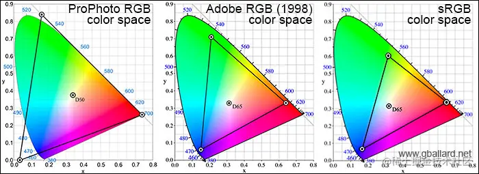
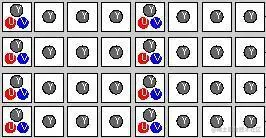
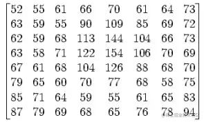
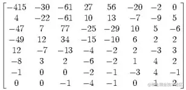
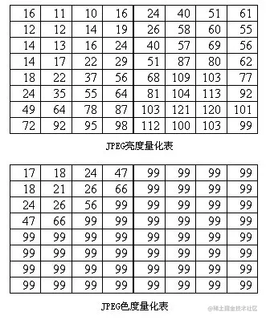
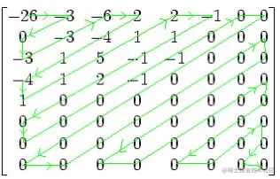
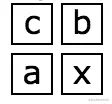
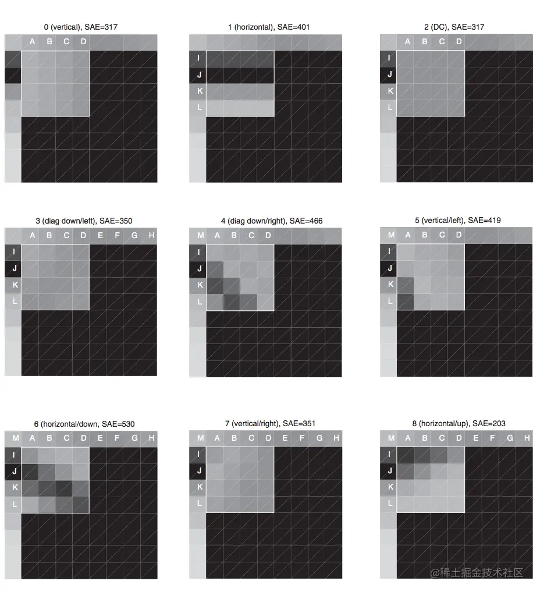

# 了解各种图形格式的编码方式

## 1.计算机图形101

在开始图片之旅之前，先来聊聊图形学的一些基础，这些在图片处理的过程中或多或少都要接触。


1.像素点：计算机显示的图像是由像素点组成的，每个像素点有RGB三种颜色，这三种颜色按一定比例混合就可以得到实际的色值。图片尺寸为640 x 480，代表图片水平有640个像素点，垂直有480像素点。

2.color depth、bit depth： 每个像素RBG若各用8位表示，bit depth就是8bit，那么这个像素就用24位表示，color depth就是24bit。一个像素color depth越深，像素表达的颜色和亮度的位数越多，文件就越大。一个color depth中每个channel的深度就是bit depth。用32位表示一个像素的话，RBG占用24位，还有8位称为alpha channel。

3.alpha composite、alpha blend、alpha channel：渲染图片的时候，图片有时有很多图层，然后再将多个图层组合起来，这叫做alpha composite。在这个过程中，多个图层每个对应像素合成的过程叫做alpha blend。

  

而每个图层是否可以被透过看到下一图层，就需要记录一些哪里透明、哪里不透明的信息，这些信息就被存在一个alpha channel中了。

4.color space：RGB三个颜色可以映射到一个三维空间，每个颜色定义一个坐标轴，每个颜色都在这个三维空间有唯一的位置。这个空间就是color space。color space有多种，AdobeRGB、CMYK等等。      



5.color model：将颜色映射到三维空间的抽象数学模型就是color model

6.color components：color component是像素的颜色单位，color components是像素所有这种单位的集合。构成像素所在的color space坐标轴的颜色就是像素的一个color component。比如，RBG像素的color components为三个颜色的color component再加上alpha channel。

各种图片格式目的是在网络传输和存储的时候使用更少的字节，即起到压缩的作用，或者支持多张图片组合成一张动态图。在图片格式解码后，无论图片的格式，图片数据都是像素数组。

## 2. JPEG

作为最悠久、最广泛流传的图片格式，从它开始图片之旅是再合适不过的了。先聊聊JPEG编码再看看JPEG文件格式，对JPEG就可以有一定的理解。

#### 2.1. JPEG编码

JPEG编码是基于两个idea，第一个是基于相邻的像素信息是相近的，即空间冗余性，尽量少记录重复的数据来达到压缩的效果。第二个是基于图像信号的频谱特性，图像包含各种频率，大部分为低频频谱，少部分为高频频谱。可以保留包含图像信息较多的低频频谱，舍去包含图像信息较少的高频频谱。而达到图片质量没有可察觉的损伤，又能达到压缩的效果。这也说明了JPEG是有损编码。

1.色彩空间转换，将RGB色彩空间转换到其他色彩空间，比如YUV色彩空间。Y代表色彩亮度(Luminance)、U代表色度(Chrominance)、V代表浓度(Chroma)，以这三个定义坐标轴建立三维空间。转换为YUV色彩空间以后，因为相邻的四个像素点U和V可以用用一个值来表示

 

这样每四个像素点，存储4个Y、1个U、一个V。YUV和RGB一样都用8位来表示，YUV色彩空间就比RGB色彩空间所需的存储空间少一半，数据就被压缩到了一半。完成了第一个idea。

2.离散余弦变换DCT DCT是傅里叶变换的一种，变换后会得到一个系数。具体公式就不详细说明了。

  

假如一张图片分割成8X8的取样块如下

 

对取样块进行DCT，取样块会从色彩域转换为频率域的DCT系数块。图片经过此步骤会输出一个频率系数矩阵，左上的系数幅度值最大，越往右下，系数的幅度值越小，频率越高。大部分图片信息都在左上区域，离左上越来越远的右下几乎不含有图片信息，甚至只含杂波。

 

这一步骤没有压缩作用，它目的是为下一步骤找低频和高频区域，也就是找出留下的区域和舍去的区域。

3.量化

此步是将上步求得的DCT系数的简化的过程，利用人眼对高频部分不敏感的特性来舍去高频部分。 将上步所得的频率系数矩阵和亮度量化表(如下)

 

进行计算。量化表就是控制压缩比的关键。频率系数矩阵的数值除以对应量化表位置上的数值，并四舍五入到最近的整数。以第一行第一个数据为例

 

此步后，高频段会出现大量的零。

 

解码的时候，反量化步骤会乘回量化表相应值，但是四舍五入导致低频有所损失，高频0字段被舍弃。此步为有损运算，会导致图像质量变低。至此，完成了第二个idea。

4.zig-zag游程编码

量化后的数据还可以进行简化，更大程度的去压缩。

对上步所得矩阵进行Z形编排

 

所得结果为−26，−3，0，−3，−3，−6，2，−4，1 −4，1，1，5，1，2，−1，1，−1，2，0，0，0，0，0，−1，−1，0，0，0，0，0，0，0，0，0，0，0，0，0，0，0，0，0，0，0，0，0，0，0，0，0，0，0，0，0，0，0，0，0，0，0，0，0，0 ，可以看出这样会出现连续的多个0，这样利于进行游程编码。

游程编码会用简化的方式去记录重复出现的内容，最后编码后出来的位数远小于原始字符串的位数，实现大幅度的数据压缩。并且游程编码用固定的4位来存储重复的数量，所以最多重复内容可以记录数量为15，超过15次要进行分段处理。JPEG对游程编码进行按需更改，只将0作为重复的内容，每个数值记录前面有多少重复的0，末尾如果都是0用EOB作为代表。此步不包含第一个数值，第一个数为直流系数，此步只处理交流系数。

这里使用的zig-zag编排后再进行游程编码如下

(0,-3);(1,-3);(0,-3);(0,-6);(0,2);(0,-4);(0,1);(0,-4);(0,1);(0,1);(0,5);(0,1);(0,2);(0,-1);(0,1);(0,-1);(0,2);(5,-1);(0,-1);EOB;

5.范式Huffman编码

JPEG将zig-zag游程编码后的结果进一步进行压缩，先将上步所得元组后一部分用下表进行转换编码，再将元组前一部分与后一部分的组值的组合用范式huffman进行编码。

```erlang
             数值                 组              实际保存值
                0                   0                   -
              -1,1                  1                  0,1
           -3,-2,2,3                2              00,01,10,11
     -7,-6,-5,-4,4,5,6,7            3    000,001,010,011,100,101,110,111
       -15,..,-8,8,..,15            4       0000,..,0111,1000,..,1111
      -31,..,-16,16,..,31           5     00000,..,01111,10000,..,11111
      -63,..,-32,32,..,63           6                   .
     -127,..,-64,64,..,127          7                   .
    -255,..,-128,128,..,255         8                   .
    -511,..,-256,256,..,511         9                   .
   -1023,..,-512,512,..,1023       10                   .
  -2047,..,-1024,1024,..,2047      11                   .
  -4095,..,-2048,2048,..,4095      12                   .
  -8191,..,-4096,4096,..,8191      13                   .
 -16383,..,-8192,8192,..,16383     14                   .
 -32767,..,-16384,16384,..,32767    15                   .

```

比如第一项(0,-3)，将-3保存为表中对应的实际保存值00，0与-3的组值2组合，则第一项更改为(0,2) ,00。再将括号里的值和成为一个字节02，高4位是前面0的个数，低四位是分组后值的组。

然后将02去Huffman表中查找，JPEG存储的时候会存储定义的Huffman表，并且分为4个表，直流亮度表、直流色度表、交流亮度表、交流色度表。02比如在相应Huffman表中为100，则第一项更改为100 00，最后存储的字节就为100 00。 对zig-zag游程编码的时候，没有对第一个数据进行编码。最后一步就是将第一个数据去相应的Huffman表查询，将结果放在结果的首部，就得到了编码的数据。

Huffman表会使得出现频率高的数字小于8位，而出现频率高的数字大于8位，这样总体存储可以减少很多空间。

#### 2.2. JPEG文件格式

大部分图片包括JPEG是由大端法(big-endian)进行存储的，一般用Intel芯片的计算是小端法(little-endian)进行存储的。这意味着，图片解码的时候要进行大端法到小端法的转换才能编码。

```c
static unsigned short swap_bigendian_to_littleendian_Two_Byte(unsigned short value) {
    return (unsigned short)((value & 0x00FF) << 8) 
      | (unsigned short)((value & 0xFF00) >> 8);
      }
static unsigned int swap_bigendian_to_littleendian_Four_Byte(unsigned int value) {
    return (unsigned int)((value & 0x000000FF) << 24) 
      | (unsigned int)((value & 0x0000FF00) << 16)
      | (unsigned int)((value & 0x00FF0000) << 8) 
      | (unsigned int)((value & 0xFF000000) >> 24);
      }
```

JPEG文件是分为多个segment，每个segment起始有segment标识，标识前两个元组规定是0xff，后两个元组代表segment的内容。

下面是一些常用的segment标识。

```ini
SOI   = ffd8   图片开始
EOI   = ffd9   图片结束
APP0  = ffe0   按JFIF标准唯一识别一个JPG的标志
SOF0  = ffc0   帧开始
SOF2  = ffc2   帧开始
SOS   = ffda   扫描行开始
DNL   = ffdc   定义行数
DRI   = ffdd   定义重新开始间隔
DQT   = ffdb   定义量化表
DHT   = ffc4   定义Huffman表
COM   = fffe   评论
```

如果只留下segment标识，则上面举个栗子图片文件格式如下

```erlang
ffd8 ffe0 .... ffdb .... ffc0 .... 
.... ffc4 .... ffc4 .... ffc4 ....
.... ff00 .... ff00 .... ff00 ....
.... ff00 .... ff00 .... ff00 .... 
.... ff00 .... ff00 .... ff00 ....
.... ff00 .... ffd9 
图片开始----作为JPG文件的识别----一个或者多个量化表
----图片帧的开始----一个到四个Huffman表(直流亮度、直流色度、交流亮度、交流色度)
----占位符(扫描时直接被忽略)----占位符----占位符----
图片结束

```

JPEG有baseline、progressive编码方式，baseline解码时会解码出部分高质量图片，并从图片顶部到图片底部、从图片左边到图片右边顺序解码。progressive解码会先解码出整张的低质量图片，再解码出高质量图片，从低质量图片到高质量图片，有一种图片逐渐清晰的感觉，从而获得了更加的视觉体验。baseline通常会包括SOF0没有一个SOS或一个，而progressive通常会包括SOF2和多个SOS。

## 3. PNG

第二广为流传的图片格式，无损编码(lossless)，为了改善和替换GIF而被开发出来，结果并没有做到。

 

#### 3.1. PNG编码

PNG编码基于一个idea，利用空间冗余性让LZ77派生算法更加高效。LZ77派生算法广泛应用在通信计算机领域，是种与图像特性无关的文件压缩算法，主要利用数据的重复序列来实现数据压缩的，PNG编码的任务就是让图片数据出现更多的重复序列来提高LZ77派生的算法的效率。

1.Pass extraction

PNG分为interlace(隔行扫描)和non-interlace(非隔行扫描)，interlace提供一种更叫友好的视觉体验，就像JPEG的progressive一样。

Pass Extraction会根据interlace或者non-interlace，从而用不同顺序提取出像素，然后分成不同的组，按提取出的顺序存储像素。interlace会分成7组，non-interlace会分成1组。

 

这样会导致interlace会scan一遍，non-interlace会scan七遍。non-interlace存储的数据会比interlace多一点，7次scan过程如下图

 

2.Scanline serialization

将分组出来的像素按行来序列化，以便下一步骤进行计算。

3.Filtering

Filtering官方的method只定义了0，其他数字以后留下作为拓展。不过有5种type。假设你想要Filter的是像素x

  

那么定义a为x前一个像素，b为x上一行像素对应位置的像素，c为b前一个像素。

定义Filt(x)函数的结果为x经过Filtering步骤的值。Recon(x)为解码反Filtering步骤的值。

Orig(x)函数的结果为x的值。floor(x)函数为floor API。PaethPredictor函数为

```ini
p = a + b - c
pa = abs(p - a)
pb = abs(p - b)
pc = abs(p - c)
if (pa 
  Pr = a;
  } else if (pb 
  Pr = b;
  } else {
  Pr = c;
  }
return Pr

```

则Filter type对应的函数表如下。 

假如一个像素的字节流值为1到255。如果不经过这步，直接进行compression，这个字节流没有重复的序列，会导致compression没有作用。如果要是经过Filter type为Sub，字节流会有很多字节为重复的1，这会让compression大大压缩数据量。

4.Compression

上文提到过，PNG压缩用的是LZ77派生的算法，具体算法就不详细展开了。不过这是一种无损压缩算法。PNG压缩步骤没有用到图片的信号或色彩空间特性。

5.Chunking

将压缩后的数据拆分成多个chunk，来更好的管理数据和读取数据。

#### 3.2. PNG文件格式

PNG文件起始有一个固定的序列来标识文件为PNG，137 80 78 71 13 10 26 10(十进制)，其余的数据就是多个chunk，一种为关键chunk，另一种为辅助chunk。关键chunk是必须有的，关键的图像数据就在关键chunk里。

先来看一下chunk的结构

```c
typedef struct {
    unsigned int length;
    unsigned int chunk_type;
    unsigned char *chunk_data;
    unsigned int crc;
    }chunk;

```

chunk里的length字段，只记录chunk_data的长度，不管其他字段。chunk_type的值从65-90或97-122，代表A-Z或a-z，用字符来标识chunk的类型。crc代表除length字段外的三个字段的循环冗余差错检验(TCP校验)。

关键chunk的出现顺序必须如下：IHDR(头信息)、PLTE(调色板)、IDAT(图片数据块)、IEND(结尾标识)

IHDR

结构如下，其他字符在知道png如何编码就很好理解了，就有color_type没有提及，color_type是利用位组合来表示的，1代表使用PLTE、2代表是真彩图片，3代表有alpha channel。

```c
typedef struct {
    unsigned int width;
    unsigned int height;
    unsigned char bit_depth;
    unsigned char color_type;
    unsigned char compression_method;
    unsigned char filter_method;
    unsigned char interlace_method;
    } IHDR;

```

PLTE

调色板包括1到256个色彩，每个色彩RGB三种颜色各占1字节，并且每种色彩有从0开始逐渐增大的索引。实际存储时，每个色彩构成一个3字节的单位，调色板存储多个这种单位，不存储单位的索引。PLTE的色彩数不能超过像素bit depth能表达的色彩数。比如bit depth为4bit，则PLTE的色彩数不能超过2的4次方即16。PLTE的目的就是，减小图像数据的大小，有了PLTE，像素点就不用存储RGB色彩了，直接存储PLTE的索引就可以了。在解码时，通过索引 * 3，就可以从调色板二进制流中找到相应的色彩位置。

IDAT

经过编码的图像数据chunk，可能有多个。

IEND

 标志图像的结束，没有chunk_data。

## 4. APNG

APNG是为PNG动图做的简单拓展。APNG包含多个PNG，将多个PNG的图片数据作为APNG的每一帧，然后将多个PNG重复的其他数据只保留下一份。APNG支持PNG的所有chunk，并且还有几个PNG不包括的关键chunk，ACTL、FCTL，并且将IDAT命名为FDAT，还增加了一个sequence_number字段。APNG第一个数据块仍是叫IDAT而不叫FDAT，这样设置了一个default image，目的是为让不支持APNG的解码器也可以解码出一张default image。

```lua
                                            APNG                          
                                            IHDR
                                            ACTL
                                            PNG_1       PNG_2      PNG_3                FCTL
IHDR        IHDR       IHDR       --->      IDAT
IDAT        IDAT       IDAT       --->      FCTL
其他Chunk   其他Chunk   其他Chunk            FDAT
IEND        IEND       IEND                 FCTL
                                            FDAT
                                            其他Chunk
                                            IEND
                                            
```

ACTL

ACTL是控制动画的chunk，num_frames记录APNG有多少帧，num_playes记录APNG播放动画多少遍。

```c
typedef struct {
    unsigned int num_frames;
    unsigned int num_playes;
    }actl;

```

FCTL

FCTL是每个帧的头部chunk，结构如下

```c
typedef struct {
    unsigned int sequence_number;
    unsigned int width;
    unsigned int height;
    unsigned int x_offset;
    unsigned int y_offset;
    unsigned short delay_num;
    unsigned short delay_den;
    unsigned char dispose_op;
    unsigned char blend_op;
    }fctl;

```

delay_num为这一帧显示时间的以秒为单位的分子，delay_den为这一帧显示时间以秒为单位的分母。

blend_op取值可能为APNG_BLEND_OP_SOURCE或APNG_BLEND_OP_OVER，这个字段取决此帧在渲染的时候，是否需要alpha blend。如果是APNG_BLEND_OP_SOURCE，则不进行alpha blend，在画布上清空上帧的渲染。APNG_BLEND_OP_OVER则进行，在画布上继续上帧渲染。

dispose_op取值可能为APNG_DISPOSE_OP_NONE、APNG_DISPOSE_OP_BACKGROUND、APNG_DISPOSE_OP_PREVIOUS，这个字段取决此帧处理结束时的操作。APNG_DISPOSE_OP_NONE表示为不作操作，APNG_DISPOSE_OP_BACKGROUND表示为将画布上此帧清空为透明黑色，APNG_DISPOSE_OP_PREVIOUS表示为将画布还原为上一帧结束时的内容。

APNG解码时还有关于chunk正确性的检测

1.IHDR只能有一个，且必须为开头。

2.ACTL必须只有一个。

3.FCTL和FDAT中的sequence_number必须按顺序递增，不能有间隔和重复。

4.FCTL的个数必须和ACTL中的num_frames相等。

5.FCTL后面必须是IDAT或FDAT。

## 5. WEBP

WEBP是Google推出的新一代文件格式，期望代替JPEG和PNG，在与JPEG和PNG相同的图片质量的情况下，可以大大缩小文件大小。WEBP分为有损编码和无损编码(lossless)，有损编码是基于VP8视频格式编码，而无损编码是WEBP小组开发出的方式。

#### 5.1. WEBP有损编码

VP8编码与JPEG编码相近，其中最主要的不同是应用帧内预测(intra-prediction)。帧内预测就是在一个帧内应用预测编码，利用图像已编码的一部分预测另一未编码部分，然后将预测部分的原图像数据减去预测出来的数据，得到差值(residual)，然后对差值进行编码。这样做的目的是差值比原数据小得多，可以达到压缩的目的。解码的时候，将差值和预测值求和，就得到了原值。JPEG编码的是原值，而WEBP编码的是差值，这是WEBP比JPEG同样图片质量，体积更小的主要原因。

下面来看看帧内预测，具体细节可以在[The H.264 Advanced Video Compression Standard, Second Edition](https://link.juejin.cn?target=http%3A%2F%2Ffiles.cnblogs.com%2Ffiles%2Firish%2FThe_H.264_advanced_video_compression_standard.pdf)中找到。帧内预测分为两步，它会先找到合适的分块，再找到分块中合适的模式。

 

上图中描述围一圈的多种预测方法，用左一行和上一行进行4 x 4分块预测。对于亮度可分为4 x 4 、16 x 16宏块(macroblock)预测，4 x 4块预测叫做4 × 4 Luma Prediction，16 x 16块预测叫做16 × 16 Luma Prediction。色度分为8 x 8宏块(macroblock)预测，叫做8 × 8 Chroma Prediction。

使用哪种分块预测是由解码器在解码时动态决定的。分块越精细，预测的越准，预测后的差值越小。但是分块越精细，需要记录如何分块的信息就越多。所以，选择哪种分块预测是差值大小和记录如何分块的信息大小的权衡(trade-off)。一般来说，细节越丰富的地方会分块越细，即使用4 x 4分块预测。细节相对不丰富的地方使用16 x 16分块预测。

不同的分块还有不同的预测模式，4 × 4 Luma Prediction有9种预测模式，16 x 16 LumaPrediction有4种预测模式，8 x 8 Chroma Prediction有4种预测模式。

不同的预测模式的思想是基于角度帧内预测(Angular Intra Prediction)，或将被预测的半圆划分为33个角度，从这些角度来预测，达到一种渐变的效果。或从周围取平均值达到一种平面的效果。下图为2-34共33个角度、0为Planar预测模式、1为DC预测模式。Planar预测模式的预测值为四边像素的均值。DC预测模式的预测值为左方和上方像素的均值。不同的预测模式就是采用某个角度或平面进行预测。


4 × 4 Luma Prediction9种预测模式如下图，带有字母为已编码块用来预测其他块，灰色的为待预测块。

 

对于可能的预测模式都要计算出来，然后计算出每种模式的SAE，SAE为衡量预测的错误程度，最后选用错误程度最小的模式。下图为预测9种模式后比较SAE，肉眼可以看出第8种为预测最准确的模式，其SAE也最小。

 

WEBP编码第一步与JPEG编码一样，色彩空间转换。第二步就是帧内预测。第三步对图像原值减去预测值得到的差值(residual)进行DCT。第四步进行量化，WebP量化比JPEG量化更复杂，可以做到不同的区域，进行不同的量化。第五步游程编码。第六步用算术编码Arithmetic coding代替huffman编码。

#### 5.2. WEBP无损编码

WEBP无损编码仍是基于预测编码和减少空间冗余性。

1.Predictor Transform

WEBP无损编码使用的预测编码，与无损编码基于VP8的帧内预测不同，无损编码的预测编码对一个块进行预测。并且有14种不同的模式。假设，P为预测点，O、TL、T、TR、L为已编码点，X为未编码点，TL代表Top-Left，TR代表Top-Right。

```scss
预测块P位置示意图
O    O    O    O    O    O    O    O    O    O    O
O    O    O    O    O    O    O    O    O    O    O
O    O    O    O    TL   T    TR   O    O    O    O
O    O    O    O    L    P    X    X    X    X    X
X    X    X    X    X    X    X    X    X    X    X
X    X    X    X    X    X    X    X    X    X    X
模式 预测值
0 0xff000000
1 L
2  T
3  TR
4 TL
5 Average2(Average2(L, TR), T)
6   Average2(L, TL)
7    Average2(L, T)
8 Average2(TL, T)
9    Average2(T, TR)
10   Average2(Average2(L, TL), Average2(T, TR))
11    Select(L, T, TL)
12  ClampAddSubtractFull(L, T, TL)
13    ClampAddSubtractHalf(Average2(L, T), TL)

```

最后仍对真实值和预测值的差值进行编码。

2.Color Transform

此步为下一步做准备，目的是减少空间冗余性。JPEG和PNG都是减少像素间的相关性，WEBP从像素内部着手。将像素Green颜色值保留，Red颜色值转变为从Green值表达，Blue颜色值从Green颜色和Red颜色值表达。

3.Subtract Green Transform

去掉Red颜色值中Green颜色值表达的部分，去掉Blue颜色值中Green颜色值表达的部分。

4.Color Indexing Transform

如果整张图片像素的颜色值没有超过256个，则建立类似调色板一样的数组来映射颜色。像素存储索引就可以。

5.Compression

每个像素可以用3中不同的方法进行压缩，Huffman编码(Huffman Coded Literals)、LZ77后向引用(LZ77 Backward Reference)、颜色缓存编码(Color Cache Code)。大部分代码用Huffman进行编码。而如果遇到了重复的序列，就会使用LZ77后向引用。LZ77后向引用，指的是前面出现过了相同的序列，后面的重复序列改为前面相同序列位置的引用即可，引用的方式按LZ77前缀编码。引用分为Length和Distance两部分，Length代表序列的长度，Distance代表前面序列的位置。颜色缓存编码是在编码和解码过程中使用的缓存，将最近用过的颜色缓存在一个数组中，随着扫描新的像素缓存会不断更新。

#### 5.3. WEBP文件格式

WEBP文件格式是参照RIFF(资源交换档案格式)来存储的，WEBP文件开头是四字节的RIFF的ASCII码、四字节的文件大小、四字节的WEBP的ASCII码。文件构成的基本单位和PNG一致是Chunk。

chunk结构如下

```c
typedef struct {
    unsigned int fourCC;   
    unsigned int size;
    unsigned char *payLoad;
    }Chunk;

```

FourCC代表chunk标识的ASCII码。Size代表除Size字段的长度。PayLoad代表数据。

VP8X

紧接着WEBP文件标识符的是拓展Chunk VP8X(Extended)

```c
typedef struct {
    unsigned char combine;  
    unsigned short reserved_first; 
    unsigned char reserved_second; 
    unsigned short canvas_width_minus_one_first;  
    unsigned char canvas_width_minus_one_second;  
    unsigned short canvas_height_minus_one_first;  
    unsigned char canvas_height_minus_one_second;  
    }VP8X;

```

VP8X的第一个字节是个合并字节，这个合并字节的首两位和最后一位为保留位，中间5位，每位标识是否有相关的Chunk，分别为ICC、Alpha、EXIF、XMP、Animation。后面的Reserve、Canvas_Width_Minus_One、Canvas_Height_Minus_One都是两个字段组合成一个24位字段。

VP8和VP8L

有损编码的数据Chunk为VP8，按照VP8的标准编码。无损编码的数据Chunk为VP8L。

ANIM

ANIM为控制动画的Chunk，background_color代表画布默认颜色，loop_count代表动画循环次数，结构如下

```c
typedef struct {
    unsigned int background_color;
    unsigned short loop_count;
    }ANIM;

```

ANMF

ANMF为每一帧的头部Chunk，结构如下

```c
typedef struct {
    unsigned short frame_x_first;
    unsigned char frame_x_second;
    unsigned short frame_y_first;
    unsigned char frame_y_second;
    unsigned short frame_width_minus_one_first;
    unsigned char frame_width_minus_one_second;
    unsigned short frame_height_minus_one_first;
    unsigned char frame_height_minus_one_second;
    unsigned short frame_duration_first;
    unsigned char frame_duration_second;
    unsigned char combine;  
    unsigned char *frame_data;
    }ANMF;

```

结构的前10个字段都是两两组合成24位字段。分别为帧起始x坐标、帧起始y坐标、帧宽减一、帧高减一、帧展示时长。combine字段前6位为保留位，后一位为blending method位，最后一位为disposal _method位。blending method值为0，则不alpha_blend，为1，则alpha_blend，这与APNG一致。disposal_method值为0，则不做处理，为1，则将画布清空为透明黑色。

## 6. BPG

BPG仍是一个年轻的图片文件格式，在2014年被开发出来，基于HEVC视频编码标准。压缩效果相当惊人。写本文的时候仍然是0.97版本发布，还没有进入正式版。

## 7. 结语

了解了各种图片的编码格式后，不同图片格式的优劣就很好理解了。一般来说JPEG比PNG压缩程度更大，文件体积更小。图片色彩越复杂，图片信息越多，图片信号高频段越少，JPEG的有损编码损失越少。对于色彩复杂的图片JPEG相比PNG是较好的选择。对于色彩单一的图片，JPEG有损编码后，图片高频段大量被丢弃，导致图片质量很差，这种情况PNG是更好的选择。WEBP显然会比JPEG体积更小，编码时间更长，但长的时间相对于传输时间可以接受。WEBP比PNG体积更小，色彩单一的情况下，解码时间比PNG更短，色彩复杂的情况下，解码时间比PNG更长。BPG图片的文件体积是现阶段图片格式中最小的，解码时间也是最长的。因为BPG现在支持情况不太理想，而且专利也是头疼的问题，BPG的未来尚不明朗。如果说想尝试新的图片格式来优化性能，WEBP是很完美的选择。BPG的成本会大一些。

你我的图片之旅迎来了尾声，新的图片格式在旧的图片格式或视频格式基础上涌现出来。

几十年间，人们不停对更高效的算法进行探索，几十年后，仍然会这样。

人类，就是这么进步过来的。

## 参考

摘自http://blog.mrriddler.com/2016/07/20/%E5%9B%BE%E7%89%87%E4%B9%8B%E6%97%85/