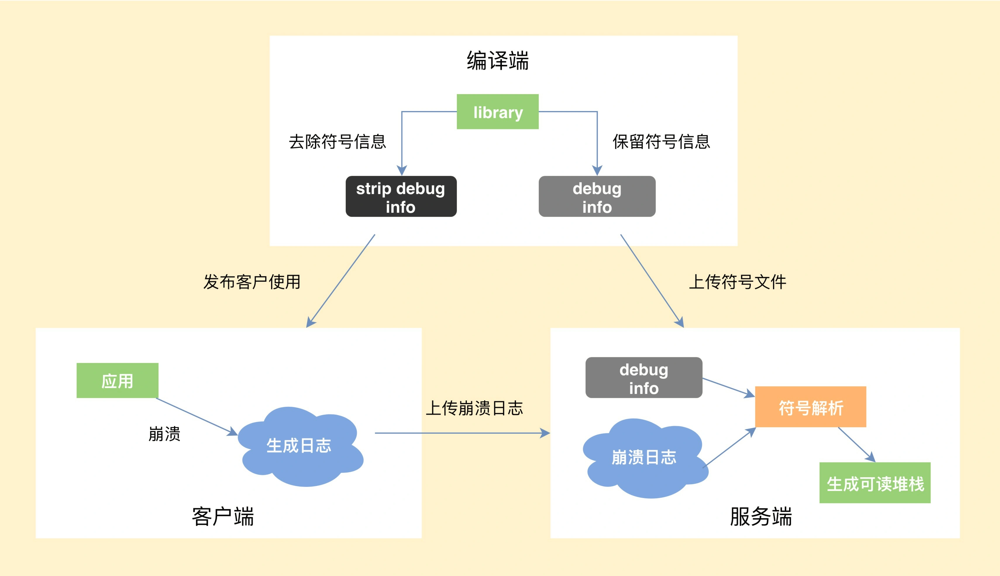

# 崩溃优化

## 1. Java 崩溃

Java 崩溃就是在 Java 代码中，出现了未捕获异常，导致程序异常退出。Java 崩溃捕获相对容易，直接实现`Thread.UncaughtExceptionHandler`即可处理收集。

[Thread.UncaughtExceptionHandler](https://blog.adison.top/android/perf/crash/KillApplicationHandler/)：当某一线程因未捕获的异常而即将终止时，Java 虚拟机将使用 Thread.getUncaughtExceptionHandler() 查询该线程以获得其 UncaughtExceptionHandler 的线程，并调用处理程序的 uncaughtException 方法，将线程和异常作为参数传递。如果某一线程没有明确设置其 UncaughtExceptionHandler，则将它的 ThreadGroup 对象作为其 UncaughtExceptionHandler。如果 ThreadGroup 对象对处理异常没有什么特殊要求，那么它可以将调用转发给 默认的未捕获异常处理程序。

我们需要实现此接口，并注册为程序中默认未捕获异常处理。这样当未捕获异常发生时，就可以做一些个性化的异常处理操作。

```java
public class CrashHandler implements UncaughtExceptionHandler {
 
    public static String TAG = "MyCrash";
    // 系统默认的UncaughtException处理类
    private Thread.UncaughtExceptionHandler mDefaultHandler;
 
    private static CrashHandler instance = new CrashHandler();
    private Context mContext;
 
    /** 保证只有一个CrashHandler实例 */
    private CrashHandler() {
    }
 
    /** 获取CrashHandler实例 ,单例模式 */
    public static CrashHandler getInstance() {
        return instance;
    }
 
    /**
     * 初始化
     * 
     * @param context
     */
    public void init(Context context) {
        mContext = context;
        // 获取系统默认的UncaughtException处理器
        mDefaultHandler = Thread.getDefaultUncaughtExceptionHandler();
        // 设置该CrashHandler为程序的默认处理器
        Thread.setDefaultUncaughtExceptionHandler(this);
    }
 
    /**
     * 当UncaughtException发生时会转入该函数来处理
     */
    @Override
    public void uncaughtException(Thread thread, Throwable ex) {
        if (!handleException(ex) && mDefaultHandler != null) {
            // 如果用户没有处理则让系统默认的异常处理器来处理
            mDefaultHandler.uncaughtException(thread, ex);
        } else {
            SystemClock.sleep(3000);
            // 退出程序
            android.os.Process.killProcess(android.os.Process.myPid());
            System.exit(1);
        }
    }
 
    /**
     * 自定义错误处理,收集错误信息 发送错误报告等操作均在此完成.
     * 
     * @param ex
     * @return true:如果处理了该异常信息; 否则返回false.
     */
    private boolean handleException(Throwable ex) {
        if (ex == null)
            return false;
 
        try {
            // 使用Toast来显示异常信息
            new Thread() {
 
                @Override
                public void run() {
                    Looper.prepare();
                    Toast.makeText(mContext, "很抱歉,程序出现异常,即将重启.",
                            Toast.LENGTH_LONG).show();
                    Looper.loop();
                }
            }.start();
            // 收集设备参数信息
            collectDeviceInfo(mContext);
            // 保存日志文件
            saveCrashInfoFile(ex);
            SystemClock.sleep(3000);
        } catch (Exception e) {
            e.printStackTrace();
        }
 
        return true;
    }
 
}
```

```java
public class MyAppcation extends Application{
	
	@Override
	public void onCreate() {
		super.onCreate();
		CrashHandler.getInstance().init(this);
	}
}
```
## 2. Native 崩溃

一般都是因为在 Native 代码中访问非法地址，也可能是地址对齐出现了问题，或者发生了程序主动 abort，这些都会产生相应的 signal 信号，导致程序异常退出。

### 2.1 Native 崩溃的捕获流程

> [Android 平台 Native 代码的崩溃捕获机制及实现](https://blog.adison.top/android/perf/crash/native-catch/)

* 编译端。编译 C/C++ 代码时，需要将带符号信息的文件保留下来。
* 客户端。捕获到崩溃时候，将收集到尽可能多的有用信息写入日志文件，然后选择合适的时机上传到服务器。
* 服务端。读取客户端上报的日志文件，寻找适合的符号文件，生成可读的 C/C++ 调用栈。



### 2.2 Native 崩溃捕获的难点

Chromium 的[Breakpad](https://chromium.googlesource.com/breakpad/breakpad/+/master)是目前 Native 崩溃捕获中最成熟的方案。

在上面的三个流程中，**最核心的是怎么样保证客户端在各种极端情况下依然可以生成崩溃日志**。因为在崩溃时，程序会处于一个不安全的状态，如果处理不当，非常容易发生二次崩溃。

* **情况一：文件句柄泄漏，导致创建日志文件失败，怎么办？**

  **应对方式**：我们需要提前申请文件句柄 fd 预留，防止出现这种情况。

* **情况二：因为栈溢出了，导致日志生成失败，怎么办？**

  **应对方式**：为了防止栈溢出导致进程没有空间创建调用栈执行处理函数，我们通常会使用常见的 `signalstack`。在一些特殊情况，我们可能还需要直接替换当前栈，所以这里也需要在堆中预留部分空间。

* **情况三：整个堆的内存都耗尽了，导致日志生成失败，怎么办？**

  **应对方式**：这个时候我们无法安全地分配内存，也不敢使用 `stl` 或者` libc` 的函数，因为它们内部实现会分配堆内存。这个时候如果继续分配内存，会导致出现堆破坏或者二次崩溃的情况。Breakpad 做的比较彻底，重新封装了[Linux Syscall Support](https://chromium.googlesource.com/linux-syscall-support/)，来避免直接调用 `libc`。

* **情况四：堆破坏或二次崩溃导致日志生成失败，怎么办？**

  **应对方式**：Breakpad 会从原进程 fork 出子进程去收集崩溃现场，此外涉及与 Java 相关的，一般也会用子进程去操作。这样即使出现二次崩溃，只是这部分的信息丢失，我们的父进程后面还可以继续获取其他的信息。在一些特殊的情况，我们还可能需要从子进程 fork 出孙进程。

当然 Breakpad 也存在着一些问题，例如生成的 `minidump `文件是二进制格式的，包含了太多不重要的信息，导致文件很容易达到几 MB。但是 minidump 也不是毫无用处，它有一些比较高级的特性，比如使用 [gdb 调试](https://www.chromium.org/chromium-os/packages/crash-reporting/debugging-a-minidump/)、可以看到传入参数等。Chromium 未来计划使用 Crashpad 全面替代 Breakpad，但目前来说还是 “too early to mobile”。

我们有时候想遵循 Android 的文本格式，并且添加更多我们认为重要的信息，这个时候就要去改造 Breakpad 的实现。比较常见的例如增加 Logcat 信息、Java 调用栈信息以及崩溃时的其他一些有用信息。

#### 2.2.1 获取logcat 

日志流程是这样的，`应用层 --> liblog.so --> logd`，底层使用ring buffer来存储数据。 获取的方式有以下三种： 

1. 通过logcat命令获取。   
   优点：非常简单，兼容性好。   
   缺点：整个链路比较长，可控性差，失败率高，特别是堆破坏或者堆内存不足时，基本会失败。 
   
2. hook liblog.so实现。通过hook liblog.so 中__android_log_buf_write 方法，将内容重定向到自己的buffer中。   
   优点：简单，兼容性相对还好。  
   缺点：要一直打开。   
3. 自定义获取代码。通过移植底层获取logcat的实现，通过socket直接跟logd交互。  
    优点：比较灵活，预先分配好资源，成功率也比较高。  
    缺点：实现非常复杂 

#### 2.2.2 获取Java 堆栈   

native崩溃时，通过unwind只能拿到Native堆栈。我们希望可以拿到当时各个线程的Java堆栈  

1. Thread.getAllStackTraces()。    
   优点：简单，兼容性好。    
   缺点：
     * 成功率不高，依靠系统接口在极端情况也会失败。        
     * 7.0之后这个接口是没有主线程堆栈。       
     * 使用Java层的接口需要暂停线程  

2.  hook libart.so。通过hook ThreadList和Thread的函数，获得跟ANR一样的堆栈。为了稳定性，我们会在fork子进程执行。  
   优点：信息很全，基本跟ANR的日志一样，有native线程状态，锁信息等等。  
   缺点：黑科技的兼容性问题，失败时可以用Thread.getAllStackTraces()兜底

## 3. 衡量指标

### 3.1 如何客观地衡量崩溃

要衡量一个指标，首先要统一计算口径。如果想评估崩溃造成的用户影响范围，我们会先去看 **UV 崩溃率**。

```java
UV 异常率 = 发生异常退出或崩溃的 UV / 登录 UV
```

只要用户出现过一次崩溃就会被计算到，所以 UV 崩溃率的高低会跟应用的使用时长有比较大的关系。我们还可以去看应用 PV 崩溃率、启动崩溃率、重复崩溃率这些指标，计算方法都大同小异。

这里为什么要单独统计启动崩溃率呢？因为启动崩溃对用户带来的伤害最大，应用无法启动往往通过热修复也无法拯救。闪屏广告、运营活动，很多应用启动过程异常复杂，又涉及各种资源、配置下发，极其容易出现问题。微信读书、蘑菇街、淘宝、天猫这些“重运营”的应用都有使用一种叫作“[安全模式](https://mp.weixin.qq.com/s?__biz=MzUxMzcxMzE5Ng==&mid=2247488429&idx=1&sn=448b414a0424d06855359b3eb2ba8569&source=41#wechat_redirect)”的技术来保障客户端的启动流程，在监控到客户端启动失败后，给用户自救的机会。

### 3.2 如何客观地衡量稳定性

崩溃率是不是就能完全等价于应用的稳定性呢？答案是肯定不行。处理了崩溃，我们还会经常遇到 ANR（Application Not Responding，程序没有响应）这个问题。

通常有两种做法去发现应用中的 ANR 异常。

1. **使用 FileObserver 监听 /data/anr/traces.txt 的变化**。非常不幸的是，很多高版本的 ROM，已经没有读取这个文件的权限了。这个时候你可能只能思考其他路径，海外可以使用 Google Play 服务，而国内微信利用[Hardcoder](https://mp.weixin.qq.com/s/9Z8j3Dv_5jgf7LDQHKA0NQ?)框架（HC 框架是一套独立于安卓系统实现的通信框架，它让 App 和厂商 ROM 能够实时“对话”了，目标就是充分调度系统资源来提升 App 的运行速度和画质，切实提高大家的手机使用体验）向厂商获取了更大的权限。
2. **监控消息队列的运行时间**。这个方案无法准确地判断是否真正出现了 ANR 异常，也无法得到完整的 ANR 日志。在我看来，更应该放到卡顿的性能范畴。（目前大部分ANR监控使用这种方式）

> ANR监控可以参考：[这篇文章](https://blog.adison.top/perf-opt/Android/anr/anr_monitor/)

### 3.3 异常退出

在讨论什么是异常退出之前，我们先看看都有哪些应用退出的情形。

* 主动自杀。Process.killProcess()、exit() 等。
* 崩溃。出现了 Java 或 Native 崩溃。
* 系统重启；系统出现异常、断电、用户主动重启等，我们可以通过比较应用开机运行时间是否比之前记录的值更小。
* 被系统杀死。被 low memory killer 杀掉、从系统的任务管理器中划掉等。
* ANR。

我们可以在应用启动的时候设定一个标志，在主动自杀或崩溃后更新标志，这样下次启动时通过检测这个标志就能确认运行期间是否发生过异常退出。对应上面的五种退出场景，我们排除掉主动自杀和崩溃（崩溃会单独的统计）这两种场景，希望可以监控到剩下三种的异常退出，理论上这个异常捕获机制是可以达到 100% 覆盖的。

通过这个异常退出的检测，可以反映如 ANR、low memory killer、系统强杀、死机、断电等其他无法正常捕获到的问题。当然异常率会存在一些误报，比如用户从系统的任务管理器中划掉应用。对于线上的大数据来说，还是可以帮助我们发现代码中的一些隐藏问题。

所以就得到了一个新的指标来衡量应用的稳定性，即异常率。

```she
UV 异常率 = 发生异常退出或崩溃的 UV / 登录 UV
```

根据应用的前后台状态，我们可以把异常退出分为前台异常退出和后台异常退出。“被系统杀死”是后台异常退出的主要原因，当然我们会**更关注前台的异常退出**的情况，这会跟 ANR、OOM 等异常情况有更大的关联。通过异常率我们可以比较全面的评估应用的稳定性。

#### 3.3.1 getHistoricalProcessExitReasons

在Android 11中，ActivityManager引入一个新的api：***getHistoricalProcessExitReasons***，用于报告近期任何进程终止的原因（包含了上面所提到的所有异常退出原因）。应用可以使用此方法收集崩溃诊断信息，例如进程终止是由于 ANR、内存问题还是其他原因所致。此外，您还可以使用新的 `setProcessStateSummary()` 方法存储自定义状态信息，以便日后进行分析。

`getHistoricalProcessExitReasons()` 方法会返回 `ApplicationExitInfo` 类的实例，该类包含与应用进程终止相关的信息。通过对此类的实例调用 `getReason()`，您可以确定应用进程终止的原因。例如，REASON_CRASH 的返回值表示应用中发生了未处理的异常。如果应用需要确保退出事件的唯一性，可以保留特定于应用的标识符，例如基于` getTimestamp()` 方法的时间戳的哈希值。

```java
if (Build.VERSION.SDK_INT >= Build.VERSION_CODES.R) {
  ActivityManager am = (ActivityManager) getSystemService(Context.ACTIVITY_SERVICE);
  List<ApplicationExitInfo> applicationExitInfos = am.getHistoricalProcessExitReasons(null, 0, 0);

  if (applicationExitInfos == null || applicationExitInfos.size() == 0) {
    return;
  }
  long lastExitTimestamp = getPreferences(0).getLong(PREV_DETECT_TIME_KEY, 0);
  List<ApplicationExitInfo> unprocessedExitInfos = new ArrayList<>();
  for (ApplicationExitInfo exitInfo : applicationExitInfos) {
    if (exitInfo.getTimestamp() > lastExitTimestamp) {
      unprocessedExitInfos.add(exitInfo);
    } else {
      break;
    }
  }

  if (unprocessedExitInfos.size() > 0) {
    getPreferences(0).edit().putLong(PREV_DETECT_TIME_KEY, unprocessedExitInfos.get(0).getTimestamp())
      .apply();
  }

  for (ApplicationExitInfo exitInfo : unprocessedExitInfos) {
    Log.e(TAG, String.format("Exit reason: %d, description: %s", exitInfo.getReason(),
                             exitInfo.getDescription()));

    if (exitInfo.getReason() == ApplicationExitInfo.REASON_ANR) {
      UUID uuid = UUID.randomUUID();
      String fileName = "anr_info_" + uuid.toString() + ".trace";
      File outFile = new File(getFilesDir().getAbsolutePath() + "/" + fileName);

      try (InputStream inputStream = exitInfo.getTraceInputStream()) {
        copyStreamToFile(inputStream, outFile);
      } catch (IOException e) {
        Log.e(TAG, "copyStreamToFile: ", e);
      }

      // upload the file to server
    }
  }
}
```


## 4. 崩溃分析

### 4.1 崩溃现场

崩溃现场是我们的“第一案发现场”，它保留着很多有价值的线索。在这里我们挖掘到的信息越多，下一步分析的方向就越清晰，而不是去靠盲目猜测。

操作系统是整个崩溃过程的“旁观者”，也是我们最重要的“证人”。一个好的崩溃捕获工具知道应该采集哪些系统信息，也知道在什么场景要深入挖掘哪些内容，从而可以更好地帮助我们解决问题。

那么在崩溃现场应该采集哪些信息：

1. **崩溃信息**
   从崩溃的基本信息，我们可以对崩溃有初步的判断。
     * 进程名、线程名。崩溃的进程是前台进程还是后台进程，崩溃是不是发生在 UI 线程。
     * 崩溃堆栈和类型。崩溃是属于 Java 崩溃、Native 崩溃，还是 ANR，对于不同类型的崩溃我们关注的点也不太一样。特别需要看崩溃堆栈的栈顶，看具体崩溃在系统的代码，还是我们自己的代码里面。
   
2. **系统信息**
   系统的信息有时候会带有一些关键的线索，对我们解决问题有非常大的帮助。
     * Logcat。这里包括应用、系统的运行日志。由于系统权限问题，获取到的 Logcat 可能只包含与当前 App 相关的。其中系统的 `event logcat` 会记录 App 运行的一些基本情况，记录在文件 `/system/etc/event-log-tags` 中，我们可以通过 `adb logcat -b events` 查看。

       ```shell
       system logcat:
       10-25 17:13:47.788 21430 21430 D dalvikvm: Trying to load lib ... 
       event logcat:
       10-25 17:13:47.788 21430 21430 I am_on_resume_called: 生命周期
       10-25 17:13:47.788 21430 21430 I am_low_memory: 系统内存不足
       10-25 17:13:47.788 21430 21430 I am_destroy_activity: 销毁 Activty
       10-25 17:13:47.888 21430 21430 I am_anr: ANR 以及原因
       10-25 17:13:47.888 21430 21430 I am_kill: APP 被杀以及原因
       ```
       
     * 机型、系统、厂商、CPU、ABI、Linux 版本等。我们会采集多达几十个维度，这对寻找共性问题会很有帮助。
   
     * 设备状态：是否 root、是否是模拟器。一些问题是由 Xposed 或多开软件造成，对这部分问题我们要区别对待。

3. **内存信息**
  OOM、ANR、虚拟内存耗尽等，很多崩溃都跟内存有直接关系。如果我们把用户的手机内存分为“2GB 以下”和“2GB 以上”两个桶，会发现“2GB 以下”用户的崩溃率是“2GB 以上”用户的几倍。
  
    * 系统剩余内存。关于系统内存状态，可以直接读取文件`/proc/meminfo`。当系统可用内存很小（低于 MemTotal 的 10%）时，OOM、大量 GC、系统频繁自杀拉起等问题都非常容易出现。
    * 应用使用内存。包括 Java 内存、`RSS（Resident Set Size）`、`PSS（Proportional Set Size）`，我们可以得出应用本身内存的占用大小和分布。PSS 和 RSS 通过 `/proc/self/smap` 计算，可以进一步得到例如 apk、dex、so 等更加详细的分类统计。
    * 虚拟内存。虚拟内存可以通过 `/proc/self/status` 得到，通过 `/proc/self/maps` 文件可以得到具体的分布情况。有时候我们一般不太重视虚拟内存，但是很多类似 OOM、tgkill 等问题都是虚拟内存不足导致的。
    ```shell
    Name:     com.sample.name   // 进程名
    FDSize:   800               // 当前进程申请的文件句柄个数
    VmPeak:   3004628 kB        // 当前进程的虚拟内存峰值大小
    VmSize:   2997032 kB        // 当前进程的虚拟内存大小
    Threads:  600               // 当前进程包含的线程个数
    ```
  一般来说，对于 32 位进程，如果是 32 位的 CPU，虚拟内存达到 3GB 就可能会引起内存申请失败的问题。如果是 64 位的 CPU，虚拟内存一般在 3～4GB 之间。当然如果我们支持 64 位进程，虚拟内存就不会成为问题。Google Play 要求 2019 年 8 月一定要支持 64 位，在国内虽然支持 64 位的设备已经在 90% 以上了，但是商店都不支持区分 CPU 架构类型发布，普及起来需要更长的时间。
  
4. **资源信息**
  有的时候我们会发现应用堆内存和设备内存都非常充足，还是会出现内存分配失败的情况，这跟资源泄漏可能有比较大的关系
    * 文件句柄 fd。文件句柄的限制可以通过 `/proc/self/limits` 获得，一般单个进程允许打开的最大文件句柄个数为 1024（**较新款的Android这个值被改为32768**）。但是如果文件句柄超过 800 个就比较危险，需要将所有的 fd 以及对应的文件名输出到日志中，进一步排查是否出现了有文件或者线程的泄漏。
    ```shell
    opened files count 812:
    0 -> /dev/null
    1 -> /dev/log/main4 
    2 -> /dev/binder
    3 -> /data/data/com.crash.sample/files/test.config
    ...
    ```
  
    * 线程数。当前线程数大小可以通过上面的 status 文件得到，一个线程可能就占 2MB 的虚拟内存，过多的线程会对虚拟内存和文件句柄带来压力。根据我的经验来说，如果线程数超过 400 个就比较危险。需要将所有的线程 id 以及对应的线程名输出到日志中，进一步排查是否出现了线程相关的问题。
     ```shell
     threads count 412:               
     1820 com.sample.crashsdk                         
     1844 ReferenceQueueD                                             
     1869 FinalizerDaemon   
     ...
     ```
  
     * JNI。使用 JNI 时，如果不注意很容易出现引用失效、引用爆表等一些崩溃。我们可以通过 `DumpReferenceTables` 统计 JNI 的引用表，进一步分析是否出现了 JNI 泄漏等问题。
     ```java
     Java_com_android_geektime_MainActivity_testInitLocalRef(JNIEnv *env, jobject thiz) {
         // 标记
         jstring pMark = env->NewStringUTF("I'm a mark");
         // 强制进行 reference table dump
         // 查找了一次VMDebug类，会添加到local ref table中
         jclass vm_class = env->FindClass("dalvik/system/VMDebug");
         jmethodID dump_mid = env->GetStaticMethodID(vm_class, "dumpReferenceTables", "()V");
         env->CallStaticVoidMethod(vm_class, dump_mid);
     }
     ```
  
5. **应用信息**
     * 崩溃场景。崩溃发生在哪个 Activity 或 Fragment，发生在哪个业务中。
     * 关键操作路径。不同于开发过程详细的打点日志，我们可以记录关键的用户操作路径，这对我们复现崩溃会有比较大的帮助。
     * 其他自定义信息。不同的应用关心的重点可能不太一样，比如网易云音乐会关注当前播放的音乐，QQ 浏览器会关注当前打开的网址或视频。此外例如运行时间、是否加载了补丁、是否是全新安装或升级等信息也非常重要。

除了上面这些通用的信息外，针对特定的一些崩溃，我们可能还需要获取类似磁盘空间、电量、网络使用等特定信息。所以说一个好的崩溃捕获工具，会根据场景为我们采集足够多的信息，让我们有更多的线索去分析和定位问题。当然数据的采集需要注意用户隐私，做到足够强度的加密和脱敏。

## 5.崩溃分析

### 5.1 第一步：确定重点

确认和分析重点，关键在于在日志中找到重要的信息，对问题有一个大致判断。一般来说，我建议在确定重点这一步可以关注以下几点。

1. **确认严重程度**。解决崩溃也要看性价比，我们优先解决 Top 崩溃或者对业务有重大影响，例如启动、支付过程的崩溃。
2. **崩溃基本信息**。确定崩溃的类型以及异常描述，对崩溃有大致的判断。一般来说，大部分的简单崩溃经过这一步已经可以得到结论。
     * Java 崩溃。Java 崩溃类型比较明显，比如 `NullPointerException` 是空指针，`OutOfMemoryError` 是资源不足，这个时候需要去进一步查看日志中的 “内存信息”和“资源信息”。
     * Native 崩溃。需要观察 `signal`、`code`、`fault addr` 等内容，以及崩溃时 Java 的堆栈。关于各 signal 含义的介绍，可以查看[崩溃信号介绍](https://blog.adison.top/android/perf/crash/native-crash-signal/)。比较常见的是有 SIGSEGV 和 SIGABRT，前者一般是由于空指针、非法指针造成，后者主要因为 ANR 和调用 abort() 退出所导致。
     * ANR。我的经验是，先看看主线程的堆栈，是否是因为锁等待导致。接着看看 ANR 日志中 iowait、CPU、GC、system server 等信息，进一步确定是 I/O 问题，或是 CPU 竞争问题，还是由于大量 GC 导致卡死。
3. **Logcat**。Logcat 一般会存在一些有价值的线索，日志级别是 Warning、Error 的需要特别注意。从 Logcat 中我们可以看到当时系统的一些行为跟手机的状态，例如出现 ANR 时，会有“am_anr”；App 被杀时，会有“am_kill”。不同的系统、厂商输出的日志有所差别，当从一条崩溃日志中无法看出问题的原因，或者得不到有用信息时，不要放弃，建议查看相同崩溃点下的更多崩溃日志。
4. **各个资源情况**。结合崩溃的基本信息，我们接着看看是不是跟 “内存信息” 有关，是不是跟“资源信息”有关。比如是物理内存不足、虚拟内存不足，还是文件句柄 fd 泄漏了。

无论是资源文件还是 Logcat，内存与线程相关的信息都需要特别注意，很多崩溃都是由于它们使用不当造成的。

### 5.2 第二步：查找共性

如果使用了上面的方法还是不能有效定位问题，我们可以尝试查找这类崩溃有没有什么共性。找到了共性，也就可以进一步找到差异，离解决问题也就更进一步。

机型、系统、ROM、厂商、ABI，这些采集到的系统信息都可以作为维度聚合，共性问题例如是不是因为安装了 Xposed，是不是只出现在 x86 的手机，是不是只有三星这款机型，是不是只在 Android 5.0 的系统上。应用信息也可以作为维度来聚合，比如正在打开的链接、正在播放的视频、国家、地区等。

找到了共性，可以对你下一步复现问题有更明确的指引。

### 5.3 第三步：尝试复现

如果我们已经大概知道了崩溃的原因，为了进一步确认更多信息，就需要尝试复现崩溃。如果我们对崩溃完全没有头绪，也希望通过用户操作路径来尝试重现，然后再去分析崩溃原因。

“只要能本地复现，我就能解”，相信这是很多开发跟测试说过的话。有这样的底气主要是因为在稳定的复现路径上面，我们可以采用增加日志或使用 Debugger、GDB 等各种各样的手段或工具做进一步分析。

### 5.4 疑难问题：系统崩溃

系统崩溃常常令我们感到非常无助，它可能是某个 Android 版本的 bug，也可能是某个厂商修改 ROM 导致。这种情况下的崩溃堆栈可能完全没有我们自己的代码，很难直接定位问题。针对这种疑难问题，我来谈谈我的解决思路。

1. **查找可能的原因**。通过上面的共性归类，我们先看看是某个系统版本的问题，还是某个厂商特定 ROM 的问题。虽然崩溃日志可能没有我们自己的代码，但通过操作路径和日志，我们可以找到一些怀疑的点。

2. **尝试规避**。查看可疑的代码调用，是否使用了不恰当的 API，是否可以更换其他的实现方式规避。

3. **Hook 解决**。这里分为 `Java Hook` 和 `Native Hook`。以我最近解决的一个系统崩溃为例，我们发现线上出现一个 Toast 相关的系统崩溃，它只出现在 Android 7.0 的系统中，看起来是在 Toast 显示的时候窗口的 token 已经无效了。这有可能出现在 Toast 需要显示时，窗口已经销毁了。

   ```java
   android.view.WindowManager$BadTokenException: 
     at android.view.ViewRootImpl.setView(ViewRootImpl.java)
     at android.view.WindowManagerGlobal.addView(WindowManagerGlobal.java)
     at android.view.WindowManagerImpl.addView(WindowManagerImpl.java4)
     at android.widget.Toast$TN.handleShow(Toast.java)
   ```

   为什么 Android 8.0 的系统不会有这个问题？在查看 Android 8.0 的源码后我们发现有以下修改：

   ```java
   try {
     mWM.addView(mView, mParams);
     trySendAccessibilityEvent();
   } catch (WindowManager.BadTokenException e) {
     /* ignore */
   }
   ```

   考虑再三，我们决定参考 Android 8.0 的做法，直接 catch 住这个异常。这里的关键在于寻找 Hook 点，这个案例算是相对比较简单的。Toast 里面有一个变量叫 mTN，它的类型为 handler，我们只需要代理它就可以实现捕获。

## 6.崩溃防护

很多时候由于一些微不足道的bug导致app崩溃很可惜，android默认的异常杀进程机制简单粗暴，但很多时候让app崩溃其实也并不能解决问题。

有些bug可能是系统bug，对于这些难以预料的系统bug我们不好绕过，还有一些bug是我们自己编码造成的，对于有些bug来说直接忽略掉的话可能只是导致部分不重要的功能没法使用而已，又或者对用户来说完全没有影响，这种情况总比每次都崩溃要好很多。

###6.1 原理

android中最重要的就是Handler机制了，简单来说Handler机制就是在一个死循环内部不断取走阻塞队列头部的Message，这个阻塞队列在主线程中是唯一的，当没有Message时，循环就阻塞，当一旦有Message时就立马被主线程取走并执行Message。

查看android源码可以发现在ActivityThread中main方法（main方法签名 `public static void main(String[] args){}`,这个main方法是静态的，公有的，可以理解为应用的入口）最后执行了`Looper.loop();`，此方法内部是个死循环(for(;;)循环)，所以一般情况下主线程是不会退出的，除非抛出异常。`queue.next();`就是从阻塞队列里取走头部的Message，当没有Message时主线程就会阻塞在这里，一有Message就会继续往下执行。android的view绘制，事件分发，activity启动，activity的生命周期回调等等都是一个个的Message，android会把这些Message插入到主线程中唯一的queue中，所有的消息都排队等待主线程的执行。

ActivityThread的main方法如下：

```java

 public static void main(String[] args) {
         
		 ...
        Looper.prepareMainLooper();//创建主线程唯一的阻塞队列queue
        ...
        ActivityThread thread = new ActivityThread();
        thread.attach(false);//执行初始化，往queue中添加Message等
        ...
        Looper.loop();//开启死循环，挨个执行Message

        throw new RuntimeException("Main thread loop unexpectedly exited");
    }

```

`Looper.loop()`关键代码如下：

```java
   for (;;) {
            Message msg = queue.next(); // might block
            ...
            msg.target.dispatchMessage(msg);//执行Message
            ...
   }     
```

android消息机制伪代码如下：

```java
public class ActivityThread {

	public static void main(String[]args){
		
		Queue queue=new Queue();// 可以理解为一个加锁的，可以阻塞线程的ArrayList
		
		queue.add(new Message(){
			void run(){
				...
				print("android 启动了，下一步该往queue中插入启动主Activity的Message了");
				Message msg=getMessage4LaunchMainActivity();
				queue.add(msg);
			}
		
		});
		
		for(;;){//开始死循环，for之后的代码永远也得不到执行
			Message  msg=queue.next();
			
			msg.run();
		
		}
	
	}


}
```

**崩溃防护**

```java
new Handler(Looper.getMainLooper()).post(new Runnable() {
            @Override
            public void run() {
               //主线程异常拦截
                while (true) {
                    try {
                        Looper.loop();//主线程的异常会从这里抛出
                    } catch (Throwable e) {
                                                
                    }
                }
            }
        });
       
        sUncaughtExceptionHandler = Thread.getDefaultUncaughtExceptionHandler();
         //所有线程异常拦截，由于主线程的异常都被我们catch住了，所以下面的代码拦截到的都是子线程的异常
        Thread.setDefaultUncaughtExceptionHandler(new Thread.UncaughtExceptionHandler() {
            @Override
            public void uncaughtException(Thread t, Throwable e) {
                
            }
});
```

原理很简单，就是通过Handler往主线程的queue中添加一个Runnable，当主线程执行到该Runnable时，会进入我们的while死循环，如果while内部是空的就会导致代码卡在这里，最终导致ANR，但我们在while死循环中又调用了`Looper.loop()`，这就导致主线程又开始不断的读取queue中的Message并执行，这样就可以保证以后主线程的所有异常都会从我们手动调用的`Looper.loop()`处抛出，一旦抛出就会被try{}catch捕获，这样主线程就不会crash了，如果没有这个while的话那么主线程下次抛出异常时我们就又捕获不到了，这样APP就又crash了，所以我们要通过while让每次crash发生后都再次进入消息循环，while的作用仅限于每次主线程抛出异常后迫使主线程再次进入消息循环。我们可以用下面的伪代码来表示：

```java

public class ActivityThread {

	public static void main(String[]args){
		
		Queue queue=new Queue();// 可以理解为一个加锁的，可以阻塞线程的ArrayList
		
		...
		
		for(;;){//开始死循环，for之后的代码永远也得不到执行
			Message  msg=queue.next();
			
			//如果msg 是我们post的Runnable就会执行如下代码
				//我们post的Runnable中的代码
				  while (true) {
                    try {
                       	 for(;;){//所有主线程的异常都会从msg.run()中抛出，所以我们加一个try{}catch来捕获所有主线程异常，捕获到后再次强迫进入循环，不断读取queue中消息并执行
                       	 	Message  msg=queue.next();
                       	 	msg.run();
                       	 }
                       
                    } catch (Throwable e) {
                    
                    }
			//否则执行其他逻辑	
			 
		
		}
	
	}
```

为什么要通过new Handler.post方式而不是直接在主线程中任意位置执行 `while (true) { try { Looper.loop(); } catch (Throwable e) {} }`

这是因为该方法是个死循环，若在主线程中，比如在Activity的onCreate中执行时会导致while后面的代码得不到执行，activity的生命周期也就不能完整执行，通过Handler.post方式可以保证不影响该条消息中后面的逻辑。

## 参考

[Cockroach](https://github.com/android-notes/Cockroach)

[Android 开发高手课](https://time.geekbang.org/column/article/70602)


