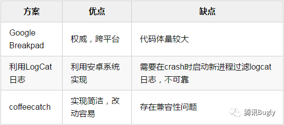
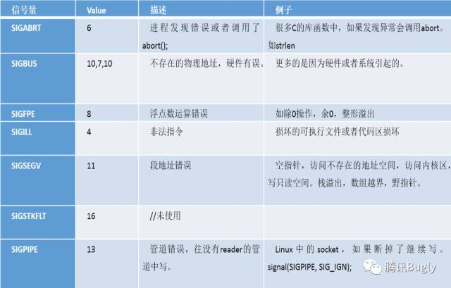

# Android 平台 Native 代码的崩溃捕获机制及实现

> 转自https://mp.weixin.qq.com/s/g-WzYF3wWAljok1XjPoo7w?

## 一、背景

在Android平台，native crash一直是crash里的大头。native crash具有上下文不全、出错信息模糊、难以捕捉等特点，比java crash更难修复。所以一个合格的异常捕获组件也要能达到以下目的：

- 支持在crash时进行更多扩展操作，如：

- - 打印logcat和应用日志
  - 上报crash次数
  - 对不同的crash做不同的恢复措施

- 可以针对业务不断改进和适应

## 二、现有的方案


其实3个方案在Android平台的实现原理都是基本一致的，综合考虑，可以基于coffeecatch改进。

## 三、信号机制

#### 1.程序奔溃

- 在Unix-like系统中，所有的崩溃都是编程错误或者硬件错误相关的，系统遇到不可恢复的错误时会触发崩溃机制让程序退出，如除零、段地址错误等。
- 异常发生时，CPU通过异常中断的方式，触发异常处理流程。不同的处理器，有不同的异常中断类型和中断处理方式。
- linux把这些中断处理，统一为信号量，可以注册信号量向量进行处理。
- 信号机制是进程之间相互传递消息的一种方法，信号全称为软中断信号。

#### 2.信号机制

函数运行在用户态，当遇到系统调用、中断或是异常的情况时，程序会进入内核态。信号涉及到了这两种状态之间的转换。


##### (1) 信号的接收

接收信号的任务是由内核代理的，当内核接收到信号后，会将其放到对应进程的信号队列中，同时向进程发送一个中断，使其陷入内核态。注意，此时信号还只是在队列中，对进程来说暂时是不知道有信号到来的。

##### (2) 信号的检测

进程陷入内核态后，有两种场景会对信号进行检测：

- 进程从内核态返回到用户态前进行信号检测
- 进程在内核态中，从睡眠状态被唤醒的时候进行信号检测

当发现有新信号时，便会进入下一步，信号的处理。

##### (3) 信号的处理

信号处理函数是运行在用户态的，调用处理函数前，内核会将当前内核栈的内容备份拷贝到用户栈上，并且修改指令寄存器（eip）将其指向信号处理函数。

接下来进程返回到用户态中，执行相应的信号处理函数。

信号处理函数执行完成后，还需要返回内核态，检查是否还有其它信号未处理。如果所有信号都处理完成，就会将内核栈恢复（从用户栈的备份拷贝回来），同时恢复指令寄存器（eip）将其指向中断前的运行位置，最后回到用户态继续执行进程。

至此，一个完整的信号处理流程便结束了，如果同时有多个信号到达，上面的处理流程会在第2步和第3步骤间重复进行。

##### (4) 常见信号量类型



## 四、捕捉native crash

#### 1.注册信号处理函数

第一步就是要用信号处理函数捕获到native crash(SIGSEGV, SIGBUS等)。在posix系统，可以用sigaction()：

```
#include <signal.h> 
int sigaction(int signum,const struct sigaction *act,struct sigaction *oldact));
```

- **signum**：代表信号编码，可以是除SIGKILL及SIGSTOP外的任何一个特定有效的信号，如果为这两个信号定义自己的处理函数，将导致信号安装错误。
- **act**：指向结构体sigaction的一个实例的指针，该实例指定了对特定信号的处理，如果设置为空，进程会执行默认处理。
- **oldact**：和参数act类似，只不过保存的是原来对相应信号的处理，也可设置为NULL。

```
struct sigaction sa_old;  
memset(&sa, 0, sizeof(sa));  
sigemptyset(&sa.sa_mask);  
sa.sa_sigaction = my_handler;  
sa.sa_flags = SA_SIGINFO;
if (sigaction(sig, &sa, &sa_old) == 0) {  
  ...  
}
```

#### 2.设置额外栈空间

```
#include <signal.h>
int sigaltstack(const stack_t *ss, stack_t *oss);
```

- SIGSEGV很有可能是栈溢出引起的，如果在默认的栈上运行很有可能会破坏程序运行的现场，无法获取到正确的上下文。而且当栈满了（太多次递归，栈上太多对象），系统会在同一个已经满了的栈上调用SIGSEGV的信号处理函数，又再一次引起同样的信号。
- 我们应该开辟一块新的空间作为运行信号处理函数的栈。可以使用sigaltstack在任意线程注册一个可选的栈，保留一下在紧急情况下使用的空间。（系统会在危险情况下把栈指针指向这个地方，使得可以在一个新的栈上运行信号处理函数）

```
stack_t stack;  
memset(&stack, 0, sizeof(stack));  
/* Reserver the system default stack size. We don't need that much by the way. */  
stack.ss_size = SIGSTKSZ;  
stack.ss_sp = malloc(stack.ss_size);  
stack.ss_flags = 0;  
/* Install alternate stack size. Be sure the memory region is valid until you revert it. */  
if (stack.ss_sp != NULL && sigaltstack(&stack, NULL) == 0) {  
  ...  
}
```

## 3.兼容其他signal处理

```
static void my_handler(const int code, siginfo_t *const si, void *const sc) {
...  
  /* Call previous handler. */  
  old_handler.sa_sigaction(code, si, sc);  
}
```

- 某些信号可能在之前已经被安装过信号处理函数，而sigaction一个信号量只能注册一个处理函数，这意味着我们的处理函数会覆盖其他人的处理信号
- 保存旧的处理函数，在处理完我们的信号处理函数后，在重新运行老的处理函数就能完成兼容。

## 五、注意事项

#### 1.防止死锁或者死循环

首先我们要了解async-signal-safe和可重入函数概念：

> - A signal handler function must be very careful, since processing elsewhere may be interrupted at some arbitrary point in the execution of the program.
> - POSIX has the concept of “safe function”.  If a signal interrupts the execution of an unsafe function, and handler  either calls an unsafe function or handler terminates via a call to longjmp() or siglongjmp() and the program subsequently calls an unsafe function, then the behavior of the program is undefined.

回想下在“信号机制”一节中的图示，进程捕捉到信号并对其进行处理时，进程正在执行的正常指令序列就被信号处理程序临时中断，它首先执行该信号处理程序中的指令（类似发生硬件中断）。但在信号处理程序中，不能判断捕捉到信号时进程执行到何处。如果进程正在执行malloc，在其堆中分配另外的存储空间，而此时由于捕捉到信号而插入执行该信号处理程序，其中又调用malloc，这时会发生什么？这可能会对进程造成破坏，因为malloc通常为它所分配的存储区维护一个链表，而插入执行信号处理程序时，进程可能正在更改此链表。（参考《UNIX环境高级编程》）

Single UNIX Specification说明了在信号处理程序中保证调用安全的函数。这些函数是可重入的并被称为是异步信号安全（async-signal-safe）。除了可重入以外，在信号处理操作期间，它会阻塞任何会引起不一致的信号发送。下面是这些异步信号安全函数：

.jpeg)

但即使我们自己在信号处理程序中不使用不可重入的函数，也无法保证保存的旧的信号处理程序中不会有非异步信号安全的函数。所以要使用alarm保证信号处理程序不会陷入死锁或者死循环的状态。

```
static void signal_handler(const int code, siginfo_t *const si,
                                    void *const sc) {

    /* Ensure we do not deadlock. Default of ALRM is to die.
    * (signal() and alarm() are signal-safe) */
    signal(code, SIG_DFL);
    signal(SIGALRM, SIG_DFL);
    
    /* Ensure we do not deadlock. Default of ALRM is to die.
      * (signal() and alarm() are signal-safe) */
    (void) alarm(8);
    ....
}
```

#### 2.在哪里打印堆栈

##### (1) 子进程

考虑到信号处理程序中的诸多限制，一般会clone一个新的进程，在其中完成解析堆栈等任务。

下面是Google Breakpad的流程图，在新的进程中DoDump，使用ptrace解析crash进程的堆栈，同时信号处理程序等待子进程完成任务后，再调用旧的信号处理函数。父子进程使用管道通信。


##### (2) 子线程

在我的实验中，在子进程或者信号处理函数中，经常无法回调给java层。于是我选择了在初始化的时候就建立了子线程并一直等待，等到捕捉到crash信号时，唤醒这条线程dump出crash堆栈，并把crash堆栈回调给java。

```
static void nativeInit(JNIEnv* env, jclass javaClass, jstring packageNameStr, jstring tombstoneFilePathStr, jobject obj) {
    ...
    initCondition();

    pthread_t thd;
    int ret = pthread_create(&thd, NULL, DumpThreadEntry, NULL);    if(ret) {
        qmlog("%s", "pthread_create error");
    }
}

void* DumpThreadEntry(void *argv) {
    JNIEnv* env = NULL;
     if((*g_jvm)->AttachCurrentThread(g_jvm, &env, NULL) != JNI_OK)
    {
        LOGE("AttachCurrentThread() failed");
        estatus = 0;
        return &estatus;
    }
        
    while (true) {
        //等待信号处理函数唤醒
        waitForSignal();

        //回调native异常堆栈给java层
        throw_exception(env);
        
        //告诉信号处理函数已经处理完了
        notifyThrowException();
    }
    
    if((*g_jvm)->DetachCurrentThread(g_jvm) != JNI_OK)
    {
        LOGE("DetachCurrentThread() failed");
        estatus = 0;
        return &estatus;
    }

    return &estatus;
}
```

## 六、收集native crash原因

信号处理函数的入参中有丰富的错误信息，下面我们来一一分析。

```
/*信号处理函数*/

void (*sa_sigaction)(const int code, siginfo_t *const si, void * const sc) 

siginfo_t {
   int      si_signo;     /* Signal number 信号量 */
   int      si_errno;     /* An errno value */
   int      si_code;      /* Signal code 错误码 */
   }
```

#### 1.code

发生native crash之后，logcat中会打出如下一句信息：

signal 11 (SIGSEGV), code 0 (SI_USER), fault addr 0x0

根据code去查表，其实就可以知道发生native crash的大致原因：

.jpeg)

代码的一部分如下，其实就是根据不同的code，输出不同信息，这些都是固定的。

```
case SIGFPE:
    switch(code) {
    case FPE_INTDIV:
      return "Integer divide by zero";
    case FPE_INTOVF:
      return "Integer overflow";
    case FPE_FLTDIV:
      return "Floating-point divide by zero";
    case FPE_FLTOVF:
      return "Floating-point overflow";
    case FPE_FLTUND:
      return "Floating-point underflow";
    case FPE_FLTRES:
      return "Floating-point inexact result";
    case FPE_FLTINV:
      return "Invalid floating-point operation";
    case FPE_FLTSUB:
      return "Subscript out of range";
    default:
      return "Floating-point";
    }
    break;
  case SIGSEGV:
    switch(code) {
    case SEGV_MAPERR:
      return "Address not mapped to object";
    case SEGV_ACCERR:
      return "Invalid permissions for mapped object";
    default:
      return "Segmentation violation";
    }
    break;
```

#### 2.pc值

信号处理函数中的第三个入参sc是uc_mcontext的结构体，是cpu相关的上下文，包括当前线程的寄存器信息和奔溃时的pc值。能够知道崩溃时的pc，就能知道崩溃时执行的是那条指令。

不过这个结构体的定义是平台相关，不同平台、不同cpu架构中的定义都不一样：

- **x86-64架构**：uc_mcontext.gregs[REG_RIP]
- **arm架构**：uc_mcontext.arm_pc

#### 3.共享库名字和相对偏移地址

##### (1) dladdr()

pc值是程序加载到内存中的绝对地址，我们需要拿到奔溃代码相对于共享库的相对偏移地址，才能使用addr2line分析出是哪一行代码。通过dladdr()可以获得共享库加载到内存的起始地址，和pc值相减就可以获得相对偏移地址，并且可以获得共享库的名字。

```
Dl_info info;  
if (dladdr(addr, &info) != 0 && info.dli_fname != NULL) {  
  void * const nearest = info.dli_saddr;  
  //相对偏移地址
  const uintptr_t addr_relative =  
    ((uintptr_t) addr - (uintptr_t) info.dli_fbase);  
  ...  
}
```

作为有追求的我们，肯定不满足于仅仅通过一个函数就获得答案。我们尝试下如何手工分析出相对地址。首先要了解下进程的地址空间布局。

##### (2) Linux下进程的地址空间布局

.jpeg)

任何一个程序通常都包括代码段和数据段，这些代码和数据本身都是静态的。程序要想运行，首先要由操作系统负责为其创建进程，并在进程的虚拟地址空间中为其代码段和数据段建立映射。光有代码段和数据段是不够的，进程在运行过程中还要有其动态环境，其中最重要的就是堆栈。

上图中Random stack offset和Random mmap offset等随机值意在防止恶意程序。Linux通过对栈、内存映射段、堆的起始地址加上随机偏移量来打乱布局，以免恶意程序通过计算访问栈、库函数等地址。

栈(stack)，作为进程的临时数据区,增长方向是从高地址到低地址。

##### (3) /proc/self/maps：检查各个模块加载在内存的地址范围

在Linux系统中，/proc/self/maps保存了各个程序段在内存中的加载地址范围，grep出共享库的名字，就可以知道共享库的加载基值是多少。

.jpeg)

得到相对偏移地址之后，使用readelf查看共享库的符号表，就可以知道是哪个函数crash了。

.jpeg)

## 七、获取堆栈

#### 1.原理

在前一步，我们获取了奔溃时的pc值和各个寄存器的内容，通过SP和FP所限定的stack frame，就可以得到母函数的SP和FP，从而得到母函数的stack frame（PC，LR，SP，FP会在函数调用的第一时间压栈），以此追溯，即可得到所有函数的调用顺序。

.jpeg)

#### 2.实现

- 在4.1.1以上，5.0以下：使用安卓系统自带的libcorkscrew.so
- 5.0以上：安卓系统中没有了libcorkscrew.so，使用自己编译的libunwind

```
#ifdef USE_UNWIND
    /* Frame buffer initial position. */
    t->frames_size = 0;
    
    /* Skip us and the caller. */
    t->frames_skip = 0;
    
    /* 使用libcorkscrew解堆栈 */
#ifdef USE_CORKSCREW
    t->frames_size = backtrace_signal(si, sc, t->frames, 0, BACKTRACE_FRAMES_MAX);
#else
    /* Unwind frames (equivalent to backtrace()) */
    _Unwind_Backtrace(coffeecatch_unwind_callback, t);
#endif
    
/* 如果无法加载libcorkscrew，则使用自己编译的libunwind解堆栈 */

#ifdef USE_LIBUNWIND
    if (t->frames_size == 0) {
        size_t i;
        t->frames_size = unwind_signal(si, sc, t->uframes, 0,BACKTRACE_FRAMES_MAX);
        for(i = 0 ; i < t->frames_size ; i++) {
            t->frames[i].absolute_pc = (uintptr_t) t->uframes[i];
            t->frames[i].stack_top = 0;
            t->frames[i].stack_size = 0;
            __android_log_print(ANDROID_LOG_DEBUG, TAG, "absolute_pc:%x", t->frames[i].absolute_pc);
        }
    }
#endif
```

libunwind是一个独立的开源库，高版本的安卓源码中也使用了libunwind作为解堆栈的工具，并针对安卓做了一些适配。下面是使用libunwind解堆栈的主循环，每次循环解一层堆栈。

```
static ALWAYS_INLINE int
slow_backtrace (void **buffer, int size, unw_context_t *uc)
{
  unw_cursor_t cursor;
  unw_word_t ip;
  int n = 0;
  
  if (unlikely (unw_init_local (&cursor, uc) < 0))
    return 0;
    
  while (unw_step (&cursor) > 0)
    {
      if (n >= size)
          return n;
      if (unw_get_reg (&cursor, UNW_REG_IP, &ip) < 0)
          return n;
      buffer[n++] = (void *) (uintptr_t) ip;
    }
  return n;
}
```

## 八、获取函数符号

#### (1) libcorkscrew

可以通过libcorkscrew中的get_backtrace_symbols函数获得函数符号。

```
/*
* Describes the symbols associated with a backtrace frame.
*/
typedef struct {
    uintptr_t relative_pc;
    uintptr_t relative_symbol_addr;
    char* map_name;
    char* symbol_name;    
    char* demangled_name;
} backtrace_symbol_t;
    
/*
* Gets the symbols for each frame of a backtrace.
* The symbols array must be big enough to hold one symbol record per frame.
* The symbols must later be freed using free_backtrace_symbols.
*/

void get_backtrace_symbols(const backtrace_frame_t* backtrace, size_t frames,
        backtrace_symbol_t* backtrace_symbols);
```

##### (2) dladdr

更通用的方法是通过dladdr获得函数名字。

```
int dladdr(void *addr, Dl_info *info);

typedef struct {
   const char *dli_fname;  /* Pathname of shared object that
                              contains address */
   void       *dli_fbase;  /* Base address at which shared
                              object is loaded */
   const char *dli_sname;  /* Name of symbol whose definition
                              overlaps addr */
   void       *dli_saddr;  /* Exact address of symbol named
                              in dli_sname */
} Dl_info;
```

传入每一层堆栈的相对偏移地址，就可以从dli_fname中获得函数名字。

## 九、获得java堆栈

如何获得native crash所对应的java层堆栈，这个问题曾经困扰了我一段时间。这里有一个前提：我们认为crash线程就是捕获到信号的线程，虽然这在SIGABRT下不一定可靠。有了这个认知，接下来就好办了。在信号处理函数中获得当前线程的名字，然后把crash线程的名字传给java层，在java里dump出这个线程的堆栈，就是crash所对应的java层堆栈了。

在c中获得线程名字：

```
char* getThreadName(pid_t tid) {
    if (tid <= 1) {
        return NULL;
    }
    char* path = (char *) calloc(1, 80);
    char* line = (char *) calloc(1, THREAD_NAME_LENGTH);

    snprintf(path, PATH_MAX, "proc/%d/comm", tid);
    FILE* commFile = NULL;
    if (commFile = fopen(path, "r")) {
        fgets(line, THREAD_NAME_LENGTH, commFile);
        fclose(commFile);
    }
    free(path);
    if (line) {
        int length = strlen(line);
        if (line[length - 1] == '\n') {
            line[length - 1] = '\0';
        }
    }
    return line;
}
```

然后传给java层：

```
    /**
     * 根据线程名获得线程对象，native层会调用该方法，不能混淆
     * @param threadName
     * @return
     */
    @Keep
    public static Thread getThreadByName(String threadName) {
        if (TextUtils.isEmpty(threadName)) {
            return null;
        }

        Set<Thread> threadSet = Thread.getAllStackTraces().keySet();
        Thread[] threadArray = threadSet.toArray(new Thread[threadSet.size()]);

        Thread theThread = null;
        for(Thread thread : threadArray) {
            if (thread.getName().equals(threadName)) {
                theThread =  thread;
            }
        }

        Log.d(TAG, "threadName: " + threadName + ", thread: " + theThread);
        return theThread;
    }
```

## 十、 结果展示

经过诸多探索，终于得到了完美的堆栈：

```
java.lang.Error: signal 11 (Address not mapped to object) at address 0x0
  at dalvik.system.NativeStart.run(Native Method)
Caused by: java.lang.Error: signal 11 (Address not mapped to object) at address 0x0
  at /data/app-lib/com.tencent.moai.crashcatcher.demo-1/libQMCrashGenerator.so.0xd8e(dangerousFunction:0x5:0)
  at /data/app-lib/com.tencent.moai.crashcatcher.demo-1/libQMCrashGenerator.so.0xd95(wrapDangerousFunction:0x2:0)
  at /data/app-lib/com.tencent.moai.crashcatcher.demo-1/libQMCrashGenerator.so.0xd9d(nativeInvalidAddressCrash:0x2:0)
  at /system/lib/libdvm.so.0x1ee8c(dvmPlatformInvoke:0x70:0)
  at /system/lib/libdvm.so.0x503b7(dvmCallJNIMethod(unsigned int const*, JValue*, Method const*, Thread*):0x1ee:0)
  at /system/lib/libdvm.so.0x28268(Native Method)
  at /system/lib/libdvm.so.0x2f738(dvmMterpStd(Thread*):0x44:0)
  at /system/lib/libdvm.so.0x2cda8(dvmInterpret(Thread*, Method const*, JValue*):0xb8:0)
  at /system/lib/libdvm.so.0x648e3(dvmInvokeMethod(Object*, Method const*, ArrayObject*, ArrayObject*, ClassObject*, bool):0x1aa:0)
  at /system/lib/libdvm.so.0x6cff9(Native Method)
  at /system/lib/libdvm.so.0x28268(Native Method)
  at /system/lib/libdvm.so.0x2f738(dvmMterpStd(Thread*):0x44:0)
  at /system/lib/libdvm.so.0x2cda8(dvmInterpret(Thread*, Method const*, JValue*):0xb8:0)
  at /system/lib/libdvm.so.0x643d9(dvmCallMethodV(Thread*, Method const*, Object*, bool, JValue*, std::__va_list):0x14c:0)
  at /system/lib/libdvm.so.0x4bca1(Native Method)
  at /system/lib/libandroid_runtime.so.0x50ac3(Native Method)
  at /system/lib/libandroid_runtime.so.0x518e7(android::AndroidRuntime::start(char const*, char const*):0x206:0)
  at /system/bin/app_process.0xf33(Native Method)
  at /system/lib/libc.so.0xf584(__libc_init:0x64:0)
  at /system/bin/app_process.0x107c(Native Method)
Caused by: java.lang.Error: java stack
  at com.tencent.crashcatcher.CrashCatcher.nativeInvalidAddressCrash(Native Method)
  at com.tencent.crashcatcher.CrashCatcher.invalidAddressCrash(CrashCatcher.java:33)
  at com.tencent.moai.crashcatcher.demo.MainActivity$4.onClick(MainActivity.java:56)
  at android.view.View.performClick(View.java:4488)
  at android.view.View$PerformClick.run(View.java:18860)
  at android.os.Handler.handleCallback(Handler.java:808)
  at android.os.Handler.dispatchMessage(Handler.java:103)
  at android.os.Looper.loop(Looper.java:222)
  at android.app.ActivityThread.main(ActivityThread.java:5484)
  at java.lang.reflect.Method.invokeNative(Native Method)
  at java.lang.reflect.Method.invoke(Method.java:515)
  at com.android.internal.os.ZygoteInit$MethodAndArgsCaller.run(ZygoteInit.java:860)
  at com.android.internal.os.ZygoteInit.main(ZygoteInit.java:676)
  at dalvik.system.NativeStart.main(Native Method)
```

在native层构造了一个Error传给java，所以在java层可以很轻松地根据堆栈进行业务上的处理。

```
public interface CrashHandleListener {
    @Keep
    void onCrash(int id, Error e);
}
```

另外初始化时就建立等待回调线程的方式，提供了稳定的给java层的回调。在回调中我们打印了app的状态信息，包括activity的堆栈、app是否在前台等，以及打印crash前的logcat日志和把应用日志flush进文件。针对某些具体的native crash还做了业务上的处理，例如遇到热补丁框架相关的crash时就回滚补丁。

在用户环境中的很多native crash单靠堆栈是解决不了的，logcat是非常重要的补充。好几例webview crash都是通过发生crash时的logcat定位的。比如我们曾经遇到过的一个的webview crash：

```
#00 pc 00039874  /system/lib/libc.so (tgkill+12)
#01 pc 00013b5d  /system/lib/libc.so (pthread_kill+52)
#02 pc 0001477b  /system/lib/libc.so (raise+10)
#03 pc 00010ff5  /system/lib/libc.so (__libc_android_abort+36)
#04 pc 0000f554  /system/lib/libc.so (abort+4)
#05 pc 00239885  /system/lib/libwebviewchromium.so
#06 pc 00219da3  /system/lib/libwebviewchromium.so
#07 pc 00206459  /system/lib/libwebviewchromium.so
#08 pc 001fb6c7  /system/lib/libwebviewchromium.so
#09 pc 001edc97  /system/lib/libwebviewchromium.so
#10 pc 001ec5ad  /system/lib/libwebviewchromium.so
#11 pc 001ec617  /system/lib/libwebviewchromium.so
#12 pc 001ec5e5  /system/lib/libwebviewchromium.so
#13 pc 001ec5bf  /system/lib/libwebviewchromium.so
#14 pc 0022c941  /system/lib/libwebviewchromium.so
#15 pc 0022c92b  /system/lib/libwebviewchromium.so
#16 pc 0022e6a1  /system/lib/libwebviewchromium.so
#17 pc 0022ebcd  /system/lib/libwebviewchromium.so
#18 pc 0022ee1d  /system/lib/libwebviewchromium.so
#19 pc 0022c511  /system/lib/libwebviewchromium.so
#20 pc 00013347  /system/lib/libc.so (_ZL15__pthread_startPv+30)
#21 pc 0001135f  /system/lib/libc.so (__start_thread+6)
```

单凭堆栈根本看不出来是什么问题，但是在logcat中却看到这样一个warning log：

```
05-21 15:09:28.423 W/System.err(16811): java.lang.NullPointerException: Attempt to get length of null array
05-21 15:09:28.424 W/System.err(16811):     at java.io.ByteArrayInputStream.<init>(ByteArrayInputStream.java:60)
05-21 15:09:28.424 W/System.err(16811):     at com.tencent.*.InlineImage.fetcher.HttpImageFetcher.fetchFromNetwork(HttpImageFetcher.java:86)
05-21 15:09:28.424 W/System.err(16811):     at com.tencent.*.InlineImage.fetcher.BaseFetcher.fetch(BaseFetcher.java:24)
05-21 15:09:28.424 W/System.err(16811):     at com.tencent.*.InlineImage.delaystream.DelayInputStream.read(DelayInputStream.java:36)
05-21 15:09:28.424 W/System.err(16811):     at com.tencent.*.InlineImage.delaystream.DelayHttpInputStream.read(DelayHttpInputStream.java:12)
05-21 15:09:28.424 W/System.err(16811):     at java.io.InputStream.read(InputStream.java:181)
05-21 15:09:28.424 W/System.err(16811):     at org.chromium.android_webview.InputStreamUtil.read(InputStreamUtil.java:54)
```

查代码发现是我们在WebViewClient的shouldInterceptRequest接口中的业务代码发生了NullPointerException， 传进去WebView内部变成了natvie crash，问题解决。

