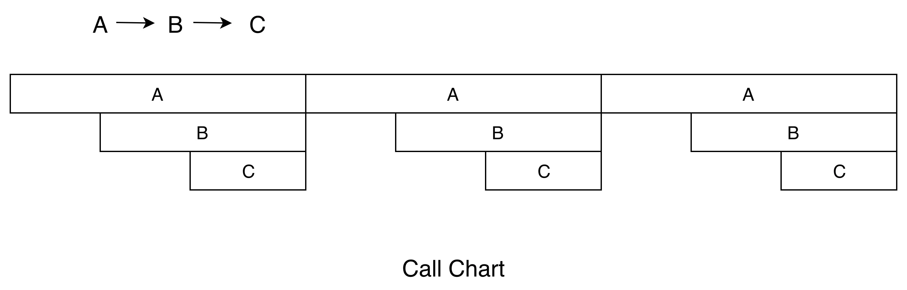
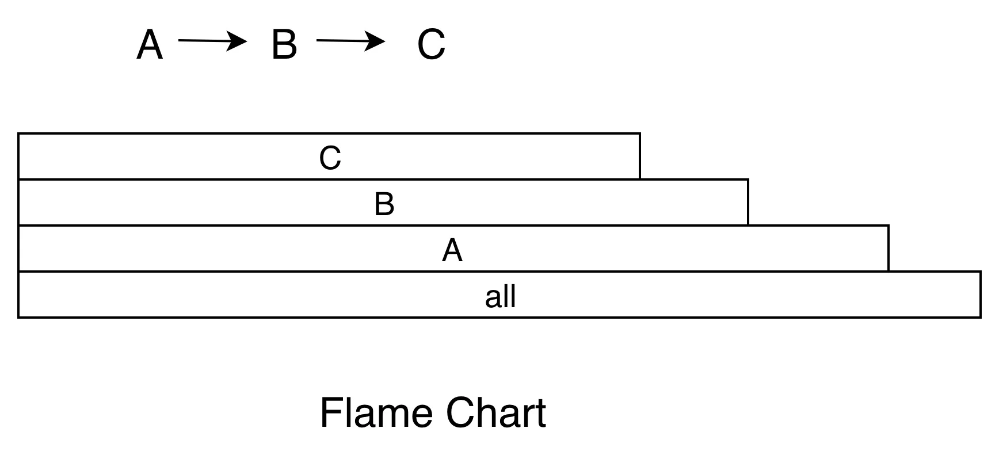
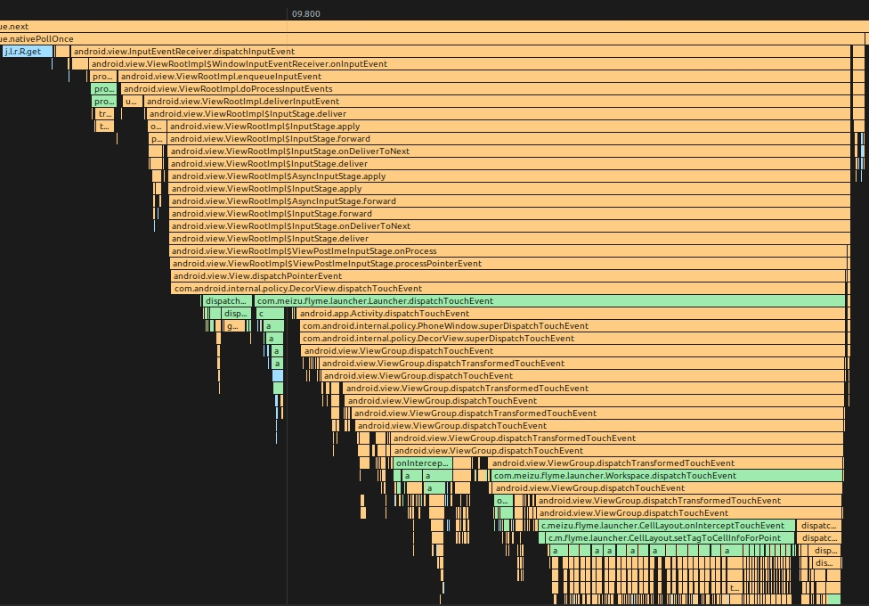

# Android 卡顿优化总结

## 1. 卡顿定义

**稳定帧率输出的画面出现一帧或者多帧没有绘制 。**

比如下图中，App 主线程有在正常绘制的时候（通常是做动画或者列表滑动），有一帧没有绘制，那么我们认为这一帧有可能会导致卡顿（这里说的是有可能，由于 Triple Buffer 的存在，这里也有可能不掉帧）


### 1. 1 系统上帧运行机制

以用户手指上下滑动应用界面的操作场景为例，**整个流程大致如下**：

1. 用户手指触摸屏幕后，屏幕驱动产生`Input`触控事件；框架`system_server`进程中的`EventHub`通过`epoll`机制监听到驱动产生的`Input`触控事件上报，由`InputReader`读取到`Input`事件后，唤醒`InputDispatcher`找到当前触控焦点应用窗口，并通过事先建立的`socket`通道发送`Input`事件到对应的应用进程；
2. 应用进程收到`Input`触控事件后`UI`线程被唤醒进行事件的分发，相关`View`控件中根据多个`ACTION_MOVE`类型的`Input`事件判断为用户手指滑动行为后，通过`Choreographer`向系统注册申请`app`类型的`Vsync`信号，并等待`Vsync`信号到来后触发绘制操作；
3. `app`类型的`Vsync`信号到来后，唤醒应用`UI`线程并向其消息队列中放入一个待执行的绘制任务，在`UI`线程中先后遍历执行`View`控件树的测量、布局和绘制（硬件加速默认开启的状态下会遍历并记录每个`View`的`draw`操作生成对应的绘制命令树）操作；
4. `View`控件树的绘制任务执行完成后会唤醒应用的`RenderThread`渲染线程执行界面渲染任务；整个渲染任务中会先同步`UI`线程中构建好的绘制命令树，然后通过`dequeueBuffer`申请一张处于`free`状态的可用`Buffer`，然后调用`SkiaOpenGLPipeline`渲染管道中使用`GPU`进行渲染操作，渲染完成后`swapBuffer`触发`queueBuffer`动作进行上帧；
5. 应用渲染线程最后的`queueBuffer`上帧动作，会唤醒对端`SurfaceFlinger`进程中的`Binder`处理线程，其中将对应用`BufferQuque`中的`Buffer`标记为`Queued`状态，然后注册申请`sf`类型的`Vsync`信号；
6. 待`sf`类型的`Vsync`信号到来后会唤醒`SurfaceFlinger`的主线程执行一帧的合成任务，其中会先通过`handlePageFlip`操作遍历所有的应用`Layer`找到有上帧操作的处于`Queued`状态的`Buffer`进行`AcquireBuffer`获取标记锁定，然后执行`persent`动作调用唤醒`HWC service`进程的工作线程执行具体的图层的合成送显操作；
7. `HWC service`中最终会收到`SurfaceFlinger`的请求后，进行图层合成操作，最终通过调用`libDrm`库相关接口`Commit`提交`Buffer`数据到Kernel内核中的屏幕驱动，并最终送到屏幕硬件上显示。

**上述过程用一张图描述如下：**


我们可以从三个方面定义卡顿：

1. 从现象上来说，在 `App` 连续的动画播放或者手指滑动列表时（关键是连续），如果连续 `2` 帧或者 `2` 帧以上，应用的画面都没有变化，那么我们认为这里发生了卡顿；
2. 从 `SurfaceFlinger` 的角度来说，在 `App` 连续的动画播放或者手指滑动列表时（关键是连续），如果有一个 `Vsync` 到来的时候 ，`App` 没有可以用来合成的 `Buffer`，那么这个 `Vsync` 周期 `SurfaceFlinger` 就不会走合成的逻辑（或者是去合成其他的 `Layer`），那么这一帧就会显示 `App` 的上一帧的画面，我们认为这里发生了卡顿；
3. 从 `App` 的角度来看，如果渲染线程在一个 `Vsync` 周期内没有 `queueBuffer` 到 `SurfaceFlinger` 中 `App` 对应的 `BufferQueue` 中，那么我们认为这里发生了卡顿。

!!! tips ""

​	关于卡顿的详细原理分析可以查看[原理篇](https://blog.adison.top/android/perf/jank/jank-principle/)	

### 1.2 卡顿与ANR的关系

产生卡顿的根本原因是UI线程不能够及时的进行渲染，导致UI的反馈不能按照用户的预期，连续、一致的呈现。产生卡顿的原因多种多样，很难一一列举，而ANR是Google人为规定的概念，产生ANR的原因最多也只有四个。分别是：

- Service Timeout:比如前台服务在20s内未执行完成，后台服务Timeout时间是前台服务的10倍，200s；
- BroadcastQueue Timeout：比如前台广播在10s内未执行完成，后台60s
- ContentProvider Timeout：内容提供者,在publish过超时10s;
- InputDispatching Timeout: 输入事件分发超时5s，包括按键和触摸事件。

而市面上的一些卡顿监控工具，经常被拿来监控ANR（卡顿阈值设置为5秒），这其实很不严谨：首先，5秒只是发生ANR的其中一种原因（Touch事件5秒未被及时消费）的阈值，而其他原因发生ANR的阈值并不是5秒；另外，就算是主线程卡顿了5秒，如果用户没有输入任何的Touch事件，同样是不会发生ANR的，更何况还有后台ANR等情况。

## 2. 卡顿分析

造成卡顿的原因可能有千百种，不过最终都会反映到 **CPU 时间**上。我们可以把 CPU 时间分为两种：用户时间和系统时间。用户时间就是执行用户态应用程序代码所消耗的时间；系统时间就是执行内核态系统调用所消耗的时间，包括 I/O、锁、中断以及其他系统调用的时间。

评价一个 CPU 的性能，需要看`主频`、`核心数`、`缓存`等参数，具体表现出来的是计算能力和指令执行能力，也就是每秒执行的浮点计算数和每秒执行的指令数。

我们可以通过下面的方法获得设备的 CPU 信息。

``` shell

// 获取 CPU 核心数
cat /sys/devices/system/cpu/possible  

// 获取某个 CPU 的频率
cat /sys/devices/system/cpu/cpu0/cpufreq/cpuinfo_max_freq
```

### 2.1 CPU使用率

我们可以通过`/proc/sta`t得到整个系统的 CPU 使用情况，通过`/proc/[pid]/stat`可以得到某个进程的 CPU 使用情况。

关于 stat 文件各个属性的含义和 CPU 使用率的计算，可以阅读	[《Linux 环境下进程的 CPU 占用率》]()和[Linux 文档](https://man7.org/linux/man-pages/man5/proc.5.html)。其中比较重要的字段有：

```shell
proc/self/stat:
  utime:       用户时间，反应用户代码执行的耗时  
  stime:       系统时间，反应系统调用执行的耗时
  majorFaults：需要硬盘拷贝的缺页次数
  minorFaults：无需硬盘拷贝的缺页次数
```

!!! warning ""
	**如果 CPU 使用率长期大于 60% ，表示系统处于繁忙状态，就需要进一步分析用户时间和系统时间的比例。对于普通应用程序，系统时间不会长期高于 30%，如果超过这个值，我们就应该进一步检查是 I/O 过多，还是其他的系统调用问题。**
	
Android 是站在 Linux 巨人的肩膀上，虽然做了不少修改也砍掉了一些工具，但还是保留了很多有用的工具可以协助我们更容易地排查问题，这里我给你介绍几个常用的命令。例如，[**`top 命令`**](https://blog.adison.top/android/perf/top/)可以帮助我们查看哪个进程是 CPU 的消耗大户；**`vmstat 命令`**可以实时动态监视操作系统的虚拟内存和 CPU 活动；**`strace 命令`**可以跟踪某个进程中所有的系统调用。


### 2.2 CPU 饱和度

CPU 饱和度反映的是线程排队等待 CPU 的情况，也就是 CPU 的 **负载情况**。

CPU 饱和度首先会跟应用的 **线程数**有关，如果启动的线程过多，容易导致系统不断地切换执行的线程，把大量的时间浪费在上下文切换，我们知道每一次 CPU 上下文切换都需要刷新寄存器和计数器，至少需要几十纳秒的时间。

我们可以通过使用`vmstat命令`或者`/proc/[pid]/schedstat文件`来查看 CPU 上下文切换次数，这里特别需要注意 **`nr_involuntary_switches`**被动切换的次数。

``` shell

proc/self/sched:
  nr_voluntary_switches：     
  主动上下文切换次数，因为线程无法获取所需资源导致上下文切换，最普遍的是IO。    
  nr_involuntary_switches：   
  被动上下文切换次数，线程被系统强制调度导致上下文切换，例如大量线程在抢占CPU。
  se.statistics.iowait_count：IO 等待的次数
  se.statistics.iowait_sum：  IO 等待的时间
```


此外也可以通过 `uptime` 命令可以检查 CPU 在 1 分钟、5 分钟和 15 分钟内的平均负载。比如一个 4 核的 CPU，如果当前平均负载是 8，这意味着每个 CPU 上有一个线程在运行，还有一个线程在等待。一般平均负载建议控制在 **0.7 × 核数** 以内。

```she

00:02:39 up 7 days, 46 min,  0 users,  
load average: 13.91, 14.70, 14.32
```

另外一个会影响 CPU 饱和度的是**线程优先级**，线程优先级会影响 Android 系统的调度策略，它主要由 `nice` 和 `cgroup` 类型共同决定。nice 值越低，抢占 CPU 时间片的能力越强。

!!! warning ""
	**当 CPU 空闲时，线程的优先级对执行效率的影响并不会特别明显，但在 CPU 繁忙的时候，线程调度会对执行效率有非常大的影响。**


!!! tips ""
	关于线程优先级，你需要注意 **是否存在高优先级的线程空等低优先级线程，例如主线程等待某个后台线程的锁**。从应用程序的角度来看，无论是用户时间、系统时间，还是等待 CPU 的调度，都是程序运行花费的时间。


### 2.3 排查工具

#### [systrace](http://source.android.com/devices/tech/debug/systrace?hl=zh-cn)

`systrace`是 Android 4.1 新增的性能分析工具。通常使用 `systrace` 跟踪系统的 **I/O 操作**、 **CPU 负载**、 **Surface 渲染**、 **GC 等事 件**。`systrace`利用了 Linux 的ftrace调试工具，相当于在系统各个关键位置都添加了一些性能探针，也就是在代码里加了一些性能监控的埋点。

Android 在 ftrace 的基础上封装了atrace，并增加了更多特有的探针，例如 `Graphics`、`Activity Manager`、`Dalvik VM`、`System Server`等。systrace 工具只能监控特定系统调用的耗时情况，所以它是属于 `sample`类型，而且性能开销非常低。

> 更多介绍见 [systrace 使用](https://blog.adison.top/android/perf/jank/jank-tool/)

#### [Perfetto](https://perfetto.dev/)

在Android 9.0（API级别28）或更高版本的设备上，可以使用 systrace 在设备上记录系统跟踪。Perfetto 工具是Android下一代全新的统一的 trace 收集和分析框架，可以抓取平台和app的 trace 信息，是用来取代 systrace 的，但 systrace 由于历史原因也还会一直存在，并且 Perfetto 抓取的 trace 文件也可以同样转换成 systrace 视图，如果习惯用 systrace 的，可以用 Perfetto UI 的 Open with legacy UI 转换成 systrace 视图来看

> 更多介绍 见 [Perfetto入门](https://www.jianshu.com/p/f4cf101cc64f)

#### [CPU profiler](https://developer.android.com/studio/profile/cpu-profiler?hl=zh-cn)

CPU profiler集成在Android studio 中，更方便开发者使用。可以在可视化界面选择不同配置来跟踪CPU，其中：

* **Sample Java Methods**  的功能类似于 [Traceview](https://developer.android.com/studio/profile/traceview?hl=zh-cn) 的 sample 类型。
* **Trace Java Methods** 的功能类似于  [Traceview](https://developer.android.com/studio/profile/traceview?hl=zh-cn) 的 instrument 类型。
* **Trace System Calls** 的功能类似于 systrace。
* **SampleNative (API Level 26+)** 的功能类似于 [Simpleperf](https://android.googlesource.com/platform/system/extras/+/master/simpleperf/doc/README.md)。


#### 2.4 分析结果展示方式

#### **Call Chart**

 Call Chart 是 Traceview 和 systrace 默认使用的展示方式。它按照应用程序的函数执行顺序来展示，适合用于分析整个流程的调用。举一个最简单的例子，A 函数调用 B 函数，B 函数调用 C 函数，循环三次，就得到了下面的 Call Chart。



!!!note ""
	Call Chart 就像给应用程序做一个心电图，我们可以看到在这一段时间内，各个线程的具体工作，比如是否存在线程间的锁、主线程是否存在长时间的 I/O 操作、是否存在空闲等。

#### **Flame Chart**

Flame Chart 也就是大名鼎鼎的火焰图。它跟 Call Chart 不同的是，Flame Chart 以一个全局的视野来看待一段时间的调用分布，它就像给应用程序拍 X 光片，可以很自然地把时间和空间两个维度上的信息融合在一张图上。上面函数调用的例子，换成火焰图的展示结果如下。

**当我们不想知道应用程序的整个调用流程，只想直观看出哪些代码路径花费的 CPU 时间较多时，火焰图就是一个非常好的选择**。

火焰图还可以使用在各种各样的维度，例如内存、I/O 的分析。**有些内存可能非常缓慢地泄漏，通过一个内存的火焰图，我们就知道哪些路径申请的内存最多**，有了火焰图我们根本不需要分析源代码，也不需要分析整个流程。

## 3. 优化思路

!!! note "锁等待"
	* 通过优化流程尽量的减少流程中不必要的持锁或减小持锁范围
	* 利用一些空间换时间的缓存方案或优化CPU、IO等资源的调度与分配，减少线程的持锁的时长

!!! note "应用UI线程耗时引起卡顿"
	应用`UI`线程耗时引起的卡顿往往涉及的因素比较多，下面列举一些常见原因：
	
	1. **`UI`线程消息队列中存在除`doFrame`绘制任务外的其它耗时任务**，导致`Vsync`信号到来后，无法及时触发`UI`线程执行`doFrame`绘制上帧任务，而导致掉帧。例如界面布局`XML`文件的`inflate`解析，如果界面布局文件比较复杂，就到有大量的`IO`与反射等耗时操作。又或者`UI`线程中有`decodeBitmap`解析大图片的耗时操作。
	2. **`UI`帧的`doFrame`绘制任务处理耗时过长导致掉帧**。最常见的问题就是应用界面布局存在过度绘制，导致`measure/layout/draw`任务的计算 复杂度成倍上升。再比如应用界面布局中的部分`View`控件层面如果关闭了硬件绘制加速，就会触发`View#buildDrawingCache`的耗时操作，从而导致整个`draw`动作耗时过长而引起掉帧。
	3. **`UI`线程存在大量的阻塞等待导致上帧超时**。`UI`线程陷入阻塞等待，常见的原因就是跨进程的`Binder`调用阻塞和进程内的同步锁竞争等待。还有一类情况就是频繁的`GC`内存回收引起(一般为进程内存抖动或内存泄露引起)。
	
	**优化思路**
	
	**针对应用`UI`线程耗时引起卡顿的问题，原则就是尽量减轻`UI`线程的负担**。针对不同的引起问题原因，常见的优化思路大致如下：
	
	1. **异步处理**：各种耗时操作尽量放到子线程异步处理。比如使用`View`的异步线程`inflate`方案；`decodeBitmap`加载图片的耗时操作移到子线程统一处理等。
	2. **逻辑优化**：必须要在主线程执行的逻辑应尽量优化，减少计算频次，避免重复计算。比如采用约束布局解决嵌套过多的问题，避免过度绘制；优化应用的内存占用，避免内存泄露、内存抖动等问题，从而减少`GC`触发的次数；优化内部代码逻辑，尽量减少主线程陷入同步锁竞争等待的状态；原则上不要主动去关闭硬件绘制加速。
	3. **流程复用**：能复用的逻辑尽量复用，以避免多次调用产生的性能开销。比如`ListView`的`Adapter`中实现`View`的复用，减少`View`的`inflate`执行次数。另外`UI`线程中`Binder`请求框架查询一些系统信息，能够一次查完就不要分多次执行。且查询结果应尽量缓存在内存中实现复用，避免多次反复的查询造成主线程频繁陷入`Binder`阻塞等待。

!!! note "磁盘I/O引起卡顿"
	**选择合适的文件读写操作**。对读写速度有较高的要求，并允许低概率的数据丢失问题，就采用系统默认的基于`Page Cache`的缓存`I/O`；对文件读写的速度要求不高，但是需要严格的保证数据不会丢失就使用`Direct I/O`；如果需要对同一块区域进行频繁读写的情况，对读写性能要求极高，可以采用`mmap` 内存映射机制实现读写文件，比如腾讯开源的用于改善原生`SharePreferences`机制性能的存储工具`MMKV`就是这个原理实现的。
	
	**`I/O` 方式的选择**。一个是对于阻塞`I/O`操作尽量放入子线程执行，以免阻塞`UI`线程；二是适当采用异步`I/O`减少读取文件的耗时，提升`CPU`整体利用率，比如`Okio`就支持异步`I/O`操作。
	
	优化数据结构，建立内存缓存，尽量减少不必要的`I/O`；

## 4. 卡顿监控

### 4.1 WatchDog

这种方案的 **本质是开启一个子线程不断轮询UI线程** ，这是最容易理解，最简单粗暴的方法。这种方法甚至具有一定的普适性，iOS或者其他的客户端系统，都可以用类似的思路来监控卡顿。具体的原理和实现方法很简单：**不断向UI线程发送Message，每隔一段时间检查一次刚刚发送的Message是否被处理，如果没有被处理，则说明这段时间主线程被卡住了**。

- **优点**：简单，稳定，结果论，可以监控到各种类型的卡顿

- **缺点**：轮询不优雅，不环保，有不确定性，随机漏报

  

轮询的时间间隔越小，对性能的负面影响就越大，而时间间隔选择的越大，漏报的可能性也就越大。因为 **UI线程要不断处理我们发送的Message，必然会影响性能和功耗** 。并且容易出现 **随机漏报** : 假设 WatchDog默认的轮询时间间隔为5秒，当主线程卡顿了2秒之后，WatchDog的那个子线程才开始往主线程发送消息，并且主线程在3秒之后不卡顿了，此时主线程已经卡顿了5秒了，子线程发送的那个消息也随之得到执行，它没意识到主线程刚刚发生了卡顿。

如果我们不断缩小轮询的时间间隔，用更短的轮询时间，连续几个周期消息都没被处理才视为一次卡顿。则更容易监控到卡顿，但对性能损耗大一些。即使是缩小轮询时间间隔，也不一定能监控到。只是降低了漏报的概率。

### 4.2 Looper Printer & Choreographer

**替换主线程Looper的Printer**，从而监控dispatchMessage的执行时间。

其原理也很容易理解，以下是Looper的部分关键代码，

```java
for (;;) {
    Message msg = queue.next(); // might block
    
    // This must be in a local variable, in case a UI event sets the logger
    final Printer logging = me.mLogging;
    if (logging != null) {
        logging.println(">>>>> Dispatching to " + msg.target + " " +
                msg.callback + ": " + msg.what);
    }

    msg.target.dispatchMessage(msg);

    if (logging != null) {
        logging.println("<<<<< Finished to " + msg.target + " " + msg.callback);
    }
}
```

无论是通过反射替换Looper的 *mLogging* 还是通过 *setMessageLogging* 设置printer，我们只需要替换主线程Looper的printer对象，通过计算执行dispatchMessage方法之后和之前打印字符串的时间的差值，就可以拿到到 *dispatchMessage* 方法执行的时间。而 **大部分的主线程的操作最终都会执行到这个*dispatchMessage*方法中** 。

另外利用系统 Choreographer 模块，向该模块注册一个 FrameCallback 监听对象，并在每次 Vsync 事件 doFrame 通知回来时，循环注册该监听对象，间接统计两次 Vsync 事件的时间间隔。这样可以很方便统计到帧率以及每帧的耗时。

结合`Choreographer`和`Looper Printer`，我们不仅可以统计到准确的帧率，同时也可以计算出主线程中各个函数执行耗时，这里可以参考 [matrix](https://github.com/Tencent/matrix)


#### 4.2.1 获取耗时堆栈

当超出阈值时，我们可以将该次获取的堆栈进行分析上报，从而来捕捉卡顿信息，否则丢弃此次记录的堆栈信息。但这种方法最大的不足在于，无法获取到各个函数的执行耗时，对于稍微复杂一点的堆栈，很难找出可能耗时的函数，也就很难找到卡顿的原因。另外，通过其他线程循环获取主线程的堆栈，如果稍微处理不及时，很容易导致获取的堆栈有所偏移，不够准确，加上没有耗时信息，卡顿也就不好定位。

所以我们希望寻求一种可以在线上准确地捕捉卡顿堆栈，又能计算出各个函数执行耗时的方案。而要计算函数的执行耗时，最关键的点在于如何对执行过程中的函数进行打点监控。

可以利用 Java 字节码修改工具（如 `BCEL`、`ASM`、`Javassis`等），在编译期间收集所有生成的 class 文件，扫描文件内的方法指令进行统一的打点插桩，同样也可以高效的记录函数执行过程中的信息。

##### 实现细节：

* 为了减少插桩量及性能损耗，通过遍历 class 方法指令集，判断扫描的函数是否只含有 PUT/READ FIELD 等简单的指令，来过滤一些默认或匿名构造函数，以及 get/set 等简单不耗时函数。

* 为了方便及高效记录函数执行过程，我们为每个插桩的函数分配一个独立 ID，在插桩过程中，记录插桩的函数签名及分配的 ID，在插桩完成后输出一份 mapping，作为数据上报后的解析支持。

* 编译期已经对全局的函数进行插桩，在运行期间每个函数的执行前后都会调用 MethodBeat.i/o 的方法，如果是在主线程中执行，则在函数的执行前后获取当前距离 MethodBeat 模块初始化的时间 offset（为了压缩数据，存进一个long类型变量中），并将当前执行的是 MethodBeat i或者o、mehtod id 及时间 offset，存放到一个 long 类型变量中，记录到一个预先初始化好的数组 long[] 中 index 的位置（预先分配记录数据的 buffer 长度为 100w，内存占用约 7.6M）。数据存储如下图：

  

#### 4.2.2  无法被监控到的卡顿

使用`Looper Printer`这种方式监控， **不会随机漏报，无需轮询，一劳永逸**，但是**某些类型的卡顿无法被监控到**，因为有些情况的卡顿，这种方案从原理上就无法监控到。看到上面的 *queue.next()*，这里给了注释：**might block** ，直接跟你说这里是可能会卡住的，Printer无法监控到next里面发生的卡顿， 这时候再计算 *dispatchMessage* 方法的耗时显然就没有意义了。

如果排除主线程空闲的情况，究竟会是什么原因会卡在 *MessageQueue* 的 *next* 方法中呢？下图是 *next* 方法简化过后的源码，

```java

for (;;) {
    if (nextPollTimeoutMillis != 0) {
        Binder.flushPendingCommands();
    }

    nativePollOnce(ptr, nextPollTimeoutMillis);

    //......

    // Run the idle handlers.
    // We only ever reach this code block during the first iteration.
    for (int i = 0; i < pendingIdleHandlerCount; i++) {
        final IdleHandler idler = mPendingIdleHandlers[i];
        mPendingIdleHandlers[i] = null; // release the reference to the handler

        boolean keep = false;
        try {
            keep = idler.queueIdle();
        } catch (Throwable t) {
            Log.wtf(TAG, "IdleHandler threw exception", t);
        }

        if (!keep) {
            synchronized (this) {
                mIdleHandlers.remove(idler);
            }
        }
    }
    //......
}
```

1. 主线程空闲时会阻塞next()，具体是阻塞在nativePollOnce()，这种情况下无需监控

2. IdleHandler的queueIdle()回调方法也无法监控到
3. Touch事件大部分是从nativePollOnce直接到了InputEventReceiver，然后到ViewRootImpl进行分发

4. 还有一类相对少见的问题是SyncBarrier（同步屏障）的泄漏同样无法被监控到

第一种情况我们不用管，接下来看一下后面3种情况下如何监控卡顿。


### 4.3 监控IdleHandler卡顿

***IdleHandler*** 的 *queueIdle()*回调方法会在主线程空闲的时候被调用。然而实际上，很多开发同学都先入为主的认为这个时候反正主线程空闲，做一些耗时操作也没所谓。**其实主线程MessageQueue的*queueIdle*默认当然也是执行在主线程中**，所以这里的耗时操作其实是很容易引起卡顿和ANR的。


IdleHandler任务最终会被存储到MessageQueue的`mIdleHandlers` （一个ArrayList）中，在主线程空闲时，也就是MessageQueue的next方法暂时没有message可以取出来用时，会从`mIdleHandlers` 中取出IdleHandler任务进行执行。那我们可以把这个`mIdleHandlers` 替换成自己的，重写add方法，添加进来的 `IdleHandler` 给它包装一下，包装的那个类在执行 `queueIdle` 时进行计时，这样添加进来的每个`IdleHandler`在执行的时候我们都能拿到其 `queueIdle` 的执行时间 。如果超时我们就进行记录或者上报。

```java

private static void detectIdleHandler() {
    try {
        MessageQueue mainQueue = Looper.getMainLooper().getQueue();
        Field field = MessageQueue.class.getDeclaredField("mIdleHandlers");
        field.setAccessible(true);
        MyArrayList<MessageQueue.IdleHandler> myIdleHandlerArrayList = new MyArrayList<>();
        field.set(mainQueue, myIdleHandlerArrayList);
    } catch (Throwable t) {
        t.printStackTrace();
    }
}

static class MyArrayList<T> extends ArrayList {
    Map<MessageQueue.IdleHandler, MyIdleHandler> map = new HashMap<>();

    @Override
    public boolean add(Object o) {
        if (o instanceof MessageQueue.IdleHandler) {
            MyIdleHandler myIdleHandler = new MyIdleHandler((MessageQueue.IdleHandler) o);
            map.put((MessageQueue.IdleHandler) o, myIdleHandler);
            return super.add(myIdleHandler);
        }
        return super.add(o);
    }

    @Override
    public boolean remove(@Nullable Object o) {
        if (o instanceof MyIdleHandler) {
            MessageQueue.IdleHandler idleHandler = ((MyIdleHandler) o).idleHandler;
            map.remove(idleHandler);
            return super.remove(o);
        } else {
            MyIdleHandler myIdleHandler = map.remove(o);
            if (myIdleHandler != null) {
                return super.remove(myIdleHandler);
            }
            return super.remove(o);
        }
    }
}
```


### 4.4 监控TouchEvent卡顿

从 Input 事件分发机制可知，大部分Touch的调用栈如下：

> 有些touch事件是需要批量处理(ViewRootImpl#ConsumeBatchedInputRunnable)，这时交给Choreographer#CALLBACK_INPUT处理， 详见 [Batched consumption](https://android.googlesource.com/platform/frameworks/base/+/master/core/jni/android_view_InputEventReceiver.md)




从堆栈可见， `InputManagerService` 通过 socket 将 touch 事件发往应用进程，应用进程收到后会唤醒主线程，然后执行 `InputEventReceiver#dispatchInputEvent()`，并不会继续执行 `MessageQueue#next`。原理参见 https://juejin.cn/post/7032166333500686344


InputReader（读取、拦截、转换输入事件）和InputDispatcher（分发事件）都是运行在`system_server`系统进程中，而我们的应用程序运行在自己的应用进程中，这里涉及到跨进程通信，这里的跨进程通信用的非binder方式，而是用的socket。


InputDispatcher会与我们的应用进程建立连接，它是socket的服务端；我们应用进程的native层会有一个socket的客户端，客户端收到消息后，会通知我们应用进程里ViewRootImpl创建的WindowInputEventReceiver（继承自InputEventReceiver）来接收这个输入事件。事件传递也就走通了，后面就是上层的View树事件分发了。

!!! question "这里为啥用socket而不用binder"

	Socket可以实现异步的通知，且只需要两个线程参与（Pipe两端各一个），假设系统有N个			应用程序，跟输入处理相关的线程数目是N+1（1是Input Dispatcher线程）。然而，如果		用Binder实现的话，为了实现异步接收，每个应用程序需要两个线程，一个Binder线程，一     个后台处理线程（不能在Binder线程里处理输入，因为这样太耗时，将会阻塞住发射端的调     用线程）。在发射端，同样需要两个线程，一个发送线程，一个接收线程来接收应用的完成通     知，所以，N个应用程序需要2（N+1）个线程。相比之下，Socket还是高效多了。

有了上面的知识铺垫，现在回到我们的主问题上来，如何监控TouchEvent卡顿。既然它们是用socket来进行通信的，那么我们可以通过PLT Hook，去Hook这对socket的发送（send）和接收(recv)方法，从而监控Touch事件。当调用到了recvfrom时（send和recv最终会调用`sendto`和`recvfrom`，这2个函数的具体定义在[socket.h源码](https://link.juejin.cn?target=https%3A%2F%2Fcs.android.com%2Fandroid%2Fplatform%2Fsuperproject%2F%2B%2Fmaster%3Abionic%2Flibc%2Finclude%2Fbits%2Ffortify%2Fsocket.h%3Bdrc%3Db0193ccac5b8399f9b5ef270d102b5a50f9446ab%3Bl%3D79)），说明我们的应用接收到了Touch事件，当调用到了sendto时，说明这个Touch事件已经被成功消费掉了，当两者的时间相差过大时即说明产生了一次Touch事件的卡顿。

.png)

### 4.4. 监控SyncBarrier泄漏

当我们每次通过invalidate来刷新UI时，最终都会调用到*ViewRootImpl*中的*scheduleTraversals*方法，会向主线程的Looper中post一个SyncBarrier，其目的是为了在刷新UI时，主线程的同步消息都被跳过，此时渲染UI的异步消息就可以得到优先处理。但是我们注意到这个方法是**线程不安全**的，如果在非主线程中调用到了这里，就有可能会同时post多个SyncBarrier，但只**能remove掉最后一个**，从而有一个SyncBarrier就永远无法被remove，就导致了主线程Looper无法处理同步消息（Message默认就是同步消息），导致卡死。当然，这种情况还是比较少见的。

```java

void scheduleTraversals() {
    if (!mTraversalScheduled) {
        mTraversalScheduled = true;
        mTraversalBarrier = mHandler.getLooper().getQueue().postSyncBarrier();
        mChoreographer.postCallback(
                Choreographer.CALLBACK_TRAVERSAL, mTraversalRunnable, null);
        notifyRendererOfFramePending();
        pokeDrawLockIfNeeded();
    }
}

void unscheduleTraversals() {
    if (mTraversalScheduled) {
        mTraversalScheduled = false;
        mHandler.getLooper().getQueue().removeSyncBarrier(mTraversalBarrier);
        mChoreographer.removeCallbacks(
                Choreographer.CALLBACK_TRAVERSAL, mTraversalRunnable, null);
    }
}
```

> 关于SyncBarrier具体原理参见[同步屏障](https://blog.adison.top/front-end/android/system/handler/#73)


有什么好办法能监控到这种情况吗（虽然这种情况比较少见）：

1. 开个子线程，轮询检查主线程的MessageQueue里面的message，检查是否有同步屏障消息的when已经过去了很久了，但还没得到移除
2. 此时可以合理怀疑该同步屏障消息可能已泄露，但还不能确定（有可能是主线程卡顿，导致没有及时移除）
3. 这个时候，往主线程发一个同步消息和一个异步消息（可以间隔地多发几次，增加可信度），如果同步消息没有得到执行，但异步消息得到执行了，这说明什么？说明主线程有处理消息的能力，不卡顿，且主线程的MessageQueue中有一个同步屏障一直没得到移除，所以同步消息才没得到执行，而异步消息得到执行了。
4. 此时，可以激进一点，**我们甚至可以反射调用*MessageQueue*的*removeSyncBarrier*方法，手动把这个SyncBarrier移除掉，从而从错误状态中恢复**。

核心源码如下：

```java
MessageQueue mainQueue = Looper.getMainLooper().getQueue();
Field field = mainQueue.getClass().getDeclaredField("mMessages");
field.setAccessible(true);
Message mMessage = (Message) field.get(mainQueue);  //通过反射得到当前正在等待执行的Message
if (mMessage != null) {
    currentMessageToString = mMessage.toString();
    long when = mMessage.getWhen() - SystemClock.uptimeMillis();
    if (when < -3000 && mMessage.getTarget() == null) { //target == null则为sync barrier
        int token = mMessage.arg1;
        startCheckLeaking(token);
    }
}

private static void startCheckLeaking(int token) {
    int checkCount = 0;
    barrierCount = 0;
    while (checkCount < CHECK_STRICTLY_MAX_COUNT) {
        checkCount++;
        int latestToken = getSyncBarrierToken();
        if (token != latestToken) {     //token变了，不是同一个barrier，return
            break;
        }
        if (DetectSyncBarrierOnce()) {
            //发生了sync barrier泄漏
            removeSyncBarrier(token);   //手动remove泄漏的sync barrier
            break;
        }
        try {
            Thread.sleep(1000);
        } catch (InterruptedException e) {
            e.printStackTrace();
        }
    }
}

private static void removeSyncBarrier(int token) {
    MessageQueue mainQueue = Looper.getMainLooper().getQueue();
    Method method = mainQueue.getClass().getDeclaredMethod("removeSyncBarrier", int.class);
    method.setAccessible(true);
    method.invoke(mainQueue, token);
}

private static boolean DetectSyncBarrierOnce() {
    Handler mainHandler = new Handler(Looper.getMainLooper()) {
        @Override
        public void handleMessage(Message msg) {
            super.handleMessage(msg);
            if (msg.arg1 == 0) {
                barrierCount ++;    //收到了异步消息，count++
            } else if (msg.arg1 == 1) {
                barrierCount = 0;   //收到了同步消息，说明同步屏障不在, count设置为0
            }
        }
    };

    Message asyncMessage = Message.obtain();
    asyncMessage.setAsynchronous(true);
    asyncMessage.setTarget(mainHandler);
    asyncMessage.arg1 = 0;

    Message syncNormalMessage = Message.obtain(); 
    syncNormalMessage.arg1 = 1;

    mainHandler.sendMessage(asyncMessage);      //发送一个异步消息
    mainHandler.sendMessage(syncNormalMessage); //发送一个同步消息

    if(barrierCount > 3){
        return true;
    }
    return false;
}
```

> 坏消息是，这种方案只能监控到问题的产生，也可以直接解决问题，但是无法溯源问题究竟是哪个View导致的。


## 5. 参考

[Android 高手课](https://time.geekbang.org/column/article/73277)

[Systrace 流畅性实战](https://androidperformance.com/2021/04/24/android-systrace-smooth-in-action-1/)

[Matrix TraceCanary -- 初恋·卡顿](https://cloud.tencent.com/developer/article/1382771)

[微信Android客户端的卡顿监控方案](https://cloud.tencent.com/developer/article/1846821)
