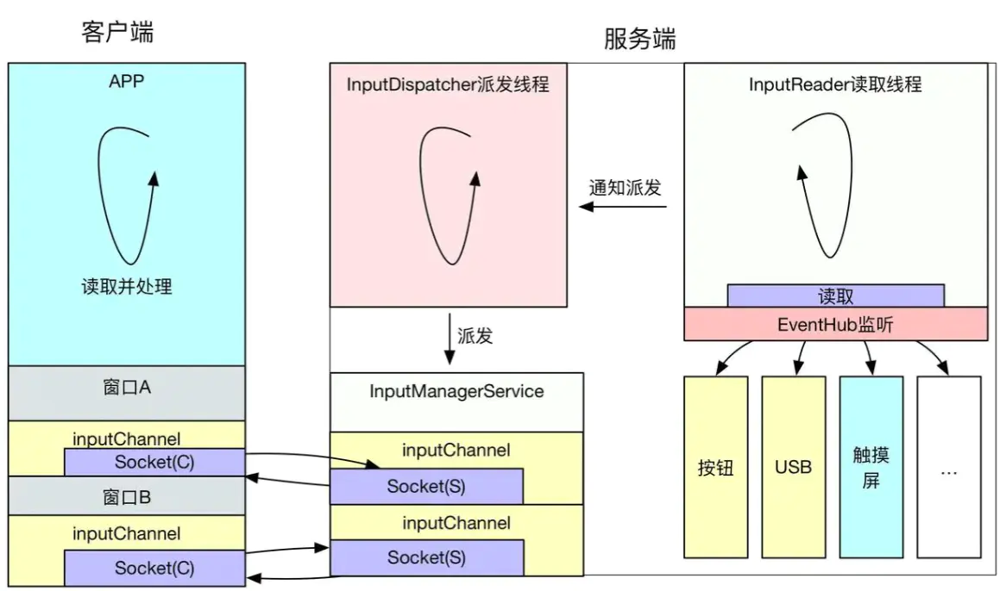

# Android卡顿掉帧问题分析之原理篇
 当用户抱怨手机在使用过程中存在卡顿问题的时候，会严重影响用户对手机品牌的好感和应用`APP`的体验，从而导致用户对手机品牌的忠诚度降低或应用`APP`的装机留存率下降。所以无论是手机设备厂商还是应用`APP`开发者，又或是`Android`系统的维护者`Google`都会对界面卡顿问题非常重视，会将界面的流畅度作为核心性能体验指标进行持续的优化。说到流畅度，本质上就是要解决用户操作手机过程中的界面丢帧问题，本来一秒钟屏幕上需要更新`60`帧画面，但是由于种种原因，这期间屏幕上只更新了`55`帧画面，这就是出现丢帧，在用户主观肉眼看来就是感知卡顿。那么当出现了丢帧卡顿的问题时，我们该如何着手去分析与优化解决呢？

在分析任何问题之前，我们都需要先弄清楚其基本原理，也就是要掌握了这个“道”，才能真正着手去分析问题，否者只能是弄得一头雾水，也没法真正的理解和解决问题。所以要想分析并解决界面掉帧卡顿问题，我们就先需要知道在`Android`系统上应用`UI`线程到底是如何完成一帧画面的上帧显示动作的（本文讲解的内容主要基于`Android`原生应用的绘制渲染流程，对于游戏应用和`Flutter`开发的应用流程会不太一样，由于篇幅所限，本文暂不涉及，可以关注团队后续其它文章的内容）。由于大部分应用界面的上帧更新画面动作都是由用户手指触摸屏幕而触发，所以本文以手指上下滑动应用界面的操作场景为例，结合`Systrace`分析一下`Android`应用上帧显示的原理。

## 1 Input事件处理机制

### 1.1 系统机制分析

`Android` 系统是由事件驱动的，而 `Input` 是最常见的事件之一，用户的点击、滑动、长按等操作，都属于 `Input` 事件驱动，其中的核心就是 `InputReader` 和 `InputDispatcher`。`InputReader` 和 `InputDispatcher` 是跑在 `system_server`进程中的两个 `Native`循环线程，负责读取和分发 `Input` 事件。整个处理过程大致流程如下：

1. 触摸屏会按照屏幕硬件的触控采样率周期，每隔几毫秒扫描一次，如果有触控事件就会上报到对应的设备驱动；系统封装了一个叫`EventHub`的对象，它利用`inotify`和`epoll`机制监听`/dev/input`目录下的`input`设备驱动节点，通过`EventHub`的`getEvents`接口就可以监听并获取到`Input`事件；
2. `InputReader`负责从`EventHub`里面把`Input`事件读取出来，然后交给 `InputDispatcher` 进行事件分发；
3. `InputDispatcher`在拿到 `InputReader`获取的事件之后，对事件进行包装后，寻找并分发到目标窗口;
4. `InboundQueue`队列（`“iq”`）中放着`InputDispatcher`从`InputReader`中拿到的`input`事件；
5. `OutboundQueue`（`“oq”`）队列里面放的是即将要被派发给各个目标窗口`App`的事件；
6. `WaitQueue`队列里面记录的是已经派发给 `App`（`“wq”`），但是 `App`还在处理没有返回处理成功的事件；
7. `PendingInputEventQueue`队列（“aq”）中记录的是应用需要处理的`Input`事件，这里可以看到`input`事件已经传递到了应用进程；
8. `deliverInputEvent` 标识 `App`  `UI Thread` 被 `Input` 事件唤醒；
9. `InputResponse` 标识 `Input` 事件区域，这里可以看到一个 `Input_Down` 事件 + 若干个 `Input_Move` 事件 + 一个 `Input_Up` 事件的处理阶段都被算到了这里；
10. `App` 响应处理`Input` 事件，内部会在其界面`View`树中逐层分发和处理。

用一张图描述整个过程大致如下（关于这部分详细的`Android`系统源码实现流程可以参考这篇文章[https://juejin.cn/post/6956500920108580878](https://links.jianshu.com/go?to=https%3A%2F%2Fjuejin.cn%2Fpost%2F6956500920108580878)）：




### 1.2 结合Systrace分析

从上面的系统机制的分析可以看出，整个`Input`触控事件的分发与处理主要涉及到两个进程：一个是`system_server`系统进程，另一个是当前焦点窗口所属的`Setting`应用进程。

一、**`system_server`进程的处理过程**：

1. 当用户手指在`Setting`应用界面滑动时，系统`system_server`进程中的`native`线程`InputReader`会从`EventHub`中读取其利用`linux`的`epoll`机制监听到的屏幕驱动上报的`Input`触控事件，然后唤醒另外一条native线程`InputDispatcher`负责进行事件的进一步分发处理。

2. `InputDispatcher`被唤醒后会先将事件放到`InboundQueue`队列（也就是`Systrace`上看到的“`iq”`队列）中，然后找到具体处理此`input`事件的应用目标窗口，并将`Input`事件放入对应的应用目标窗口的`OutboundQueue`队列（也就是`Systrace`上看到的`“oq”`队列）中，等待进一步通过`SocketPair`双工信道发送`input`事件到应用目标窗口中；

3. 最后当事件发送给具体的应用目标窗口后，会将事件移动到`WaitQueue`队列中（也就是`Systrace`上看到的`“wq”`队列）并一直等待收到到目标应用处理`Input`事件完成后的反馈后再从队列中移除，**如果5秒内没有收到目标应用窗口处理完成此次`Input`事件的反馈，就会报该应用ANR异常事件**。以上整个过程在`Android`系统`AOSP`源码中都加有相应的`Systrace tag`，如下`Systrace`截图所示：

   

   

   二、**应用进程的处理过程**：当`Input`触控事件通过`socket`传递到`Settings`应用进程这边后，会唤醒应用的`UI`线程在`ViewRootImpl#deliverInputEvent`的流程中进行`Input`事件的具体分发与处理。具体的处理流程：

   

4. 先交给之前在添加应用`PhoneWindow`窗口时的`ViewRootImpl#setView`流程中创建的多个不同类型的`InputUsage`中依次进行处理（比如对输入法处理逻辑的封装`ImeInputUsage`，某些`key`类型的`Input`事件会由它先交给输入法进程处理完后再交给应用窗口的`InputUsage`处理），**整个处理流程是按照责任链的设计模式进行**；

5. 最后会交给负责应用窗口`Input`事件分发处理的`ViewPostImeInputUsage`中具体处理，这里面会从`View`布局树的根节点`DecorView`开始遍历整个`View`树上的每一个子`View`或`ViewGroup`控件执行事件的分发、拦截、处理的逻辑；

6. 最后触控事件处理完成后会调用`finishInputEvent`结束应用对触控事件处理逻辑，**这里面会通过`JNI`调用到`native`层`InputConsumer`的`sendFinishedSignal`函数中通过socket消息通知系统框架中的`InputDispatcher`该`Input`事件处理完成**，触发从`"wq"`队列中及时移除待处理事件以免报`ANR`异常。

7. **一次滑动过程的触控交互的`InputResponse`区域中一般会包含一个`Input`的`ACTION_DOWN`事件+多个`ACTION_MOVE`事件+一个`ACTION_UP`事件**，`Settings`应用界面中的相关`View`控件在收到多个`ACTION_MOVE`触控事件后，经过判断为用户手指滑动行为，**一般会调用`View#invalidate`等相关接口触发`UI`线程的绘制上帧更新画面的操作**，具体流程后文会继续详细分析。以上过程如下`Systrace`截图所示：

   

   

## 2 应用UI线程消息循环机制

`App`应用启动时，在`Fork`创建进程后会通过反射创建代表应用主线程的`ActivityThread`对象并执行其`main`函数，进行`UI`主线程的初始化工作：


```java
/*frameworks/base/core/java/android/app/ActivityThread.java*/
public static void main(String[] args) {
     ...
     // 1.创建Looper、MessageQueue
     Looper.prepareMainLooper();
     ...
     // 2.启动loop消息循环，开始准备接收消息
     Looper.loop();
     ...
}

// 3.创建主线程Handler对象
final H mH = new H();

class H extends Handler {
  ...
}

/*frameworks/base/core/java/android/os/Looper.java*/
public static void prepareMainLooper() {
     // 准备主线程的Looper
     prepare(false);
     synchronized (Looper.class) {
          if (sMainLooper != null) {
              throw new IllegalStateException("The main Looper has already been prepared.");
          }
          sMainLooper = myLooper();
     }
}

private static void prepare(boolean quitAllowed) {
      if (sThreadLocal.get() != null) {
          throw new RuntimeException("Only one Looper may be created per thread");
      }
      // 创建主线程的Looper对象，并通过ThreadLocal机制实现与主线程的一对一绑定
      sThreadLocal.set(new Looper(quitAllowed));
}

private Looper(boolean quitAllowed) {
      // 创建MessageQueue消息队列
      mQueue = new MessageQueue(quitAllowed);
      mThread = Thread.currentThread();
}
```

主线程初始化完成后，**主线程就有了完整的 `Looper`、`MessageQueue`、`Handler`，此时 `ActivityThread` 的 `Handler` 就可以开始处理 `Message`，包括 `Application`、`Activity`、`ContentProvider`、`Service`、`Broadcast` 等组件的生命周期函数，都会以 `Message` 的形式，在主线程按照顺序处理**，这就是 `App` 主线程的初始化和运行原理，部分处理的 `Message` 如下：


```java
/*frameworks/base/core/java/android/app/ActivityThread.java*/
class H extends Handler {
        public static final int BIND_APPLICATION        = 110;
        @UnsupportedAppUsage
        public static final int RECEIVER                = 113;
        @UnsupportedAppUsage
        public static final int CREATE_SERVICE          = 114;
        @UnsupportedAppUsage
        public static final int BIND_SERVICE            = 121;
        
        public void handleMessage(Message msg) {
            switch (msg.what) {
                case BIND_APPLICATION:
                    Trace.traceBegin(Trace.TRACE_TAG_ACTIVITY_MANAGER, "bindApplication");
                    AppBindData data = (AppBindData)msg.obj;
                    handleBindApplication(data);
                    Trace.traceEnd(Trace.TRACE_TAG_ACTIVITY_MANAGER);
                    break;
                    ...
            }
         }
         ...
}
```

主线程初始化完成后，主线程就进入阻塞状态（进入`epoll_wait`状态，并释放`CPU`运行资源），等待 `Message`，一旦有 `Message` 发过来，主线程就会被唤醒，处理 `Message`，处理完成之后，如果没有其他的 `Message` 需要处理，那么主线程就会进入休眠阻塞状态继续等待。**可以说`Android`系统的运行是受消息机制驱动的**，而整个消息机制是由上面所说的四个关键角色相互配合实现的（**`Handler`**、**`Looper`**、**`MessageQueue`**、**`Message`**），其运行原理如下图所示：


## 3 Android屏幕刷新机制

### 3.1 双缓存+Vsync

在一个典型的显示系统中，一般包括`CPU`、`GPU`、`Display`三个部分：**`CPU`负责计算帧数据，把计算好的数据交给`GPU`，`GPU`会对图形数据进行渲染，渲染好后放到`buffer`(图像缓冲区)里存起来，然后`Display`（屏幕或显示器）负责把`Buffer`里的数据呈现到屏幕上**。屏幕上显示的内容，是从`Buffer`图像帧缓冲区中读取的，大致读取过程为：从`Buffer`的起始地址开始，从上往下，从左往右扫描整个`Buffer`，将内容映射到显示屏上。如下图所示：


当然，屏幕上显示的内容需要不断的更新，如果在同一个`Buffer`进行读取和写入操作，将会导致屏幕显示多帧内容而出现显示错乱。所以硬件层除了提供一个`Buffer`用于屏幕显示，还会提供了一个`Buffer`用于后台的`CPU/GPU`图形绘制与合成，也就是我们常说的**双缓冲**：让绘制和显示器拥有各自的`Buffer：CPU/GPU` 始终将完成的一帧图像数据写入到 后缓存区（`Back Buffer`），而显示器使用前缓存区（ `Front Buffer`），当屏幕刷新时，`Front Buffer` 并不会发生变化，当`Back Buffer`准备就绪后，它们才进行交换。如下图所示：


 理想情况下假设前一帧显示完成，后一帧数据就准备好了，屏幕开始读取下一帧内容进行显示，也就是开始读取上图中的后缓冲区的内容：


 此时，前后缓冲区进行一次角色交换，之前的后缓冲区变为前缓冲区，进行图形的显示，之前的前缓冲区则变为后缓冲区，进行图形的绘制合成。然而，理想很丰满，现实很骨感，上面假设“当前一帧显示完毕，后一帧准备好了”的情况，在现实中这两个事件并非同时完成。那么，屏幕读取缓冲区的速度和系统绘制合成帧的速度之间有什么关系呢，带着这个疑惑我们看看下面两个基本概念：


1. **屏幕刷新率（`Screen Refresh Rate`）**: 屏幕刷新率是一个硬件的概念，单位是`Hz`（赫兹），是说屏幕这个硬件刷新画面的频率：举例来说，`60Hz` 刷新率意思是：这个屏幕在 1 秒内，会刷新显示内容60 次；那么对应的，`90Hz` 是说在 1 秒内刷新显示内容 90 次。
2. **帧率（`Frame Rate`）**: 与屏幕刷新率对应的，帧率是一个软件的概念，单位是`FPS`（`Frame Per Second` ），表示 **`CPU/GPU` 在一秒内绘制合成产生的帧数**，意思是每秒产生画面的个数，`FPS` 的值是由软件系统决定的。举例来说，`60FPS` 指的是每秒产生 60 个画面；`90FPS` 指的是每秒产生 90 个画面。

我们用以下两个假设来分析两者的关系：

1. 屏幕刷新率比系统帧率快：
    此时，在前缓冲区内容全部映射到屏幕上之后，后缓冲区尚未准备好下一帧，屏幕将无法读取下一帧，所以只能继续显示当前一帧的图形，造成一帧显示多次，也就是**卡顿**。

2. 系统帧率比屏幕刷新率快：

   此时，屏幕未完全把前缓冲区的一帧映射到屏幕，而系统已经在后缓冲区准备好了下一帧，并要求读取下一帧到屏幕，将会导致屏幕上半部分是上一帧的图形，而下半部分是下一帧的图形，造成屏幕上显示多帧，也就是

   屏幕撕裂

   现象，如下图所示：

   


所以上面两种情况，都会导致问题，根本原因就是两个缓冲区的操作速率不一致。解决办法就是：**让屏幕控制前后缓冲区的切换时机，让系统帧速率配合屏幕刷新率的节奏**。那么屏幕是如何控制这个节奏的呢？

答案就是**垂直同步（VSync）：**当屏幕从缓冲区扫描完一帧到屏幕上之后，开始扫描下一帧之前，中间会有一个时间间隙，称为`Vetrical Blanking Interval (VBI)`，这个时间点其实就是进行前后缓存区交换的最佳时机，此时屏幕并没有在刷新，也就避免了屏幕撕裂现象的产生，所以在此时发出的一个同步`Vsync`信号，该信号用来切换前缓冲区和后缓冲区(本质就是内存地址的交换，瞬间即可完成)，即可达到最佳效果。

通过上面的分析可以看出：**屏幕的显示节奏是由屏幕刷新率的硬件参数决定且固定的，软件操作系统需要配合屏幕的显示，在固定的时间内准备好下一帧，以供屏幕进行显示，两者通过`VSync`信号来实现同步**（`VSync`这个概念并不是`Google`首创的，它在早年的`PC`机领域就已经出现了）。

### 3.2 Drawing with Vsync

在`Android 4.1`之前，屏幕刷新也遵循上面介绍的 **双缓存+`VSync`** 机制，整个流程与架构借用`2012`年`Google I/O`大会上展示的一张图如下所示：


 上图中：
 一、纵轴表示`Buffer`的使用者，由如下三个角色构成：


1. **`CPU`** : 代表利用`CPU`对界面`View`的`Measure`尺寸测量、`Layout`位置布局、`Draw`绘制并最终生成纹理的操作；
2. **`GPU`**：代表使用`OpenGl`库指令操作`GPU`硬件对`CPU`生成的纹理数据进行渲染和栅格化以及合成等操作；
3. **`Display`**：代表底层的显示屏幕；

二、横轴表示时间，每个长方形表示`Buffer`的使用，长方形的宽度代表使用时长，`VSync`代表垂直同步信号。

我们以时间为顺序来看看这种设计存在的潜在缺陷：

1. `Display`上显示第`0`帧数据，此时`CPU`和`GPU`正在处理准备第`1`帧的画面，且在`Display`显示下一帧前完成；
2. 因为`CPU`和`GPU`的处理及时，`Display`在第`0`帧显示完成后，也就是第`1`个`VSync`后，缓存进行交换，然后正常显示第`1`帧；
3. 接着第`2`帧开始处理，但是`CPU`并没有立刻开始准备第`2`帧的数据，而是直到第`2`个`VSync`快来前才开始处理的；
4. 第`2`个`VSync`来时，由于第`2`帧数据还没有准备就绪，缓存没有交换，屏幕显示的还是第`1`帧画面，即产生了丢帧卡顿问题；
5. 当第`2`帧数据准备完成后，它并不能立马被显示，而是要等到下一个`VSync` 带来后，进行前后缓存交换才能显示到屏幕上。

出现此掉帧卡顿问题的根本原因是：**上层的`CPU`和`GPU`并不知道`Vsync`信号的到来，所以在底层屏幕的`Vsync`信号发出后并没有及时收到并开始下一帧画面的操作处理**。根据前面的分析我们知道：双缓存的交换是在`Vsyn`信号到来时进行，交换后屏幕会读取`Front Buffer`内的新数据更新显示到屏幕上，而此时的`Back Buffer` 就可以供`GPU`准备下一帧数据了。如果 `Vsyn`到来时  `CPU/GPU`就开始操作的话，是有完整的`Vsync`周期时长来处理一帧数据，以避免卡顿的出现。那如何让 `CPU/GPU`的处理在 `Vsyn`信号到来时就开始进行呢？

为了优化系统显示性能，`Google`在`Android 4.1`系统中对`Android Display`系统进行了重构，引入了`Project Butter`（黄油计划），其中很重要的一点修改就是实现了：**在系统收到`VSync`信号后，上层`CPU`和`GPU`马上开始进行下一帧画面数据的处理，完成后及时将数据写入到`Buffer`中，`Google`称之为`Drawing with Vsync`**。如下图所示：


### 3.3 Choreographer

上一节中讲到的，为了优化显示系统性能，`Google`在`Android 4.1`系统中对`Android Display`系统进行了重构，引入了`Project Butter`（黄油计划），其中很重要的一点修改就是实现了：**在系统收到`VSync`信号后，上层`CPU`和`GPU`马上开始进行下一帧画面数据的处理，完成后及时将数据写入到`Buffer`中**。为了实现这个效果，控制上层`CPU`和`GPU`在收到`Vsync`信号后马上开始一帧数据的处理，谷歌为此专门设计了一个名为`Choreographer`（中文翻译为“编舞者”）的类，来控制上层绘制的节奏。

`Choreographer` 的引入，主要是为了配合系统`Vsync`垂直同步机制，给上层 App 的渲染提供一个稳定的 `Message` 处理的时机，也就是 `Vsync` 到来的时候 ，系统通过对 `Vsync` 信号周期的调整，来控制每一帧绘制操作的时机。**`Choreographer` 扮演 Android 渲染链路中承上启下的角色**：

1. **承上**：负责接收和处理 `App` 的各种更新消息和回调，等到 `Vsync` 到来的时候统一处理。比如集中处理 `Input`(主要是 `Input` 事件的处理) 、`Animation`(动画相关)、`Traversal`(包括 `measure、layout、draw` 等操作) ，判断卡顿掉帧情况，记录 `CallBack` 耗时等；
2. **启下**：负责请求和接收 `Vsync` 信号。接收 `Vsync` 信号到来的事件后回调(通过 `FrameDisplayEventReceiver`.`onVsync` )，并请求 `Vsync`(`FrameDisplayEventReceiver`.`scheduleVsync`) 。

**一般应用`App`有界面`UI`的变化时，最终都会调用走到`ViewRootImpl#scheduleTraversals()`方法中**，该方法中会往`Choreographer`中放入一个`CALLBACK_TRAVERSAL`类型的绘制任务，如下代码所示：


```java
/*frameworks/base/core/java/android/view/ViewRootImpl.java*/
@UnsupportedAppUsage
void scheduleTraversals() {
    if (!mTraversalScheduled) {
         ...
         // 通过Choreographer往主线程消息队列添加CALLBACK_TRAVERSAL绘制类型的待执行消息，用于触发后续UI线程真正实现绘制动作
         mChoreographer.postCallback(
                    Choreographer.CALLBACK_TRAVERSAL, mTraversalRunnable, null);
         ...
     }
}
```

`Choreographer`在收到的绘制任务后，其内部的工作流程如下图所示：


**从以上流程图可以看出上层一般`App`应用`UI`中`View`的绘制流程（包含SurfaceView的游戏应用的绘制流程会有一些差异，篇幅有限此处不再展开分析）**：


1. `View#invalidate`触发更新视图请求，此动作会调用`ViewRootImpl#scheduleTraversals`函数；
2. `ViewRootImpl#scheduleTraversals`中会向`Choreographer`中`postCallback`放入一个`CALLBACK_TRAVERSAL`类型绘制待执行任务；
3. `Choreographer`通过`DisplayEventReceiver`向系统`SurfaceFlinger`注册下一个`VSync`信号;
4. 当底层产生下一个`VSync`消息时，将该信号发送给`DisplayEventReceiver`，最后传递给`Choreographer`；
5. `Choreographer`收到`VSync`信号之后，向主线程`MessageQueue`发送了一个异步消息；
6. 最后，异步消息的执行者是跑在主线程中的`ViewRootImpl#doTraversal`，也就是真正开始绘制一帧的操作（包含`measure、layout、draw`三个过程）；

至此，底层的`VSync`控制上层绘制的逻辑就解释完了。

## 4 UI 线程绘制流程

在前几节中分析了应用`UI`线程的消息循环机制和`Android`屏幕刷新机制之后，我们接着`1`小节中关于`Input`触控事件的处理流程继续往下分析。在`1`小节的分析中我们了解到：用户手指在应用界面上下滑动时，应用的`UI`线程中会收到`system_server`系统进程发送来的一系列`Input`事件（包含一个`ACTION_DOWN`、多个`ACTION_MOVE`和一个`ACTION_UP`事件），应用界面布局中的相关`View`控件在收到多个`ACTION_MOVE`触控事件后，判断为用户手指的滑动行为后，一般会调用`View#invalidate`等接口触发`UI`线程的绘制上帧更新画面的操作。

在开始分析之前，我们先来看看`Android`系统的`GUI`显示系统在`APP`应用进程侧的核心架构，其整体架构如下图所示：


- `Window`是一个抽象类，**通过控制`DecorView`提供了一些标准的UI方案，比如`背景、标题、虚拟按键等`**，而`PhoneWindow`是`Window`的唯一实现类，在`Activity`创建后的attach流程中创建，应用启动显示的内容装载到其内部的`mDecor`（`DecorView`）；
- `DecorView`是整个界面布局View控件树的根节点，通过它可以遍历访问到整个`View`控件树上的任意节点；
- `WindowManager`是一个接口，继承自`ViewManager`接口，提供了`View`的基本操作方法；`WindowManagerImp`实现了`WindowManager`接口，内部通过`组合`方式持有`WindowManagerGlobal`，用来操作`View`；**`WindowManagerGlobal`是一个全局单例，内部通过`ViewRootImpl`将`View`添加至窗口中**；
- **`ViewRootImpl`是所有`View`的`Parent`，用来总体管理`View`的绘制以及与系统`WMS`窗口管理服务的`IPC`交互从而实现窗口的开辟**；`ViewRootImpl`是应用进程运转的发动机，可以看到`ViewRootImpl`内部包含`mView`（就是`DecorView`）、`mSurface`、`Choregrapher`：`mView`代表整个控件树，`mSurfacce`代表画布，应用的UI渲染会直接放到`mSurface`中，`Choregorapher`使得应用请求`vsync`信号，接收信号后开始绘制流程。

我们从`ViewRootImpl`的`invalidate`流程继续往下分析：


```java
/*frameworks/base/core/java/android/view/ViewRootImpl.java*/
@UnsupportedAppUsage
void invalidate() {
    mDirty.set(0,0,mWidth,mHeight);
    if (!mWillDrawSoon) {
         // 调用scheduleTraversals函数触发绘制操作
         scheduleTraversals();
     }
}

@UnsupportedAppUsage
void scheduleTraversals() {
    if (!mTraversalScheduled) {
         ...
         // 通过Choreographer往主线程消息队列添加CALLBACK_TRAVERSAL绘制类型的待执行消息，用于触发后续UI线程真正实现绘制动作
         mChoreographer.postCallback(
                    Choreographer.CALLBACK_TRAVERSAL, mTraversalRunnable, null);
         ...
     }
}
```

从以上分析可以看出，应用UI线程的绘制最终是通过往`Choreographer`中放入一个`CALLBACK_TRAVERSAL`类型的绘制任务而触发，下面的流程就和`3.3.3`小节中的分析的一致，`Choreographer`会先向系统申请`Vsync`信号，待`Vsync`信号到来后，向应用主线程`MessageQueue`发送一个异步消息，触发在主线程中执行`ViewRootImpl#doTraversal`绘制任务动作。我们接着看看`ViewRootImpl`的`doTraversal`函数执行绘制流程的简化代码流程：


```java
/*frameworks/base/core/java/android/view/ViewRootImpl.java*/
void doTraversal() {
     if (mTraversalScheduled) {
         mTraversalScheduled = false;
         // 调用removeSyncBarrier及时移除主线程MessageQueue中的Barrier同步栏删，以避免主线程发生“假死”
         mHandler.getLooper().getQueue().removeSyncBarrier(mTraversalBarrier);
         ...
         // 执行具体的绘制任务
         performTraversals();
         ...
    }
}

private void performTraversals() {
     ...
     // 1.从DecorView根节点出发，遍历整个View控件树，完成整个View控件树的measure测量操作
     windowSizeMayChange |= measureHierarchy(...);
     ...
     if (mFirst...) {
    // 2.第一次执行traversals绘制任务时，Binder调用访问系统窗口管理服务WMS的relayoutWindow接口，实现WMS计算应用窗口尺寸并向系统surfaceflinger正式申请Surface“画布”操作
         relayoutResult = relayoutWindow(params, viewVisibility, insetsPending);
     }
     ...
     // 3.从DecorView根节点出发，遍历整个View控件树，完成整个View控件树的layout测量操作
     performLayout(lp, mWidth, mHeight);
     ...
     // 4.从DecorView根节点出发，遍历整个View控件树，完成整个View控件树的draw测量操作
     performDraw();
     ...
}

private void performMeasure(int childWidthMeasureSpec, int childHeightMeasureSpec) {
        ...
        // 原生标识View树的measure测量过程的trace tag
        Trace.traceBegin(Trace.TRACE_TAG_VIEW, "measure");
        try {
            // 从mView指向的View控件树的根节点DecorView出发，遍历访问整个View树，并完成整个布局View树的测量工作
            mView.measure(childWidthMeasureSpec, childHeightMeasureSpec);
        } finally {
            Trace.traceEnd(Trace.TRACE_TAG_VIEW);
        }
}

private void performDraw() {
     ...
     boolean canUseAsync = draw(fullRedrawNeeded);
     ...
}

private boolean draw(boolean fullRedrawNeeded) {
    ...
    if (mAttachInfo.mThreadedRenderer != null && mAttachInfo.mThreadedRenderer.isEnabled()) {
        ...
        // 如果开启并支持硬件绘制加速，则走硬件绘制的流程（从Android 4.+开始，默认情况下都是支持跟开启了硬件加速的）
        mAttachInfo.mThreadedRenderer.draw(mView, mAttachInfo, this);
    } else {
        // 否则走drawSoftware软件绘制的流程
        if (!drawSoftware(surface, mAttachInfo, xOffset, yOffset,
                        scalingRequired, dirty, surfaceInsets)) {
                    return false;
         }
    }
}
```

从上面的代码流程可以看出，**`ViewRootImpl`中负责的整个应用界面绘制的主要流程如下**：

1. 从界面View控件树的根节点`DecorView`出发，递归遍历整个`View`控件树，完成对整个**`View`控件树的`measure`测量操作**，由于篇幅所限，本文就不展开分析这块的详细流程；
2. 界面第一次执行绘制任务时，会通过`Binder` `IPC`访问系统窗口管理服务WMS的relayout接口，实现窗口尺寸的计算并向系统申请用于本地绘制渲染的`Surface`“画布”的操作（具体由`SurfaceFlinger`负责创建应用界面对应的`Layer`对象，并通过内存共享的方式通过`Binder`将地址引用透过WMS回传给应用进程这边）；
3. 从界面View控件树的根节点`DecorView`出发，递归遍历整个`View`控件树，完成对整个**`View`控件树的`layout`布局操作**；
4. 从界面View控件树的根节点`DecorView`出发，递归遍历整个`View`控件树，完成对整个**`View`控件树的`draw`绘制操作**，如果开启并支持硬件绘制加速（从Android 4.X开始谷歌已经默认开启硬件加速），则走`GPU`硬件绘制的流程，否则走`CPU`软件绘制的流程；

以上绘制过程从`systrace`上看如下图所示：


## 5 RenderThread 线程渲染流程

截止到目前，在`ViewRootImpl`中完成了对界面的`measure`、`layout`和`draw`等绘制流程后，用户依然还是看不到屏幕上显示的应用界面内容，因为整个`Android`系统的显示流程除了前面讲到的UI线程的绘制外，界面还需要经过`RenderThread`线程的渲染处理，渲染完成后，还需要通过`Binder`调用“上帧”交给`surfaceflinger`进程中进行合成后送显才能最终显示到屏幕上。本小节中，我们将接上一节中`ViewRootImpl`中最后draw的流程继续往下分析开启硬件加速情况下，`RenderThread`渲染线程的工作流程。由于目前Android 4.X之后系统默认界面是开启硬件加速的，所以本文我们重点分析硬件加速条件下的界面渲染流程，我们先分析一下简化的代码流程：


```java
/*frameworks/base/core/java/android/view/ViewRootImpl.java*/
private boolean draw(boolean fullRedrawNeeded) {
    ...
    if (mAttachInfo.mThreadedRenderer != null && mAttachInfo.mThreadedRenderer.isEnabled()) {
        ...
        // 硬件加速条件下的界面渲染流程
        mAttachInfo.mThreadedRenderer.draw(mView, mAttachInfo, this);
    } else {
        ...
    }
}

/*frameworks/base/core/java/android/view/ThreadedRenderer.java*/
void draw(View view, AttachInfo attachInfo, DrawCallbacks callbacks) {
    ...
    // 1.从DecorView根节点出发，递归遍历View控件树，记录每个View节点的绘制操作命令，完成绘制操作命令树的构建
    updateRootDisplayList(view, callbacks);
    ...
    // 2.JNI调用同步Java层构建的绘制命令树到Native层的RenderThread渲染线程，并唤醒渲染线程利用OpenGL执行渲染任务；
    int syncResult = syncAndDrawFrame(choreographer.mFrameInfo);
    ...
}
```

从上面的代码可以看出，**硬件加速绘制主要包括两个阶段**：

1. 从`DecorView`根节点出发，递归遍历`View`控件树，记录每个`View`节点的`drawOp`绘制操作命令，完成绘制操作命令树的构建；
2. `JNI`调用同步`Java`层构建的绘制命令树到`Native`层的`RenderThread`渲染线程，并唤醒渲染线程利用`OpenGL`执行渲染任务；

### 5.1 构建绘制命令树

我们先来看看第一阶段构建绘制命令树的代码简化流程：


```java
/*frameworks/base/core/java/android/view/ThreadedRenderer.java*/
private void updateRootDisplayList(View view, DrawCallbacks callbacks) {
        // 原生标记构建View绘制操作命令树过程的systrace tag
        Trace.traceBegin(Trace.TRACE_TAG_VIEW, "Record View#draw()");
        // 递归子View的updateDisplayListIfDirty实现构建DisplayListOp
        updateViewTreeDisplayList(view);
        ...
        if (mRootNodeNeedsUpdate || !mRootNode.hasDisplayList()) {
            // 获取根View的SkiaRecordingCanvas
            RecordingCanvas canvas = mRootNode.beginRecording(mSurfaceWidth, mSurfaceHeight);
            try {
                ...
                // 利用canvas缓存DisplayListOp绘制命令
                canvas.drawRenderNode(view.updateDisplayListIfDirty());
                ...
            } finally {
                // 将所有DisplayListOp绘制命令填充到RootRenderNode中
                mRootNode.endRecording();
            }
        }
        Trace.traceEnd(Trace.TRACE_TAG_VIEW);
}

private void updateViewTreeDisplayList(View view) {
        ...
        // 从DecorView根节点出发，开始递归调用每个View树节点的updateDisplayListIfDirty函数
        view.updateDisplayListIfDirty();
        ...
}

/*frameworks/base/core/java/android/view/View.java*/
public RenderNode updateDisplayListIfDirty() {
     ...
     // 1.利用`View`对象构造时创建的`RenderNode`获取一个`SkiaRecordingCanvas`“画布”；
     final RecordingCanvas canvas = renderNode.beginRecording(width, height);
     try {
         ...
         if ((mPrivateFlags & PFLAG_SKIP_DRAW) == PFLAG_SKIP_DRAW) {
              // 如果仅仅是ViewGroup，并且自身不用绘制，直接递归子View
              dispatchDraw(canvas);
              ...
         } else {
              // 2.利用SkiaRecordingCanvas，在每个子View控件的onDraw绘制函数中调用drawLine、drawRect等绘制操作时，创建对应的DisplayListOp绘制命令，并缓存记录到其内部的SkiaDisplayList持有的DisplayListData中；
              draw(canvas);
         }
     } finally {
         // 3.将包含有`DisplayListOp`绘制命令缓存的`SkiaDisplayList`对象设置填充到`RenderNode`中；
         renderNode.endRecording();
         ...
     }
     ...
}

public void draw(Canvas canvas) {
    ...
    // draw the content(View自己实现的onDraw绘制，由应用开发者自己实现)
    onDraw(canvas);
    ...
    // draw the children
    dispatchDraw(canvas);
    ...
}

/*frameworks/base/graphics/java/android/graphics/RenderNode.java*/
public void endRecording() {
        ...
        // 从SkiaRecordingCanvas中获取SkiaDisplayList对象
        long displayList = canvas.finishRecording();
        // 将SkiaDisplayList对象填充到RenderNode中
        nSetDisplayList(mNativeRenderNode, displayList);
        canvas.recycle();
}
```

从以上代码可以看出，**构建绘制命令树的过程是从`View`控件树的根节点`DecorView`触发，递归调用每个子`View`节点的`updateDisplayListIfDirty`函数，最终完成绘制树的创建，简述流程如下**：

1. 利用`View`对象构造时创建的`RenderNode`获取一个`SkiaRecordingCanvas`“画布”；
2. 利用`SkiaRecordingCanvas`，**在每个子`View`控件的`onDraw`绘制函数中调用`drawLine`、`drawRect`等绘制操作时，创建对应的`DisplayListOp`绘制命令，并缓存记录到其内部的`SkiaDisplayList`持有的`DisplayListData`中**；
3. 将包含有`DisplayListOp`绘制命令缓存的`SkiaDisplayList`对象设置填充到`RenderNode`中；
4. 最后将根`View`的缓存`DisplayListOp`设置到`RootRenderNode`中，完成构建。

以上整个构建绘制命令树的过程可以用如下流程图表示：


 硬件加速下的整个界面的`View`树的结构如下图所示：


 最后从`Systrace`上看这个过程如下图所示：


### 5.2 执行渲染绘制任务

经过上一小节中的分析，应用在`UI`线程中从根节点`DecorView`出发，递归遍历每个子`View`节点，搜集其`drawXXX`绘制动作并转换成`DisplayListOp`命令，将其记录到`DisplayListData`并填充到`RenderNode`中，最终完成整个`View`绘制命令树的构建。从此UI线程的绘制任务就完成了。下一步`UI`线程将唤醒`RenderThread`渲染线程，触发其利用`OpenGL`执行界面的渲染任务，本小节中我们将重点分析这个流程。我们还是先看看这块代码的简化流程：


```cpp
/*frameworks/base/graphics/java/android/graphics/HardwareRenderer.java*/
public int syncAndDrawFrame(@NonNull FrameInfo frameInfo) {
    // JNI调用native层的相关函数
    return nSyncAndDrawFrame(mNativeProxy, frameInfo.frameInfo, frameInfo.frameInfo.length);
}

/*frameworks/base/libs/hwui/jni/android_graphics_HardwareRenderer.cpp*/
static int android_view_ThreadedRenderer_syncAndDrawFrame(JNIEnv* env, jobject clazz,
        jlong proxyPtr, jlongArray frameInfo, jint frameInfoSize) {
    ...
    RenderProxy* proxy = reinterpret_cast<RenderProxy*>(proxyPtr);
    env->GetLongArrayRegion(frameInfo, 0, frameInfoSize, proxy->frameInfo());
    return proxy->syncAndDrawFrame();
}

/*frameworks/base/libs/hwui/renderthread/RenderProxy.cpp*/
int RenderProxy::syncAndDrawFrame() {
    // 唤醒RenderThread渲染线程，执行DrawFrame绘制任务
    return mDrawFrameTask.drawFrame();
}

/*frameworks/base/libs/hwui/renderthread/DrawFrameTask.cpp*/
int DrawFrameTask::drawFrame() {
    ...
    postAndWait();
    ...
}

void DrawFrameTask::postAndWait() {
    AutoMutex _lock(mLock);
    // 向RenderThread渲染线程的MessageQueue消息队列放入一个待执行任务，以将其唤醒执行run函数
    mRenderThread->queue().post([this]() { run(); });
    // UI线程暂时进入wait等待状态
    mSignal.wait(mLock);
}

void DrawFrameTask::run() {
    // 原生标识一帧渲染绘制任务的systrace tag
    ATRACE_NAME("DrawFrame");
    ...
    {
        TreeInfo info(TreeInfo::MODE_FULL, *mContext);
        //1.将UI线程构建的DisplayListOp绘制命令树同步到RenderThread渲染线程
        canUnblockUiThread = syncFrameState(info);
        ...
    }
    ...
    // 同步完成后则可以唤醒UI线程
    if (canUnblockUiThread) {
        unblockUiThread();
    }
    ...
    if (CC_LIKELY(canDrawThisFrame)) {
        // 2.执行draw渲染绘制动作
        context->draw();
    } else {
        ...
    }
    ...
}

bool DrawFrameTask::syncFrameState(TreeInfo& info) {
    ATRACE_CALL();
    ...
    // 调用CanvasContext的prepareTree函数实现绘制命令树同步的流程
    mContext->prepareTree(info, mFrameInfo, mSyncQueued, mTargetNode);
    ...
}

/*frameworks/base/libs/hwui/renderthread/CanvasContext.cpp*/
void CanvasContext::prepareTree(TreeInfo& info, int64_t* uiFrameInfo, int64_t syncQueued,
                                RenderNode* target) {
     ...
     for (const sp<RenderNode>& node : mRenderNodes) {
        ...
        // 递归调用各个子View对应的RenderNode执行prepareTree动作
        node->prepareTree(info);
        ...
    }
    ...
}

/*frameworks/base/libs/hwui/RenderNode.cpp*/
void RenderNode::prepareTree(TreeInfo& info) {
    ATRACE_CALL();
    ...
    prepareTreeImpl(observer, info, false);
    ...
}

void RenderNode::prepareTreeImpl(TreeObserver& observer, TreeInfo& info, bool functorsNeedLayer) {
    ...
    if (info.mode == TreeInfo::MODE_FULL) {
        // 同步绘制命令树
        pushStagingDisplayListChanges(observer, info);
    }
    if (mDisplayList) {
        // 遍历调用各个子View对应的RenderNode的prepareTreeImpl
        bool isDirty = mDisplayList->prepareListAndChildren(
                observer, info, childFunctorsNeedLayer,
                [](RenderNode* child, TreeObserver& observer, TreeInfo& info,
                   bool functorsNeedLayer) {
                    child->prepareTreeImpl(observer, info, functorsNeedLayer);
                });
        ...
    }
    ...
}

void RenderNode::pushStagingDisplayListChanges(TreeObserver& observer, TreeInfo& info) {
    ...
    syncDisplayList(observer, &info);
    ...
}

void RenderNode::syncDisplayList(TreeObserver& observer, TreeInfo* info) {
    ...
    // 完成赋值同步DisplayList对象
    mDisplayList = mStagingDisplayList;
    mStagingDisplayList = nullptr;
    ...
}

void CanvasContext::draw() {
    ...
    // 1.调用OpenGL库使用GPU，按照构建好的绘制命令完成界面的渲染
    bool drew = mRenderPipeline->draw(frame, windowDirty, dirty, mLightGeometry, &mLayerUpdateQueue,
                                      mContentDrawBounds, mOpaque, mLightInfo, mRenderNodes,
                                      &(profiler()));
    ...
    // 2.将前面已经绘制渲染好的图形缓冲区Binder上帧给SurfaceFlinger合成和显示
    bool didSwap =
            mRenderPipeline->swapBuffers(frame, drew, windowDirty, mCurrentFrameInfo, &requireSwap);
    ...
}
```

从以上代码可以看出：`UI`线程利用`RenderProxy`向`RenderThread`线程发送一个`DrawFrameTask`任务请求，**`RenderThread`被唤醒，开始渲染，大致流程如下**：

1. `syncFrameState`中遍历`View`树上每一个`RenderNode`，执行`prepareTreeImpl`函数，实现同步绘制命令树的操作；
2. 调用`OpenGL`库`API`使用`GPU`硬件，按照构建好的绘制命令完成界面的渲染（具体过程，由于本文篇幅所限，暂不展开分析）；
3. 将前面已经绘制渲染好的图形缓冲区`Binder`上帧给`SurfaceFlinger`合成和显示；

整个过程可以用如下流程图表示：


 从`Systrace`上这个过程如下图所示：


## 6 SurfaceFlinger图形合成

`SurfaceFlinger`合成显示部分属于`Android`系统`GUI`中图形显示的内容，简单的说`SurfaceFlinger`作为系统中独立运行的一个`Native`进程，**借用`Android`官网的描述，其职责就是负责接受来自多个来源的数据缓冲区，对它们进行合成，然后发送到显示设备。**如下图所示：


 从上图可以看出，其实`SurfaceFlinger`在`Android`系统的整个图形显示系统中是起到一个**承上启下的作用**：


- **对上**：通过`Surface`与不同的应用进程建立联系，接收它们写入`Surface`中的绘制缓冲数据，对它们进行统一合成。
- **对下**：通过屏幕的后缓存区与屏幕建立联系，发送合成好的数据到屏幕显示设备。

图形的传递是通过`Buffer`作为载体，`Surface`是对`Buffer`的进一步封装，也就是说`Surface`内部具有多个`Buffer`供上层使用，如何管理这些`Buffer`呢？答案就是`BufferQueue` ，下面我们来看看`BufferQueue`的工作原理：

### 6.1 BufferQueue机制

借用一张经典的图来描述`BufferQueue`的工作原理：


BufferQueue状态转换图.jpg


`BufferQueue`是一个**典型的生产者-消费者模型中的数据结构**。在`Android`应用的渲染流程中，应用扮演的就是“生产者”的角色，而`SurfaceFlinger`扮演的则是“消费者”的角色，**其配合工作的流程如下**：


1. 应用进程中在开始界面的绘制渲染之前，需要通过`Binder`调用`dequeueBuffer`接口从`SurfaceFlinger`进程中管理的`BufferQueue` 中申请一张处于`free`状态的可用`Buffer`，如果此时没有可用`Buffer`则阻塞等待；
2. 应用进程中拿到这张可用的`Buffer`之后，选择使用`CPU`软件绘制渲染或`GPU`硬件加速绘制渲染，渲染完成后再通过`Binder`调用`queueBuffer`接口将缓存数据返回给应用进程对应的`BufferQueue`（如果是 `GPU` 渲染的话，这里还有个 `GPU`处理的过程，所以这个 `Buffer` 不会马上可用，需要等 `GPU` 渲染完成的`Fence`信号），并申请`sf`类型的`Vsync`以便唤醒“消费者”`SurfaceFlinger`进行消费；
3. `SurfaceFlinger` 在收到 `Vsync` 信号之后，开始准备合成，使用 `acquireBuffer`获取应用对应的 `BufferQueue` 中的 `Buffer` 并进行合成操作；
4. 合成结束后，`SurfaceFlinger` 将通过调用 `releaseBuffer`将 `Buffer` 置为可用的`free`状态，返回到应用对应的 `BufferQueue`中。

### 6.2 Vsync同步机制

在之前`3.3`小节关于`Android`系统屏幕刷新机制中我们分析了`Vsync`机制的来龙去脉。其实`Android`系统中的`Vsync`信号的产生与管理都是由`SurfaceFlinger`模块统一负责的，`Vysnc`信号一般分为两种类型：

1. `app`类型的`Vsync`：**`app`类型的`Vysnc`信号由上层应用中的`Choreographer`根据绘制需求进行注册和接收，用于控制应用UI绘制上帧的生产节奏**。根据`3.4`小结中的分析：应用在UI线程中调用`invalidate`刷新界面绘制时，需要先透过`Choreographer`向系统申请注册`app`类型的`Vsync`信号，待`Vsync`信号到来后，才能往主线程的消息队列放入待绘制任务进行真正`UI`的绘制动作；
2. `sf`类型的`Vsync`:**`sf`类型的`Vsync`是用于控制`SurfaceFlinger`的合成消费节奏**。应用完成界面的绘制渲染后，通过`Binder`调用`queueBuffer`接口将缓存数据返还给应用对应的`BufferQueue`时，会申请`sf`类型的`Vsync`，待`SurfaceFlinger` 在其UI线程中收到 `Vsync` 信号之后，便开始进行界面的合成操作。

**`Vsync`信号的生成是参考屏幕硬件的刷新周期的**，其架构如下图所示：


### 6.3 帧数据的提交消费过程

我们接着`3.5.2`小节中的分析，应用进程的`RenderThread`渲染线程在执行完一帧画面的渲染操作的最后，会通过`Binder`调用`queueBuffer`接口将一帧数据提交给`SurfaceFlinger`进程进行消费合成显示。我们结合相关简化的源码流程（这里基于`Android 11`源代码分析）来看看`SurfaceFlinger`中是如何处理应用的请求的。


```cpp
/*frameworks/native/libs/gui/BufferQueueProducer.cpp*/
status_t BufferQueueProducer::queueBuffer(int slot,
        const QueueBufferInput &input, QueueBufferOutput *output) {
    ATRACE_CALL();
    ......
     if (frameAvailableListener != nullptr) {
        frameAvailableListener->onFrameAvailable(item);
     }
    ......
}
```

上面的`frameAvailableListener`是`BufferQueueLayer`：


```cpp
/*frameworks/native/services/surfaceflinger/BufferQueueLayer.cpp*/
void BufferQueueLayer::onFrameAvailable(const BufferItem& item) {
    ......
     mFlinger->signalLayerUpdate();//这里触发申请一下个Vsync-sf信号
    ......
}

/*frameworks/native/services/surfaceflinger/SurfaceFlinger.cpp*/
void SurfaceFlinger::signalLayerUpdate() {
    ......
    mEventQueue->invalidate();
    ......
}

/*frameworks/native/services/surfaceflinger/Scheduler/MessageQueue.cpp*/
void MessageQueue::invalidate() {
    ......
    mEvents->requestNextVsync();// 申请一下个Vsync-sf信号
    ......
}
```

以上过程从`Systrace`上看如下图所示：


 由上面分析可知，只要有`layer`上帧，那么就会申请下一次的`Vsync-sf`信号， 当`Vsync-sf`信号来时会调用`onMessageReceived`函数来处理帧数据：


```cpp
/*frameworks/native/services/surfaceflinger/SurfaceFlinger.cpp*/
void SurfaceFlinger::onMessageInvalidate(nsecs_t expectedVSyncTime) {
    ATRACE_CALL();
    ......
    refreshNeeded |= handleMessageInvalidate();
    ......
    signalRefresh();//再次向消息队列发送一个消息，消息到达时会调用onMessageRefresh
    ......
}

bool SurfaceFlinger::handleMessageInvalidate() {
    ATRACE_CALL();
    bool refreshNeeded = handlePageFlip();
    ......
}
```

在`handleMessageInvalidate`里一个比较重要的函数是`handlePageFlip`():


```rust
/*frameworks/native/services/surfaceflinger/SurfaceFlinger.cpp*/
bool SurfaceFlinger::handlePageFlip()
{
    ATRACE_CALL();
    ......
    mDrawingState.traverse([&](Layer* layer) {
        if (layer->hasReadyFrame()) {
            frameQueued = true;
            if (layer->shouldPresentNow(expectedPresentTime)) {
                mLayersWithQueuedFrames.push_back(layer);
            } 
            .......
        } 
        ......
    });
    ......
    for (auto& layer : mLayersWithQueuedFrames) {
            if (layer->latchBuffer(visibleRegions, latchTime, expectedPresentTime)) {
                mLayersPendingRefresh.push_back(layer);
            }
            .......
     }
     ......
}
```

这里可以看出来，`handlePageFlip`里一个重要的工作是检查所有的`Layer`是否有新`Buffer`提交，如果有则调用其`latchBuffer`来处理：


```cpp
/*frameworks/native/services/surfaceflinger/BufferLayer.cpp*/
bool BufferLayer::latchBuffer(bool& recomputeVisibleRegions, nsecs_t latchTime,
                              nsecs_t expectedPresentTime) {
    ATRACE_CALL();
    ......
    status_t err = updateTexImage(recomputeVisibleRegions, latchTime, expectedPresentTime);
    ......
}

/*frameworks/native/services/surfaceflinger/BufferQueuedLayer.cpp*/
status_t BufferQueueLayer::updateTexImage(bool& recomputeVisibleRegions, nsecs_t latchTime,
                                          nsecs_t expectedPresentTime) {
     ......
     status_t updateResult = mConsumer->updateTexImage(&r, expectedPresentTime, &mAutoRefresh,
                                                      &queuedBuffer, maxFrameNumberToAcquire);
     ......
}

/*frameworks/native/services/surfaceflinger/BufferLayerConsumer.cpp*/
status_t BufferLayerConsumer::updateTexImage(BufferRejecter* rejecter, nsecs_t expectedPresentTime,
                                             bool* autoRefresh, bool* queuedBuffer,
                                             uint64_t maxFrameNumber) {
    ATRACE_CALL();
    ......
    status_t err = acquireBufferLocked(&item, expectedPresentTime, maxFrameNumber);
    ......
}

status_t ConsumerBase::acquireBufferLocked(BufferItem *item,
        nsecs_t presentWhen, uint64_t maxFrameNumber) {
    ......
    status_t err = mConsumer->acquireBuffer(item, presentWhen, maxFrameNumber);
    ......
}
```

这里调用到了`BufferLayerConsumer`的基类`ConsumerBase`里：


```cpp
/*frameworks/native/libs/gui/ConsumerBase.cpp*/
status_t ConsumerBase::acquireBufferLocked(BufferItem *item,
        nsecs_t presentWhen, uint64_t maxFrameNumber) {
    ......
    status_t err = mConsumer->acquireBuffer(item, presentWhen, maxFrameNumber);
    ......
}
```

到这里`onMessageInvalidate`中的主要工作结束，在这个函数的处理中：**`SurfaceFlinger`主要是检查每个`Layer`是否有新提交的`Buffer`， 如果有则调用`latchBuffer`将每个`BufferQueue`中的`Slot` 通过`acquireBuffer`拿走**。此过程从`Systrace`上看如下图有所示：


 之后`acquireBuffer`拿走的`Buffer`(`Slot`对应的状态是`ACQUIRED`状态)会被交由`HWC``Service`处理，这部分是在`onMessageRefresh`中处理的：


```cpp
/*frameworks/native/services/surfaceflinger/SurfaceFlinger.cpp*/
void SurfaceFlinger::onMessageRefresh() {
    ATRACE_CALL();
    ......
    mCompositionEngine->present(refreshArgs);
    ......
｝

/*frameworks/native/services/surfaceflinger/CompositionEngine/src/CompositionEngine.cpp*/
void CompositionEngine::present(CompositionRefreshArgs& args) {
    ATRACE_CALL();
    ......
    for (const auto& output : args.outputs) {
        output->present(args);
    }
    ......
}

/*frameworks/native/services/surfaceflinger/CompositionEngine/src/Output.cpp*/
void Output::present(const compositionengine::CompositionRefreshArgs& refreshArgs) {
    ATRACE_CALL();
    ......
    updateAndWriteCompositionState(refreshArgs);//告知HWC service有哪些layer要参与合成
    ......
    beginFrame();
    prepareFrame();
    ......
    finishFrame(refreshArgs);
    postFramebuffer();//这里会调用到HWC service的接口去present display合成画面
}

void Output::postFramebuffer() {
    ......
    auto frame = presentAndGetFrameFences();
    ......
}

/*frameworks/native/services/surfaceflinger/displayhardware/HWComposer.cpp*/
status_t HWComposer::presentAndGetReleaseFences(DisplayId displayId) {
    ATRACE_CALL();
    ......
    auto error = hwcDisplay->present(&displayData.lastPresentFence);//送去HWC service合成
    ......
    std::unordered_map<HWC2::Layer*, sp<Fence>> releaseFences;
    error = hwcDisplay->getReleaseFences(&releaseFences);
    RETURN_IF_HWC_ERROR_FOR("getReleaseFences", error, displayId, UNKNOWN_ERROR);

    displayData.releaseFences = std::move(releaseFences);//获取releaseFence, 以便通知到各个Slot, buffer被release后会通过dequeueBuffer给到应用，应用在绘图前会等待releaseFence
    ......
}
```

以上过程从`systrace`上看如下图所示：


 最后总结一下应用调用`queueBuffer`将一帧`Buffer`数据提到`SurfaceFlinger`后`SurfaceFlinger`的主要处理流程，：


1. 首先`Binder`线程会通过`BufferQueue`机制把应用上帧的`Slot`状态改为`QUEUED`, 然后把这个`Slot`放入`mQueue`队列， 然后通过`onFrameAvailable`回调通知到`BufferQueueLayer`, 在处理函数里会请求下一次的`Vsync-sf`信号；
2. 在`Vsync-sf`信号到来后，`SurfaceFlinger`主线程要执行两次`onMessageReceived`, 第一次要检查所有的`Layer`看是否有上帧， 如果有`Layer`上帧就调用它的`latchBuffer`把它的`Buffer`  `acquireBuffer`取走；并发送一个消息到主消息队列，让主线程再次走进`onMessageReceived`,；
3. 第二次走进来时，主要执行`present`方法，在这些方法里会和`HWC service`沟通，调用它的跨进程接口通知它去做图层的合成后送显示器显示。

后续`HWC service`的合成以及屏幕的详细显示原理由于篇幅有限就不展开说明，感兴趣的读者可以参考系列文章https://www.jianshu.com/p/df46e4b39428。

## 7 流程总结与卡顿定义

### 7.1 应用绘制上帧流程总结

在本节中我们以用户手指上下滑动应用界面的操作场景为例，结合系统源码和`Systrace`工具，按照执行顺序分析了`Android`应用绘制上帧显示的系统运行机制与总体流程，我们以一张图描述如下：


**最后总结整个流程大致如下**：


1. 用户手指触摸屏幕后，屏幕驱动产生`Input`触控事件；框架`system_server`进程中的`EventHub`通过`epoll`机制监听到驱动产生的`Input`触控事件上报，由`InputReader`读取到`Input`事件后，唤醒`InputDispatcher`找到当前触控焦点应用窗口，并通过事先建立的`socket`通道发送`Input`事件到对应的应用进程；
2. 应用进程收到`Input`触控事件后`UI`线程被唤醒进行事件的分发，相关`View`控件中根据多个`ACTION_MOVE`类型的`Input`事件判断为用户手指滑动行为后，通过`Choreographer`向系统注册申请`app`类型的`Vsync`信号，并等待`Vsync`信号到来后触发绘制操作；
3. `app`类型的`Vsync`信号到来后，唤醒应用`UI`线程并向其消息队列中放入一个待执行的绘制任务，在`UI`线程中先后遍历执行`View`控件树的测量、布局和绘制（硬件加速默认开启的状态下会遍历并记录每个`View`的`draw`操作生成对应的绘制命令树）操作；
4. `View`控件树的绘制任务执行完成后会唤醒应用的`RenderThread`渲染线程执行界面渲染任务；整个渲染任务中会先同步`UI`线程中构建好的绘制命令树，然后通过`dequeueBuffer`申请一张处于`free`状态的可用`Buffer`，然后调用`SkiaOpenGLPipeline`渲染管道中使用`GPU`进行渲染操作，渲染完成后`swapBuffer`触发`queueBuffer`动作进行上帧；
5. 应用渲染线程最后的`queueBuffer`上帧动作，会唤醒对端`SurfaceFlinger`进程中的`Binder`处理线程，其中将对应用`BufferQuque`中的`Buffer`标记为`Queued`状态，然后注册申请`sf`类型的`Vsync`信号；
6. 待`sf`类型的`Vsync`信号到来后会唤醒`SurfaceFlinger`的主线程执行一帧的合成任务，其中会先通过`handlePageFlip`操作遍历所有的应用`Layer`找到有上帧操作的处于`Queued`状态的`Buffer`进行`AcquireBuffer`获取标记锁定，然后执行`persent`动作调用唤醒`HWC service`进程的工作线程执行具体的图层的合成送显操作；
7. `HWC service`中最终会收到`SurfaceFlinger`的请求后，进行图层合成操作，最终通过调用`libDrm`库相关接口`Commit`提交`Buffer`数据到Kernel内核中的屏幕驱动，并最终送到屏幕硬件上显示。

### 7.2 卡顿的定义

根据本节中我们对`Android`应用上帧显示的原理分析，我们初步可以判断：如果在一个`Vsync`周期内（`60HZ`的屏幕上就是`16.6ms`），按照整个上帧显示的执行的顺序来看，应用`UI`线程的绘制、`RenderThread`线程的渲染、`SurfaceFlinger/HWC`的图层合成以及最终屏幕上的显示这些动作没有全部都执行完成的话，屏幕上就会显示上一帧画面的内容，也就是掉帧，而人的肉眼就可能会感觉到画面卡顿（由于 `Triple Buffer` 的存在，这里也有可能不掉帧）。

这里借用高爷的一段经典描述从三个方面定义卡顿：

1. 从现象上来说，在 `App` 连续的动画播放或者手指滑动列表时（关键是连续），如果连续 `2` 帧或者 `2` 帧以上，应用的画面都没有变化，那么我们认为这里发生了卡顿；
2. 从 `SurfaceFlinger` 的角度来说，在 `App` 连续的动画播放或者手指滑动列表时（关键是连续），如果有一个 `Vsync` 到来的时候 ，`App` 没有可以用来合成的 `Buffer`，那么这个 `Vsync` 周期 `SurfaceFlinger` 就不会走合成的逻辑（或者是去合成其他的 `Layer`），那么这一帧就会显示 `App` 的上一帧的画面，我们认为这里发生了卡顿；
3. 从 `App` 的角度来看，如果渲染线程在一个 `Vsync` 周期内没有 `queueBuffer` 到 `SurfaceFlinger` 中 `App` 对应的 `BufferQueue` 中，那么我们认为这里发生了卡顿。

## 8 参考

摘自 https://www.jianshu.com/p/386bbb5fa29a