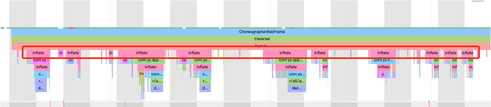
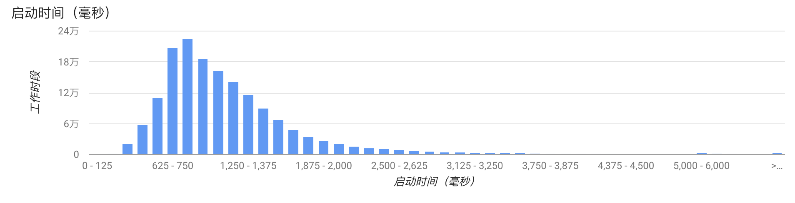

# Android启动优化
## 1. 启动优化的意义
用户如果想打开一个应用，就一定要经过“启动”这个步骤。启动时间的长短，不只是用户体验的问题，对于淘宝、京东这些应用来说，会直接影响留存和转化等核心数据。启动过慢可能会导致用户在应用商店针对您的应用给出很低的评分，甚至完全弃用您的应用。
## 2. 启动类型
### 2.1. 冷启动
冷启动是指应用从头开始启动：系统进程在冷启动后才创建应用进程。发生冷启动的情况包括应用在设备启动后或系统终止应用后首次启动
### 2.2. 热启动
热启动比冷启动简单得多，开销也更低。在热启动中，系统的所有工作就是将您的 `Activity` 带到前台。只要应用的所有 `Activity` 仍驻留在内存中，应用就不必重复执行对象初始化、布局解析和绘制。
但是，如果一些内存为响应内存整理事件（如 `onTrimMemory()`）而被完全清除，则需要重新创建相应的对象。

### 2.3. 温启动
温启动包含了在冷启动期间发生的部分操作；同时，它的开销要比热启动高。有许多潜在状态可视为温启动。例如：

* 用户在退出应用后又重新启动应用。进程可能还继续运行，但应用必须通过调用 `onCreate()` 从头开始重新创建 `Activity`。

* 系统将您的应用从内存中逐出，然后用户又重新启动它。这时候进程和 `Activity`都需要重启，但如果应用退出前通过`onSaveInstanceState`保留了状态数据，重新启动传递到 `onCreate()` 的已保存的实例 `state bundle` 对于完成启动任务会有一定帮助。

> 一般我们都是假定冷启动的基础上进行优化。这样做也可以同时提升温启动和热启动的性能。

## 3. 应用冷启动流程
### 3.1. 启动流程
用户点击图标开始，到主界面用户可操作，大致流程如下


1. **第一阶段：预览窗口**
	`SystemServer`进程会创建应用的进程和窗口
    * 系统接管，几乎没有优化的空间
    * 要是`windowBackground`主题属性配置了，会显示对应的预览，否则显示空白启动窗口

2. **第二阶段：页面显示**
  应用进程被 `SystemServer` 创建后，进行一系列初始化工作后，用户就可以看到主界面
  具体会分成以下几步：
     1. 创建应用对象（Application#onCreate）
     2. 启动主线程
     3. 创建主 Activity
     4. 视图创建、
     5. 布局
     6. 执行初始绘制
  一旦应用进程完成第一次绘制，系统进程就会换掉当前显示的后台窗口，替换为`主 Activity`。此时，用户可以开始使用应用。

3. **第三阶段：界面可操作**
 在启动完成后，还需要等待主页渲染完成并可以顺畅交互(如 **匀速连续上下滑动屏幕** )，这样才算真正启动完成

### 3.2. 源码简析
#### 3.2.1 关键类简介
* **ActivityManagerService**：AMS 是 Android 中最核心的服务之一，主要负责系统中四大组件的启动、切换、调度及应用进程的管理和调度等工作，其职责与操作系统中的进程管理和调度模块相类似，它本身也是一个 Binder 的实现类，应用进程能通过 Binder 机制调用系统服务。
* **ActivityThread**：应用的入口类，系统通过调用main函数，开启消息循环队列。ActivityThread 所在线程被称为应用的主线程（UI 线程）。
* **Instrumentation**：工具类，它用来监控应用程序和系统的交互，包装了 ActivityManagerService 的调用，一些插件化方案就是通过 hook 该类实现的。
* **ActivityStarter**：Activity 启动的工具类，处理启动 Activity 的各种 flag 。
* **ActivityStackSupervisor**：管理所有应用的 Activity 的栈，其中 mFocusedStack 就是当前应用的 Activity 栈。
#### 3.2.2 启动步骤
1. 当点击桌面 App 的时候，发起进程就是 `Launcher` 所在的进程，`startActivity()`函数最终是由`Instrumentation`通过Android的`Binder`跨进程通信机制 发送消息给 `system_server `进程；
> Activity.java
```java
  public void startActivityForResult(@RequiresPermission Intent intent, int requestCode,
            @Nullable Bundle options) {
        if (mParent == null) {
            options = transferSpringboardActivityOptions(options);
            Instrumentation.ActivityResult ar =
                mInstrumentation.execStartActivity(
                    this, mMainThread.getApplicationThread(), mToken, this,
                    intent, requestCode, options);
            ···
        } else {
            ···
        }
    }
```
> Instrumentation.java
```java
    public ActivityResult execStartActivity(
            Context who, IBinder contextThread, IBinder token, Activity target,
            Intent intent, int requestCode, Bundle options) {
        ···
        try {
            intent.migrateExtraStreamToClipData();
            intent.prepareToLeaveProcess(who);
            int result = ActivityManager.getService()
                .startActivity(whoThread, who.getBasePackageName(), intent,
                        intent.resolveTypeIfNeeded(who.getContentResolver()),
                        token, target != null ? target.mEmbeddedID : null,
                        requestCode, 0, null, options);
            checkStartActivityResult(result, intent);
        } catch (RemoteException e) {
            throw new RuntimeException("Failure from system", e);
        }
        return null;
    }
```
2. 在 `system_server` 中，启动进程的操作会先调用
`ActivityManagerService#startProcessLocked()` 方法，该方法内部调用 `Process.start(android.app.ActivityThread)；`而后通过 `socket` 通信告知 `Zygote `进程 `fork` 子进程，即 app 进程。进程创建后将 `ActivityThread` 加载进去，执行 `ActivityThread#main()`方法；
> ActivityManagerService.java
```java
 private final void startProcessLocked(ProcessRecord app, String hostingType,
            String hostingNameStr, String abiOverride, String entryPoint, String[] entryPointArgs) {
        ···
            if (entryPoint == null) entryPoint = "android.app.ActivityThread";
            Trace.traceBegin(Trace.TRACE_TAG_ACTIVITY_MANAGER, "Start proc: " +
                    app.processName);
            checkTime(startTime, "startProcess: asking zygote to start proc");
            ProcessStartResult startResult;
            if (hostingType.equals("webview_service")) {
                ···
            } else {
                startResult = Process.start(entryPoint,
                        app.processName, uid, uid, gids, debugFlags, mountExternal,
                        app.info.targetSdkVersion, seInfo, requiredAbi, instructionSet,
                        app.info.dataDir, invokeWith, entryPointArgs);
            }
            ···
    }
```

3. 在 `app` 进程中，`main()` 方法会实例化 `ActivityThread`，同时创建 `ApplicationThread`，`Looper`，`Hander` 对象，调用 `ActivityThread#attach(false)` 方法进行 Binder 通信，方法里面调用 `ActivityManagerService#attachApplication(mAppThread)` 方法，将 thread 信息告知 `ActivityManagerService` ， 接着 `Looper` 启动循环；
> ActivityThread.java
```java
public static void main(String[] args) {
       ···
        Looper.prepareMainLooper();

        ActivityThread thread = new ActivityThread();
        thread.attach(false);

        if (sMainThreadHandler == null) {
            sMainThreadHandler = thread.getHandler();
        }
        ···
        Looper.loop();
        ···
    }


    private void attach(boolean system) {
        ···
        if (!system) {
            ···
            final IActivityManager mgr = ActivityManager.getService();
            try {
                mgr.attachApplication(mAppThread);
            } catch (RemoteException ex) {
                throw ex.rethrowFromSystemServer();
            }
            ···
        } else {
           ···
        }
        ···
    }
```
4. 在`system_server`进程中，`ActivityManagerService#attachApplication(mAppThread)`里依次初始化了`Application`和`Activity`，分别有2个关键函数：
    - `thread#bindApplication()`方法通知主线程`Handler` 创建 `Application` 对象、绑定 `Context` 、执行 `Application#onCreate() `生命周期
    - `mStackSupervisor#attachApplicationLocked()`方法中调用 `ActivityThread#ApplicationThread#scheduleLaunchActivity()`方法，进而通过主线程`Handler`消息通知创建 `Activity` 对象，然后再调用 `mInstrumentation#callActivityOnCreate()`执行 `Activity#onCreate()` 生命周期
> ActivityManagerService.java

```java
    private final boolean attachApplicationLocked(IApplicationThread thread,
            int pid) {
        ···
        try {
            ···
            if (app.instr != null) {
                thread.bindApplication(processName, appInfo, providers,
                        app.instr.mClass,
                        profilerInfo, app.instr.mArguments,
                        app.instr.mWatcher,
                        app.instr.mUiAutomationConnection, testMode,
                        mBinderTransactionTrackingEnabled, enableTrackAllocation,
                        isRestrictedBackupMode || !normalMode, app.persistent,
                        new Configuration(getGlobalConfiguration()), app.compat,
                        getCommonServicesLocked(app.isolated),
                        mCoreSettingsObserver.getCoreSettingsLocked(),
                        buildSerial);
            } else {
                thread.bindApplication(processName, appInfo, providers, null, profilerInfo,
                        null, null, null, testMode,
                        mBinderTransactionTrackingEnabled, enableTrackAllocation,
                        isRestrictedBackupMode || !normalMode, app.persistent,
                        new Configuration(getGlobalConfiguration()), app.compat,
                        getCommonServicesLocked(app.isolated),
                        mCoreSettingsObserver.getCoreSettingsLocked(),
                        buildSerial);
            }
            ···
        } catch (Exception e) {
            ···
        }
        ···
        // See if the top visible activity is waiting to run in this process...
        if (normalMode) {
            try {
                if (mStackSupervisor.attachApplicationLocked(app)) {
                    didSomething = true;
                }
            } catch (Exception e) {
                ···
            }
        }
        ···
    }
```
## 4. 检测分析
### 4.1. 查看logcat
在 Android 4.4及更高版本中，`logcat` 包含一个输出行，其中包含名为 `Displayed` 的值。此值代表从启动进程到在屏幕上完成对应 `Activity` 的绘制所用的时间。经过的时间包括以下事件序列：

1. 启动进程
2. 初始化对象
3. 创建并初始化 Activity
4. 布局填充
5. 首次绘制应用
```shell
ActivityManager: Displayed com.android.myexample/.StartupTiming: +3s534ms
```
另外，可以手动调用`reportFullyDrawn() `方法告知系统应用真正完全显示，输出如下
```shell
system_process I/ActivityManager: Fully drawn {package}/.MainActivity: +1s54ms
```
### 4.2 adb命令
```shell
adb [-d|-e|-s <serialNumber>] shell am start -S -W
    com.example.app/.MainActivity
    -c android.intent.category.LAUNCHER
    -a android.intent.action.MAIN
```
> -c 和 -a 为可选参数，可让您为 intent 指定 <category> 和 <action>
> 输出如下
```shell
Starting: Intent
    Activity: com.example.app/.MainActivity
    ThisTime: 2044
    TotalTime: 2044
    WaitTime: 2054
    Complete
```

* ThisTime
表示最后一个Activity启动耗时。
* TotalTime
表示所有Activity启动耗时。
* WaitTime
表示AMS启动Activity的总耗时。

一般来说，只需查看得到的`TotalTime`，即应用的启动时间，其包括 `创建进程 + Application初始化 + Activity初始化到界面显示` 的过程

### 4.3 [cpu profiler](https://developer.android.com/studio/profile/cpu-profiler?hl=zh-cn)

整体通过 JVM Agent 实现，具有完全方法调用栈输出，且支持 Java、C/C++方法的耗时检测，上手比较简单，但其存在性能损耗较大的问题，且一般仅用于 debug 包，release 包需要额外添加 debuggable 的配置；

### 4.4 [Nanoscope](https://github.com/uber/nanoscope)
```shell
nanoscope start --package=com.example.app
```


调试方便，性能损耗小，得出的结果真实，不过暂时只支持 Nexus 6P 和 x86 模拟器，无法针对中低端机做测试
### 4.5 [Systrace/Perfetto](https://developer.android.com/topic/performance/tracing)
调试方便，性能损耗小，得出的结果真实，可以很方便地追踪关键系统调用的耗时情况，如例如 GC、System Server、CPU 调度等；另外也可以通过代码插桩支持应用程序代码的耗时分析

查看手机支持的systrace 类型

```shell
python systrace.py --list-categories
```
执行命令
```shell
./systrace sched freq idle am wm gfx view binder_driver hal dalvik
 camera input res -a com.hiyo.yy -b 16384 -o trace.html
```


通过插桩，我们可以看到应用主线程和其他线程的函数调用流程。它的实现原理非常简单，就是将下面的两个函数分别插入到每个方法的入口和出口。
```java

class Trace {
  public static void i(String tag) {
    Trace.beginSection(name);
  }
  public static void o() {
      Trace.endSection();
  }
}
```
> 这里要考虑一些细节，如降低插桩对性能的影响、哪些函数需要被排除掉

函数插桩后效果：
```java
class Test {
  public void test() {
    Trace.i("Test.test()");
    //原来的工作
    Trace.o()；
  }
}
```
## 5. 优化
### 5.1 闪屏优化
1. **视觉优化**
设置预览窗口（`windowBackground`）和默认闪屏页面一致，用户视觉上启动快了。这种完全“跟手”的感觉在高端机上体验非常好，但对于中低端机，会把总的的闪屏时间变得更长。

2. **合并闪屏和主页面的 Activity**

减少一个 Activity 会给线上带来 100 毫秒左右的优化。但是如果这样做的话，管理时会非常复杂，在进入后台再通过最近任务栏启动、通过`Deep Link`启动等启动流程会有不少问题。我们可以通过自己管理activity任务栈来解决。譬如对于我司项目，我通过`SingleTop+栈管理`实现了类似`SingleTask`的效果。

例如：下面就是模拟`SingleTask`的 `cleanTop` 操作
```java
    protected void onCreate(Bundle savedInstanceState) {
        if (ActivityStackManager.getInstance().checkMainExist(this)) {
            super.onCreate(savedInstanceState);
            //如果主页面已经存在，直接finish掉当前页面
            finish();
            //并且之前的主页面拉到前台
            handleForOriginActivity();
            return;
        }
    }

    private void handleForOriginActivity() {
        if (ActivityStackManager.getInstance().isAppForeground()) {
            //前台直接模拟newIntent即可
            mockSingleTaskLaunchMode();
        } else {
            //后台时通过FLAG_ACTIVITY_REORDER_TO_FRONT重新拉起到前台
            Intent originIntent = getIntent();
            if (originIntent == null || !originIntent.hasExtra(INTENT_EXTRA_FORCE_TO_FRONT)) {
                startOriginActivityByReorderToFront(originIntent);
            }
        }
    }

      private void mockSingleTaskLaunchMode() {
        ActivityStackManager.getInstance().finishActivitysTopofMain();
        MainActivity originMainActivity =
                (MainActivity) ActivityStackManager.getInstance().getMainActivity();
        originMainActivity.onNewIntent(getIntent());
        originMainActivity.onRestart();
        originMainActivity.onStart();
        originMainActivity.onResume();
    }

    private void startOriginActivityByReorderToFront(Intent originIntent) {
        Intent intent = new Intent();
        intent.setComponent(new ComponentName(this,
                MainActivity.class));
        if (originIntent != null) {
            Bundle extras = originIntent.getExtras();
            if (extras == null) {
                extras = new Bundle();
            }
            extras.putBoolean(INTENT_EXTRA_FORCE_TO_FRONT, true);
            intent.putExtras(extras);
        }

        intent.addFlags(Intent.FLAG_ACTIVITY_NO_USER_ACTION);
        Activity firstMainActivity = ActivityStackManager.getInstance().getFirstMainActivity();
        if (firstMainActivity instanceof MainActivity) {
            firstMainActivity.startActivity(intent);
            ((MainActivity) firstMainActivity).onNewIntent(originIntent);
        }
    }
```
### 5.2 业务优化
我们首先需要梳理清楚当前启动过程正在运行的每一个模块，哪些是一定需要的、哪些可以砍掉、哪些可以懒加载。我们也可以根据业务场景来决定不同的启动模式。对于中低端机器，我们要学会降级，学会推动产品经理做一些功能取舍。但是需要注意的是，**懒加载要防止集中化，否则容易出现首页显示后用户无法操作的情形。**

优化策略如下

* **异步必要且耗时业务**
* **延时加载非必要但耗时业务**
* **删除非必要预加载**
* **懒加载服务模块**，例如，我发现启动过程各种服务模块都是直接初始化的，修改成 **服务注册机制，用时加载**。
* 主线程循环业务需要特别注意，当循环数据源是动态获取的，累计效果可能会很耗时。

### 5.3 线程优化
线程的优化主要在于 **减少 CPU 调度带来的波动，让应用的启动时间更加稳定**。

启动过程中如果有太多的线程一起启动，会导致CPU时间片抢占情况严重，尤其是低端机。这样会导致主线程Sleep状态变多，从而增加启动时间。


线程切换的数据我们可以通过`sched` 文件查看(需要root权限)
```shell
proc/[pid]/sched:
  nr_voluntary_switches：     
  主动上下文切换次数，因为线程无法获取所需资源导致上下文切换，最普遍的是IO。    
  nr_involuntary_switches：   
  被动上下文切换次数，线程被系统强制调度导致上下文切换，例如大量线程在抢占CPU。
```
优化策略如下：

* **使用统一线程池并且根据机器性能控制线程数量**
* **删除非必要线程操作**，譬如我们项目`datamodel`的`setter`方法会触发依赖的`kvo`模块（类似`eventbus`）的线程操作,启动过程创建`datamodel`可以通过构造的方式代替`setter`方式，这样就不会触发`kvo`模块的线程操作。
* **延时进入调度队列**，动过程不需要立马执行的线程任务可以延迟执行
* **锁优化**
    * 如果主线程和别的线程竞争锁，可能会导致主线程等待,需要排查这些等待是否可以优化
    通过`systrace` 可以看到锁等待的事件
    
    * 优化不必要的锁消耗
      通过`systrace` 可以看到锁本身也是有性能耗损的
      
        1. 能用无锁数据结构，就不要用锁；
        2. 能锁区块，就不要锁整个方法体；
        3. 能用对象锁，就不要用类锁。
    
    > JDK6后,java开发团队做了各种锁优化。比如，自旋锁，自适应自旋锁，锁消除，锁膨胀，轻量级锁，偏向锁等。但是日常开发中，使用锁还是要多些思考。
### 5.3 IO优化
在负载过高的时候，I/O 性能下降得会比较快。特别是对于低端机，同样的 I/O 操作耗时可能是高端机器的几十倍。启动过程不建议出现网络 I/O，相比之下，磁盘 I/O 是启动优化一定要抠的点。

优化方案如下：

1. **编译期根据布局XML动态生成布局代码**
编译期根据布局XML动态生成布局代码，这样可以节省掉布局`inflate`时间，在中低端机上有比较可观的收益。
   
   编译期根据布局XML动态生成布局代码可以使用开源库[X2C](https://github.com/iReaderAndroid/X2C)来实现，不过问题比较多，需要自行定制修改
2. **`SharedPreference` 优化**
   我们在启动过程只需要读取 `Setting.sp` 的几项数据，不过 `SharedPreference` 在初始化的时候还是要全部数据一起解析。如果它的数据量超过 1000 条，启动过程解析时间可能就超过 100 毫秒。如果只解析启动过程用到的数据项则会很大程度减少解析时间。我么可以使用单独的sp文件存储启动过程使用的数据项

### 5.4 系统调用优化
* **在启动过程，我们尽量不要做系统调用**，例如 `PackageManagerService` 操作、`Binder` 调用等待。
* **在启动过程也不要过早地拉起应用的其他进程**，`System Server` 和新的进程都会竞争 CPU 资源。特别是系统内存不足的时候，当我们拉起一个新的进程，可能会成为“压死骆驼的最后一根稻草”。它可能会触发系统的 low memory killer 机制，导致系统杀死和拉起（保活）大量的进程，从而影响前台进程的 CPU。
### 5.5 GC 优化
在启动过程，要尽量减少 GC 的次数，避免造成主线程长时间的卡顿，特别是对 Dalvik 来说，我们可以通过 systrace 单独查看整个启动过程 GC 的时间。
```shell
python systrace.py dalvik -b 90960 -a com.sample.gc
```
对于 GC 各个事件的具体含义，可以参考[查看GC](https://blog.adison.top/android/perf/memory/Android_memory_tools_gc/)

我们也可以使用系统提供的`Debug`API来监控启动过程总 `GC` 的耗时情况，特别是`阻塞式同步 GC` 的总次数和耗时。

```java
// GC使用的总耗时，单位是毫秒
Debug.getRuntimeStat("art.gc.gc-time");
// 阻塞式GC的总耗时
Debug.getRuntimeStat("art.gc.blocking-gc-time");
```
如果我们发现主线程出现比较多的 `GC 同步等待`，那就需要通过 `Allocation` 工具做进一步的分析。**启动过程避免进行大量的字符串操作，特别是序列化跟反序列化过程。一些频繁创建的对象，例如网络库和图片库中的 `Byte` 数组、`Buffer` 可以复用。如果一些模块实在需要频繁创建对象，可以考虑移到 `Native` 实现**。

Java 对象的逃逸也很容易引起 GC 问题，我们在写代码的时候比较容易忽略这个点。**我们应该保证对象生命周期尽量的短，在栈上就进行销毁。(如尽量使用局部变量)**

### 5.6 数据重排
Linux 文件系统从磁盘读文件的时候，会以 block 为单位去磁盘读取，一般 block 大小是 4KB。也就是说一次磁盘读写大小至少是 4KB，然后会把 4KB 数据放到页缓存 Page Cache 中。如果下次读取文件数据已经在页缓存中，那就不会发生真实的磁盘 I/O，而是直接从页缓存中读取，大大提升了读的速度


Dex 文件用的到的类和安装包 APK 里面各种资源文件一般都比较小，但是读取非常频繁。我们可以利用系统这个机制将它们按照读取顺序重新排列，减少真实的磁盘 I/O 次数。
#### 5.6.1 类重排
启动过程类加载顺序可以通过复写 ClassLoader 得到。
```java

class GetClassLoader extends PathClassLoader {
    public Class<?> findClass(String name) {
        // 将 name 记录到文件
        writeToFile(name，"coldstart_classes.txt");
        return super.findClass(name);
    }
}
```
然后通过FaceBook开源的[ReDex](https://github.com/facebook/redex) 的[Interdex](https://github.com/facebook/redex/tree/main/libredex)调整类在 Dex 中的排列顺序，最后可以利用 010 Editor 查看修改后的效果。


#### 5.6.2 资源文件重排
Facebook 在比较早的时候就使用“资源热图”来实现资源文件的重排，支付宝在[《通过安装包重排布优化 Android 端启动性能》](https://mp.weixin.qq.com/s/79tAFx6zi3JRG-ewoapIVQ)中也详细讲述了资源重排的原理和落地方法。在实现上，它们都是通过修改 Kernel 源码，单独编译了一个特殊的 ROM。这样做的目的有三个：

* **统计**。统计应用启动过程加载了安装包中哪些资源文件，比如 assets、drawable、layout 等。跟类重排一样，我们可以得到一个资源加载的顺序列表。
* **度量**。在完成资源顺序重排后，我们需要确定是否真正生效。比如有哪些资源文件加载了，它是发生真实的磁盘 I/O，还是命中了 Page Cache。
* **自动化**。任何代码提交都有可能改变启动过程中类和资源的加载顺序，如果完全依靠人工手动处理，这个事情很难持续下去。通过定制 ROM 的一些埋点和配合的工具，我们可以将它们放到自动化流程当中。
事实上如果仅仅为了统计，我们也可以使用 Hook 的方式。下面是利用 [Frida](https://frida.re/) 实现获得 Android 资源加载顺序的方法。
```java

resourceImpl.loadXmlResourceParser.implementation=function(a,b,c,d){
   send('file:'+a)
   return this.loadXmlResourceParser(a,b,c,d)
}


resourceImpl.loadDrawableForCookie.implementation=function(a,b,c,d,e){
   send("file:"+a)
   return this.loadDrawableForCookie(a,b,c,d,e)
}
```
调整安装包文件排列需要修改 `7zip` 源码实现支持传入文件列表顺序，同样最后可以利用 `010 Editor` 查看修改后的效果。

这两个优化可能会带来 100～200 毫秒的提高，我们还可以大大减少启动过程 I/O 的时间波动。特别是对于中低端机器来说，经常发现启动时间波动非常大，这个波动跟 CPU 调度相关，但更多时候是跟 I/O 相关。

### 5.7 去掉类校验
在加载类的过程有一个 `verify class` 的步骤，它需要校验方法的每一个指令，是一个比较耗时的操作。

我们可以通过 Hook 来去掉 verify 这个步骤，这对启动速度有几十毫秒的优化。不过其实最大的优化场景在于首次和覆盖安装时。以 `Dalvik` 平台为例，一个 2MB 的 Dex 正常需要 350 毫秒，将 `classVerifyMode` 设为 `VERIFY_MODE_NONE` 后，只需要 150 毫秒，节省超过 50% 的时间。

```java

// Dalvik Globals.h
gDvm.classVerifyMode = VERIFY_MODE_NONE;
// Art runtime.cc
verify_ = verifier::VerifyMode::kNone;
```
但是 ART 平台要复杂很多，Hook 需要兼容几个版本。而且在安装时大部分 Dex 已经优化好了，去掉 ART 平台的 verify 只会对动态加载的 Dex 带来一些好处。
这个黑科技可以大大降低首次启动的速度，代价是对后续运行会产生轻微的影响。同时也要考虑兼容性问题，暂时不建议在 ART 平台使用

## 6. 监控
终于千辛万苦的优化好了，我们还要找一套合理、准确的方法来度量优化的成果。同时还要对它做全方位的监控，以免被人破坏劳动果实。
### 6.1 实验室监控
如果想客观地反映启动的耗时，视频录制会是一个非常好的选择。特别是我们很难拿到竞品的线上数据，所以实验室监控也非常适合做竞品的对比测试。它的难点在于如何让实验系统准确地找到启动结束的点，这里可以通过下面两种方式。

* **`80%` 绘制**。当页面绘制超过 80% 的时候认为是启动完成，不过可能会把闪屏当成启动结束的点，不一定是我们所期望的。
* **图像识别**。手动输入一张启动结束的图片，当实验系统认为当前截屏页面有 `80% `以上相似度时，就认为是启动结束。这种方法更加灵活可控，但是实现难度会稍微高一点。


启动的实验室监控可以定期自动去跑，需要注意的是，我们应该覆盖高、中、低端机不同的场景。但是使用录屏的方式也有一个缺陷，就是出现问题时我们需要人工二次定位具体是什么代码所导致的。
### 6.2 线上监控
实验室覆盖的场景和机型还是有限的，是驴是马我们还是要发布到线上进行验证。针对线上，启动监控会更加复杂一些。[Android Vitals](https://developer.android.google.cn/topic/performance/vitals/launch-time#av)可以对应用冷启动、温启动时间做监控。


事实上，每个应用启动的流程都非常复杂，上面的图并不能真实反映每个应用的启动耗时。启动耗时的计算需要考虑非常多的细节，比如：

* **启动结束的统计时机**。是否是使用用户真正可以操作的时间作为启动结束的时间。
* **启动时间扣除的逻辑**。闪屏、广告和新手引导这些时间都应该从启动时间里扣除。
* **启动排除逻辑**。Broadcast、Server 拉起，启动过程进入后台这些都需要排除出统计。

经过精密的扣除和排除逻辑，我们最终可以得到用户的线上启动耗时。**准确的启动耗时统计是非常重要的。有很多优化在实验室完成之后，还需要在线上灰度验证效果。这个前提是启动统计是准确的，整个效果评估是真实的。**
那我们一般使用什么指标来衡量启动速度的快慢呢？
很多应用采用平均启动时间，不过这个指标其实并不太好，一些体验很差的用户很有可能是被平均了。
我更建议使用类似下面的指标：

* **快开慢开比**。例如 2 秒快开比、5 秒慢开比，我们可以看到有多少比例的用户体验非常好，多少比例的用户比较槽糕。
* **90% 用户的启动时间**。如果 90% 的用户启动时间都小于 5 秒，那么我们 90% 区间启动耗时就是 5 秒。
 
此外我们还要区分启动的类型。这里要统计首次安装启动、覆盖安装启动、冷启动和温启动这些类型，一般我们都使用普通的 **冷启动时间** 作为指标。另一方面热启动的占比也可以反映出我们程序的活跃或保活能力。

除了指标的监控，启动的线上堆栈监控更加困难。Facebook 会利用 [Profilo](https://github.com/facebookincubator/profilo) 工具对启动的整个流程耗时做监控，并且在后台直接对不同的版本做自动化对比，监控新版本是否有新增耗时的函数。

## 7. 总结
在这么多的优化方案中，业务优化是最快出成果同时也是风险最小的。很多产品经理为了提升自己负责的模块的数据，总会逼迫开发做各种各样的预加载。比如只有 1% 用户使用的功能，却让所有用户都做预加载。面对这种情况，我们要狠下心来，只留下那些真正不能删除的业务，或者通过场景化直接找到那 1% 的用户。跟产品经理 PK 可能不是那么容易，关键在于 **数据。我们需要证明启动优化带来整体留存、转化的正向价值，是大于某个业务取消预加载带来的负面影响。**

启动优化需要耐得住寂寞，把整个流程摸清摸透，一点点把时间抠出来，特别是对于低端机和系统繁忙的场景。当我们足够熟悉底层的知识时，也可以利用系统的特性去做更加深层次的优化。

对于启动优化要警惕 KPI 化，**我们要解决的不是一个数字，而是用户真正的体验问题。**

## 8 参考
[Android 高手课](https://time.geekbang.org/column/article/73651)

[Android app 启动流程分析](https://juejin.cn/post/6844904068943446029)