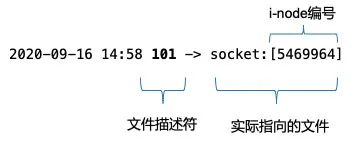

# Android句柄泄漏分析

## 1. 基本概念

### 1.1 什么是句柄

句柄(`file descriptor`)即文件描述符，在 Linux 中一切皆文件，系统在运行时有大量的文件操作，内核为了高效管理已被打开的文件会创建索引，用来指向被打开的文件，这个索引即是文件描述符，其表现形式为一个非负整数。由于Android基 于Linux 系统，所以Android也继承了文件描述符系统。

在adb shell中，可以通过命令 `ls -la /proc/{pid}/fd` 查看当前进程文件描述符使用信息，执行该操作需要root后的手机

``` shell
root@x86:/ # ls -la /proc/732/fd
lrwx------ root     root              2021-10-24 23:53 0 -> /dev/null
lrwx------ root     root              2021-10-24 23:53 1 -> /dev/null
lr-x------ root     root              2021-10-24 23:53 10 -> /dev/__properties__
lrwx------ root     root              2021-10-24 23:53 11 -> anon_inode:[eventpoll]
lr-x------ root     root              2021-10-24 23:53 12 -> /dev/urandom
lr-x------ root     root              2021-10-24 23:53 13 -> /system/priv-app/SystemUI/SystemUI.apk
lrwx------ root     root              2021-10-24 23:53 14 -> anon_inode:[eventfd]
lrwx------ root     root              2021-10-24 23:53 15 -> anon_inode:[eventpoll]
lrwx------ root     root              2021-10-24 23:53 16 -> anon_inode:[eventfd]
lrwx------ root     root              2021-10-24 23:53 17 -> socket:[12554]
lrwx------ root     root              2021-10-24 23:53 18 -> anon_inode:[eventpoll]
lrwx------ root     root              2021-10-24 23:53 19 -> anon_inode:[eventfd]
lrwx------ root     root              2021-10-24 23:53 2 -> /dev/null
lrwx------ root     root              2021-10-24 23:53 20 -> anon_inode:[eventpoll]
lrwx------ root     root              2021-10-24 23:53 21 -> anon_inode:[eventfd]
lrwx------ root     root              2021-10-24 23:53 22 -> anon_inode:[eventpoll]
lrwx------ root     root              2021-10-24 23:53 23 -> anon_inode:[eventfd]
lrwx------ root     root              2021-10-24 23:53 24 -> anon_inode:[eventpoll]
lrwx------ root     root              2021-10-24 23:53 25 -> /dev/nemuguest
lrwx------ root     root              2021-10-24 23:53 26 -> socket:[12668]
lrwx------ root     root              2021-10-24 23:53 27 -> /dev/vtunnel
lrwx------ root     root              2021-10-24 23:53 28 -> /dev/vtunnel
lrwx------ root     root              2021-10-24 23:53 29 -> socket:[12727]
lrwx------ root     root              2021-10-24 23:53 3 -> socket:[11857]
lrwx------ root     root              2021-10-24 23:53 31 -> socket:[15743]
lrwx------ root     root              2021-10-24 23:53 32 -> /dev/ashmem
l-wx------ root     root              2021-10-24 23:53 4 -> /sys/kernel/debug/tracing/trace_marker
```

上图中 箭头前的数字部分是文件描述符，箭头指向的部分是对应的文件信息。



同时通过`ls -al /proc/{pid}/fd | wc -l`来查看查看进程FD数量

### 1.2  fd limit

可以打开的文件描述符是有上限的，所以分到每一个进程可打开的文件描述符也是有限的。可以通过命令 `cat /proc/sys/fs/file-max` 查看所有进程允许打开的最大文件描述符数量，同样，执行该操作也需要root后的手机

```shell
root@x86:/ # cat /proc/sys/fs/file-max
206453
```

也可以通过命令 **`ulimit -n` ** 查看单个进程的允许打开的最大文件描述符数量。Linux默认进程最大文件描述符数量是1024。

```shell
root@x86:/ # ulimit -n
1024
```

> **注意**：较新款的Android这个值被改为32768。

### 1.3 句柄简单分类

针对android应用的文件描述符先简单做一个说明，平时查句柄问题一般可以通过对比哪一类文件描述符数量过高，来缩小问题范围。

| 类别标识 |             FD类型             |                说明                |
| :------: | :----------------------------: | :--------------------------------: |
|    1     |   /data/data/或者/data/app/    |            打开文件相关            |
|    2     |             socket             |      与网络请求或进程通信相关      |
|    3     |          /dev/ashmem           |    与数据库操作或者线程创建相关    |
|    4     | anon_inode:[eventpoll/eventfd] | 与HandlerThread或带looper线程相关  |
|    5     |      anon_inode:[timerfd]      | 系统文件描述符类型，和应用关系不大 |
|    6     |      anon_inode:[dmabuf]       |     InputChannel泄漏时增加明显     |
|    7     |             pipe:              |  与HandlerThread带looper线程相关   |
|    8     |             /sys/              |         一般是系统操作使用         |

## 2. 句柄泄漏场景

### 2.1 Resource相关

#### Stream

```kotlin
for (index in 1..100) {
    var out: FileOutputStream? = null
    try {
        val fileName = "temp_${index}"
        val file = File(cacheDir, fileName)
        file.createNewFile()
        out = FileOutputStream(file)
    } catch (e: Exception) {
        e.printStackTrace()
    } finally {
//     out?.close()
    }
}
```

调用上面这段代码会出现大量上面表格中`1`类别的FD，因为在使用完 FileOutputStream 后没有及时释放。每次创建 file 对象，即使它都是打开同一个文件，系统依然会每次都为进程创建不同的FD来指向这个文件流。

Android 中经常会使用到 FileInputStream，FileOutputStream，FileReader，FileWriter 等输入输出流，处理不好会导致内存溢出和FD泄漏。需要及时关闭，应当在finally块中操作，保证一定能close掉。

> 文件句柄，创建方式为底层最终调用系统函数open，会生成一个int的fd值。

#### Cursor

```java
public void problemMethod() {  
    Cursor cursor = query(); // 假设 query() 是一个查询数据库返回 Cursor 结果的函数   
    if (flag == false) {  // 出现了提前返回
        return;  
    }  
    cursor.close();  
}
```

与输入输出流相似，数据库查询的 Cursor 如果没有及时进行 Close 操作，也会出现FD泄漏的情况。这类  FD泄漏会导致出现表格中`3`类别的FD。

大概原理是：通过Uri查询数据库所得到的数据集，保存在native层的`CursorWindow`中。`CursorWindow`的实质是共享内存的抽象，以实现跨进程数据共享。共享内存所采用的实现方式是文件映射。在ContentProvider端透过SQLiteDatabase的封装查询到的数据集保存在`CursorWindow`所指向的共享内存中。然后通过Binder把这片共享内存传递到ContentResolver端，即查询端。这样客户就能够通过Cursor来访问这块共享内存中的数据集了。具体源码分析查看[SQLite泄漏](https://segmentfault.com/a/1190000039323289)

### 2.2 HandlerThread

```kotlin
for (index in 1..100) {
    val thread = HandlerThread("background-refresh-thread")
    thread.start()
    val handler = Handler(thread.looper)
// destroy(handler, thread)
}


private fun destroy(handler: Handler, handlerThread: HandlerThread) {
    handlerThread.quitSafely()
    handler.removeCallbacksAndMessages(null)
}
```

HandlerThread在不需要使用的时候，需要调用上述代码中的`destroy`方法来释放资源。HandlerThread FD泄漏会导致出现表格中`4`类别的FD。

HandlerThread会泄漏文件描述符的原因是使用了Looper，所以如果普通Thread中使用了Looper，也会有这个问题。Looper对象初始化时Looper.prepare() 需要fd资源，会消耗一对fd(`eventFd`和`epollFd`)，这两个fd是用来实现线程间通信的。

### 2.3 InputChannel

```kotlin
for (index in 1..10) {
    val alertDialog = AlertDialog.Builder(this)
        .setTitle("test leak")
        .create()
    alertDialog.show()
}
```

运行上述代码，会发现多了10个表格中`2`类别(也就是socket)的FD。这是因为Dialog内部会调用`WindowManager.addView`，`WindowManager.addView` 的每次调用，最终会调用WMS的 `addWindow` 方法，WMS在其中会创建 `InputChannel` 用于进行跨进程通信。本质上是初始化了一对`socket`文件（会在服务端进程和客户端进程各创建一个）进行通信，如果不调用 removeView 这对FD将得不到释放。

如果是这种FD泄漏，一般异常log会出现`InputChannel`相关关键词，如`Could not read input channel file descriptors from parcel`，对于此类异常，也可以通过`adb shell dumpsys window`查看一下当前的window信息，即可以比较明确的看出是哪个window有异常，然后找原因解决。

如上面的代码，执行dumpsys window命令之后，会发现

```shell
WINDOW MANAGER ANIMATOR STATE (dumpsys window animator)
    DisplayContentsAnimator #0:
      Window #0: WindowStateAnimator{e5d6e54 com.android.systemui.ImageWallpaper}
      Window #1: WindowStateAnimator{e5dc1fd com.mumu.launcher/com.mumu.launcher.Launcher}
      Window #2: WindowStateAnimator{5b4def2 com.adison.andoridnotes/com.adison.notes.ApiDemos}
      Window #3: WindowStateAnimator{b1cd943 com.adison.andoridnotes/com.adison.notes.ApiDemos}
      Window #4: WindowStateAnimator{24d1bc0 com.adison.andoridnotes/com.adison.notes.perf.FDLeak}
      Window #5: WindowStateAnimator{b36be52 com.adison.andoridnotes/com.adison.notes.perf.FDLeak}
      Window #6: WindowStateAnimator{9b83523 com.adison.andoridnotes/com.adison.notes.perf.FDLeak}
      Window #7: WindowStateAnimator{fb17a20 com.adison.andoridnotes/com.adison.notes.perf.FDLeak}
      Window #8: WindowStateAnimator{686efd9 com.adison.andoridnotes/com.adison.notes.perf.FDLeak}
      Window #9: WindowStateAnimator{f5e6d9e com.adison.andoridnotes/com.adison.notes.perf.FDLeak}
      Window #10: WindowStateAnimator{6cf007f com.adison.andoridnotes/com.adison.notes.perf.FDLeak}
      Window #11: WindowStateAnimator{984184c com.adison.andoridnotes/com.adison.notes.perf.FDLeak}
      Window #12: WindowStateAnimator{36db095 com.adison.andoridnotes/com.adison.notes.perf.FDLeak}
      Window #13: WindowStateAnimator{9bfc5aa com.adison.andoridnotes/com.adison.notes.perf.FDLeak}
      Window #14: WindowStateAnimator{5d259b com.adison.andoridnotes/com.adison.notes.perf.FDLeak}
      Window #15: WindowStateAnimator{fc980f9 KeyguardScrim}
      Window #16: WindowStateAnimator{7adf83e StatusBar}
```

很明显，com.adison.notes.perf.FDLeak有异常addWindow操作。

### 2.4 Java Thread Start

Java在起线程的时候也会需要开Fd资源，如果线程生命周期操作不当，当起的线程过多时也会导致Fd泄漏问题，当然这里也是会经常躺枪。具体可以这篇文章：[不可思议的OOM](https://www.jianshu.com/p/e574f0ffdb42)。

线程start的简化流程如下：


**对于1的地方**，**ashmem_create_region 会创建一块ashmen匿名共享内存,并返回一个文件描述符**，如果Fd资源不足了，会报出类似` java.lang.OutOfMemoryError: Could not allocate JNI Env`调用栈错误，这时这里有可能只是躺枪，可能是已经有Fd泄漏了导致再起线程时这里创建JNIENV需要打开Fd失败。

**对于2的地方**，如果内存资源不足了，或者没有连续虚拟地址可用会抛出`java.lang.OutOfMemoryError: pthread_create (1040KB stack) failed: Try again`类似错误调用栈，这个时候应该去调查为何虚拟地址不足，这是真正OOM的问题了。

## 3. 句柄泄漏排查

### 3.1 句柄泄漏概述

句柄泄露是指程序中已分配的fd由于某种原因未释放或者无法释放，造成fd句柄占用越来越多，当达到进程上限后，程序将发生崩溃，而需要fd资源的场景很多，即在fd资源不足时，这些需要fd资源的很多场景，代码都有可能出现异常从而进程crash或功能异常，因此这些场景可能只是躺枪导致进程崩溃，真正罪魁祸首应该是大量占用fd资源的地方。
 因此，Fd泄漏的原因一般都有如下特点：

1. 同一个问题可能出现不同堆栈
2. 比较隐晦

### 3.2 句柄泄漏堆栈常见关键词

如果你的应用崩溃堆栈有以下关键词，恭喜你，你的应用可能存在文件描述符泄漏。

- Xxx  too many open files
- Could not allocate JNI Env
- Could not allocate dup blob fd
- Could not read input channel file descriptors from parcel
- InputChannel is not initialized
- Could not open input channel pair
- CursorWindow: Could not allocate CursorWindow 

### 3.3 句柄泄漏分析

句柄泄漏可以通过多方面信息去分析：

1. logcat 查看异常栈情况，什么信息在频繁的打印，涉及到fd open的日志频繁打印是最值得怀疑的地方。

2. 句柄泄漏通常会导致卡顿，内存飙升等异常现象，可以在进程复现未挂的时候抓取想要的信息：

  * 查看fd信息`adb shell ls -a -l /proc/{pid}/fd` ，通过对比前面表格中哪一类文件描述符数量过高，来缩小问题范围。
  * 查看进程线程信息：`ps -t {pid`}，跟线程相关的fd泄漏通过进程的信息可以很快定位出异常线程。
  * 查看是否有异常window：`adb shell dumpsys window`，用于解决 InputChannel 相关的泄漏问题。
  * 抓取hprof定位资源使用情况

4. 线上监控：在应用crash的时候或者定时轮询当前进程使用的FD数量，在达到阈值时，通过readlink的方式读取/proc/self/fd的信息，以获取fd信息，示例代码如下：

   ```kotlin
   List<String> dumpInfo = new ArrayList<>();
   String fdDirPath = String.format("/proc/%d/fd/", Process.myPid());
   File[] fds = new File(fdDirPath).listFiles();
   if (fds == null) {
       dumpInfo.add("Unable to list " + fdDirPath);
   } else {
       for (File f : fds) {
           String fdSymLink = f.getAbsolutePath();
           String resolvedPath = "";
           try {
               resolvedPath = Os.readlink(fdSymLink);
           } catch (ErrnoException ex) {
               resolvedPath = ex.getMessage();
           }
           dumpInfo.add(fdSymLink + "\t" + resolvedPath);
       }
   }
   // Dump the fds & paths to a temp file.
   try {
       File dumpFile = File.createTempFile("fd_", "", dumpDir);
       Path out = Paths.get(dumpFile.getAbsolutePath());
       Files.write(out, dumpInfo, StandardCharsets.UTF_8);
   } catch (IOException ex) {
       Log.w(TAG, "Unable to write open descriptors to file: " + ex);
   }
   ```

## 4. 参考链接

   [浅谈及案例分析 FD 泄漏](http://jackin.cn/2018/05/30/android-fd-leak-wtf.html)

   [Android Fd泄漏问题分析](https://www.jianshu.com/p/befd4b86cc42)

   [一文帮你搞懂 Android 文件描述符](https://segmentfault.com/a/1190000039323289)

   
