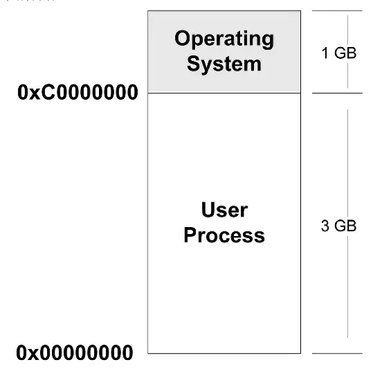
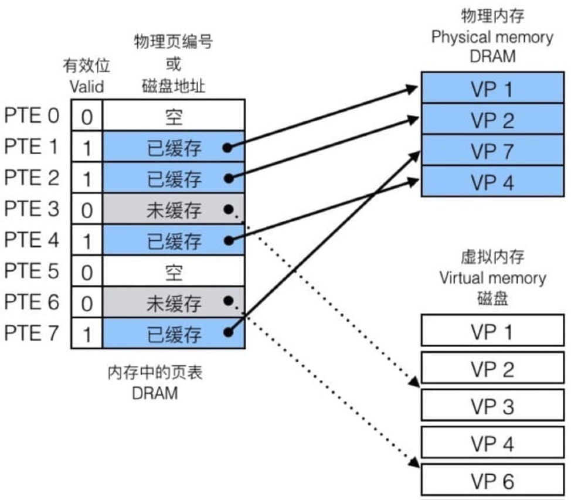
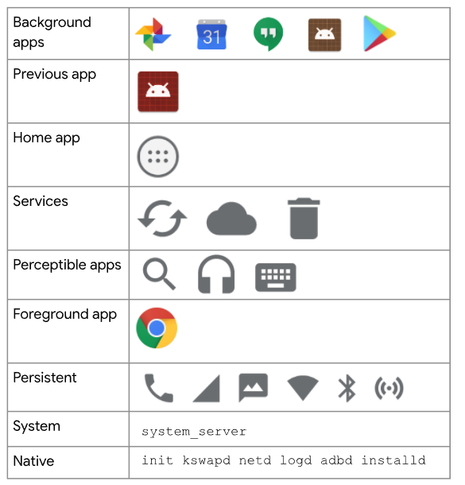
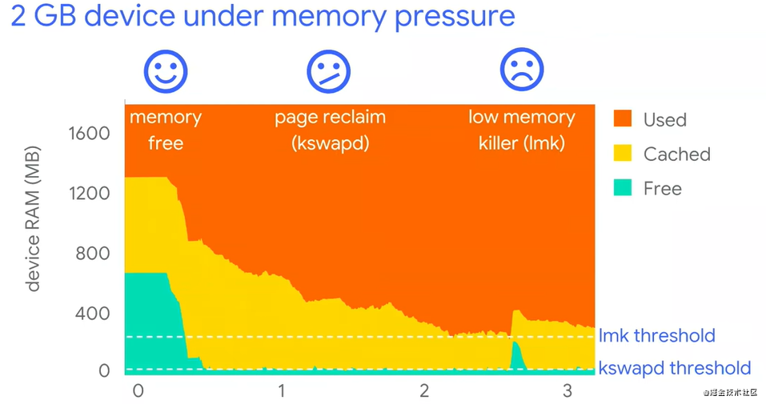

# android 内存管理

## 1. 内存基础知识

### 1.1 物理内存(RAM)
RAM即大家常说的运行内存，简称运存，是一种在手机中用来暂时保存数据的元件，相当于电脑中的内存条。物理内存是CPU的地址线可以直接进行寻址的内存空间大小，加载到内存地址寄存器中的内存又叫“硬件内存”，是内存单元真正的地址(也叫物理地址)。RAM作为进程运行不可或缺的资源，对系统和稳定性有着决定性的影响。另外，RAM的一部分被操作系统留作他用，比如显存等。
	
### 1.2 虚拟内存
是一个概念，并不是实际的内存，在物理内存之上增加一个中间层，让程序通过虚拟地址去间接的访问物理内存呢。通过虚拟内存，每个进程好像都可以独占内存一样，每个进程看到的内存都是一致的，这称为虚拟地址空间。对于4G内存的Linux系统来说，虚拟内存也为4G，其中1G为系统的内存，剩下的3G为应用程序的内存。

  - **逻辑（虚拟）地址**
	上述`0x00000000`到`0xC0000000`就是应用程序可用的逻辑（虚拟）地址。这里引用一个浅显的例子——我们在C语言指针编程中，可以读取指针变量本身的值(&操作)，这里取得的值就是逻辑地址——也就是说，这个(&操作)取得的值是CPU控制生成的一个逻辑地址，并不是这个指针变量在RAM中的真正地址。
	
#### 1.2.1 分段与分页
  * **分段**

    进程是操作系统资源分配的最小单元。操作系统分配给进程的内存空间中包含五种段：数据段、代码段、BSS、堆、栈。

    * 数据段：存放程序中的静态变量和已初始化且不为零的全局变量。
    * 代码段：存放可执行文件的操作指令，代码段是只读的，不可进行写操作。这部分的区域在运行前已知其大小。
    * BSS段( Block Started By Symbol)：存放未初始化的全局变量，在变量使用前由运行时初始化为零。
    * 堆：存放进程运行中被动态分配的内存，其大小不固定。
    * 栈：存放程序中的临时的局部变量和函数的参数值。

    那么分段的技术可以解决什么问题呢？

    !!! note "" 
        假设程序A的虚拟地址空间是`0x00000000~0x00000099`，映射到的物理地址空间是`0x00000600~0x00000699`，程序B的虚拟地址空间是`0x00000100~0x00000199`，映射到的物理地址空间是`0x00000300~0x00000399`。 假设你手残，在程序A中操作了地址`0x00000150`，但是此时的地址`0x00000150`是虚拟的，而虚拟化的操作是在操作系统的掌控中的，所以，操作系统有能力判断，这个虚拟地址`0x00000150`是有问题的，然后阻止后续的操作。所以，这里体现出了隔离性。（另一种体现隔离性的方式就是，操作同一个虚拟地址，实际上可能操作的是不同的物理地址）

    所以通过分段机制，我们可以更好的控制不同段的属性，这有利于内存的组织安排，可以对不同的属性代码、数据进行更方便的管理。如果是打乱的放在内存中，那么读写属性就很难控制。

  * **分页**

    分页其实就是把段空间更细分了一下，粒度更小。此时物理内存被划分为一小块一小块，每块被称为帧(Frame)。分配内存时，帧是分配时的最小单位。并将进程的虚拟内存空间也划分为大小相等的块，称为`页面（Page）`。

    虚拟内存和物理内存的映射通过`页表(page table)`来实现。每个页表实际上是一个数组，数组中的每个元素称为`页表项(PTE, page table entry)`，每个页表项负责把虚拟页映射到物理页上。在 物理内存中，每个进程都有自己的页表。

    因为有一个表可以查询，就会遇到两种情况，一种是命中(Page Hit)，另一种则是未命中(Page Fault)。命中的时候，即访问到页表中蓝色条目的地址时，因为在 DRAM 中有对应的数据，可以直接访问。不命中的时候，即访问到 page table 中灰色条目的时候，因为在 DRAM 中并没有对应的数据，所以需要执行缺页置换。

#### 1.2.2 缺页中断
事实上，在每个进程创建加载时，内核只是为进程“创建”了虚拟内存的布局，具体就是初始化进程控制表中内存相关的链表，实际上并不立即就把虚拟内存对应位置的程序数据和代码（比如.text .data段）拷贝到物理内存中，只是建立好虚拟内存和磁盘文件之间的映射就好（叫做存储器映射），等到运行到对应的程序时，才会通过缺页异常，来拷贝数据。还有进程运行过程中，要动态分配内存，比如malloc时，也只是分配了虚拟内存，即为这块虚拟内存对应的页表项做相应设置，当进程真正访问到此数据时，才引发缺页异常。

在请求分页系统中，可以通过查询页表中的状态位来确定所要访问的页面是否存在于内存中。每当所要访问的页面不在内存时，会产生一次缺页中断，此时操作系统会根据页表中的外存地址在外存中找到所缺的一页，将其调入内存。

缺页本身是一种中断，与一般的中断一样，需要经过4个处理步骤：

1. 保护CPU现场
2. 分析中断原因
3. 转入缺页中断处理程序进行处理
4. 恢复CPU现场，继续执行

但是缺页中断是由于所要访问的页面不存在于内存时，由硬件所产生的一种特殊的中断，因此，与一般的中断存在区别：

1. 在指令执行期间产生和处理缺页中断信号
2. 一条指令在执行期间，可能产生多次缺页中断
3. 缺页中断返回是，执行产生中断的一条指令，而一般的中断返回是，执行下一条指令。

#### 1.2.3 虚拟内存好处
**虚拟内存的好处**：

1. **扩大地址空间**；
2. **内存保护**：每个进程运行在各自的虚拟内存地址空间，互相不能干扰对方。虚存还对特定的内存地址提供写保护，可以防止代码或数据被恶意篡改。
3. **公平内存分配**。采用了虚存之后，每个进程都相当于有同样大小的虚存空间。
4. 当进程通信时，可采用虚存共享的方式实现。
5. 当不同的进程使用同样的代码时，比如库文件中的代码，物理内存中可以只存储一份这样的代码，**不同的进程只需要把自己的虚拟内存映射过去就可以了，节省内存**
6. 虚拟内存很适合在多道程序设计系统中使用，许多程序的片段同时保存在内存中。当一个程序等待它的一部分读入内存时，可以把CPU交给另一个进程使用。在内存中可以保留多个进程，**系统并发度提高**
7. 在程序需要分配连续的内存空间的时候，只需要在虚拟内存空间分配连续空间，而不需要实际物理内存的连续空间，**可以利用碎片**

**虚拟内存的代价**：

1. 虚存的管理需要建立很多数据结构，这些数据结构要占用额外的内存
2. 虚拟地址到物理地址的转换，增加了指令的执行时间。
3. 页面的换入换出需要磁盘I/O，这是很耗时的
4. 如果一页中只有一部分数据，会浪费内存。

### 1.3 交换(Swap)空间

  在系统中运行的每个进程都需要使用到内存，但不是每个进程都需要每时每刻使用系统分配的内存空间。当系统运行所需内存超过实际的物理内存，内核会释放某些进程所占用但未使用的部分或所有物理内存，将这部分释放的数据存储在磁盘上直到进程下一次调用，并将释放出的内存提供给有需要的进程使用。
  
  引用一个容易理解但不是很恰当的比喻：你不需要很长的轨道就可以让一列火车从上海开到北京。你只需要足够长的铁轨（比如说3公里）就可以完成这个任务。采取的方法是把后面的铁轨立刻铺到火车的前面，只要你的操作足够快并能满足要求，列车就能像在一条完整的轨道上运行。
  
  swap和虚拟内存结伴而来的。如果系统是64位，最大虚拟内存可以是2的64次方，没有计算机会有这么大的内存。当内存不够用的时候只能映射到磁盘。linux专门开辟了一个swap磁盘分区，当物理内存不够用的时候(程序并不知道)，将内存中很久不使用的内存区域交换到swap区。也即是说：用作虚拟内存的磁盘空间称为交换空间（swap空间）。
  
  Android 没有使用磁盘作为交换空间，而是使用`zRAM`来实现swap，`zram swap` 主要原理就是从内存分配一块区域出来用作 swap 分区，每次如果内存空间不够了，不是把应用程序杀掉，而是把应用程序所占用的内存数据复制到 swap 分区，等切换回来的时候就可以直接把这部分数据恢复到内存当中，节省重新开启所需的时间。而被放到 swap 分区的应用程序，所占用的内存都是被压缩过的，比如，微信在普通内存中占用 50 MB 的空间，如果压缩率为 0.4，则放到 swap 分区里面的数据只需要 20 MB 的空间，这样 swap 分区里面就可以存放更多后台临时不用的应用程序，变相扩展了内存的大小。

### 1.4 JVM
JVM是`Java Virtual Machine（Java 虚拟机）`的缩写，JVM是一种用于计算设备的规范，它是一个虚构出来的计算机，是通过在实际的计算机上仿真模拟各种计算机功能来实现的。

Java语言的一个非常重要的特点就是平台无关性。而使用Java虚拟机是实现这一特点的关键。一般的高级语言如果要在不同的平台上运行，至少需要编译成不同的目标代码。而引入Java语言虚拟机后，Java语言在不同平台上运行时不需要重新编译。Java语言使用Java虚拟机屏蔽了与具体平台相关的信息，使得Java语言编译程序只需生成在Java虚拟机上运行的目标代码（字节码），就可以在多种平台上不加修改地运行。Java虚拟机在执行字节码时，把字节码解释成具体平台上的机器指令执行。这就是Java的能够 **“一次编译，到处运行”** 的原因。

## 2. Android 内存管理

### 2.1 ART和 Dalvik 虚拟机

ART和 Dalvik是Android平台的虚拟机，遵循 Dex 字节码规范，并没有遵循 JVM 规范来实现，因此 并不是 Java 虚拟机。 ART 和 Dalvik 可以支持已转换为 .dex（即`Dalvik Executable`）格式的Java应用程序的运行。在5.0版本以后，Dalvik虚拟机被彻底的丢弃，全部采用ART。

 **ART 和 Dalvik 区别**

* 编译模式不同
  * ART使用AOT（Ahead-Of-Time）编译模式，应用在第一次安装的时候，字节码就会预先编译成机器码存储在本地。在App运行时，ART模式就较Dalvik模式少了解释字节码的过程，所以App的运行效率会有所提高，占用内存也会相应减少。
  * Dalvik 使用JIT（Just-In-Time）编译模式，意思为即时编译，每次运行app时虚拟机会将dex文件解释翻译成机器码，这样才算是本地可执行代码，之后被系统运行。
* ART占用空间比Dalvik大（原生代码占用的存储空间更大，字节码变为机器码之后，可能会增加10%-20%），这也是著名的“空间换时间"。
* 预编译也可以明显改善电池续航，因为应用程序每次运行时不用重复编译了，从而减少了 CPU 的使用频率，降低了能耗。
* Art应用启动更快、运行更快、体验更流畅、触感反馈更及时。

### 2.2 共享内存

Android可以跨进程共享RAM页面（Pages））。它可以通过以下方式实现：

* 每个应用程序进程都是从名为Zygote的现有进程分叉（fork）出来的。Zygote进程在系统引导并加载framework代码和资源（例如Activity Themes）时启动。要启动新的应用程序进程，系统会fork Zygote进程，然后在新进程中加载并运行应用程序的代码。这种方法允许在所有应用程序进程中共享大多数的为framework代码和资源分配的RAM页面。
* 大多数静态数据都被映射到一个进程中。该技术允许在进程之间共享数据，并且还允许在需要时将其换出。这些静态数据包括：Dalvik代码（通过将其置于预链接的.odex文件中进行直接的memory-mapping），app资源（通过将资源表设计为可以mmap的结构并通过对齐APK的zip条目） 和传统的项目元素，如.so文件中的本地代码。
* 在许多地方，Android使用显式分配的共享内存区域（通过ashmem或gralloc）在进程间共享相同的动态RAM。例如，Window surface在应用程序和屏幕合成器之间使用共享内存，而游标(cursor)缓冲区在Content Provider和客户端之间使用共享内存。

### 2.3 内存页面

系统会将页面视为`可用`或`已使用`。可用页面是未使用的 RAM。已使用的页面是系统目前正在使用的 RAM，并分为以下类别：

- **缓存页**：有存储文件（例如代码或内存映射文件）的内存。缓存内存有两种类型：
    - 私有页：由一个进程拥有且未共享
        - 干净页：存储器中未经修改的文件副本，可由 [`kswapd`](https://developer.android.com/topic/performance/memory-management#kswapd) 删除以增加可用内存
        - 脏页：存储器中经过修改的文件副本；可由 `kswapd` 移动到 zRAM 或在 zRAM 中进行压缩以增加可用内存
    - 共享页：由多个进程使用
        - 干净页：存储器中未经修改的文件副本，可由 `kswapd` 删除以增加可用内存
        - 脏页：存储器中经过修改的文件副本；允许通过 `kswapd` 或者通过明确使用 [`msync()`](https://developer.android.com/reference/android/system/Os#msync(long,%20long,%20int)) 或 [`munmap()`](https://developer.android.com/reference/android/system/Os#munmap(long,%20long)) 将更改写回存储器中的文件，以增加可用空间
- **匿名页**：没有存储文件支持的内存（例如，通过设置了`MAP_ANONYMOUS`标记的`mmap()`进行分配）
    -  脏页：可由 `kswapd` 移动到 zRAM/在 zRAM 中进行压缩以增加可用内存

### 2.4 内存不足管理

面对不同的内存压力，android 会有不同的应对策略。从低到高依次是 `垃圾回收（GC）`、`内核交换守护进程(kswapd)`释放内存、`低内存终止守护进程杀死进程(low-memory killer)`释放内存；他们的代价也是逐步上升。下面我们依个来介绍一下。		

#### 2.5 GC 垃圾回收

无论是ART还是Dalvik虚拟机，都和众多Java虚拟机一样，属于一种托管内存环境（程序员不需要显示的管理内存的分配与回收，交由系统自动管理）。托管内存环境会跟踪每个内存分配， 一旦确定程序不再使用一块内存，它就会将其释放回堆中，而无需程序员的任何干预。回收托管内存环境中未使用内存的机制称为垃圾回收。

辨别一个对象是否是垃圾，虚拟机采用的是可达性分析法。即从一些确定活跃有用的对象出发，向下分析他的引用链；如果一个对象直接或者间接这些对象所引用，那么他就不是垃圾，否则就是垃圾。这些确定活跃有用的对象称为 `GC Roots`：

**GC Root对象**

- 虚拟机栈（栈帧中的本地变量表）中引用的对象
- 本地方法栈中 JNI（即一般说的 Native 方法）引用的对象
- 方法区中类静态属性引用的对象
- 方法区中常量引用的对象

GC 也并不是直接对整个堆区进行回收，而是将堆区中的对象分成两个部分：`新生代`、`老年代`。

刚创建的对象大都会被回收，而在多次回收中存活的对象则后续也很少被回收。新生代中存储的对象主要是刚被创建不久的对象，而老年代则存储着那些在多次 GC 中存活的对象。那么我们可以针对这些不同特性的对象，执行不同的回收算法来提高GC性能：

- 对于新创建的对象，我们需要更加频繁地对他们进行GC来释放内存，且每次只需要记录需要留下来的对象即可，而不必要去标记其他大量需要被回收的对象，提高性能（`标记-复制算法`）。
- 对于熬过很多次GC的对象，则可以以更低的频率对他门进行GC，且每次只需要关注少量需要被回收的对象即可（`标记-整理算法`）。
> 关于垃圾回收算法见[详细说明](https://blog.adison.top/books/jvm/)

尽管垃圾回收速度非常快，但仍会影响应用的性能。通常情况下，您无法从代码中控制何时发生垃圾回收事件。系统有一套专门确定何时执行垃圾回收的标准。当条件满足时，系统会停止执行进程并开始垃圾回收。如果在动画或音乐播放等密集型处理循环过程中发生垃圾回收，则可能会增加处理时间，进而可能会导致应用中的代码执行超出建议的 16ms 阈值，无法实现高效、流畅的帧渲染。

此外，您的代码流执行的各种工作可能迫使垃圾回收事件发生得更频繁或导致其持续时间超过正常范围。 例如，如果您在 Alpha 混合动画的每一帧期间，在 for 循环的最内层分配多个对象，则可能会使内存堆受到大量对象的影响。在这种情况下，垃圾回收器会执行多个垃圾回收事件（`内存抖动`），并可能降低应用的性能。

#### 2.6 内核交换守护进程

内核交换守护进程 (`kswapd`) 是 Linux 内核的一部分，用于将已使用内存转换为可用内存。当设备上的可用内存不足时，该守护进程将变为活动状态。Linux 内核设有可用内存上下限阈值。当可用内存降至下限阈值以下时，`kswapd` 开始回收内存。当可用内存达到上限阈值时，`kswapd` 停止回收内存。

它主要的工作时回收干净页、压缩页等操作来释放内存。

- 当内核交换守护进程启动时，他会把干净页回收以释放内存。当进程再次访问干净页时，则需要去硬盘中再次读取。
- 对于脏页，内核交换守护进程会把他们压缩后放入 zRAM 中。当进程访问脏页时，则需要从zRAM中解压出来。

通过不断回收和压缩分页的方式来释放内存，以满足新的内存请求。使用此方式释放的内存也无法满足新的内存请求时，android 会启动低内存终止守护进程，来终止一些低优先级的进程。

#### 2.7 低内存终止守护进程

很多时候，`kswapd` 不能为系统释放足够的内存。在这种情况下，系统会使用 [`onTrimMemory()`](https://developer.android.google.cn/reference/android/content/ComponentCallbacks2#onTrimMemory(int)) 通知应用内存不足，应该减少其分配量。如果这还不够，内核会开始终止进程以释放内存。它会使用低内存终止守护进程 (LMK) 来执行此操作。

`LMK` 使用一个名为 [`oom_adj_score`](https://android.googlesource.com/platform/system/core/+/master/lmkd/README.md) 的`内存不足分值`来确定正在运行的进程的优先级，以此决定要终止的进程，进程的优先级从高到低排序如下，优先级更高的进程会优先被终止：

从上到下依次是：

- 后台应用：使用过的 app 会被缓存在后台，下一次打开可以更加快速地进行切换。当内存不足时，此类应用会最快被杀死。
- 上一个应用：例如从微信跳转到浏览器，此时微信就是上一个应用。
- 主屏幕应用：这是启动器应用，也就是我们的桌面。如果这个进程被kill了，那么返回桌面时会暂时黑屏。
- 服务：同步服务、上传服务等等
- 可觉察的应用：例如正在播放的音乐软件，他可以被我们感知到，但是不在前台。
- 前台应用：当前正在使用的应用，如果这个应用被kill了，需要向用户报崩溃异常，此时的体验是极差的。
- 持久性（服务）：这些是设备的核心服务，例如电话和 WLAN。
- 系统：系统进程。这些进程被终止后，手机可能即将重新启动，就像手机突然卡死重启。
- 原生：系统使用的极低级别的进程，例如我们的内核交换守护进程。

**进程优先级**

Android中总共有5个进程优先级（按重要性降序）：

* **Foreground Process**：前台进程（正常不会被杀死）
用户当前操作所必需的进程。有很多组件能以不同的方式使得其所在进程被判定为前台进程。如一
个进程满足以下任一条件，即视为前台进程：
    - 托管用户正在交互的 Activity（已调用 Activity 的 onResume() 方法）
    - 托管某个 Service，后者绑定到用户正在交互的 Activity
    - 托管正执行一个生命周期回调的 Service（onCreate()、onStart() 或 onDestroy()）
    - 托管正执行其 onReceive() 方法的 BroadcastReceiver

* **Visible Process**：可见进程（正常不会被杀死)
没有任何前台组件、但仍会影响用户在屏幕上所见内容的进程。杀死这类进程也会明显影响用户体
验。如果一个进程满足以下任一条件，即视为可见进程：
    - 托管不在前台、但仍对用户可见的 Activity（`已调用其 onPause() 方法,但没有调用onStop`）。例如，上层Activity是Dialog风格时或者上层Activity是透明时;
    - 托管通过 Service.startForeground() 启动的前台Service
      > Service.startForeground()：它要求系统将它视为用户可察觉到的服务，或者基本上对用户是可见的。
    - 托管系统用于某个用户可察觉的特定功能的Service，比如动态壁纸、输入法服务等等。

*  **Service Process**：服务进程（正常不会被杀死）

  正在运行已使用 startService() 方法启动的服务且不属于上述两个更高类别进程的进程。尽管服务进程与用户所见内容没有直接关联，但是它们通常在执行一些用户关心的操作（例如，后台网络上传或下载数据）。因此，除非内存不足以维持所有前台进程和可见进程同时运行，否则系统会让服务进程保持运行状态。

* **Background / Cached Process**：后台进程（可能随时被杀死）

  这类进程一般会持有一个或多个目前对用户不可见的 Activity （已调用 Activity 的 onStop() 方法）。它们不是当前所必须的，因此当其他更高优先级的进程需要内存时，系统可能 随时终止 它们以回收内存。但如果正确实现了Activity的生命周期，即便系统终止了进程，当用户再次返回应用时也不会影响用户体验：关联Activity在新的进程中被重新创建时可以恢复之前保存的状态

* **Empty Process**：空进程（可以随时杀死）

  不含任何活跃组件的进程。保留这种进程的的唯一目的是用作缓存（为了更加有效的使用内存而不是完全释放掉），以缩短下次启动应用程序所需的时间，因为启动一个新的进程也是需要代价的。只要有需要，Android会随时杀死这些进程。

!!!note "Home键退出和返回键退出的区别?" 
    Home键退出，程序保留状态为后台进程；而返回键退出，程序保留状态为空进程，空进程更容易被系统回收。Home键其实主要用于进程间切换，返回键则是真正的退出程序。

**最后再来回顾一下**：

- 在0-1阶段，系统的内存资源足够，程序请求内存分配，系统会不断地使用空闲页来满足应用的内存请求
- 在1-2阶段，系统的可利用内存下降到一个阈值，程序继续请求内存分配，内核交换守护进程启动，开始释放缓存来满足内存请求
- 在2-3阶段，系统的被利用内存达到一个阈值，系统将启动低内存终止守护进程来杀死进程释放内存
