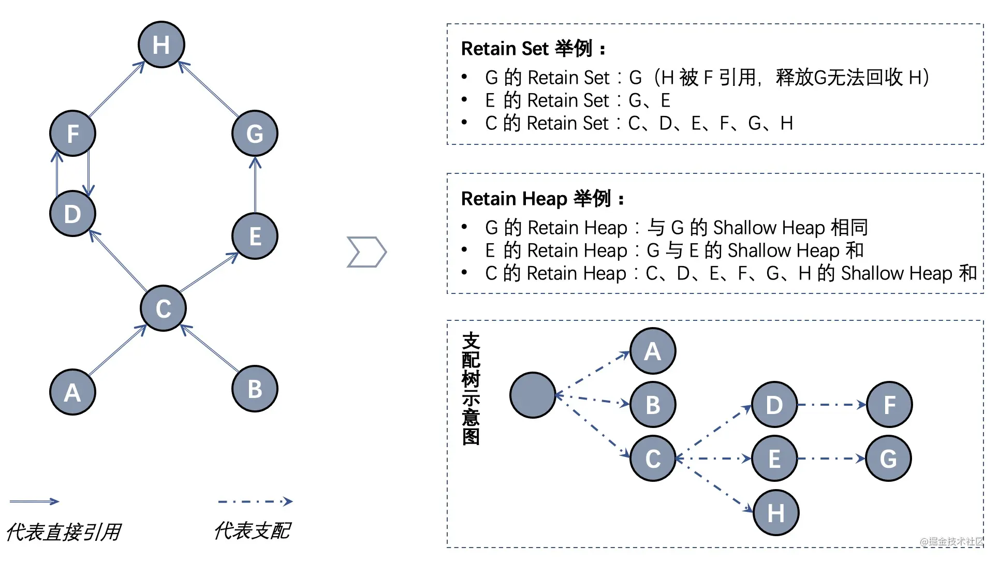
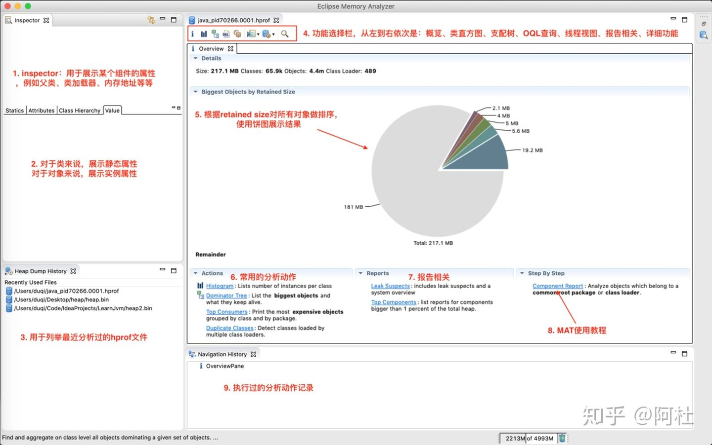
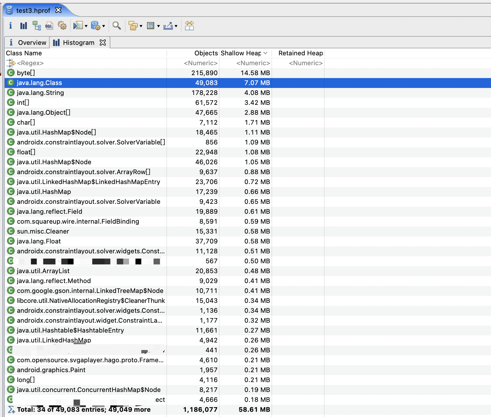
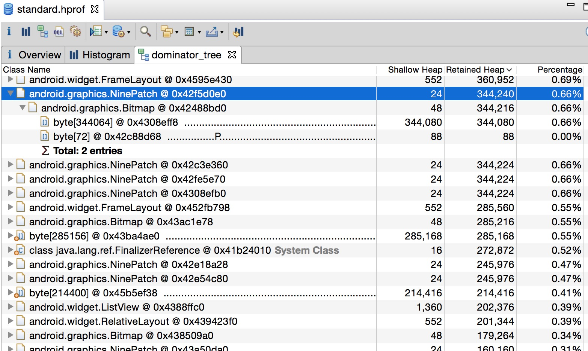
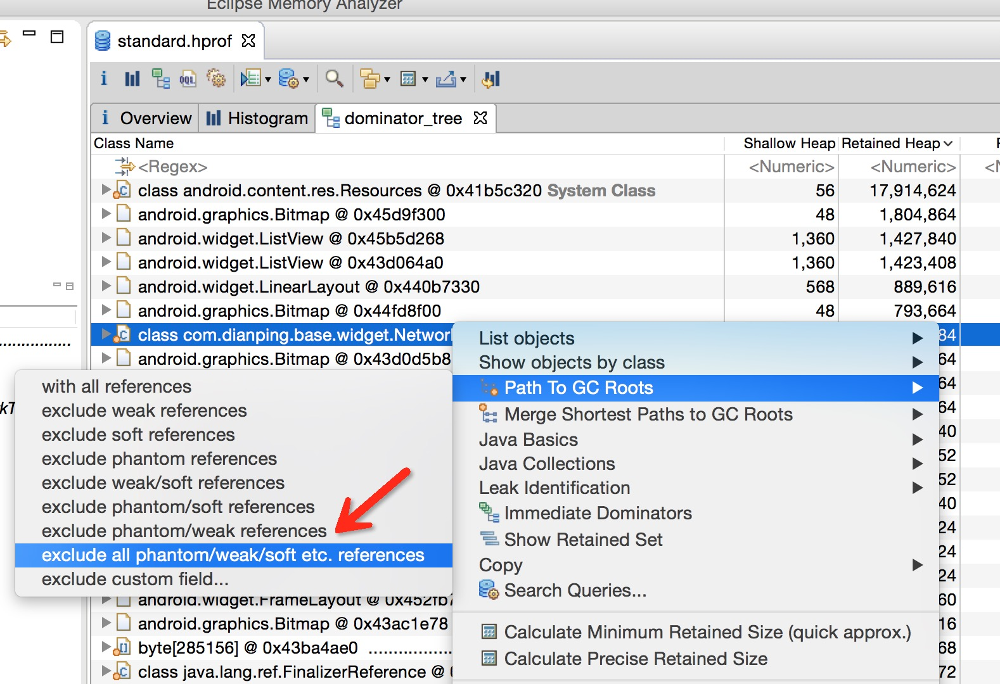

# MAT入门

## 1. MAT 简介

MAT（全名：[Memory Analyzer Tool](https://www.eclipse.org/mat/)），是一款高性能、具备丰富功能的Java堆内存分析工具，可以帮助定位内存泄漏问题和减少内存消耗。

### 1.1 安装及使用

在Android开发过程中，我们一般是下载其[独立版本](https://www.eclipse.org/mat/downloads.php),直接下载安装运行即可。

#### 1.1.1 获取HPROF文件

HPROF文件存储的是特定时间点，java进程的内存快照，在Android中可以通过多种方式获取

* adb命令

  ```shell
  adb shell am dumpheap <processname> /data/local/tmp/xxx.hprof
  ```

* 代码方式

  ```kotlin
  try {
      val fileName = "xxxxx/dump.hprof"
      Debug.dumpHprofData(fileName)
  } catch (e: IOException) {
  	e.printStackTrace()
  }
  ```

* 通过Android Profiler 

#### 1.1.2 转换HPROF文件

由于`Android`的`Dalvik`虚拟机导出的堆转储文件的格式与标准的`JVM`导出的堆转储文件的格式标准不一样，所以使用`MAT`打开`Android`的`Dalvik`虚拟机导出的 堆转储文件时必须先转换成`MAT`能识别的标准格式。`Android`提供了装换工具`hprof-conv`

```shell
/android-sdk/platform-tools/hprof-conv <FileName> <newFileName>.hprof
```

这样我们就能使用`MAT`打开`<newFileName>.hprof`文件了

## 2. 基本概念

### 2.1 **GC Roots** 

根搜索算法是JVM用来的判断对象是否存活的算法，此算法基本思路为通过一系列的“GC Roots”对象作为起始点，从这些节点往下搜索，当一个对象和GC Roots不可达时，则该对象是无用的，可被回收的。

在java中，可作为GC Roots的对象有：

* 虚拟机栈（栈帧中的本地变量表）中引用的对象；
* 方法区中的类静态属性引用的对象；
* 方法区中常量引用的对象；
* 本地方法栈中JNI（即一般说的Native方法）中引用的对象

### 2.2 引用类型

#### 2.2.1 强引用（Strong references）

普通的java引用，我们通常new的对象就是： `StringBuffer buffer = new StringBuffer();` 如果一个对象通过一串强引用链可达，那么它就不会被垃圾回收。你肯定不希望自己正在使用的引用被垃圾回收器回收吧。但对于集合中的对象，应在不使用的时候移除掉，否则会占用更多的内存，导致内存泄漏。

#### 2.2.2 软引用（Soft reference）

如果一个对象只具有软引用，则内存空间充足时，垃圾回收器就不会回收它；如果内存空间不足了，就会回收这些对象的内存。只要垃圾回收器没有回收它，该对象就可以被程序使用。一般软引用可用来实现内存敏感的高速缓存。

#### 2.2.3 弱引用（WeakReference）

`WeakReference`不会强制对象保存在内存中。它拥有比较短暂的生命周期，允许你使用垃圾回收器的能力去权衡一个对象的可达性。在垃圾回收器扫描它所管辖的内存区域过程中，一旦gc发现对象是`weakReference`可达，就会把它放到ReferenceQueue中，等下次gc时回收它。 `WeakReference<Widget> weakWidget = new WeakReference<Widget>(widget);` 系统为我们提供了WeakHashMap，和HashMap类似，只是其key使用了weak reference。如果WeakHashMap的某个key被垃圾回收器回收，那么entity也会自动被remove。

由于WeakReference被GC回收的可能性较大，因此，在使用它之前，你需要通过weakObj.get()去判断目的对象引用是否已经被回收.

#### 2.2.4 虚引用（Phantom reference）

和soft，weak Reference区别较大，它的get()方法总是返回null。这意味着你只能用PhantomReference本身，而得不到它指向的对象。当WeakReference指向的对象变得弱可达(weakly reachable）时会立即被放到ReferenceQueue中，这在finalization、garbage collection之前发生。理论上，你可以在finalize()方法中使对象“复活”（使一个强引用指向它就行了，gc不会回收它）。但没法复活PhantomReference指向的对象。而PhantomReference是在garbage collection之后被放到ReferenceQueue中的，没法复活。

## 3. MAT相关概念

### 3.1 **Shallow Heap**

Shallow size就是对象本身占用堆内存的大小，不包含其引用的对象。

- 常规对象（非数组）的Shallow size有其成员变量的数量和类型决定。
- 数组的shallow size有数组元素的类型（对象类型、基本类型）和数组长度决定

因为不像c++的对象本身可以存放大量内存，java的对象成员都是些引用。真正的内存都在堆上，看起来是一堆原生的byte[], char[], int[]，所以我们如果只看对象本身的内存，那么数量都很小。所以我们看到Histogram图是以Shallow size进行排序的，排在第一位第二位的是byte，char 。

### 3.2 Retained Set

一个对象的 Retained Set，指的是该对象被 GC 回收后，所有能被回收的对象集合（如下图所示，G的 Retain Set 只有 G 并不包含 H，原因是虽然 H 也被 G 引用，但由于 H 也被 F 引用 ，G 被垃圾回收时无法释放 H）；另外，当该对象无法被 GC 回收，则其 Retained set 也必然无法被 GC 回收。

### 3.3 Dominator tree

如果所有指向对象 Y 的路径都经过对象 X，则 X 支配（dominate） Y（如下图中，C、D 均支配 F，但 G 并不支配 H）。Dominator tree 是根据对象引用及支配关系生成的整体树状图，支配树清晰描述了对象间的依赖关系，下图左的 Dominator tree 如下图右下方支配树示意图所示。支配关系还有如下关系：

- Dominator tree 中任一节点的子树就是被该节点支配的节点集合，也就是其 Retain Set。
- 如果 X 直接支配 Y，则 X 的所有支配节点均支配 Y。



### 3.4 outgoing references

对象引用的外部对象（注意不包含对象的基本类型属性。基本属性内容可在 inspector 查看）

### 3.5 incoming references

直接引用了当前对象的对象，每个对象的 incoming references 可能有 0 到多个。

### 3.6 OQL(Object Query Language)

OQL的全称是Object Query Language，是一门用类SQL语言查找内存镜像中目标对象的语言，是一种领域专属语言（DSL）。

## 4. MAT 视图

使用MAT打开一个heap dump文件，解析完成后，默认会进入欢迎页，欢迎页里包含了一些常见的分析：最大内存占用分析、常见的分析动作、常用的分析报告、MAT使用教程等等。

我们看下下面这张图，可以看出MAT的主要结构和功能：




1. inspector：透视图，用于展示一个对象的详细信息，例如内存地址、加载器名称、包名、对象名称、对象所属的类的父类、对象所属的类的加载器对象、该对象的堆内存大小和保留大小，gc root信息。
2. inspector窗口的下半部分是展示类的静态属性和值、对象的实例属性和值、对象所属的类的继承结构。
3. Heap Dump History：用于列举最近分析过的文件
4. 常用功能栏，从左到右依次是：概览、Histogram、Dominator Tree、OQL查询、线程视图、报告相关、详细功能。其中概览就是在刚解析完后展示的这个页面，详细功能按钮则是提供了一些更细致的分析能力。
5. 概览中的饼图：该饼图用于展示retained size最大的对象
6. 常用的分析动作：类直方图、支配树、按照类和包路径获取消耗资源最多的对象、重名类。
7. 报告相关：Leak Suspects用于查找内存泄漏问题，以及系统概览
8. Components Report：这个功能是一组功能的集合，用于分析某一类性的类的实例的问题，例如分析`java.util.*`开头的类的实例对象的一些使用情况，例如：重复字符串、空集合、集合的使用率、软引用的统计、finalizer的统计、Map集合的碰撞率等等。

### 4.1 Histogram

`Histogram`是从类的角度看哪些类及该类的实例对象占用着内存情况，默认是按照某个类的shallow heap大小从大到小排序。



Retained Heap这一列的值是空的，因为对于某个类的所有实例计算总的retained heap非常慢，使用者可以使用右键菜单`Calculate Precise Retained Size`计算。

### 4.2 Dominator tree

Dominator tree列出最大的对象以及其依赖存活的Object （大小是以Retained Heap为标准排序的）。

Dominator tree可以用来排查是哪些对象导致了其他对象无法被垃圾收集器回收，




### 4.3 Path to GC Root

在Histogram或者Domiantor Tree的某一个条目上，右键可以查看其GC Root Path：



我们一般会选择`exclude all phantom/weak/soft etc.references`, 意思是查看排除虚引用/弱引用/软引用等的引用链，因为被虚引用/弱引用/软引用的对象可以直接被GC给回收，我们要看的就是某个对象否还存在Strong 引用链，如果有，则说明存在内存泄漏，然后再去排查具体引用。

## 5.参考

[MAT 使用入门](https://www.androidperformance.com/2015/04/11/AndroidMemory-Usage-Of-MAT/)

[MAT 入门篇](https://juejin.cn/post/6908665391136899079)

[MAT进阶使用](http://androooid.github.io/public/lightsky/mat_usage/mat_usage.html)


