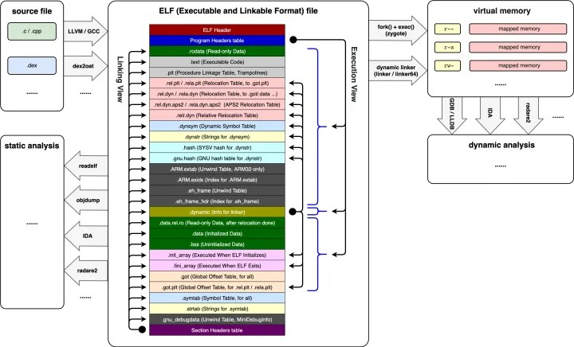
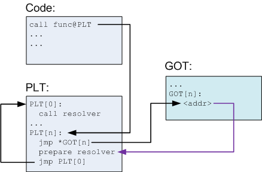
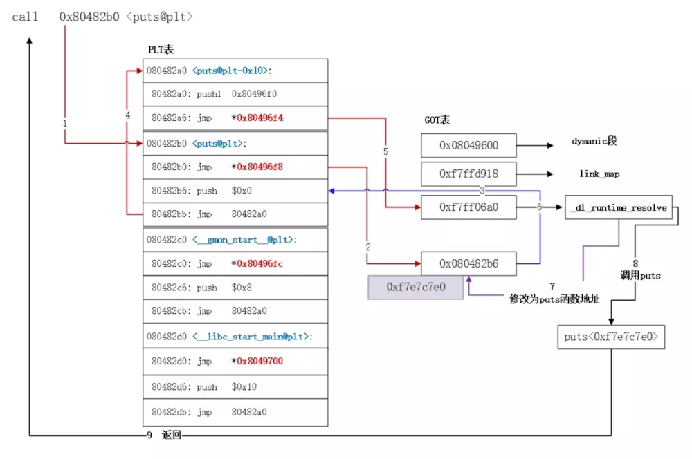
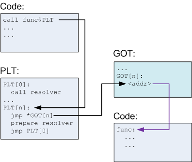
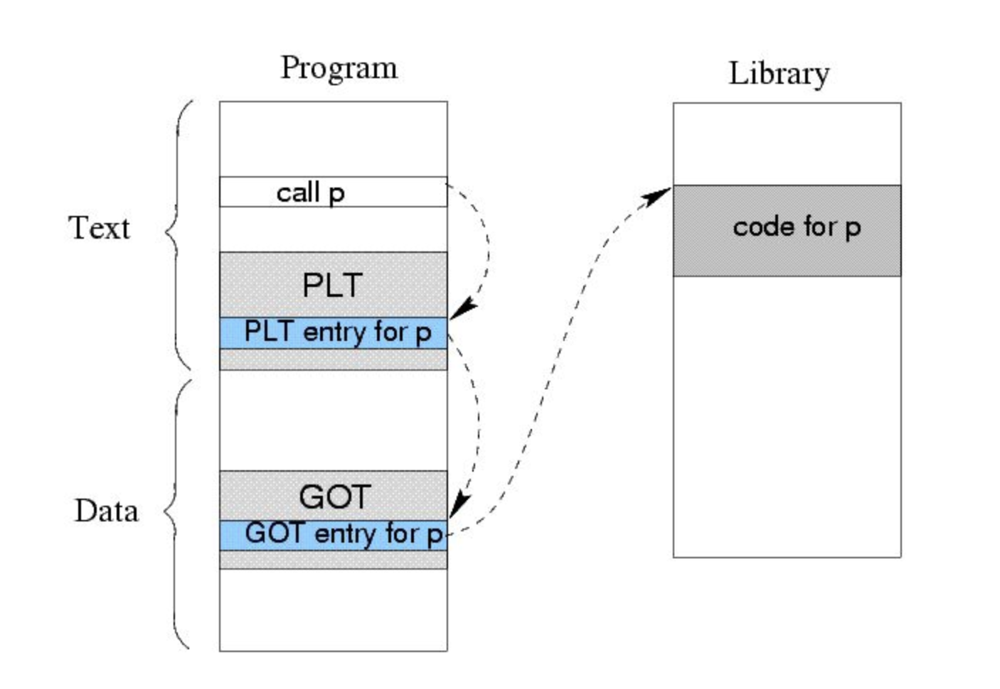
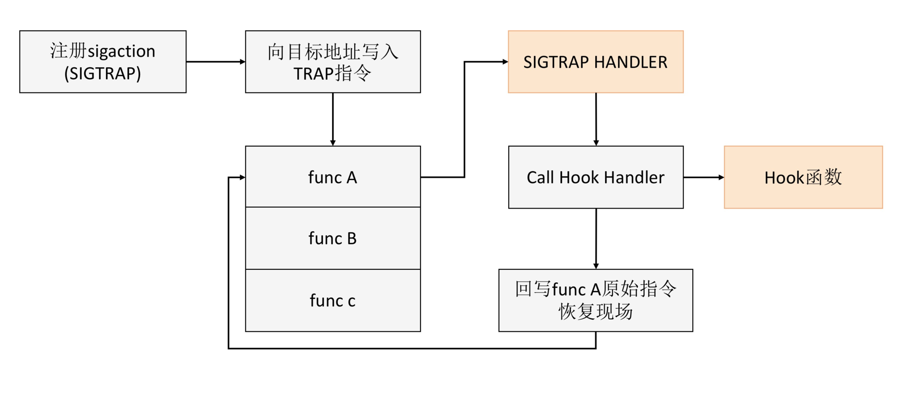
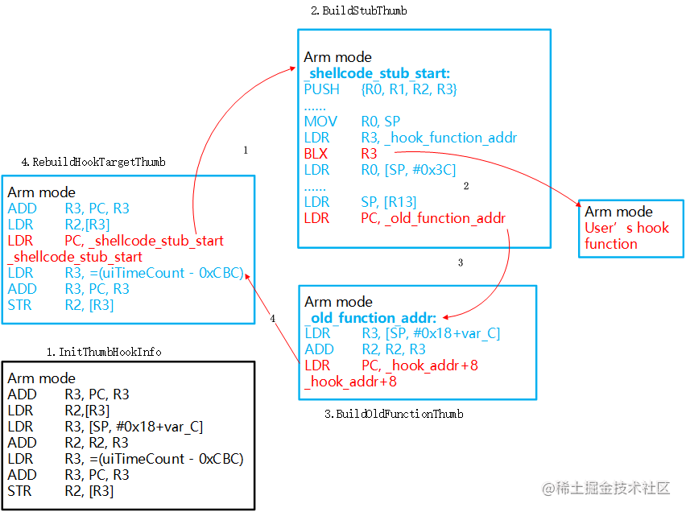

# Native Hook

## 1. 什么是HOOK？

Hook 直译过来就是“钩子”的意思，是指截获进程对某个 API 函数的调用，使得 API 的执行流程转向我们实现的代码片段，从而实现我们所需要得功能，这里的功能可以是监控、修复系统漏洞，也可以是劫持或者其他恶意行为。

## 2. 为什么要HOOK？

Native Hook技术一直在解决一些疑难问题时特别有效，由于不仅可以修改我们自己的代码，也可以修改系统的代码，所以用处非常广泛，在性能监控方面可以做锁阻塞，IO ，Binder call，fd泄漏等的监控，在稳定性方面可以修复特殊机型或者系统的一些native bug。

## 3. 如何HOOK？

`Native Hook`技术又分为`GOT/PLT Hook`，`Inline Hook`，`Trap Hook` 等，`GOT/PLT Hook`兼容性比较好，可以达到上线标准，但是只能Hook基于GOT表的一些函数，`Inline Hook`能Hook几乎所有函数，但是兼容性较差，不能达到上线标准，`Trap Hook`兼容性也能达到上线标准而且Hook范围比Inline Hook还广，但是由于它是基于信号处理的，性能比较差。

### 3.1 GOT/PLT Hook

GOT/PLT Hook 主要是用于替换某个 SO 的外部调用，通过将外部函数调用跳转成我们的目标函数。

那 GOT/PLT Hook 的实现原理究竟是什么呢？你需要先对 SO 库文件的 ELF 文件格式和动态链接过程有所了解。

#### ELF 格式

ELF（Executableand Linking Format）是可执行和链接格式，它是一个开放标准，各种 UNIX 系统的可执行文件大多采用 ELF 格式。虽然 ELF 文件本身就支持三种不同的类型（重定位、执行、共享），不同的视图下格式稍微不同，不过它有一个统一的结构，这个结构如下图所示。



我们主要关心“.plt”和“.got”这两个节区：

* **.plt**。该节保存过程链接表（Procedure Linkage Table）。
* **.got**。该节保存着全局的偏移量表。

我们也可以使用`readelf -S`来查看 ELF 文件的具体信息。

#### 链接过程

接下来我们再来看看动态链接的过程，当需要使用一个 Native 库（.so 文件）的时候，我们需要调用`dlopen("libname.so")`来加载这个库。

在我们调用了`dlopen("libname.so")`之后，系统首先会检查缓存中已加载的 ELF 文件列表。如果未加载则执行加载过程，如果已加载则计数加一，忽略该调用。然后系统会用从 `libname.so` 的`dynamic`节区中读取其所依赖的库，按照相同的加载逻辑，把未在缓存中的库加入加载列表。

你可以使用下面这个命令来查看一个库的依赖：

```shell
readelf -d <library> | grep NEEDED
```

下面我们大概了解一下系统是如何加载的 ELF 文件的。

* 读 ELF 的程序头部表，把所有 PT_LOAD 的节区 mmap 到内存中。

* 从“.dynamic”中读取各信息项，计算并保存所有节区的虚拟地址，然后执行重定位操作。

* 最后 ELF 加载成功，引用计数加一。

但是这里有一个关键点，在 ELF 文件格式中我们只有函数的绝对地址。如果想在系统中运行，这里需要经过 **重定位**。这其实是一个比较复杂的问题，因为不同机器的 CPU 架构、加载顺序不同，导致我们只能在运行时计算出这个值。不过还好动态加载器（`/system/bin/linker`）会帮助我们解决这个问题。

如果你理解了动态链接的过程，我们再回头来思考一下“.got”和“.plt”它们的具体含义。

* **The Global Offset Table (GOT)**。简单来说就是在数据段的地址表，假定我们有一些代码段的指令引用一些地址变量，编译器会引用 GOT 表来替代直接引用绝对地址，因为绝对地址在编译期是无法知道的，只有重定位后才会得到 ，GOT 自己本身将会包含函数引用的绝对地址。
* **The Procedure Linkage Table (PLT)**。PLT 不同于 GOT，它位于代码段，动态库的每一个外部函数都会在 PLT 中有一条记录，每一条 PLT 记录都是一小段可执行代码。 一般来说，外部代码都是在调用 PLT 表里的记录，然后 PLT 的相应记录会负责调用实际的函数。我们一般把这种设定叫作“[蹦床](https://en.wikipedia.org/wiki/Trampoline_%28computing%29)”（Trampoline）。

PLT 和 GOT 记录是一一对应的，并且 GOT 表第一次解析后会包含调用函数的实际地址。既然这样，那 PLT 的意义究竟是什么呢？PLT 从某种意义上赋予我们一种懒加载的能力。当动态库首次被加载时，所有的函数地址并没有被解析。下面让我们结合图来具体分析一下首次函数调用，请注意图中黑色箭头为跳转，紫色为指针。



* 我们在代码中调用 func，编译器会把这个转化为 func@plt，并在 PLT 表插入一条记录

* PLT 表中第一条（或者说第 0 条）PLT[0]是一条特殊记录，它是用来帮助我们解析地址的。通常在类 Linux 系统，这个的实现会位于动态加载器，就是提到的 `/system/bin/linker`

* 其余的 PLT 记录都均包含以下信息：

  * 跳转 GOT 表的指令（jmp *GOT[n]）。
  * 为上面提到的第 0 条解析地址函数准备参数。
  * 调用 PLT[0]，这里 resovler 的实际地址是存储在 GOT[2] 。
  
* 在解析前 GOT[n]会直接指向 jmp *GOT[n]的下一条指令。在解析完成后，我们就得到了 func 的实际地址，动态加载器会将这个地址填入 GOT[n]，然后调用 func。

  

如果对上面的这个调用流程还有疑问，你可以参考[《GOT 表和 PLT 表》](https://www.jianshu.com/p/0ac63c3744dd)这篇文章，它里面有一张图非常清晰。

  

当第一次调用发生后，之后再调用函数 func 就高效简单很多。首先调用 PLT[n]，然后执行 jmp *GOT[n]。GOT[n]直接指向 func，这样就高效的完成了函数调用。



总结一下，因为很多函数可能在程序执行完时都不会被用到，比如错误处理函数或一些用户很少用到的功能模块等，那么一开始把所有函数都链接好实际就是一种浪费。**为了提升动态链接的性能，我们可以使用 PLT 来实现延迟绑定的功能。**

对于函数运行的实际地址，我们依然需要通过 GOT 表得到，整个简化过程如下：



了解PLT Hook的原理后，可以进一步分析出这种技术的特点：

- 由于修改的是GOT表中的数据，因此修改后，所有对该函数进行调用的地方就都会被Hook到。这个效果的影响范围是该PLT和GOT所处的整个so库。因此，当目标so库中多行被执行代码都调用了该PLT项所对应的函数，那它们都会去执行Hook功能。
- PLT与GOT表中仅仅包含本ELF需要调用的共享库函数项目，因此不在PLT表中的函数无法Hook到。

那么这些特点会导致什么呢？

- 可以大量Hook那些系统API，但是难以精准Hook住某次函数调用。这比较适用于开发者对于自家APP性能监控的需求。比如Hook住malloc使其输出参数，这样就能大量统计评估该APP对于内存的需求。但是对于一些对Hook对象有一定精准度要求的需求来说很不利，比如说是安全测试或者逆向分析的工作需求，这些工作中往往需要对于目标so中的某些关键点有准确的观察。
- 对于一些so内部自定义的函数无法Hook到。因为这些函数不在PLT表和GOT表里。这个缺点对于不少软件分析者来说可能是无法忍受的。因为许多关键或核心的代码逻辑往往都是自定义的。例如NDK中实现的一些加密工作，即使使用了共享库中的加密函数，但秘钥的保存管理等依然需要进一步分析，而这些工作对于自定义函数甚至是某行汇编代码的监控能力要求是远远超出PLT Hook所能提供的范围。
- 在回调原函数方面，PLT Hook在hook目标函数时，如果需要回调原来的函数，那就在Hook后的功能函数中直接调用目标函数即可。可能有点绕，详细解释一下：假设对目标函数malloc()的调用在1.so中，用户用PLT Hook技术开发的HookMalloc()功能函数在2.so中。（因为通常情况下目标函数与用户的自定义Hook功能函数不在一个ELF文件里）当1.so中调用malloc()时会去1.so的PLT表中查询，结果是执行流程进入了2.so中的HookMalloc()中。如果这时候HookMalloc中希望调用原目标函数malloc()，那就直接调用malloc()就好了。因为这里的malloc会去2.so中的PLT表中查询，不受1.so中那个被修改过的PLT表的影响。

### 3.2 Trap Hook

对于函数内部的 Hook，你可以先从头想一下，会发现调试器就具备一切 Hook 框架具有的能力，可以在目标函数前断住程序，修改内存、程序段，继续执行。业界也有不少人将 Trap Hook 叫作断点 Hook，它的原理就是在需要 Hook 的地方想办法触发断点，并捕获异常。一般我们会利用 SIGTRAP 或者 SIGKILL（非法指令异常）这两种信号。下面以 SIGTRAP 信号为例，具体的实现步骤如下。



* 注册信号接收句柄（signal handler），不同的体系结构可能会选取不同的信号，我们这里用 SIGTRAP。

* 在我们需要 Hook 得部分插入 Trap 指令。

* 系统调用 Trap 指令，进入内核模式，调用我们已经在开始注册好的信号接收句柄（signal handler）。

* 执行我们信号接收句柄（signal handler），这里需要注意，所有在信号接收句柄（signal handler）执行的代码需要保证[async-signal-safe](http://man7.org/linux/man-pages/man7/signal-safety.7.html)。这里我们可以简单的只把信号接收句柄当作蹦床，使用 logjmp 跳出这个需要 async-signal-safe（正如我在“崩溃分析”所说的，部分函数在 signal 回调中使用并不安全）的环境，然后再执行我们 Hook 的代码。

* 在执行完 Hook 的函数后，我们需要恢复现场。这里如果我们想继续调用原来的函数 A，那直接回写函数 A 的原始指令并恢复寄存器状态。

> Trap Hook 兼容性非常好，它也可以在生产环境中大规模使用。但是它最大的问题是效率比较低，不适合 Hook 非常频繁调用的函数。Facebook 的[Profilo](https://github.com/facebookincubator/profilo)就是通过定期发送 SIGPROF 信号来实现卡顿监控的。

  

### 3.3 Inline Hook

跟 Trap Hook 一样，Inline Hook 也是函数内部调用的 Hook。它直接将函数开始（Prologue）处的指令更替为跳转指令，使得原函数直接跳转到 Hook 的目标函数函数，并保留原函数的调用接口以完成后续再调用回来的目的。

原理如下图所示




这张图是一张arm下最基本的hook流程，从上图中可以看出主要有如下几个步骤：

- 在想要Hook的目标代码处备份下面的几条指令，然后插入跳转指令，把程序流程转移到一个stub段上去。
- 在stub代码段上先把所有寄存器的状态保存好，并调用用户自定义的Hook功能函数，然后把所有寄存器的状态恢复并跳转到备份代码处。
- 在备份代码处把当初备份的那几条指令都执行一下，然后跳转到当初备份代码位置的下面接着执行程序。

由此可以看出使用Inline Hook有如下的Hook效果特点：

- 完全不受函数是否在PLT表中的限制，直接在目标so中的任意代码位置都可进行Hook。这个Hook精准度是汇编指令级的。这对于逆向分析人员和安全测试人员来说是个非常好的特性！
- 可以介入任意函数的操作。由于汇编指令级的Hook精度，以及不受PLT表的限制，Inline Hook技术可以去函数执行中的任意代码行间进行Hook功能操作，从而读取或修改任意寄存器，使得函数的操作流程完全可以被控制。
- 对Hook功能函数的限制较小。由于在第二步调用Hook功能函数前已经把所有之前的寄存器状态都进行保存了，因此此时的Hook功能函数几乎就是个独立的函数，它无需受限于原本目标函数的参数形式，完全都由自己说了算。并且执行完后也完全是一个正常的函数退出形式释放栈空间。
- 对于PLT Hook的强制批量Hook的特性，Inline Hook要灵活许多。当想要进行批量Hook一些系统API时也可以直接去找内存里对应的如libc.so这些库，对它们中的API进行Hook，这样的话，所有对这个API的调用也就都被批量Hook了。

与 GOT/PLT Hook 相比，Inline Hook 可以不受 GOT/PLT 表的限制，几乎可以 Hook 任何函数。不过其实现十分复杂，我至今没有见过可以用在生产环境的实现。并且在 ARM 体系结构下，无法对叶子函数和很短的函数进行 Hook。

如果只对于系统调用有参数或者性能上的监控需求，那可以考虑采用PLT Hook技术路线。一般适合APP的官方员工。 而如果是希望应对各种各样APP自己独有的NDK函数或者代码段的话，目前只能选择Inline Hook。适合APP逆向人员，软件分析人员，CTF Android逆向解题等。


### 3.4 各个流派的优缺点比较

1. GOT/PLT Hook 是一个比较中庸的方案，有较好的性能，中等的实现难度，但其只能 Hook 动态库之间的调用的函数，并且无法 Hook 未导出的私有函数，而且只存在安装与卸载 2 种状态，一旦安装就会 Hook 所有函数调用。
2. Trap Hook 最为稳定，但由于需要切换运行模式（R0/R3），且依赖内核的信号机制，导致性能很差。
3. Inline Hook 是一个非常激进的方案，有很好的性能，并且也没有 PLT 作用域的限制，可以说是一个非常灵活、完美的方案。但其实现难度极高，我至今也没有看到可以部署在生产环境的 Inline Hook 方案，因为涉及指令修复，需要编译器的各种优化。

|              | 粒度 | 实现难度 | 性能 | 作用域          | 稳定性           |
| ------------ | ---- | -------- | ---- | --------------- | ---------------- |
| GOT/PLT Hook | 函数 | 中       | 高   | 低（GOT/PLT表） | 高               |
| Trap Hook    | 指令 | 中       | 低   | 高              | 高               |
| Inline Hook  | 指令 | 高       | 高   | 高              | 低(实现难度过大) |

可以看出三种方案都是各有优缺点，我们可以根据自己的需要选择合适的Hook方案，发挥他们的长处，目前来说基于兼容性和性能两方面考虑，GOT/PLT Hook通常是我们线上项目的最优选择。

> 但是需要注意，无论是哪一种 Hook 都只能 Hook 到应用自身的进程，我们无法替换系统或其他应用进程的函数执行。


## 4. PLT Hook 实践

GOT/PLT Hook 看似简单，但是实现起来也是有一些坑的，需要考虑兼容性的情况。一般来说，推荐使用业界的成熟方案。

* 爱奇艺开源的的[xHook](https://github.com/iqiyi/xHook)，它使用的也是 GOT Hook。

* Facebook 的[PLT Hook](https://github.com/facebookincubator/profilo/tree/main/deps/plthooks)。

* 字节开源的[bhook](https://github.com/bytedance/bhook), 和xHook是同一个作者，估计是跳槽到了字节

总结一下 xhook 中执行 PLT hook 的流程：

1. 读 maps，获取 ELF 的内存首地址（start address）。
2. 验证 ELF 头信息。
3. 从 PHT 中找到类型为 `PT_LOAD` 且 offset 为 `0` 的 segment。计算 ELF 基地址。
4. 从 PHT 中找到类型为 `PT_DYNAMIC` 的 segment，从中获取到 `.dynamic` section，从 `.dynamic` section中获取其他各项 section 对应的内存地址。
5. 在 `.dynstr` section 中找到需要 hook 的 symbol 对应的 index 值。
6. 遍历所有的 `.relxxx` section（重定位 section），查找 symbol index 和 symbol type 都匹配的项，对于这项重定位项，执行 hook 操作。hook 流程如下：
   - 读 maps，确认当前 hook 地址的内存访问权限。
   - 如果权限不是可读也可写，则用 `mprotect` 修改访问权限为可读也可写。
   - 如果调用方需要，就保留 hook 地址当前的值，用于返回。
   - 将 hook 地址的值替换为新的值。（执行 hook）
   - 如果之前用 `mprotect` 修改过内存访问权限，现在还原到之前的权限。
   - 清除 hook 地址所在内存页的处理器指令缓存。

  如果不想深入它内部的原理，我们只需要直接使用这些开源的优秀方案就可以了, 具体PLT Hook 实践参见[Android Native Hook](https://juejin.cn/post/6844903698435407879#heading-5)

## 参考

[Native Hook 技术，天使还是魔鬼？](https://time.geekbang.org/column/article/87269)

[Android Native Hook](https://juejin.cn/post/6844903698435407879#heading-22)