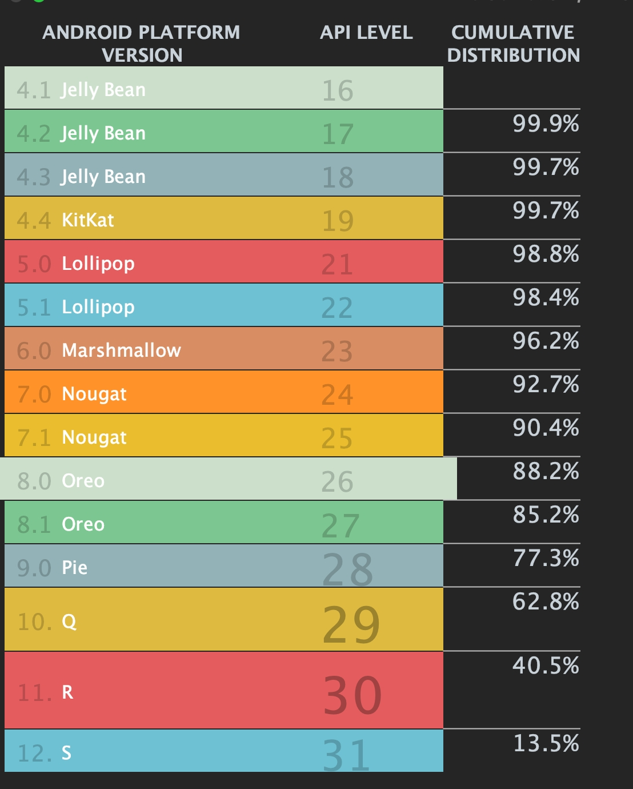
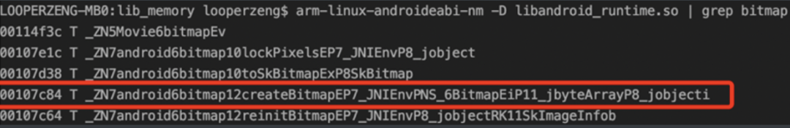
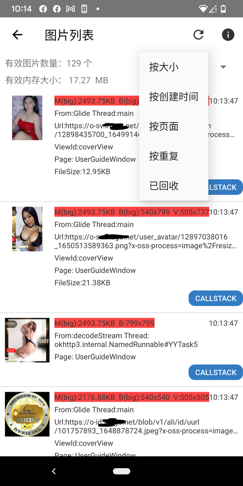
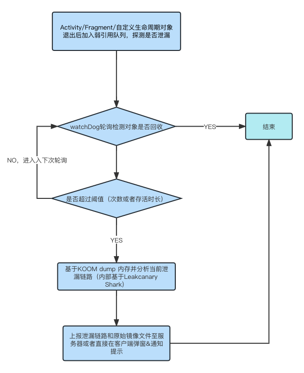
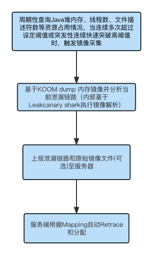
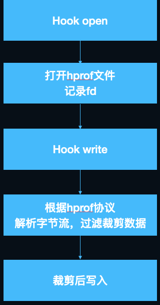
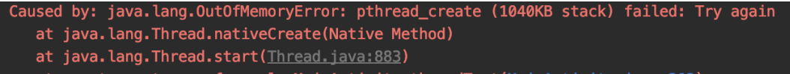
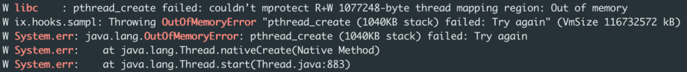
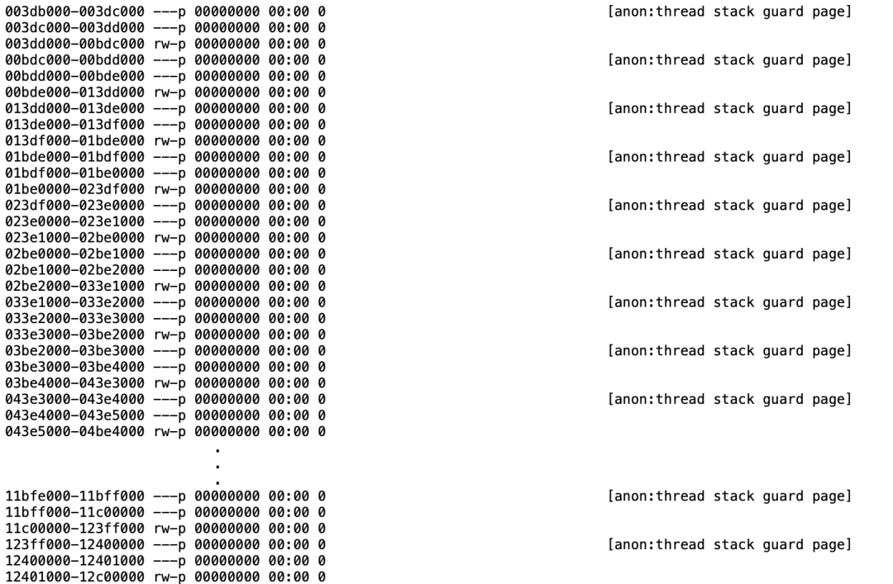

# Android 内存综合治理

## 1. 内存基础监控

### 1.1 简介
内存基础监控主要负责对客户端的整体内存状态进行监控，借助线上海量用户的复杂案例来帮助我们发现在开发及测试阶段难以发现的问题，同时也能够帮助我们对客户端的内存使用情况进行分析，从而帮助我们优化客户端的内存使用情况。

监控模块主要实现对`虚拟内存`、`Java堆`、`FD数量`、`线程数量`、`PSS`、`Native Heap`的监控，根据系统限制或设置固定数值，定期查看其状态，同时我们把页面跳转时记录的内存数据记录在链路中进行上报，从而统计出应用运行过程中各个业务场景的内存状态。

### 1.2. 核心源码
```kotlin
// FD数量,耗时一般
fun getFds(): Int {
    lastFDCount = 0
    runCatching {
        if (appFdFile == null) {
            appFdFile = File("/proc/self/fd")
        }
        appFdFile?.listFiles { _, name -> TextUtils.isDigitsOnly(name) }
            ?.size ?: 0
    }.getOrDefault(0).also { lastFDCount = it }
    return lastFDCount
}


/**
 * Get Threads.
 * 耗时一般
 */
fun getProcessStatus(): ProcessStatus {
    val processStatus = ProcessStatus()
    runCatching {
        if (appStatusFile == null) {
            appStatusFile = File("/proc/self/status")
        }
        appStatusFile?.useLines {
            it.forEach { line ->
                when {
                    line.startsWith("VmSize") -> processStatus.vssKbSize = VSS_REGEX.matchValue(line)
                    line.startsWith("VmRSS") -> processStatus.rssKbSize = RSS_REGEX.matchValue(line)
                    line.startsWith("Threads") ->
                        processStatus.threadsCount = THREADS_REGEX.matchValue(line)
                }
            }
        }
    }
    lastProcessStatus = processStatus
    return processStatus
}


/**
 *  获取内存信息 比较耗时
 */
fun getProcessMemoryInfo(): ProcessMemInfo {
    val memInfo = ProcessMemInfo()
    runCatching {
        val mi = Debug.MemoryInfo()
        Debug.getMemoryInfo(mi)
        if (Build.VERSION.SDK_INT >= 23) {
            memInfo.javaHeapInKb = mi.getMemoryStat("summary.java-heap").toLong()
            memInfo.nativeHeapInKb = mi.getMemoryStat("summary.native-heap").toLong()
            memInfo.code = mi.getMemoryStat("summary.code").toLong()
            memInfo.stack = mi.getMemoryStat("summary.stack").toLong()
            memInfo.graphics = mi.getMemoryStat("summary.graphics").toLong()
            memInfo.system = mi.getMemoryStat("summary.system").toLong()
            memInfo.totalPssInKb = mi.getMemoryStat("summary.total-pss").toLong()
            memInfo.totalSwap = mi.getMemoryStat("summary.total-swap").toLong()
        } else {
            memInfo.javaHeapInKb = mi.dalvikPrivateDirty.toLong()
            memInfo.nativeHeapInKb = mi.nativePrivateDirty.toLong()
//            val otherPrivateDirty = mi.otherPrivateDirty
            memInfo.system = if (Build.VERSION.SDK_INT >= 19) {
                mi.totalPss - mi.totalPrivateDirty - mi.totalPrivateClean
            } else {
                mi.totalPss - mi.totalPrivateDirty
            }.toLong()
            memInfo.totalPssInKb = mi.totalPss.toLong()
        }
    }
    lastProcessMemInfo = memInfo
    return lastProcessMemInfo
}


```

## 2. 图片检测&监控

### 2.1. 简介
假设屏幕分辨率 `1080x1920`，一张 Bitmap 占满屏幕时内存大小是`1080x1920x4`，大约 8MB。所以一个不起眼的 Bitmap 占用的内存也远远大于多数对象。可见，如果应用内有许多不合理的图片，就会拉高内存水位。如下图， 目前88%以上的用户的手机是8.0及更高系统版本，它的内存申请是在Native层的。因此，图片内存的分析重点放在8.0以及更高的系统版本上。


从[Bitmap: 从出生到死亡](https://blog.adison.top/perf-opt/Android/bitmap/bitmap-from-birth-to-death/#3-bitmap) 可以知道， 


无论哪种Bitmap创建方式，最终殊途同归。都会通过`Bitmap.cpp`中的`Bitmap::createBitmap`方法创建Bitmap对象。

所以，我们只需要hook这个`createBitmap`函数，就能够拿到每次图片创建时的bitmap的Java对象。通过该对象，可以获得`图片的尺寸大小`、`内存占用大小`，`堆栈`等信息，将这些信息上报到性能平台也就达到了检测与监控图片创建的目标。

这里hook的方案采用爱奇艺开源的`plt-hook`开源方案[xHook](https://github.com/iqiyi/xHook)来完成。关于`plt-hook`具体原理见[Native-Hook](https://blog.adison.top/perf-opt/Android/memory/Native-Hook/)。


那怎么查找到这个函数呢？

首先需要通过 `adb pull system/lib/libandroid_runtime.so` 拿到系统的so文件，然后通过`arm-linux-androideabi-nm -D libandroid_runtime.so | grep bitmap` ，可以查找到对应的函数名，也就是我们要hook的函数，系统版本不同可能会有差异，注意兼容。



### 2.2. 实现

核心源码如下：

```c++
  jobject (*old_create_bitmap_fun)(JNIEnv *env, void *bitmap,
                                     int bitmapCreateFlags, jbyteArray ninePatchChunk,
                                     jobject ninePatchInsets,
                                     int density);
    void Hooker::InitHook() {
        bool hooked = false;
        xhook_clear();
        int result = xhook_register(hook_lib,
                                    GetCreateBitmapSymbol(),
                                    reinterpret_cast<void *>(HookBitmapCreate),
                                    reinterpret_cast<void **>(&old_create_bitmap_fun));
        result != 0 ? hooked = false : hooked = true;
        if (hooked) {
            int result = xhook_refresh(0);
        }
    }

    const char *Hooker::GetCreateBitmapSymbol() {
        if (android_api >= __ANDROID_API_O__) {
            return "_ZN7android6bitmap12createBitmapEP7_JNIEnvPNS_6BitmapEiP11_jbyteArrayP8_jobjecti";
        } else if (android_api >= __ANDROID_API_M__) {
            return "_ZN11GraphicsJNI12createBitmapEP7_JNIEnvPN7android6BitmapEiP11_jbyteArrayP8_jobjecti";
        } else if (android_api >= __ANDROID_API_L__) {
            return "_ZN11GraphicsJNI12createBitmapEP7_JNIEnvP8SkBitmapP11_jbyteArrayiS5_P8_jobjecti";
        } else if (android_api >= __ANDROID_API_K__) {
            return "_ZN11GraphicsJNI12createBitmapEP7_JNIEnvP8SkBitmapP11_jbyteArrayiS5_P10_jintArrayi";
        } else {
            bitmapProfiler::Log::error(TAG, "SDK :%d not support", android_api);
            return "_ZN7android6bitmap12createBitmapEP7_JNIEnvPNS_6BitmapEiP11_jbyteArrayP8_jobjecti";
        }
    }

     jobject Hooker::HookBitmapCreate(JNIEnv *env, void *bitmap, int bitmapCreateFlags,
                                     jbyteArray ninePatchChunk, jobject ninePatchInsets,
                                     int density) {

        jobject obj = old_create_bitmap_fun(env, bitmap, bitmapCreateFlags,
                                            ninePatchChunk, ninePatchInsets, density);

        if (hookEnabled()) {
           ...
           // 这里把hook到的bitmap传递到java层处理
        }

        return obj;
    }
   
```

这样我们就得知经过app创建的所有Bitmap的内存大小。

我们还可以更进一步，获取图片所在view的宽高，有时由于一些错误处理，会导致一个很小的view里面承载了一个内存宽高比它本身宽高大得多的图片，这样的话，解码图片时按照内存宽高来解码就很浪费了；

另外，我们也可以获取图片文件大小。

这里我们可以通过字节码插桩技术来实现。

以hook `Okhttp`和`Glide`为例，核心源码如下:

**ASM 相关代码**
```java
public class ImageProfilerClassVisitor extends BaseClassVisitor {
    
    ...

    @Override
    public MethodVisitor visitMethod(int access, String methodName, String desc, String signature, String[] exceptions) {
        MethodVisitor mv = cv.visitMethod(access, methodName, desc, signature, exceptions);
   
        if(mClassName.equals("com/bumptech/glide/request/SingleRequest") && (methodName.equals("<init>") || methodName.equals( "init")) && desc!=null){
            return mv == null ? null : new GlideMethodAdapter(mv,access,methodName,desc);
        }

        if(mClassName.equals("okhttp3/OkHttpClient$Builder") && methodName.equals("<init>") && desc.equals("()V")){
            return mv == null ? null : new OkHttpMethodAdapter(mv,access,methodName,desc);
        }

        return mv;
    }

}

public class OkHttpMethodAdapter extends AdviceAdapter {

    ...

    @Override
    protected void onMethodExit(int opcode) {
        super.onMethodExit(opcode);
        //添加应用拦截器
        mv.visitVarInsn(ALOAD, 0);
        mv.visitFieldInsn(GETFIELD, "okhttp3/OkHttpClient$Builder", "interceptors", "Ljava/util/List;");
        mv.visitMethodInsn(INVOKESTATIC, "[pageageName]/instrument/image/ImageTracer", "getInstance", "()L[pageageName]/instrument/image/ImageTracer;", false);
        mv.visitMethodInsn(INVOKEVIRTUAL, "[pageageName]/instrument/image/ImageTracer", "getOkHttpInterceptors", "()Ljava/util/List;", false);
        mv.visitMethodInsn(INVOKEINTERFACE, "java/util/List", "addAll", "(Ljava/util/Collection;)Z", true);
        mv.visitInsn(POP);
    }
}

public class GlideMethodAdapter extends AdviceAdapter {

     ...
    @Override
    protected void onMethodExit(int opcode) {
        super.onMethodExit(opcode);
        mv.visitVarInsn(ALOAD, 0);
        mv.visitMethodInsn(INVOKESTATIC, "[pageageName]/instrument/image/aop/glide/GlideHook", "proxy", "(Ljava/lang/Object;)V", false);
    }
}

```

**代理实现**

```java

public class ImageInterceptor implements Interceptor {


    @Override
    public Response intercept(Chain chain) throws IOException {
        //发出请求时不拦截
        Request request = chain.request();
        Response response = chain.proceed(request);
        //拦截响应
        String header = response.header("Content-Type");
        //如果是图片类型则拦截
        try {
            if(isImage(header) && ImageMonitorManager.INSTANCE.getInstalled()){
                process(response);
            }
        } catch (Throwable e) {
            e.printStackTrace();
        }
        return response;
    }

    private void process(Response response){
        String header = response.header("Content-Length");
         ...
        //获取图片大小
        ImageDataManager.INSTANCE.saveImageSizeInfo(response.request().url().toString(), Integer.parseInt(header));
    }

  ...
}


public class GlideHook  {

    public static void proxy(Object singleRequest) {
        try {
        ...
        requestListeners.add(new GlideImageListener());
        ...
    }
}

public class GlideImageListener<R> implements RequestListener<R> {


    @Override
    public boolean onResourceReady(R resource, Object model, Target<R> target, DataSource dataSource, boolean isFirstResource) {
         if(target instanceof CustomViewTarget || target instanceof ViewTarget){
                View view;
                if (target instanceof ViewTarget){
                    view = ((ViewTarget) target).getView();
                }else {
                    view = ((CustomViewTarget) target).getView();
                }
                target.getSize(new SizeReadyCallback() {
                    @Override
                    public void onSizeReady(int width, int height) {
                          if (resource == null)return;
                          // 获取view的宽高
                          ImageDataManager.INSTANCE.saveImageInfo(resource,theadName,width,height,"Glide",callStack,view,model.toString());
                    }
                });
            }
        return false;
    }
}

```
> 对于通过图片控件方法直接设置图片的情况，如`setImageDrawable`，`setImageBitmap`等，我们可以通过hook控件的相关方法来实现。这里要求项目最好有一套自己的控件系统，这样可以方便统一处理。

### 2.3. 小结

这样，我们就能得到应用创建的`Bitmap的内存大小`，`加载的view的大小`、`图片文件大小`等信息，通过这些信息，我们可以对图片进行优化，比如：

1. 是否存在过大内存的图片
    在清晰度要求不高的场景下，可以适当的缩小原始原图, 譬如一些磨砂模糊图片
2. 是否存在Bitmap的内存宽高远大于view大小的情况
    譬如，Glide是根据控件大小来为 transform 自动计算出具体的 width 和 height。对于宽高为 wrap_content 的控件，自动计算出的结果是当前屏幕大小，所以使用Glide加载的时候，控件布局尽量设置宽高，避免出现过大的图片
3. 是否存在过大的图片文件
   可以直接从云端获取指定宽高的图片 
4. 是否存在重复Bitmap
    可以考虑复用
5. Bitmap是否存在内存泄漏，是否正常回收
    譬如 `bitmap拷贝行为，通过源bitmap对象获得变换后的bitmap对象，这里需要考虑源bitmap是否可以立即释放。`

我们可以做成一个工具，方便查看定位问题，效果如下：



同时，上报性能监控平台数据，可以做版本数据对比以及一键提bug

!!! note "关于上面提到设置为wrap_content导致Glide加载图片内存过大问题源码"

    ```java
    # ViewTarget.java
    void getSize(@NonNull SizeReadyCallback cb) {
        int currentWidth = this.getTargetWidth();
        int currentHeight = this.getTargetHeight();
        ...
    }
    
    private int getTargetWidth() {
        ...
        return this.getTargetDimen(this.view.getWidth(), layoutParamSize, horizontalPadding);
    }
    
    private int getTargetDimen(int viewSize, int paramSize, int paddingSize) {
        int adjustedParamSize = paramSize - paddingSize;
        if (adjustedParamSize > 0) {
            return adjustedParamSize;
        } else if (this.waitForLayout && this.view.isLayoutRequested()) {
            return 0;
        } else {
            int adjustedViewSize = viewSize - paddingSize;
            if (adjustedViewSize > 0) {
                return adjustedViewSize;
            } else if (!this.view.isLayoutRequested() && paramSize == -2) {
                if (Log.isLoggable("ViewTarget", 4)) {
                    Log.i("ViewTarget", "Glide treats LayoutParams.WRAP_CONTENT as a request for an image the size of this device's screen dimensions. If you want to load the original image and are ok with the corresponding memory cost and OOMs (depending on the input size), use override(Target.SIZE_ORIGINAL). Otherwise, use LayoutParams.MATCH_PARENT, set layout_width and layout_height to fixed dimension, or use .override() with fixed dimensions.");
                }
                // 当设置LayoutParams.WRAP_CONTENT会走进这里，这里会返回当前屏幕的宽高，上面log也有明确提示
                return getMaxDisplayLength(this.view.getContext());
            } else {
                return 0;
            }
        }
    }
    ```

## 3. 内存泄露

### 3.1. Java内存泄露

> 这一部分的实现主要采用了快手[KOOM](https://github.com/KwaiAppTeam/KOOM)的方案，利用系统`Copy On Write`的特性，fork子进程后进行dump，避免了进程的冻结，后续的页面泄漏分析也会在独立的Service中执行，尽量降低对主进程的影响。


对于线下检查，不需要过于考虑性能影响，我们基于“应检尽检”原则，主动出击，发现一例检查一例，尽可以覆盖各种场景和情况。

基于 LeakCanary基本原理（**对象销毁时加入弱引用队列，然后检测目标是否被回收**） 以及`KOOM`我们在线下设计了一套自动分析上报内存泄露的工具，主要流程如下：




对于线上检查，需要优先考虑性能影响，我们基于“愿检尽检”原则，等待重要危险条件触发才去检查和镜像采集，尽量不影响用户体验。主要流程如下：




#### 原理

**镜像采集**

镜像采集采用虚拟机`supend->fork虚拟机进程->虚拟机resume->dump内存`镜像的策略，将传统Dump冻结进程20s的时间缩减至20ms以内。


```java
  ...
  ...
// 虚拟机suspend，然后fork
int pid = suspendAndFork();
if (pid == 0) {
  // Child process
// 子进程dump heap
  Debug.dumpHprofData(path);
  exitProcess();
} else if (pid > 0) {
  // Parent process
// 虚拟机resume，当前子线程等待子进程结束
  dumpRes = resumeAndWait(pid);
}
  ...
  ...
```
```c++
pid_t HprofDump::SuspendAndFork() {
  ...
  ...
  suspend_vm_fnc_();
  pid_t pid = fork();
  if (pid == 0) {
    prctl(PR_SET_NAME, "forked-dump-process");
  }
  ...
  ...
  return pid;
}

bool HprofDump::ResumeAndWait(pid_t pid) {
  ...
  ...
resume_vm_fnc_();
int status;
for (;;) {
  if (waitpid(pid, &status, 0) != -1 || errno != EINTR) {
    if (!WIFEXITED(status)) {
      return false;
    }
    return true;
  }
  return false;
}
  ...
  ...
}
```

 **HPROF 裁剪**

主要是去除了无用信息

- 跳过 header

- 分 tag 裁剪

  - 裁剪无用信息：`char[]; byte[]; timestamp; stack trace serial number; class serial number`;

  - 压缩数据信息

实现方式：dump hprof的过程中实时裁剪, 通过`hook write`，在写入文件过程中裁剪



**hprof解析性能优化**

Shark是LeakCanary 2.0推出的全新解析组件，主要做了以下几项优化：

* 索引，shark低内存开销的最根本原因就是通过索引做到了内存懒加载，遍历hprof时存储对象在hprof中的位置，并为其建立索引方便按需解析。

* 数据结构上做了深度优化，主要是使用了更高效的map，有2个：第一是对于key和value都是基础类型或字符串的使用hppc做map，第二是对于value不是基本类型的，使用SortedBytesMap存储内容。

具体的索引有：实例索引、类索引、字符串索引、类名索引、数组索引：

```java
/**
 * This class is not thread safe, should be used from a single thread.
 */
internal class HprofInMemoryIndex private constructor(
  private val positionSize: Int,
  private val hprofStringCache: LongObjectScatterMap<String>,
  private val classNames: LongLongScatterMap,
  private val classIndex: SortedBytesMap,
  private val instanceIndex: SortedBytesMap,
  private val objectArrayIndex: SortedBytesMap,
  private val primitiveArrayIndex: SortedBytesMap,
  private val gcRoots: List<GcRoot>,
  private val proguardMapping: ProguardMapping?,
  val primitiveWrapperTypes: Set<Long>
) {
 
/**
 * Code from com.carrotsearch.hppc.LongLongScatterMap copy pasted, inlined and converted to Kotlin.
 *
 * See https://github.com/carrotsearch/hppc .
 */
class LongLongScatterMap constructor(expectedElements: Int = 4) {
 
/**
 * A read only map of `id` => `byte array` sorted by id, where `id` is a long if [longIdentifiers]
 * is true and an int otherwise. Each entry has a value byte array of size [bytesPerValue].
 *
 * Instances are created by [UnsortedByteEntries]
 *
 * [get] and [contains] perform a binary search to locate a specific entry by key.
 */
internal class SortedBytesMap(
  private val longIdentifiers: Boolean,
  private val bytesPerValue: Int,
  private val sortedEntries: ByteArray
) {
```

所谓hppc是High Performance Primitive Collection的缩写，shark使用kotlin将其重写了。hppc只支持基本类型，所以没有了装、拆箱的性能损耗，相关集合操作也做了大量优化。

Koom对其主要做了以下几点优化：

* GC root剪枝，由于我们搜索Path to GC Root时，是从GC Root自顶向下BFS，如JavaFrame、MonitorUsed等此类GC Root可以直接剪枝。

* 基本类型、基本类型数组不搜索、不解析。

* 同类对象超过阈值时不再搜索。

* 增加预处理，缓存每个类的所有递归super class，减少重复计算。

* 将object ID的类型从long修改为int，Android虚拟机的object ID大小只有32位，目前shark里使用的都是long来存储的，OOM时百万级对象的情况下，可以节省10M内存。  

### 3.2. Native内存泄露

它的核心原理如下

* hook malloc/free 等内存分配器方法，用于记录 Native 内存分配元数据「大小、堆栈、地址等」
* 周期性的使用 `mark-and-sweep` 分析整个进程 Native Heap，获取不可达的内存块信息「地址、大小」
* 利用不可达的内存块的地址、大小等从我们记录的元数据中获取其分配堆栈，产出泄漏数据「不可达内存块地址、大小、分配堆栈等」

这里内部主要是利用[libmemunreachable](https://android.googlesource.com/platform/system/memory/libmemunreachable/+/master/README.md)来实现

## 4. 资源收敛、监控

### 4.1. 线程

线程是有限的系统资源，我们通常会使用线程池来复用线程，但使用了线程池并不意味着就能解决所有的线程使用问题，也并不是所有的业务场景都能使用线程池的，比如要求 looper 上下文的场景（HandlerThread）。

如果使用线程的逻辑出了 bug 导致意料之外的“野线程”出现并不断堆积，线程数量就有可能失控，即线程泄漏了。

我们知道，每个线程都对应了独立的栈内存。在 Android 中，默认创建一个 Java 线程需要占用大约 1M 的栈内存，如果是 native 线程，还可以通过 `pthread_attr_t` 参数为创建的线程指定栈的大小。 不加限制地创建线程，会让本不充裕的 32 位地址空间雪上加霜。

线程数量过多除了可能导致`pthread_create`问题，



那是不是升级到 64 位包，就没有问题了呢？答案是否定的。虽然 64 位包的虚拟地址空间很大，但是线程随着代码运行入栈，数据需要实际写入物理内存，应用的 `PSS` 也会增长。除此之外，系统对线程的数量也是有限制的。

系统从三个方面限制了进程的数量：

* 配置文件 [/proc/sys/kernel/threads-max](https://man7.org/linux/man-pages/man5/proc.5.html) 指定了系统范围的最大线程数量

* Linux resource limits 的 [RLIMIT_NPROC](https://man7.org/linux/man-pages/man2/getrlimit.2.html) 参数对应了当前用户 uid 的最大线程数量，Android 中基本上一个 应用就对应了一个 uid，因此这个阈值就可以认为是应用的最大线程数量

* [虚拟地址空间不足或者内核分配 vma 失败](https://cs.android.com/android/platform/superproject/+/master:bionic/libc/bionic/pthread_create.cpp;l=227)等内存原因，导致创建线程时分配栈内存时 mmap 或 mprotect 调用失败

前两者取决于厂商的配置，比如我手中的测试机 resource limits 阈值高达数万，而现网有些用户的机型则只有 500。

但对现在大多数手机而言，线程数量不太容易达到 `thread-max` 或者 `resource limits` 的阈值，通常是在还没达到限制阈值，就因为上述第三个原因而创建线程失败， `pthread_create` 将返回非 0 值 `EAGAIN()`。



#### 4.1.1  线程数量过多监控

通过 watchdog 周期检查监控应用的线程数量的方式，提前暴露问题，当数量超过设定阈值后，上报线程信息，用于排查线程泄漏问题并建立相关指标。虽然简单，但是好用。

可以通过读取 `/proc/[pid]/status` 中的 `Threads` 字段的值得到(见前面第一点：内存基础监控)，另外在 Linux 中每个线程都对应了一个 `/proc/[pid]/task/[tid]` 目录，该目录下的 stat 文件记录了线程 tid、线程名等信息，我们可以遍历 `/proc/[pid]/task` 目录得到当前进程所有线程的信息。

遍历 `/proc/[pid]/task/[tid]/stat` 文件会有比较多的 IO 操作，可以结合应用的实际情况设定阈值，超过阈值再进行 dump ,最后上报服务端聚类分析。

```java

    private fun getThreadCount(): Int {
        return SystemInfo.procStatus.thread
    }

    private fun dumpThreadIfNeed() {

        // 超过阈值再进行 dump
        if (mOverThresholdCount > monitorConfig.maxOverThresholdCount) return

        val threadNames = runCatching { File("/proc/self/task").listFiles() }
            .getOrElse {
                SwordLog.i(TAG, "/proc/self/task child files is empty")

                return@getOrElse emptyArray()
            }
            ?.map {
                runCatching { File(it, "comm").readText() }.getOrElse { "failed to read $it/comm" }
            }
            ?.map {
                if (it.endsWith("\n")) it.substring(0, it.length - 1) else it
            }
            ?: emptyList()

        SwordLog.i(TAG, "threadNames = $threadNames")

        OOMFileManager.createDumpFile(OOMFileManager.threadDumpDir)
            .run {
                runCatching { writeText(threadNames.joinToString(separator = ",")) }
            }
    }
```

大部分线程都是`Thread-?`、`pool-thread-?`这类没有特征的线程，仅通过上报的线程名难以定位到具体的业务代码。此外我们在 native 创建的线程，如果没有对子线程设置名字，子线程就会继承父线程的名字。如果我们可以拿到创建线程的 `stacktrace`，那这个问题就迎刃而解了。无论是java 线程还是native线程都 是通过 `pthread_create` 创建的，可以通过`native hook pthread_create` 来实现。


#### 4.1.2 线程栈内存泄漏监控

不了解 `pthread` 的同学可能会感到困惑，线程都退出了，为什么栈内存还会泄漏呢？我们看一下 Linux man page 中的描述：

> Either pthread_join(3) or pthread_detach() should be called foreach thread that an application creates, so that system resourcesfor the thread can be released.

`system resource `，其实主要就是指栈内存。只有 detach 状态的线程，才会在线程执行完退出时自动释放栈内存，否则就需要等待调用 join 来释放内存，而使用默认参数创建的 pthread 都是 joinable 状态的。

我们可以在创建线程时就通过 `pthread_attr_t` 参数把线程设置为 `PTHREAD_CREATE_DETACHED` 状态，那么创建的这个线程就不需要再显式调用 `pthread_detach` 或 `pthread_join` 了，Android 的 [Java 线程](https://cs.android.com/android/platform/superproject/+/master:art/runtime/thread.cc;l=915?q=thread.cc)在创建的时候就设置了此状态。

所以这个问题只会发生在通过native 创建的线程。

```c++
JNIEXPORT void JNICALL
Java_com_duowan_sample_hook_JNIObj_threadTest(JNIEnv *env, jclass clazz) {
    pthread_t pthreads[PTHREAD_COUNT];
    for (int i = 0; i < PTHREAD_COUNT; ++i) {
        pthread_attr_t attr;
        pthread_attr_init(&attr);
        //        pthread_attr_setdetachstate(&attr, PTHREAD_CREATE_DETACHED);

        int ret = pthread_create(&pthreads[i], nullptr, thread_test, nullptr);
//        pthread_detach(pthreads[i]);
        pthread_getattr_np(pthreads[i], &attr);
        int state = PTHREAD_CREATE_JOINABLE;
        pthread_attr_getdetachstate(&attr, &state);
        LOGD(TAG, "detach state = %d", state);
        if (i % 500 == 0) {
            LOGD(TAG, "sleep");
            sleep(1);
        }
        if (ret != 0) {
            LOGD(TAG, "pthread_create error[%d]: %d", i, ret);
            break;
        }

    }
    ...
}
```

这里既没有 detach 也没有 join，当线程执行完就退出了，但这时查看 `/proc/[pid]/maps` 就能发现，内存中充斥着大量的栈内存没有释放，并且与线程的数量不匹配。



同样的，我们可以通过 hook `pthread_detach` 和 `pthread_join` 这两个 API，就能统计出是哪些线程的栈内存泄漏了。

整体native hook核心源码如下：
    
```c++
    bool ThreadHooker::RegisterSo(const std::string &lib, int source) {
        if (IsLibIgnored(lib)) {
            return false;
        }
        auto lib_ctr = lib.c_str();
        sword::Log::info(TAG, "HookSo %d %s", source, lib_ctr);
        xhook_register(lib_ctr, "pthread_create",
                       reinterpret_cast<void *>(HookThreadCreate), nullptr);
        xhook_register(lib_ctr, "pthread_detach",
                       reinterpret_cast<void *>(HookThreadDetach), nullptr);
        xhook_register(lib_ctr, "pthread_join",
                       reinterpret_cast<void *>(HookThreadJoin), nullptr);
        xhook_register(lib_ctr, "pthread_exit",
                       reinterpret_cast<void *>(HookThreadExit), nullptr);

        return true;
    }

    int ThreadHooker::HookThreadCreate(pthread_t *tidp, const pthread_attr_t *attr,
                                       void *(*start_rtn)(void *), void *arg) {
        if (hookEnabled() && start_rtn != nullptr) {
            auto time = Util::CurrentTimeMs();
            sword::Log::info(TAG, "HookThreadCreate");
            auto *hook_arg = new StartRtnArg(arg, Util::CurrentTimeMs(), start_rtn);
            auto *thread_create_arg = hook_arg->thread_create_arg;
            void *thread = sword::CallStack::GetCurrentThread();
            if (thread != nullptr) {
                // 获取java栈，通过 libart.so得到 art::Thread::DumpJavaStack的函数指针实现
                sword::CallStack::JavaStackTrace(thread,
                                                hook_arg->thread_create_arg->java_stack);
            }
            // 获取native栈, 基于Unwind实现，具体参见https://blog.adison.top/perf-opt/Android/memory/native-backtrace/
            sword::CallStack::FastUnwind(thread_create_arg->pc,
                                         sword::Constant::kMaxCallStackDepth);
            thread_create_arg->stack_time = Util::CurrentTimeMs() - time;
            return pthread_create(tidp, attr,
                                  reinterpret_cast<void *(*)(void *)>(HookThreadStart),
                                  reinterpret_cast<void *>(hook_arg));
        }
        return pthread_create(tidp, attr, start_rtn, arg);
    }

    int ThreadHooker::HookThreadDetach(pthread_t t) {
        if (!hookEnabled()) return pthread_detach(t);
        ...
        // 记录detach的线程
        bool valid = threadMap.count(threadId) > 0;
        sword::Log::info(TAG, "DetachThread tid:%p", threadId);
        if (valid) {
            threadMap[threadId].thread_detached = true;
        } else {
            leakThreadMap.erase(threadId);
        }
        return pthread_detach(t);
    }

    int ThreadHooker::HookThreadJoin(pthread_t t, void **return_value) {
        if (!hookEnabled()) return pthread_join(t, return_value);

         ...
        // 记录join的线程
        bool valid = threadMap.count(threadId) > 0;
        sword::Log::info(TAG, "JoinThread tid:%p", threadId);
        if (valid) {
            threadMap[threadId].thread_detached = true;
        } else {
            leakThreadMap.erase(threadId);
        }
        return pthread_join(t, return_value);
    }

    void ThreadHooker::HookThreadExit(void *return_value) {
        if (!hookEnabled()) pthread_exit(return_value);

        bool valid = threadMap.count(threadId) > 0;
        if (!valid) return;
        auto &item = threadMap[threadId];
        sword::Log::info(TAG, "ExitThread tid:%p name:%s", threadId,
                        item.name.c_str());

        item.exitTime = time;
        item.name.assign(threadName);
        if (!item.thread_detached) {
            // 泄露了
            sword::Log::error(TAG,
                             "Exited thread Leak! Not joined or detached!\n tid:%p",
                             threadId);
            leakThreadMap[threadId] = item;
        }
        threadMap.erase(threadId);
        sword::Log::info(TAG, "ExitThread finish");
        pthread_exit(return_value);
    }
```


### 4.2. 其他资源触动监控

* **文件句柄数量过多**

```java
    private fun getFdCount(): Int {
        return File("/proc/self/fd").listFiles()?.size ?: 0
    }

    private fun dumpFdIfNeed() {
        SwordLog.i(TAG, "over threshold dumpFdIfNeed")

        if (mOverThresholdCount > monitorConfig.maxOverThresholdCount) return

        if (Build.VERSION.SDK_INT < Build.VERSION_CODES.LOLLIPOP) return

        val fdNames = runCatching { File("/proc/self/fd").listFiles() }
            .getOrElse {
                SwordLog.i(TAG, "/proc/self/fd child files is empty")

                return@getOrElse emptyArray()
            }
            ?.map { file ->
                runCatching { Os.readlink(file.path) }.getOrElse { "failed to read link ${file.path}" }
            }
            ?: emptyList()

        OOMFileManager.createDumpFile(OOMFileManager.fdDumpDir)
            .run {
                runCatching { writeText(fdNames.sorted().joinToString(separator = ",")) }
            }
    }
```

* **32位系统虚拟内存过大**

虚拟内存占用可以通过读取`/proc/self/status`获取

```java
    File("/proc/self/status").forEachLineQuietly { line ->
        if (procStatus.vssInKb != 0 && procStatus.rssInKb != 0
            && procStatus.thread != 0) return@forEachLineQuietly

        when {
        line.startsWith("VmSize") -> {
            procStatus.vssInKb = VSS_REGEX.matchValue(line)
        }

        line.startsWith("VmRSS") -> {
            procStatus.rssInKb = RSS_REGEX.matchValue(line)
        }

        line.startsWith("Threads") -> {
            procStatus.thread = THREADS_REGEX.matchValue(line)
        }
        }
    }

    val info = SystemInfo.procStatus
    if (!SystemInfo.isSupport64Bit && info.vssInKb > monitorConfig.vssSizeThreshold) {
        SwordLog.e(
            TAG, "oom vss  < " +
            "${SizeUnit.KB.toMB(info.vssInKb)}M")
    }
```

* **手机可用内存过低**

手机可用内存可通过读取`/proc/meminfo`获取
```java
    File("/proc/meminfo").forEachLineQuietly { line ->
      when {
        line.startsWith("MemTotal") -> {
          memInfo.totalInKb = MEM_TOTAL_REGEX.matchValue(line)
        }

        line.startsWith("MemFree") -> {
          memInfo.freeInKb = MEM_FREE_REGEX.matchValue(line)
        }

        line.startsWith("MemAvailable") -> {
          memInfo.availableInKb = MEM_AVA_REGEX.matchValue(line)
        }

        line.startsWith("CmaTotal") -> {
          memInfo.cmaTotal = MEM_CMA_REGEX.matchValue(line)
        }

        line.startsWith("ION_heap") -> {
          memInfo.IONHeap = MEM_ION_REGEX.matchValue(line)
        }
      }
    }

    memInfo.rate = 1.0f * memInfo.availableInKb / memInfo.totalInKb
```

* **堆内存过高&固定间隔时间内分配内存过多（used差值）**

java 堆内存通过 `Runtime.getRuntime()` 获取

``` java
    // java虚拟机（这个进程）能构从操作系统那里挖到的最大的内存，以字节为单位
    javaHeap.max = Runtime.getRuntime().maxMemory()
    // java虚拟机现在已经从操作系统那里挖过来的内存大小，也就是java虚拟机这个进程当时所占用的所有内存
    javaHeap.total = Runtime.getRuntime().totalMemory()
    // JVM已经挖到但是还没有占用的内存大小
    javaHeap.free = Runtime.getRuntime().freeMemory()

    javaHeap.used = javaHeap.total - javaHeap.free
```


## 参考
[线程：“你可能把握不住”](https://mp.weixin.qq.com/s?__biz=MzAwNDY1ODY2OQ==&mid=2649288240&idx=1&sn=f94a50422737deef53497eea93213e61&chksm=8334cab2b44343a40d59814b459288a7f85098fa7f4d260d8290987a49fa39df90021523d00d&scene=178&cur_album_id=1917034737605394434#rd)

[KOOM原理](https://blog.csdn.net/stone_cold_cool/article/details/121444045)
