# Android Native栈回溯

## 背景

在日常编码中，经常会遇到需要栈回溯的场景，比如异常上报，动态 Hook（判断来自哪个函数）等等。那么在 Android 中怎么进行栈回溯呢，最近研究了一下这个问题。

理论上像栈回溯这种通用场景，应该有系统函数可以实现，那么系统函数又有什么问题呢，为什么有这篇踩坑文，接下来一一讲解。

## 栈回溯的理论基础

写一个简单的函数调用如下。

```
void func4(int a, int b, int c, int d, int e) {
    __android_log_print(ANDROID_LOG_INFO, "backtrace", "func");
}

void func3(int a, int b, int c, int d, int e, int f, int g, int h) {
    func4(1,2,3,4,5);
}

void func2(int a, int b, int c) {
    func3(1,2,3,4,5,6,7,8);
}

void func1(int a) {
    func2(1, 2, 3);
}

extern "C" JNIEXPORT jstring JNICALL
Java_com_example_backtrackdemo_MainActivity_stringFromJNI(
        JNIEnv* env,
        jobject /* this */) {
    func1(1);
    std::string hello = "Hello from C++";
    return env->NewStringUTF(hello.c_str());
}
```

总结下调用顺序就是。

```
Java_com_example_backtrackdemo_MainActivity_stringFromJNI -> func1 -> func2 -> func3 -> func4
```

挑一个方法的汇编代码来看。

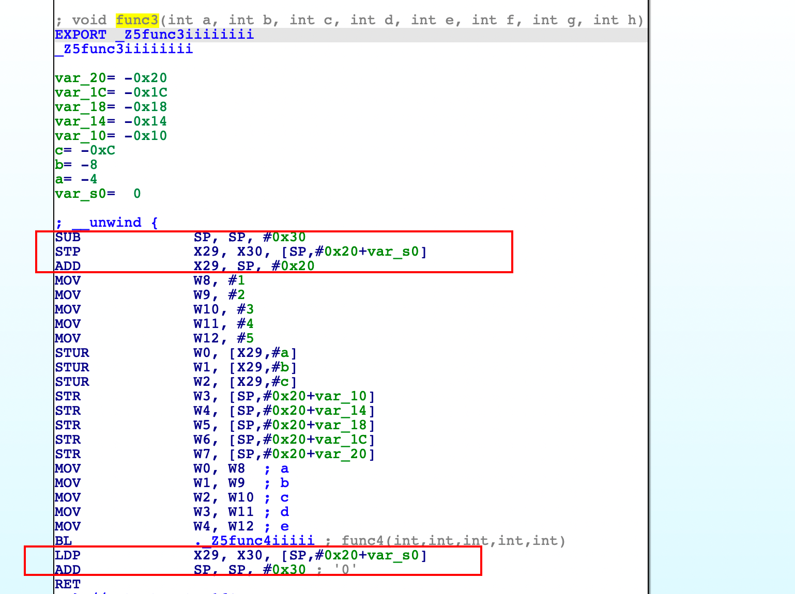

每个方法的开头和结尾都有这样5条指令，这种指令叫做栈平衡操作。众所周知，每个方法有属于自己的一块栈帧，在进入方法之后，首先要开辟出属于自己的栈空间，也就是。

```
SUB SP,SP,#0x30
```

这样就给自己开辟了 0x30 大小的一块栈空间。
​
然后保存上一个函数的信息，为了该方法结束的时候，可以跳转回上个函数。

```
STP X29, X30, [SP, #0x20+var_s0]
```

这样就把 X29 和 X30 寄存器保存在了当前的栈顶，按照 Arm64 的寄存器约定，X30 就是 LR，也就是函数返回时下一步要执行的指令地址。
​
然后把当前的栈顶信息又给了新的 X29 寄存器，所以 Arm64 的寄存器约定里，X29 就是 FP 寄存器，保存的是栈底信息。

```
ADD X29, SP, #0x20
```

这就是一个方法开始时做的事情。然后在方法结束的时候，恢复了上个方法的 X29 和 X30 寄存器信息。

```
LDP X29, X30, [SP, #0x20 + var_s0]
```

把自己的栈帧从堆栈中移除。

```
ADD SP, SP, #0x30
```

这样就完成了一个函数的堆栈操作，这块操作都是编译器自动实现的，至于分配给一个函数多大的栈空间，也是编译器根据函数中用的的栈大小来计算的，使用高级语言编程时无需感知这个过程。

细心的你可能已经发现了 X29 保存的当前函数的栈顶地址，然后在下个函数开始的时候又会被存到栈中保存，这样就形成了一个循环，你可以通过 X29 寄存器不断的向上回溯，这就是栈回溯的理论基础，用图表示的寄存器结构像下面这样。

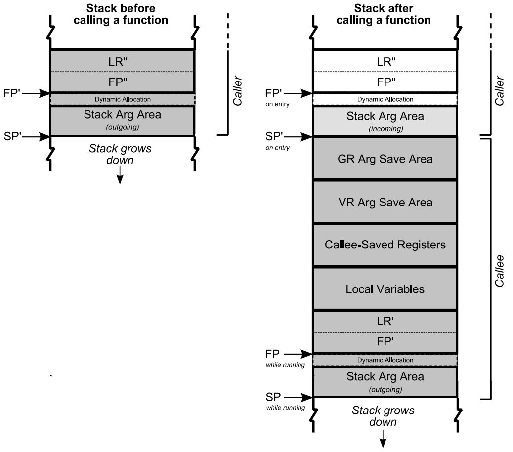

> 关于FP、SP、LR寄存器可以参考[这篇文章](https://blog.csdn.net/qq_34430371/article/details/121795096)

## 基于.eh_frame的栈回溯

这里不首先讲基于 FP 的栈回溯实现，而是说基于 .eh_frame（也叫Unwind）的 Unwind_backtrace。是因为 Android 的 C 库是 Google 家自己开发的 bionic，在 bionic 中，google 团队提供了官方的 backtrace 方法，Unwind_backtrace，https://github.com/gcc-mirror/gcc/blob/master/libgcc/unwind.inc，就是这个方案。
​
使用方法如下。

```
// 1. 定义结构体存储unwind_backtrace返回的信息
struct BacktraceState {
    void **current;
    void **end;
};

// 2. 定义callback方法，供unwind_backtrace回调
static _Unwind_Reason_Code unwindCallback(struct _Unwind_Context *context, void *arg) {
    BacktraceState *state = static_cast<BacktraceState *>(arg);
    uintptr_t pc;

#ifdef HAVE_GETIPINFO
    int ip_before_insn = 0;
    pc = _Unwind_GetIPInfo (context, &ip_before_insn);
#else
    pc = _Unwind_GetIP(context);
#endif

    if (pc) {
        if (state->current == state->end) {
            return _URC_END_OF_STACK;
        } else {
            *state->current++ = reinterpret_cast<void *>(pc);
        }
    }
    return _URC_NO_REASON;
}

// 3. 调用_Unwind_Backtrace
const size_t max = 32;
void *buffer[max] = {0};
BacktraceState state = {buffer, buffer + max};
_Unwind_Backtrace(unwindCallback, &state);

// 4. 使用_Unwind_Backtrace返回的信息
size_t count = state.current - buffer;
for (size_t idx = 0; idx < count; ++idx) {
    const void *addr = buffer[idx];
    // ... do something like dladdr(addr, &info)
}
```

Unwind_backtrace 和普通的基于 FP 的回溯有什么区别呢，Unwind_backtrace 是基于 .eh_frame 段解析的，接下来会简单的说下 .eh_frame 段的相关内容。但是关于 .eh_frame 段的详细历史[这篇文章](https://www.freesion.com/article/30371059487/ )讲的比较清楚。

编译器在构建的时候会生成 .eh_frame 段，这个段简单来说就是在通用寄存器变化时都记录了下来，记录成一个寄存器变化索引表，这样你不管执行到哪条指令，都可以根据这个表还原出寄存器的状态。表格是以非可读的字节码形式存储的，但是 `readelf` 已经做了解析工作。如果你用 `readelf` 去解析 so，可以看到这样的信息。

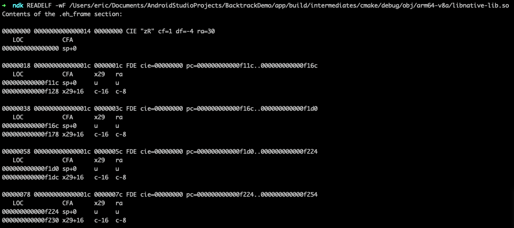

CFA 是栈基地址，后面是几个通用寄存器的恢复方法，ra 就是上一级函数的地址。

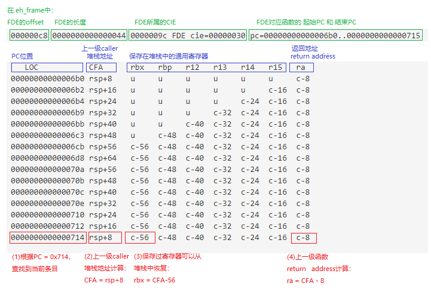

有了这个表，再根据当前的 PC 寄存器的值就可以恢复每一级函数的调用地址。

以上面的 demo 为例，在 func4 的地方我们打个断点，看下 PC 寄存器的值 0x7a34b95150。

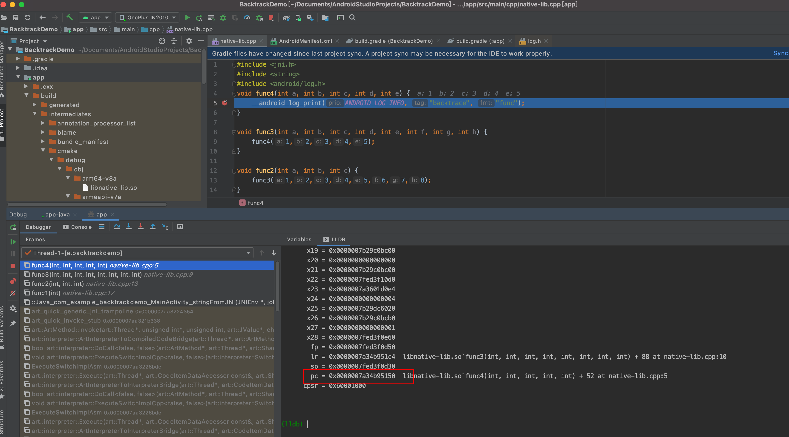

需要注意的是这个 PC 寄存器的值是 so 加载到内存后实际的内存地址，需要减去加载到内存块的起始地址才是实际在 so 中的位置。起始地址怎么看很简单。
​
先查一下这个 app 的进程号。

```
adb shell "ps | grep com.example.backtrackdemo"
u0_a317      27476   841 5332892 104952 0                   0 t com.example.backtrackdemo
```

然后在 maps 里面看内存的分布。

```
main_boost_switch  map_files/         maps
OnePlus8:/ # more /proc/27476/maps | grep "native-lib.so"
7a34b86000-7a34bb7000 r-xp 00000000 fc:09 32864                          /data/app/com.example.backtrackdemo-JrcMGs7yb18P3a4WTWIZpA==/lib/arm64/libnative-lib.so
7a34bb7000-7a34bbb000 r--p 00030000 fc:09 32864                          /data/app/com.example.backtrackdemo-JrcMGs7yb18P3a4WTWIZpA==/lib/arm64/libnative-lib.so
7a34bbb000-7a34bbc000 rw-p 00034000 fc:09 32864                          /data/app/com.example.backtrackdemo-JrcMGs7yb18P3a4WTWIZpA==/lib/arm64/libnative-lib.so
```

一般情况下第一个地址就是这个 so 在内存中的 base 地址（这里不考虑异常情况，在代码中计算 base 网上也可以查到很多示例代码），所以我们知道实际 PC 地址是 0x7a34b95150 - 0x7a34b86000 = 0xF150
​
接下来我们就在 .eh_frame 段中找到记录这个 PC 的块（也叫 FDE）。

```
00000018 000000000000001c 0000001c FDE cie=00000000 pc=000000000000f11c..000000000000f16c
   LOC           CFA      x29   ra
000000000000f11c sp+0     u     u
000000000000f128 x29+16   c-16  c-8
```

可以看到在 f128 之后，ra 的值是 c-8，也就是 x29+16-8，调式器里打一下这个值。

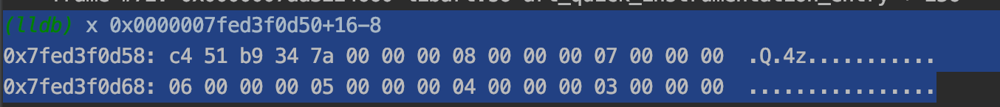

7a34b951c4。

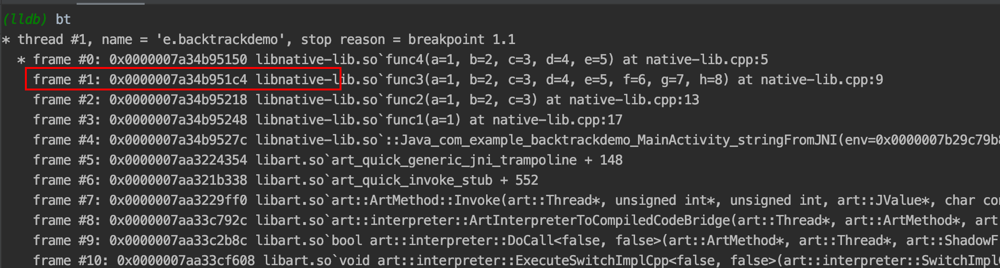

正好和 lldb 打印的栈回溯中上一级函数的地址对应起来了。找到上一级 PC 后，我们可以继续回溯，上一级 PC 的实际值是 0x7a34b951c4-0x7a34b86000=0xf1c4，那找到对应的 FDE。

```
00000038 000000000000001c 0000003c FDE cie=00000000 pc=000000000000f16c..000000000000f1d0
   LOC           CFA      x29   ra
000000000000f16c sp+0     u     u
000000000000f178 x29+16   c-16  c-8
```

ra = c-8 = x29+16-8，.eh_frame 是个静态段，这里的 x29 是指的的当前栈帧的 x29 寄存器的值，那这个值怎么获取呢，在理论背景中提到，x29 寄存器其实就是 FP 寄存器，FP 寄存器是依次存储的，所以当前x29寄存器的值就是上一级函数的 x29 寄存器的地址，实际上 ra = c-8 = x29+16-8 = *x29+16-8。

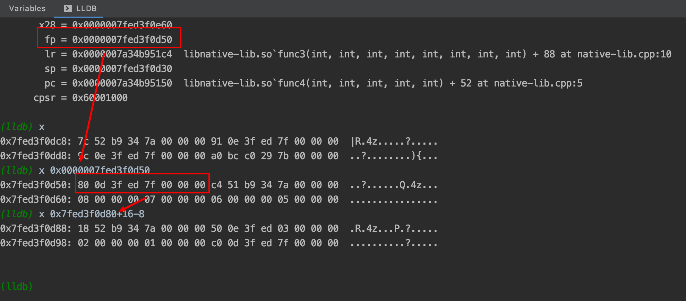

这里回溯到上一级 PC 地址 7a34b95218，以此类推就可以回溯各级调用栈了。
​
说到这里你可能有个疑问，虽然我们有个 .eh_frame 在这里，但是好像也要通过 x29 寄存器向上回溯，其实不然，当编译器保存 x29 的值的时候，你可以通过 x29 进行回溯，当寄存器没有保存 x29 值的时候，会记录相应的 SP 寄存器的偏移。比如我们可以在编译选项中增加`-fomit-frame-pointer`。

```
add_compile_options(-fomit-frame-pointer)
```

可以优化掉 FP 寄存器，这个时候在看 .eh_frame 段就是以 SP 寄存器作为偏移标准了。

```
00000018 0000000000000014 0000001c FDE cie=00000000 pc=000000000000f26c..000000000000f288
   LOC           CFA
000000000000f26c sp+0
000000000000f270 sp+16

00000030 0000000000000014 00000034 FDE cie=00000000 pc=000000000000f288..000000000000f43c
   LOC           CFA      ra
000000000000f288 sp+0     u
000000000000f290 sp+128   c-16

00000048 0000000000000014 0000004c FDE cie=00000000 pc=000000000000f43c..000000000000f510
   LOC           CFA      ra
000000000000f43c sp+0     u
000000000000f444 sp+80    c-16

00000060 0000000000000014 00000064 FDE cie=00000000 pc=000000000000f510..000000000000f570
   LOC           CFA      ra
000000000000f510 sp+0     u
000000000000f518 sp+48    c-16
```

用 Unwind 还有一个好处是，它不仅可以做栈回溯，它可以恢复所有寄存器的值，这就是为什么 Google 的 bionic 顺便用它来做栈回溯的原因。
​
但是通过 Unwind 的实现原理我们知道，它依赖 .eh_frame 段，在 so 里时，一切正常，但是当这个方法在动态代码中，比如一个虚拟机的字节码中，就失效了，因为动态代码根本没有将自己的信息编译进 .eh_frame 段中，这时候就还需要用老本行，基于 FP 寄存器的回溯。

## 基于FP递归的栈回溯

说起 FP 的递归回溯其实也不麻烦，甚至比 Unwind 更简单一些，你只需要拿到 FP 寄存器的值，这需要用一点内联汇编。

```
void get_fp(unsigned long *fp) {
#ifdef __aarch64__
    __asm__ __volatile__ (
    "mov %0, x29 \t\n"
    :"=r"(*fp));
#else
    __asm__ __volatile__ (
    "mov %0, r7 \t\n"
    :"=r"(*fp));
#endif
}
```

然后一层层的进行遍历就行了

```
size_t backtrace(FuncInfo * stack, size_t max)
{
    unsigned long fp = 0;
    int depth = 0;
    do {
        if (stack == NULL) {
            break;
        }
        get_fp(&fp);
        if (fp == 0) {
            break;
        }
        for (depth = 0; (depth < max) && (0 != fp) && (0 != *(unsigned long *)fp) && (fp != *(unsigned long *)fp); ++depth) {
            stack[depth].pc = (void *)(*(unsigned long *)(fp + sizeof(unsigned long)));
            Dl_info info;

            if (!dladdr(stack[depth].pc, &info)) {
                break;
            }

            if (!info.dli_fname) {
                break;
            }

            if (info.dli_fname && strstr(info.dli_fname, "/data/app") == NULL) {
                break;
            }

            __android_log_print(ANDROID_LOG_INFO, "backtrace", "pc %p", stack[depth].pc);
            __android_log_print(ANDROID_LOG_INFO, "backtrace", "symbol %s", info.dli_sname);

            fp = *(unsigned long *)fp;
        }
    } while (false);
    return depth;
}
```

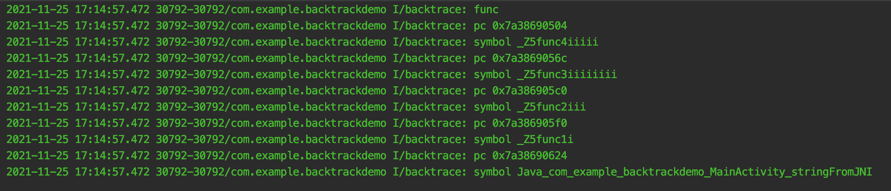

说到这，我们再来比较一下基于 FP 寄存器的回溯和基于 .eh_frame 段的回溯各自的优缺点。

##### 基于FP寄存器的回溯

1. 效率高
2. 不能穿过 JNI 和 OAT
3. 如果编译选项中优化掉了 FP 寄存器，则不能使用

##### 基于 .eh_frame 段的回溯

1. 解析复杂、效率低
2. 兼容性好
3. Android 原生支持
4. 可以恢复所有通用寄存器的值

腾讯有个开源项目 https://cloud.tencent.com/developer/article/1832287，优化了系统的 Unwind_backtrace 方案，只恢复 PC 寄存器的值，忽略其他寄存器。

## 踩平的一些坑

上面的代码可以正常运行，是因为我在坑里游了一会泳，首先第一个坑是这句代码。

```
if (info.dli_fname && strstr(info.dli_fname, "/data/app") == NULL) {
    break;
}
```

为什么限制只在 app 自己的 so 中遍历的，因为 android 的系统库不遵循 FP 的规则，FP 存的不是上一级栈底的地址，这个通过汇编可以看出来。
​
art_quick_generic_jni_trampoline 将自己的 x29 和 pc 放在了 sp+0xd0 的地方，然后把 sp 给了 x29。

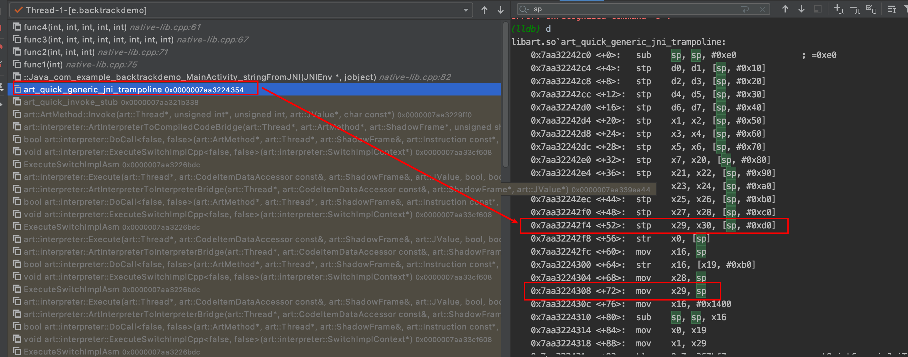

所以在 stringFromJNI 函数里面拿到的 x29 的值加上 0xd0 才是存 pc 的地方。

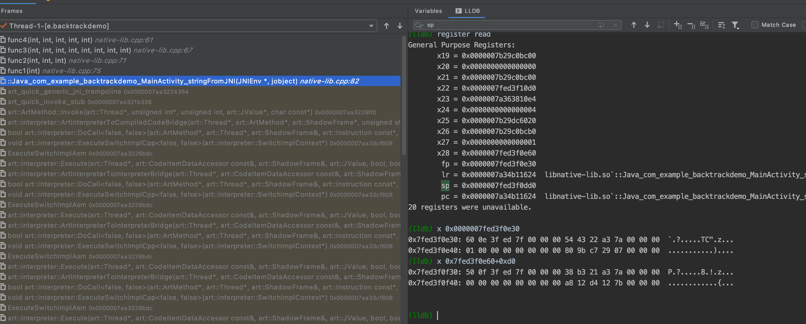

可以看出来，这里 x29 存的是 sp 的地址，所以如果想穿透系统函数，这里需要把 x29 的值加上 0xd0，拿到的值才是 pc（x30）的地址。
​
当然了，每一个函数栈帧的大小不一样，这里需要加的偏移也不一样，所以通过 FP 回溯遍历在这里会特别麻烦。

当然我们一般没有需要回溯到系统函数的需求，所以遇到系统函数就直接返回了。

第二个坑，前面提过现在这个栈回溯的需求是在动态虚拟机的字节码里，所以不出意外，动态虚拟机的调用链中应该也有不遵循 FP 回溯标准的函数吧，看了一下，不出意外果然有。
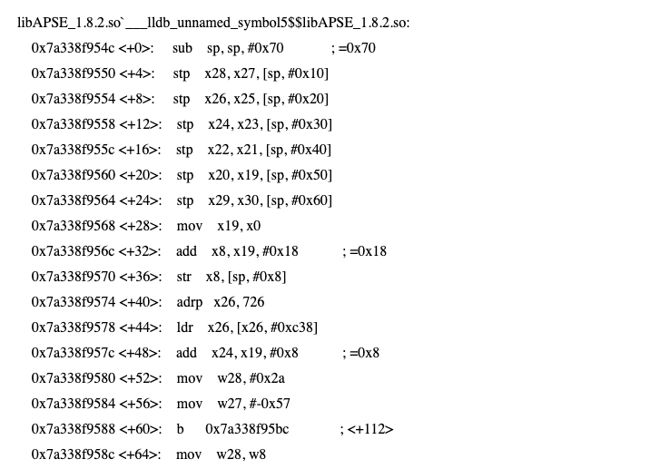

这个坑怎么解决的其实和上面对系统库函数的分析类似，总结一下就是看汇编代码，这个函数是个静态函数，栈帧固定是 0x70 大小，所以遇到这个函数的时候，就直接把上一级的 FP+0x70 跳过，去遍历下个函数。因为这种非标函数比较少，所以这个 workaround 是可行的。

## References

https://developer.aliyun.com/article/815064