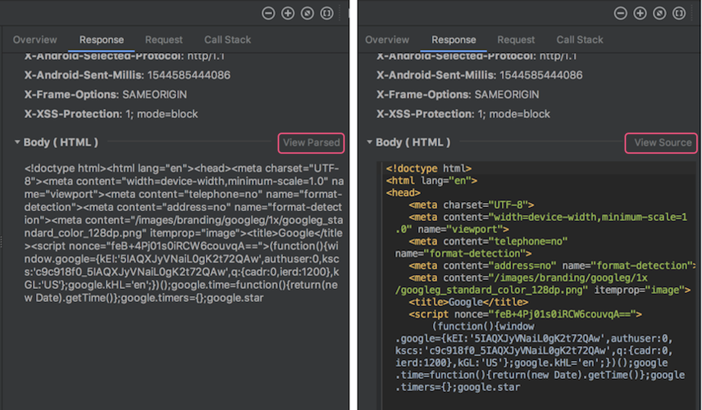

# 网络优化
## 1. 何为网络优化

一个数据包从手机出发要经过无线网络、核心网络以及外部网络（互联网），才能到达我们的服务器。


那整个网络请求的速度会跟哪些因素有关呢？


从上面这张图上看，客户端网络库实现、服务器性能以及网络链路的质量都是影响网络请求速度的因素。

如果说速度是关键，那对网络传输速度有决定性影响的主要有以下两个方面：

* **延迟**：数据从信息源发送到目的地所需的时间。
* **带宽**：逻辑或物理通信路径最大的吞吐量。

那延迟和带宽又跟什么因素有关呢？这里面涉及的因素也非常多，例如信号的强度、附近有没有基站、距离有多远等；还跟使用的网络制式，正在使用 3G、4G 还是 5G 网络有关，并且网络的拥塞情况也会产生影响，比如是不是在几万人聚集的大型活动场所等。

下面是不同网络制式的带宽和延迟的一般参考值。


当出现上面说到的那些因素时，网络访问的带宽要大打折扣，延迟会加倍放大。而高延迟、低带宽的网络场景也就是我们常说的“弱网络”，它主要特点有：


另外一个方面，不同的应用对延迟和带宽的侧重点可能不太一样。对于直播类应用或者“王者荣耀”来说，延迟会更重要一些；对腾讯视频、爱奇艺这种点播的应用来说，带宽会更加重要一些。**网络优化需要结合自己应用的实际情况来综合考虑。**

所谓的网络优化，究竟指的是什么？在我看来，核心内容有以下三个：

* **速度**。在网络正常或者良好的时候，怎样更好地利用带宽，进一步提升网络请求速度。
* **弱网络**。移动端网络复杂多变，在出现网络连接不稳定的时候，怎样最大程度保证网络的连通性。
* **安全**。网络安全不容忽视，怎样有效防止被第三方劫持、窃听甚至篡改。

那对于速度、弱网络以及安全的优化，又该从哪些方面入手呢？首先你需要先搞清楚一个网络请求的整个过程。


从图上看到，整个网络请求主要分为几个步骤，而整个请求的耗时可以细分到每一个步骤里面。

* **DNS 解析**。通过 DNS 服务器，拿到对应域名的 IP 地址。在这个步骤，我们比较关注 DNS 解析耗时情况、运营商 LocalDNS 的劫持、DNS 调度这些问题。
* **创建连接**。跟服务器建立连接，这里包括 TCP 三次握手、TLS 密钥协商等工作。多个 IP/ 端口该如何选择、是否要使用 HTTPS、能否可以减少甚至省下创建连接的时间，这些问题都是我们优化的关键。
* **发送 / 接收数据**。在成功建立连接之后，就可以愉快地跟服务器交互，进行组装数据、发送数据、接收数据、解析数据。我们关注的是，如何根据网络状况将带宽利用好，怎么样快速地侦测到网络延时，在弱网络下如何调整包大小等问题。
* **关闭连接**。连接的关闭看起来非常简单，其实这里的水也很深。这里主要关注主动关闭和被动关闭两种情况，一般我们都希望客户端可以主动关闭连接。

所谓的网络优化，就是围绕速度、弱网络、安全这三个核心内容，减少每一个步骤的耗时，打造快速、稳定且安全的高质量网络。

## 2. 网络分析工具
### 2.1 GUI工具

####  **Network Profiler**

**使用**

1. 依次点击 View > Tool Windows > Profiler（您也可以点击工具栏中的  图标 ）。
2. 从 Android Profiler 工具栏中选择要分析的设备和应用进程。如果您已通过 USB 连接设备但系统未列出该设备，请确保您已启用 USB 调试。
3. 点击 NETWORK 时间轴上的任意位置以打开网络性能剖析器。

**特点**

1. 显示实时网络活动：发送、接收数据及连接数。
2. 需启动高级分析。
3. 仅支持 `HttpURLConnection` 与`OkHttp`

**说明**

窗口顶部显示事件时间轴。在时间轴 `(1)` 上，您可以点击并拖动以选择时间轴的一部分来检查网络流量。


在时间轴下方的窗格 `(2)` 中，您可以选择以下某个标签页，以详细了解时间轴上选定时段内的网络活动：

* `Connection View`：列出了在时间轴上选定时段内从您应用的所有 CPU 线程发送或接收的文件。对于每个请求，您可以检查大小、类型、状态和传输时长。 您可以通过点击任意列标题来对此列表排序。您还会看到时间轴上选定时段的明细数据，从而了解每个文件的发送或接收时间。
* `Thread View`：显示您应用的每个 CPU 线程的网络活动。 如下图所示，您可以在此视图中检查各网络请求由应用的哪些线程负责。


从 `Connection View` 或 `Thread View` 中点击请求名称，可检查有关已发送或已接收数据的详细信息 `(3)`。点击各个标签页可查看响应标头和正文、请求标头和正文或调用堆栈。

在 **Response** 和 **Request** 标签页中，点击 **View Parsed** 链接可显示格式化文本，点击 **View Source** 链接可显示原始文本。




####  **[Charles](https://www.charlesproxy.com/)/[Fiddler](https://www.telerik.com/fiddler)**

无论是`Charles`还是`Fiddler`，都是设置代理抓取http包

Mac下使用的抓包&Web调试工具，详细使用见[ Charles 使用教程详解](https://zhuanlan.zhihu.com/p/140942687)

Window下使用的抓包&Web调试工具，详细使用见[Fiddler使用教程](https://zhuanlan.zhihu.com/p/102392715)

> Charles和Fiddler都是收费软件，但是可以免费试用, 也可以使用开源的[mitmproxy](https://mitmproxy.org/)代替
> 适合分析HTTP,HTTPS 其中https数据 可以通过安装中间人证书来解密


####  **[Wireshark](https://www.wireshark.org/)**

除了通过设置代理抓取http包外，还有另一种是直接抓取经过网卡的所有协议包，其中最出名就是大名鼎鼎的wireshark以及linux自带的抓包软件tcpdump。tcpdump后面再展开讲解。这里主要讲解wireshark的使用。

**特点**

1. 功能强大，可以抓取所有协议的包, 适合分析`TCP`,`UDP`
2. 无法分析https数据包，由于wireshark是在链路层获取的数据包信息，所以获取到的https包是加密后的数据，因此无法分析包内容。当然，我们可以对https数据包进行解密， 但是操作具有一定的复杂度，可能要消耗很多时间。


**过滤语法简单介绍**

wireshark的过滤语法总结起来其实也很简单，就是以协议开头，后面可以跟着协议的属性，然后加上一些判断符号，比如contains、==、>、<等等。

比如只想展示http的协议内容，则直接在过滤器输入框中输入http即可。如下图：


比如我只想看http协议的请求头中uri包含’/api’的协议，就可以这么写：


如果想通过目标ip或者来源ip来过滤包，就不可以以http协议为前缀了，因为这些是ip协议的相关属性。通过目标ip来过滤可以这么写：


上面表示目标机器的ip是61.135.217.100并且协议是http的包。


### 2.2 命令工具

####  **ping**

`ping`命令主要用于测试网络连通性

执行 `ping` 指令会使用 `ICMP` 传输协议，发出要求回应的信息，若远端主机的网络功能没有问题，就会回应该信息，因而得知该主机运作正常。

!!! notes "什么是ICMP"

    因特网控制报文协议`ICMP`（`Internet Control Message Protocol`）是一个差错报告机制，是`TCP/IP`协议簇中的一个重要子协议，通常被IP层或更高层协议（TCP或UDP）使用，属于网络层协议，主要用于在IP主机和路由器之间传递控制消息，用于报告主机是否可达、路由是否可用等。这些控制消息虽然并不传输用户数据，但是对于收集各种网络信息、诊断和排除各种网络故障以及用户数据的传递具有至关重要的作用。
    

**ping 使用**

```bash
ping -c 4 www.baidu.com
```

`-c` 参数指定发送的数据包数量，`4` 表示发送 4 个数据包。

**ping 输出**

```bash
PING www.a.shifen.com (163.177.151.110): 56 data bytes
64 bytes from 163.177.151.110: icmp_seq=0 ttl=53 time=4.636 ms
64 bytes from 163.177.151.110: icmp_seq=1 ttl=53 time=5.344 ms
64 bytes from 163.177.151.110: icmp_seq=2 ttl=53 time=4.884 ms
64 bytes from 163.177.151.110: icmp_seq=3 ttl=53 time=4.810 ms

--- www.a.shifen.com ping statistics ---
4 packets transmitted, 4 packets received, 0.0% packet loss
round-trip min/avg/max/stddev = 4.636/4.918/5.344/0.262 ms
```

* bytes值：数据包大小，也就是字节。
* time值：响应时间，这个时间越小，说明你连接这个地址速度越快。
* ttl值：Time To Live, 生存时间，指示了IP数据包可以经过最大的路由器数量，当一个ip数据包每经过一个路由器时，该TTL的值就会减1，当经过的路由器个数超过TTL的值时，该IP数据包就会被路由器抛弃，这样就可以避免数据包在网络中无限传输。

> 更多关于 `ping` 的内容，可以参考 [ping命令](https://www.runoob.com/linux/linux-comm-ping.html)

####  **traceroute**

`traceroute`命令 用于追踪数据包在网络上的传输时的全部路径，它默认发送的数据包大小是40字节。

通过traceroute我们可以知道信息从你的计算机到互联网另一端的主机是走的什么路径。当然每次数据包由某一同样的出发点（source）到达某一同样的目的地(destination)走的路径可能会不一样，但基本上来说大部分时候所走的路由是相同的。

traceroute通过发送小的数据包到目的设备直到其返回，来测量其需要多长时间。一条路径上的每个设备traceroute要测3次。输出结果中包括每次测试的时间(ms)和设备的名称（如有的话）及其ip地址。

**traceroute 使用**

```bash
traceroute www.58.com
traceroute to www.58.com (211.151.111.30), 30 hops max, 40 byte packets
 1  unknown (192.168.2.1)  3.453 ms  3.801 ms  3.937 ms
 2  221.6.45.33 (221.6.45.33)  7.768 ms  7.816 ms  7.840 ms
 3  221.6.0.233 (221.6.0.233)  13.784 ms  13.827 ms 221.6.9.81 (221.6.9.81)  9.758 ms
 4  221.6.2.169 (221.6.2.169)  11.777 ms 122.96.66.13 (122.96.66.13)  34.952 ms 221.6.2.53 (221.6.2.53)  41.372 ms
 5  219.158.96.149 (219.158.96.149)  39.167 ms  39.210 ms  39.238 ms
 6  123.126.0.194 (123.126.0.194)  37.270 ms 123.126.0.66 (123.126.0.66)  37.163 ms  37.441 ms
 7  124.65.57.26 (124.65.57.26)  42.787 ms  42.799 ms  42.809 ms
 8  61.148.146.210 (61.148.146.210)  30.176 ms 61.148.154.98 (61.148.154.98)  32.613 ms  32.675 ms
 9  202.106.42.102 (202.106.42.102)  44.563 ms  44.600 ms  44.627 ms
10  210.77.139.150 (210.77.139.150)  53.302 ms  53.233 ms  53.032 ms
11  211.151.104.6 (211.151.104.6)  39.585 ms  39.502 ms  39.598 ms
12  211.151.111.30 (211.151.111.30)  35.161 ms  35.938 ms  36.005 ms
```

记录按序列号从1开始，每个纪录就是一跳 ，每跳表示一个网关，我们看到每行有三个时间，单位是ms, 是探测数据包向每个网关发送三个数据包后，网关响应后返回的时间；

有时我们traceroute一台主机时，会看到有一些行是以星号表示的。出现这样的情况，可能是防火墙封掉了ICMP的返回信息，所以我们得不到什么相关的数据包返回数据。

有时我们在某一网关处延时比较长，有可能是某台网关比较阻塞，也可能是物理设备本身的原因。当然如果某台DNS出现问题时，不能解析主机名、域名时，也会 有延时长的现象；您可以加-n参数来避免DNS解析，以IP格式输出数据。

#### **tcpdump**

tcpdump是linux上自带的一个抓包软件(mac也有)，功能强大，也可以抓取经过指定网卡的所有协议包。

由于是命令行工具，tcpdump抓取到的包不易于分析，一个常见的做法是将tcpdump抓到的包输出到某个文件，然后将文件拷贝下来用wireshark分析。

**tcpdump 使用**

Android没有内置`tcpdump`，需要自己安装，同时要求手机root权限。

1. 下载 [tcpdump](https://www.tcpdump.org/linktypes.html)
2. 将 tcpdump 放入手机： `adb push ~/tcpdump /data/local/tcpdump`
3. 将 tcpdump 的权限变为可执行：`chmod +x tcpdump`
4. 开始抓包： 譬如 `/data/local/tcpdump -vv -s 0 -w /mnt/sdcard/pcapture.pcap`。其中 `"-s 0"` 表示每个包都抓取全部长度，而不是部分长度；`"-w /mnt/sdcard/pcapture.pcap"` 表示抓取的包写入指定文件；`"-vv"` 表示显示多一些信息，如果要显示更多信息可以用 `"-vvv"`
5. 按下 `"contrl+c"` 结束抓包。
6. 将`"/mnt/sdcard/pcapture.pcap"`  拉取到电脑上： `adb pull /mnt/sdcard/pcapture.pcap <指定目录>`
7. 通过 `Wireshark` 或者 `charles`进行分析。

上面是步骤比较繁琐，每次都需要抓包后都需要拉取到电脑上，有没有办法直接在电脑上抓去手机的包呢？答案是有的，我们可以使用 `adb forward` 命令将手机的端口转发到电脑上。基本思路如下图


1. 手机开始抓包:在 adb shell 中运行 `/data/local/tcpdump -n -s 0 -w - | nc -l -p 12345`
2. 将手机抓的包传送到电脑的 Wireshark 中: 另开一个终端运行 `adb forward tcp:12345 tcp:12345 && nc 127.0.0.1 12345 | /Applications/Wireshark.app/Contents/MacOS/wireshark -k -S -i -`

这样就可以实时抓取手机的包了。

> 更多关于`tcpdump`的使用，可以参考 [tcpdump 使用指南](https://juejin.cn/post/6844904084168769549)

## 3. 网络优化

### 3.1 高质量网络库

在实际的开发工作中，我们很少会直接去操作底层的网络接口，一般都会使用网络库。Square 出品的[OkHttp](https://github.com/square/okhttp)是目前最流行的 Android 网络库，它还被 Google 加入到 Android 系统内部，为广大开发者提供网络服务。那网络库究竟承担着一个什么样的角色呢？在我看来，它屏蔽了下层复杂的网络接口，让我们可以更高效地使用网络请求。

那网络库究竟承担着一个什么样的角色呢？在我看来，它屏蔽了下层复杂的网络接口，让我们可以更高效地使用网络请求。

.webp)

如上图所示，一个网络库的核心作用主要有以下三点：

* **统一编程接口**。无论是同步还是异步请求，接口都非常简单易用。同时我们可以统一做策略管理，统一进行流解析（JSON、XML、Protocol Buffers）等。
* **全局网络控制**。在网络库内部我们可以做统一的网络调度、流量监控以及容灾管理等工作。
* **高性能**。既然我们把所有的网络请求都交给了网络库，那网络库是否实现高性能就至关重要。既然要实现高性能，那我会非常关注速度，CPU、内存、I/O 的使用，以及失败率、崩溃率、协议的兼容性等方面。

不同的网络库实现差别很大，比较关键有这几个模块：


接下来我们一起来对比 OkHttp、Chromium 的[Cronet](https://chromium.googlesource.com/chromium/src/+/master/components/cronet/)以及微信[Mars](https://github.com/Tencent/mars)这三个网络库的内部实现。


**OkHttp**

OkHttp主要问题是它并不支持跨平台，对于大型应用来说跨平台是非常重要的。我们不希望所有的优化 Android 和 iOS 都要各自去实现一套，不仅浪费人力而且还容易出问题。

**Mars**

对于 Mars 来说，它是一个跨平台的 Socket 层解决方案，并不支持完整的 HTTP 协议，所以 Mars 从严格意义上来讲并不是一个完整的网络库。但是它在弱网络和连接上做了大量的优化，并且支持长连接。关于 Mars 的网络多优化的更多细节，你可以参考[Wiki](https://github.com/Tencent/mars/wiki)。

**Cronet**

Chromium 网络库作为标准的网络库，基本上可以说是找不到太大的缺点。而且我们可以享受 Google 后续网络优化的成果，类似 TLS 1.3、QUIC 支持等。但是它针对弱网络场景没有做太多定制的优化，也不支持长连接。

#### 大网络平台

对于大公司来说，我们不能只局限在客户端网络库的双端统一上。网络优化不仅仅是客户端的事情，所以我们有了统一的网络中台，它负责提供前后台一整套的网络解决方案。

阿里的[ACCS](https://www.infoq.cn/article/taobao-mobile-terminal-access-gateway-infrastructure)、蚂蚁的[mPaaS](https://mp.weixin.qq.com/s/nz8Z3Uj9840KHluWjwyelw)、携程的[网络服务](https://www.infoq.cn/article/how-ctrip-improves-app-networking-performance)都是公司级的网络中台服务，这样所有的网络优化可以让整个集团的所有接入应用受益。

下图是 mPaaS 的网络架构图，所有网络请求都会先经过统一的接入层，再转发到业务服务器。这样我们可以在业务服务器无感知的情况下，在接入层做各种各样的网络优化。


### 3.2 HTTPDNS

DNS 的解析是我们网络请求的第一项工作，默认我们使用运营商的 LocalDNS 服务。这块耗时在 3G 网络下可能是 200～300ms，4G 网络也需要 100ms。

解析慢并不是默认 LocalDNS 最大的“原罪”，它还存在一些其他问题：

* 稳定性。UDP 协议，无状态，容易域名劫持（难复现、难定位、难解决），每天至少几百万个域名被劫持，一年至少十次大规模事件。、
* 准确性。LocalDNS 调度经常出现不准确，比如北京的用户调度到广东 IP，移动的运营商调度到电信的 IP，跨运营商调度会导致访问慢，甚至访问不了。
* 及时性。运营商可能会修改 DNS 的 TTL，导致 DNS 修改生效延迟。不同运营商的服务实现不一致，我们也很难保证 DNS 解析的耗时。
  
为了解决这些问题，就有了 HTTPDNS。简单来说自己做域名解析的工作，通过 HTTP 请求后台去拿到域名对应的 IP 地址，直接解决上述所有问题。

对于大网络平台来说，我们会有统一的 HTTPDNS 服务，并将它和运维系统打通。在传统的 DNS 基础上，还会增加精准的流量调度、网络拨测 / 灰度、网络容灾等功能。


> 网络拨测是指在网络请求前，先通过 HTTP 请求去拨测网络是否可用，如果不可用则直接返回错误，不再发起网络请求。这样可以避免网络请求失败后的重试，减少网络请求的耗时。

> 网络容灾是指在网络请求失败后，通过 HTTP 请求去拨测网络是否可用，如果可用则重试网络请求，如果不可用则直接返回错误。这样可以避免网络请求失败后的重试，减少网络请求的耗时。

关于 HTTPDNS 的更多知识，可以参考百度的[《DNS 优化》](https://mp.weixin.qq.com/s/iaPtSF-twWz-AN66UJUBDg)。对客户端来说，我们可以通过预请求的方法，提前拿到一批域名的 IP，不过这里需要注意 IPv4 与 IPv6 协议栈的选择问题。

### 3.3 连接复用

在 DNS 解析之后，我们来到了创建连接这个环节。创建连接要经过 TCP 三次握手、TLS 密钥协商，连接建立的代价是非常大的。这里我们主要的优化思路是复用连接，这样不用每次请求都重新建立连接。

如果我们使用okhttp之类的网络库，那么我们可以通过连接池来复用连接。网络库并不会立刻把连接释放，而是放到连接池中。这时如果有另一个请求的域名和端口是一样的，就直接拿出连接池中的连接进行发送和接收数据，少了建立连接的耗时。

另外，我们可以利用HTTP 协议里的 keep-alive，而 HTTP/2.0 的多路复用则可以进一步的提升连接复用率。它复用的这条连接支持同时处理多条请求，所有请求都可以并发在这条连接上进行。


虽然 H2 十分强大，不过这里还有两个问题需要解决。一个是同一条 H2 连接只支持同一个域名，一个是后端支持 HTTP/2.0 需要额外的改造。这个时候我们只需要在统一接入层做改造，接入层将数据转换到 HTTP/1.1 再转发到对应域名的服务器。


这样所有的服务都不用做任何改造就可以享受 HTTP/2.0 的所有优化，不过这里需要注意的是 H2 的多路复用在本质上依然是同一条 TCP 连接，如果所有的域名的请求都集中在某一条连接中，在网络拥塞的时候容易出现 TCP 队首阻塞问题。

> 对于客户端网络库来说，无论 OkHttp 还是 Chromium 网络库对于 HTTP/2.0 的连接，同一个域名只会保留一条连接。对于一些第三方请求，特别是文件下载以及视频播放这些场景可能会遇到对方服务器单连接限速的问题。在这种情况下我们可以通过修改网络库实现，也可以简单的通过禁用 HTTP/2.0 协议解决。

### 3.4 压缩与加密

#### 3.4.1 压缩

怎么减少传输的数据量，也就是我们常说的数据压缩。首先对于 HTTP 请求来说，数据主要包括三个部分：

* 请求 URL
* 请求 header
* 请求 body

对于 header 来说，如果使用 HTTP/2.0 连接本身的[头部压缩](https://juejin.cn/post/7133238781452222472)技术，那么需要压缩的主要是请求 URL 和请求 body。

对于请求 URL 来说，一般会带很多的公共参数，这些参数大部分都是不变的。**这样不变的参数客户端只需要上传一次即可，其他请求我们可以在接入层中进行参数扩展**。

对于请求 body 来说，一方面是数据通信协议的选择，在网络传输中目前最流行的两种数据序列化方式是 `JSON` 和 `Protocol Buffers`。Protocol Buffers 使用起来更加复杂一些，但在数据压缩率、序列化与反序列化速度上面都有很大的优势。

另外一方面是压缩算法的选择，通用的压缩算法主要是如 gzip，Google 的[Brotli](./assets/https://github.com/google/brotli)或者 Facebook 的[Z-standard](https://github.com/facebook/zstd)都是压缩率更高的算法。其中如果 `Z-standard` 通过业务数据样本训练出适合的字典，是目前压缩率表现最好的算法。但是各个业务维护字典的成本比较大

当然针对特定数据我们还有其他的压缩方法，例如针对图片我们可以使用 `webp`、`hevc`等压缩率更高的格式

#### 3.4.2 加密

数据安全也是网络重中之重的一个环节，在大网络平台中我们都是基于 HTTPS 的 HTTP/2 通道，已经有了 TLS 加密。

但是 HTTPS 带来的代价也是不小的，它需要 2-RTT 的协商成本，在弱网络下时延不可接受。同时后台服务解密的成本也十分高昂，在大型企业中需要单独的集群来做这个事情。

HTTPS 的优化有下面几个思路：

* **连接复用率**。通过多个域名共用同一个 HTTP/2 连接、长连接等方式提升连接复用率。
* **减少握手次数**。[TLS 1.3](https://zhuanlan.zhihu.com/p/44980381)可以实现 0-RTT 协商，事实上在 TLS 1.3 release 之前，微信的[mmtls](https://mp.weixin.qq.com/s/tvngTp6NoTZ15Yc206v8fQ)、Facebook 的[fizz](https://mp.weixin.qq.com/s?__biz=MzI4MTY5NTk4Ng==&mid=2247489465&idx=1&sn=a54e3fe78fc559458fa47104845e764b&source=41#wechat_redirect)、阿里的 SlightSSL 都已在企业内部大规模部署。
* **性能提升**。使用 ecc 证书代替 RSA，服务端签名的性能可以提升 4～10 倍，但是客户端校验性能降低了约 20 倍，从 10 微秒级降低到 100 微秒级。另外一方面可以通过 Session Ticket 会话复用，节省一个 RTT 耗时。


使用 HTTPS 之后，整个通道是不是就一定高枕无忧呢？如果客户端设置了代理，TLS 加密的数据可以被解开并可能被利用 。这个时候我们可以在客户端将[“证书锁定”](https://zhuanlan.zhihu.com/p/58204817)（Certificate Pinning），为了老版本兼容和证书替换的灵活性，建议锁定根证书。

我们也可以对传输内容做二次加密，这块在统一接入层实现，业务服务器也同样无需关心这个流程。需要注意的是二次加密会增加客户端与服务器的处理耗时，我们需要在安全性与性能之间做一个取舍。


### 3.5 其他优化

关于网络优化的手段还有很多，一些方案可能是需要用钱堆出来的，比如`部署跨国的专线`、`加速点`，`多 IDC 就近接入`等。

除此之外，使用[CDN 服务](https://toutiao.io/posts/6gb8ih/preview)、[P2P 技术](https://mp.weixin.qq.com/s?__biz=MzI4MTY5NTk4Ng==&mid=2247489182&idx=1&sn=e892855fd315ed2f1395f05b765f9c4e&source=41#wechat_redirect)也是比较常用的手段，特别在直播这类场景。总的来说，网络优化我们需要综合用户体验、带宽成本以及硬件成本等多个因素来考虑。

下面献上一张高质量网络的全景大图。


### 3.6 QUIC 与 IPv6

#### 3.6.1 QUIC

QUIC 协议由 Google 在 2013 年实现，在 2018 年基于 QUIC 协议的 HTTP 更被确认为[HTTP/3](https://zh.wikipedia.org/wiki/HTTP/3)。在连接复用中前面说过 HTTP/2 + TCP 会存在队首阻塞的问题，基于 UDP 的 QUIC 才是终极解决方案。

如下图所示，你可以把 QUIC 简单理解为 **HTTP/2.0 + TLS 1.3 + UDP**。


事实上，它还有着其他的很多优势：

* **灵活控制拥塞协议**。如果想对 TCP 内部的拥塞控制算法等模块进行优化和升级，整体周期是相对较长的。对于 UDP 来说，我们不需要操作系统支持，随时可改，例如可以直接使用 Google 的[BBR](https://queue.acm.org/detail.cfm?id=3022184) 算法。
* **“真”连接复用**。不仅解决了队首阻塞的问题，在客户端网络切换的时候也不需要重连，用户使用 App 的体验会更加流畅。

既然 QUIC 那么好，为什么我们在生产环境没有全部切换成 QUIC 呢？那是因为有很多坑还没有踩完，目前发现的主要问题还有：

* **创建连接成功率**。主要是 UDP 的穿透性问题，NAT 局域网路由、交换机、防火墙等会禁止 UDP 443 通行，目前 QUIC 在国内建连的成功率大约在 95% 左右。
* **运营商支持**。运营商针对 UDP 通道支持不足，表现也不稳定。例如 QoS 限速丢包，有些小的运营商甚至还直接不支持 UDP 包。

尽管有这样那样的问题，但是 QUIC 一定是未来。当然，通过大网络平台的统一接入层，我们业务基本无需做什么修改。


#### 3.6.2 IPv6

IPv6 不仅针对 IoT 技术，对万物互联的时代有着非常大的意义。而且它对网络性能也有正向的作用，在印度经过测试，使用 IPv6 网络相比 IPv4 连接耗时可以降低 10%～20%。推行 IPv6 后，无穷无尽的 IP 地址意味着可以告别各种 NAT，P2P、QUIC 的连接也不再是问题。

> 由于IPv4地址空间的限制，当前的Internet必须采用权宜之计解决方案来应对其计划外的扩展：网络地址转换（NAT）。它使多个用户和设备可以共享相同的公共IP地址。


## 4. 网络监控

一个网络请求从手机到后台服务器，会涉及基站、光纤、路由器这些硬件设施，也会跟运营商和服务器机房有关。不论是基站故障、光纤被挖断、运营商挟持，还是我们的机房、CDN 服务商出现故障，都有可能会引起用户网络出现问题。你有没有感觉线上经常突发各种千奇百怪的网络问题，很多公司的运维人员每天过得胆战心惊、疲于奔命。

“善良”的故障过了一段时间之后莫名其妙就好了，“顽固”的故障难以定位也难以解决。这些故障究竟是如何产生的？为什么突然就恢复了？它们影响了多少用户、哪些用户？想要解决这些问题离不开高质量的网络，而高质量的网络又离不开强大的监控。

### 4.1 如何监控网络

#### 4.1.1 插桩

360 开源的性能监控工具[ArgusAPM](https://github.com/Qihoo360/ArgusAPM)就是利用 Aspect 切换插桩，实现监控系统和 OkHttp 网络库的请求。

系统网络库的插桩实现可以参考[TraceNetTrafficMonitor](https://github.com/Qihoo360/ArgusAPM/blob/bc03d63c65019cd3ffe2cbef9533c9228b3f2381/argus-apm/argus-apm-aop/src/main/java/com/argusapm/android/aop/TraceNetTrafficMonitor.java)，主要利用[Aspect](https://www.shouce.ren/api/spring2.5/ch06s02.html)的切面功能，关于 OkHttp 的拦截可以参考[OkHttp3Aspect](https://github.com/Qihoo360/ArgusAPM/blob/bc03d63c65019cd3ffe2cbef9533c9228b3f2381/argus-apm/argus-apm-okhttp/src/main/java/com/argusapm/android/okhttp3/OkHttp3Aspect.java)，它会更加简单一些，因为 OkHttp 本身就有代理机制。

```java
@Pointcut("call(public okhttp3.OkHttpClient build())")
public void build() {
}

@Around("build()")
public Object aroundBuild(ProceedingJoinPoint joinPoint) throws Throwable {
    Object target = joinPoint.getTarget();
    if (target instanceof OkHttpClient.Builder &&    Client.isTaskRunning(ApmTask.TASK_NET)) {
        OkHttpClient.Builder builder = (OkHttpClient.Builder) target;
        builder.addInterceptor(new NetWorkInterceptor());
    }
    return joinPoint.proceed();
}
```

插桩的方法看起来很好，但是并不全面。如果使用的不是系统和 OkHttp 网络库，又或者使用了 Native 代码的网络请求，都无法监控到。

#### 4.1.2 Native Hook

网络相关的我们一般会 Hook 下面几个方法 ：

* 连接相关：connect。
* 发送数据相关：send 和 sendto。
* 接收数据相关：recv 和 recvfrom。

Android 在不同版本 Socket 的逻辑会有那么一些差异，以 Android 7.0 为例，Socket 建连的堆栈如下：

```java
java.net.PlainSocketImpl.socketConnect(Native Method)
java.net.AbstractPlainSocketImpl.doConnect
java.net.AbstractPlainSocketImpl.connectToAddress
java.net.AbstractPlainSocketImpl.connect
java.net.SocksSocketImpl.connect
java.net.Socket.connect
com.android.okhttp.internal.Platform.connectSocket
com.android.okhttp.Connection.connectSocket
com.android.okhttp.Connection.connect
```

“socketConnect”方法对应的 Native 方法定义在[PlainSocketImpl.c](http://androidxref.com/7.0.0_r1/xref/libcore/ojluni/src/main/native/PlainSocketImpl.c)，查看[makefile](http://androidxref.com/7.0.0_r1/xref/libcore/ojluni/src/main/native/openjdksub.mk)可以知道它们会编译在 libopenjdk.so 中。不过在 Android 8.0，整个调用流程又完全改变了。为了兼容性考虑，我们直接 PLT Hook 内存的所有 so，但是需要排除掉 Socket 函数本身所在的 libc.so。

```c++
hook_plt_method_all_lib("libc.so", "connect", (hook_func) &create_hook);
hook_plt_method_all_lib("libc.so, "send", (hook_func) &send_hook);
hook_plt_method_all_lib("libc.so", "recvfrom", (hook_func) &recvfrom_hook);
...
```

这种做法不好的地方在于会把系统的 Local Socket 也同时接管了，需要在代码中增加过滤条件。


#### 4.1.3 统一网络库

尽管拿到了所有的网络调用，想想会有哪些使用场景呢？模拟网络数据、统计应用流量，或者是单独代理 WebView 的网络请求。


一般来说，我们不会非常关心第三方的网络请求情况，而对于我们应用自身的网络请求，最好的监控方法还是统一网络库。

**不过我们可以通过插桩和 Hook 这两个方法，监控应用中有哪些地方使用了其他的网络库，而不是默认的统一网络库。**

### 4.2 如何监控流量

应用流量监控的方法非常简单，一般通过 TrafficStats 类。TrafficState 是 Android API 8 加入的接口，用于获取整个手机或者某个 UID 从开机算起的网络流量。至于如何使用，你可以参考 Facebook 一个历史比较久远的开源库[network-connection-class](https://github.com/facebookarchive/network-connection-class)。

```java
getMobileRxBytes()        //从开机开始Mobile网络接收的字节总数，不包括Wifi
getTotalRxBytes()         //从开机开始所有网络接收的字节总数，包括Wifi
getMobileTxBytes()        //从开机开始Mobile网络发送的字节总数，不包括Wifi
getTotalTxBytes()         //从开机开始所有网络发送的字节总数，包括Wifi
```

它的实现原理其实也非常简单，就是利用 Linux 内核的统计接口。具体来说，是下面两个 proc 接口。

```shell
// stats接口提供各个uid在各个网络接口（wlan0, ppp0等）的流量信息
/proc/net/xt_qtaguid/stats
// iface_stat_fmt接口提供各个接口的汇总流量信息
proc/net/xt_qtaguid/iface_stat_fmt
```

TrafficStats 的工作原理是读取 proc，并将目标 UID 下面所有网络接口的流量相加。但如果我们不使用 TrafficStats 接口，而是自己解析 proc 文件呢？那我们可以得到不同网络接口下的流量，从而计算出 WiFi、2G/3G/4G、VPN、热点共享、WiFi P2P 等不同网络状态下的流量。

不过非常遗憾的是，Android 7.0 之后系统已经不让我们直接去读取 stats 文件，防止开发者可以拿到其他应用的流量信息，因此只能通过 TrafficStats 拿到自己应用的流量信息。

除了流量信息，通过 /proc/net 我们还可以拿到大量网络相关的信息，例如网络信号强度、电平强度等。Android 手机跟 iPhone 都有一个网络测试模式，感兴趣的同学可以尝试一下。

* iPhone：打开拨号界面，输入“*3001#12345#*”，然后按拨号键。
* Android 手机：打开拨号界面，输入“*#*#4636#*#*”，然后按拨号键（可进入工程测试模式，部分版本可能不支持）。


!!! question "为什么系统可以判断此时的 WiFi“已连接，但无法访问互联网"

    对于手机厂商来说，它在底层可以拿到的信息有很多。

    * 网卡驱动层信息。如射频参数，可以用来判断 WiFi 的信号强度；网卡数据包队列长度，可以用来判断网络是否拥塞。
    * 协议栈信息。主要是获取数据包发送、接收、时延和丢包等信息。

    如果一个 WiFi 发送过数据包，但是没有收到任何的 ACK 回包，这个时候就可以初步判断当前的 WiFi 是有问题的。这样系统可以知道当前 WiFi 大概率是有问题的，它并不关心是不是因为我们后台服务器出问题导致的。

### 4.3 大网络平台监控

前面讲了一些应用网络请求和流量的监控方法，但是还没真正回答应该如何去打造一套强大的网络监控体系。跟网络优化一样，网络监控不是客户端可以单独完成的，它也是整个大网络平台的一个重要组成部分。

不过首先我们需要在客观上承认这件事情做起来并不容易，因为网络问题会存在下面这些特点：

* **实时性**。部分网络问题过时不候，可能很快就丢失现场。
* **复杂性**。可能跟国家、地区、运营商、版本、系统、机型、CDN 都有关，不仅维度多，数据量也巨大。
* **链路长**。整个请求链条非常长，客户端故障、网链障络、服务故障都有可能。

因此所谓的网络监控，并不能保证可以明确找到故障的原因。而我们目标是希望快速发现问题，尽可能拿到更多的辅助信息，协助我们更容易地排查问题。下面分别从客户端与接入层的角度出发，一起来看看哪些信息可以帮助我们更好地发现问题和解决问题。

#### 4.3.1 客户端监控

客户端的监控使用统一网络库的方式，你可以想想我们需要关心哪些内容：

* **时延**。一般我们比较关心每次请求的 DNS 时间、建连时间、首包时间、总时间等，会有类似 1 秒快开率、2 秒快开率这些指标。
* **维度**。网络类型、国家、省份、城市、运营商、系统、客户端版本、机型、请求域名等，这些维度主要用于分析问题。
* **错误**。DNS 失败、连接失败、超时、返回错误码等，会有 DNS 失败率、连接失败率、网络访问的失败率这些指标。

通过这些数据，我们也可以汇总出应用的网络访问大图。例如在国内无论我们去到哪里都会问有没有 WiFi，WiFi 的占比会超过 50%。这其实远远比海外高，在印度 WiFi 的占比仅仅只有 15% 左右。


同样的我们分版本、分国家、分运营商、分域名等各种各样的维度，来监控我们的时延和错误这些访问指标。由于维度太多，每个维度的取值范围也很广，如果是实时计算整个数据量会非常非常大。为了运算简单我们可以抛弃 UV，只计算每一分钟部分维度的 PV。

#### 4.3.2 接入层监控

客户端监控的数据会比接入层更加丰富，因为有可能会出现部分数据还没到达接入层就已经被打回，例如运营商劫持的情况。

但是接入层的数据监控还是非常有必要的，主要的原因是：

* **实时性**。客户端如果使用秒级的实时上报，对用户性能影响会比较大。服务端就不会存在这个问题，它很容易可以做到秒级的监控。
* **可靠性**。如果出现某些网络问题，客户端的数据上报通道可能也会受到影响，客户端的数据不完全可靠。

那接入层应该关心哪些数据呢？一般来说，我们会比较关心 **服务的入口和出口流量、服务端的处理时延、错误率**等。

下面是一个简单根据客户端、国家以及运营商维度分析的示例。当然更多的时候是某一个服务出现问题，这个时候通过分域名或者错误码就可以很容易的找到原因。


#### 4.3.3 监控报警

无论是客户端还是接入层的监控，它们都是分层的。

* **实时监控**。秒级或者分钟级别的实时监控的信息会相比少一些，例如只有访问量（PV）、错误率，没有去拆分几百个上千个维度，也没有独立访问用户数（UV），实时监控的目的是最快速度发现问题。
* **离线监控**。小时或者天级别的监控我们可以拓展出全部的维度来做监控，它的目的是在监控的同时，可以更好地圈出问题的范围。


那在监控的同时如何实现准确的自动化报警呢？这同样也是业界的一个难题，它的难度在于如果规则过于苛刻，可能会出现漏报；如果过于宽松，可能会出现太多的误报。

业界一般存在两种报警的算法，

* 一套是基于规则，例如失败率与历史数据相比暴涨、流量暴跌等。
* 另一种是基于时间序列算法或者神经网络的智能化报警，使用者不需要录入任何规则，只需有足够长的历史数据，就可以实现自动报警。

智能化报警目前准确性也存在一些问题，在智能化基础上面添加少量规则可能会是更好的选择。

如果我们收到一个线上的网络报警，通过接入层和客户端的监控报表，也会有了一个大致的判断。那怎么样才能确定问题的最终原因？我们是否可以拿到用户完整的网络日志？甚至远程地诊断用户的网络情况？

关于“网络日志和远程诊断，如何快速定位网络问题”，可以参考[线上疑难问题该如何排查和跟踪？](https://blog.adison.top/perf-opt/Android/net/log/)


# 参考
[Android开发高手课](https://time.geekbang.org/column/article/77990)