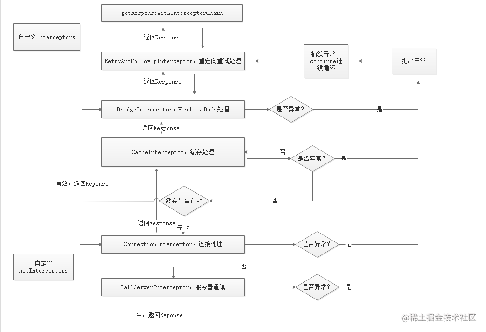
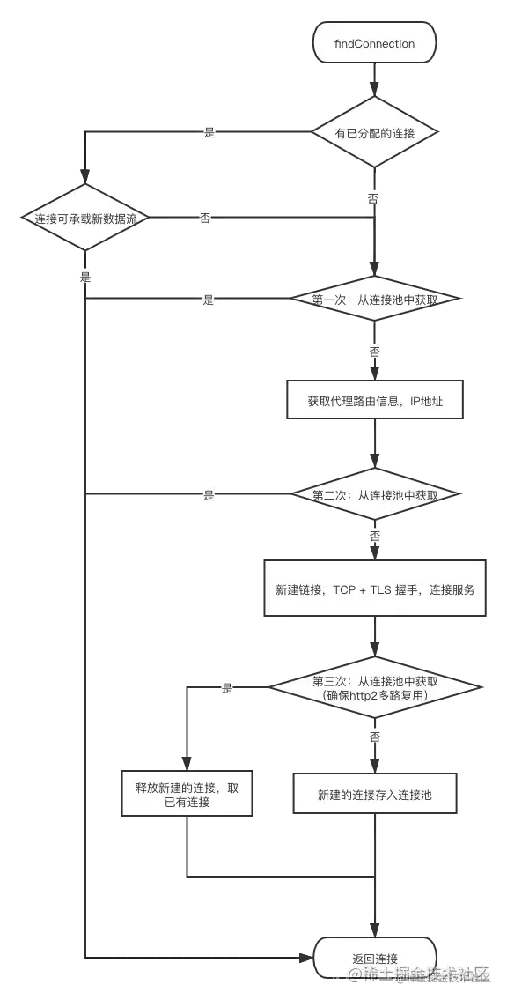
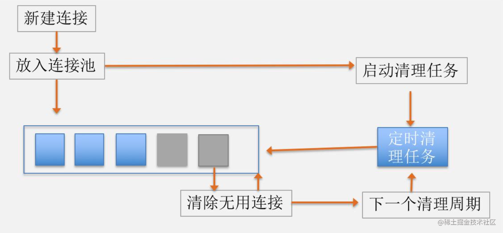

# OKhttp 核心解析

## 1. 总览

Okhttp是目前最流行的 Android 网络库，它还被 Google 加入到 Android 系统内部，为广大开发者提供网络服务。

那网络库究竟承担着一个什么样的角色呢？在我看来，它屏蔽了下层复杂的网络接口，让我们可以更高效地使用网络请求。


.webp)

如上图所示，一个网络库的核心作用主要有以下三点：

* **统一编程接口**。无论是同步还是异步请求，接口都非常简单易用。同时我们可以统一做策略管理，统一进行流解析（JSON、XML、Protocol Buffers）等。
* **全局网络控制**。在网络库内部我们可以做统一的网络调度、流量监控以及容灾管理等工作。
* **高性能**。既然我们把所有的网络请求都交给了网络库，那网络库是否实现高性能就至关重要。既然要实现高性能，那我会非常关注速度，CPU、内存、I/O 的使用，以及失败率、崩溃率、协议的兼容性等方面。

接下来我们一起来看下OkHttp的内部实现。

## 2 OKHttp请求整体流程

首先来看一个最简单的Http请求是如何发送的。

```kotlin
   val okHttpClient = OkHttpClient()
   val request: Request = Request.Builder()
       .url("https://www.google.com/")
       .build()

   okHttpClient.newCall(request).enqueue(object :Callback{
       override fun onFailure(call: Call, e: IOException) {
       }

       override fun onResponse(call: Call, response: Response) {
       }
   })
```

这段代码看起来比较简单,OkHttp请求过程中最少只需要接触`OkHttpClient`、`Request`、`Call`、 `Response`，

整个网络请求过程大致如下图所示


1. 通过建造者模式构建OKHttpClient与 Request
2. OKHttpClient通过newCall发起一个新的请求
3. 通过分发器维护请求队列与线程池，完成请求调配
4. 通过五大默认拦截器完成请求重试，缓存处理，建立连接等一系列操作
5. 得到网络请求结果

## 3. OKHttp分发器(Dispatcher)是怎样工作的?

分发器的主要作用是维护请求队列与线程池,比如我们有100个异步请求，肯定不能把它们同时请求，而是应该把它们排队分个类，分为正在请求中的列表和正在等待的列表，
等请求完成后，即可从等待中的列表中取出等待的请求，从而完成所有的请求

而这里同步请求各异步请求又略有不同

**同步请求**

```java
synchronized void executed(RealCall call) {
	runningSyncCalls.add(call);
}
```

因为同步请求不需要线程池，也不存在任何限制。所以分发器仅做一下记录。后续按照加入队列的顺序同步请求即可

**异步请求**

```java
synchronized void enqueue(AsyncCall call) {
	//请求数最大不超过64,同一Host请求不能超过5个
	if (runningAsyncCalls.size() < maxRequests && runningCallsForHost(call) < maxRequestsPerHost) 	  {
		runningAsyncCalls.add(call);
		executorService().execute(call);
	} else {
		readyAsyncCalls.add(call);
	}
}
```

当正在执行的任务未超过最大限制64，同时同一Host的请求不超过5个，则会添加到正在执行队列，同时提交给线程池。否则先加入等待队列。
每个任务完成后，都会调用分发器的finished方法,这里面会取出等待队列中的任务继续执行

## 4. OKHttp拦截器是怎样工作的?

经过上面分发器的任务分发，下面就要利用拦截器开始一系列配置了

```java
# RealCall
  override fun execute(): Response {
    try {
      client.dispatcher.executed(this)
      return getResponseWithInterceptorChain()
    } finally {
      client.dispatcher.finished(this)
    }
  }
```

我们再来看下RealCall的execute方法，可以看出，最后返回了getResponseWithInterceptorChain,责任链的构建与处理其实就是在这个方法里面

```java
#RealCall
fun getResponseWithInterceptorChain(): Response {
    //创建拦截器数组
    val interceptors = mutableListOf<Interceptor>()
    //添加应用拦截器
    interceptors += client.interceptors
    //添加重试和重定向拦截器
    interceptors += RetryAndFollowUpInterceptor(client)
    //添加桥接拦截器
    interceptors += BridgeInterceptor(client.cookieJar)
    //添加缓存拦截器
    interceptors += CacheInterceptor(client.cache)
    //添加连接拦截器
    interceptors += ConnectInterceptor
    if (!forWebSocket) {
      //添加网络拦截器
      interceptors += client.networkInterceptors
    }
    //添加请求拦截器
    interceptors += CallServerInterceptor(forWebSocket)
    
    //创建责任链
    val chain = RealInterceptorChain(interceptors, transmitter, null, 0, originalRequest, this,
        client.connectTimeoutMillis, client.readTimeoutMillis, client.writeTimeoutMillis)
    ...
    try {
      //启动责任链
      val response = chain.proceed(originalRequest)
      ...
      return response
    } catch (e: IOException) {
      ...
    }
  }
```
我们先不关心每个拦截器具体做了什么，主流程最终走到chain.proceed(originalRequest)。我们看一下这个procceed方法：

```java
  # RealInterceptorChain
  override fun proceed(request: Request): Response {
    return proceed(request, transmitter, exchange)
  }

  @Throws(IOException::class)
  fun proceed(request: Request, transmitter: Transmitter, exchange: Exchange?): Response {
    if (index >= interceptors.size) throw AssertionError()
    // 统计当前拦截器调用proceed方法的次数
    calls++

    // exchage是对请求流的封装，在执行ConnectInterceptor前为空，连接和流已经建立但此时此连接不再支持当前url
    // 说明之前的网络拦截器对url或端口进行了修改，这是不允许的!!
    check(this.exchange == null || this.exchange.connection()!!.supportsUrl(request.url)) {
      "network interceptor ${interceptors[index - 1]} must retain the same host and port"
    }

    // 这里是对拦截器调用proceed方法的限制，在ConnectInterceptor及其之后的拦截器最多只能调用一次proceed!!
    check(this.exchange == null || calls <= 1) {
      "network interceptor ${interceptors[index - 1]} must call proceed() exactly once"
    }

    // 创建下一层责任链 注意index + 1
    val next = RealInterceptorChain(interceptors, transmitter, exchange,
        index + 1, request, call, connectTimeout, readTimeout, writeTimeout)

    //取出下标为index的拦截器，并调用其intercept方法，将新建的链传入。
    val interceptor = interceptors[index]
    val response = interceptor.intercept(next) 

    // 保证在ConnectInterceptor及其之后的拦截器至少调用一次proceed!!
    check(exchange == null || index + 1 >= interceptors.size || next.calls == 1) {
      "network interceptor $interceptor must call proceed() exactly once"
    }

    return response
  }
```

代码中的注释已经写得比较清楚了，总结起来就是创建下一级责任链，然后取出当前拦截器，调用其intercept方法并传入创建的责任链。++为保证责任链能依次进行下去，必须保证除最后一个拦截器（CallServerInterceptor）外，其他所有拦截器intercept方法内部必须调用一次chain.proceed()方法++，如此一来整个责任链就运行起来了。

比如ConnectInterceptor源码中：

```java
# ConnectInterceptor 这里使用单例
object ConnectInterceptor : Interceptor {

  @Throws(IOException::class)
  override fun intercept(chain: Interceptor.Chain): Response {
    val realChain = chain as RealInterceptorChain
    val request = realChain.request()
    val transmitter = realChain.transmitter()

    val doExtensiveHealthChecks = request.method != "GET"
    //创建连接和流
    val exchange = transmitter.newExchange(chain, doExtensiveHealthChecks)
    //执行下一级责任链
    return realChain.proceed(request, transmitter, exchange)
  }
}
```

除此之外在责任链不同节点对于proceed的调用次数有不同的限制，ConnectInterceptor拦截器及其之后的拦截器能且只能调用一次，因为网络握手、连接、发送请求的工作发生在这些拦截器内，表示正式发出了一次网络请求；而在这之前的拦截器可以执行多次proceed，比如错误重试。
经过责任链一级一级的递推下去，最终会执行到CallServerInterceptor的intercept方法，此方法会将网络响应的结果封装成一个Response对象并return。之后沿着责任链一级一级的回溯，最终就回到getResponseWithInterceptorChain方法的返回。

如上所示责任链添加的顺序及作用如下表所示：

| 拦截器                            | 作用                                                         |
| --------------------------------- | ------------------------------------------------------------ |
| 应用拦截器                        | 拿到的是原始请求，可以添加一些自定义header、通用参数、参数加密、网关接入等等。 |
| RetryAndFollowUpInterceptor       | 处理错误重试和重定向                                         |
| BridgeInterceptor                 | 应用层和网络层的桥接拦截器，主要工作是为请求添加cookie、添加固定的header，比如Host、Content-Length、Content-Type、User-Agent等等，然后保存响应结果的cookie，如果响应使用gzip压缩过，则还需要进行解压。 |
| CacheInterceptor                  | 缓存拦截器，如果命中缓存则不会发起网络请求。                 |
| ConnectInterceptor                | 连接拦截器，内部会维护一个连接池，负责连接复用、创建连接（三次握手等等）、释放连接以及创建连接上的socket流。 |
| networkInterceptors（网络拦截器） | 用户自定义拦截器，通常用于监控网络层的数据传输。             |
| CallServerInterceptor             | 请求拦截器，在前置准备工作完成后，真正发起了网络请求。       |

我们的网络请求就是这样经过责任链一级一级的递推下去，最终会执行到`CallServerInterceptor`的`intercept`方法，此方法会将网络响应的结果封装成一个`Response`对象并`return`。之后沿着责任链一级一级的回溯，最终就回到`getResponseWithInterceptorChain`方法的返回,如下图所示：



!!! note "addInterceptor与addNetworkInterceptor的区别"

    二者通常的叫法为应用拦截器和网络拦截器，从整个责任链路来看，应用拦截器是最先执行的拦截器，也就是用户自己设置request属性后的原始请求，而网络拦截器位于ConnectInterceptor和CallServerInterceptor之间，此时网络链路已经准备好，只等待发送请求数据。

    1. 首先，应用拦截器在RetryAndFollowUpInterceptor和CacheInterceptor之前，所以一旦发生错误重试或者网络重定向，网络拦截器可能执行多次，因为相当于进行了二次请求，但是应用拦截器永远只会触发一次。另外如果在CacheInterceptor中命中了缓存就不需要走网络请求了，因此会存在短路网络拦截器的情况。
    2. 其次，如上文提到除了CallServerInterceptor，每个拦截器都应该至少调用一次realChain.proceed方法。实际上在应用拦截器这层可以多次调用proceed方法（本地异常重试）或者不调用proceed方法（中断），但是网络拦截器这层连接已经准备好，可且仅可调用一次proceed方法。
    3. 最后，从使用场景看，应用拦截器因为只会调用一次，通常用于统计客户端的网络请求发起情况；而网络拦截器一次调用代表了一定会发起一次网络通信，因此通常可用于统计网络链路上传输的数据。
    
## 5. 连接管理

### 5.1 连接复用

`ConnectInterceptor`的主要工作就是负责建立`TCP`连接，建立`TCP`连接需要经历三次握手四次挥手等操作，如果每个`HTTP`请求都要新建一个`TCP`消耗资源比较多
 而`Http1.1`已经支持`keep-alive`,即多个`Http`请求复用一个`TCP`连接，`OKHttp`也做了相应的优化，下面我们来看下`OKHttp`是怎么复用`TCP`连接的

`ConnectInterceptor`中查找连接的代码会最终会调用到`ExchangeFinder.findConnection`方法，具体如下

```java
# ExchangeFinder
//为承载新的数据流 寻找 连接。寻找顺序是 已分配的连接、连接池、新建连接
private RealConnection findConnection(int connectTimeout, int readTimeout, int writeTimeout,
    int pingIntervalMillis, boolean connectionRetryEnabled) throws IOException {
  synchronized (connectionPool) {
    // 1.尝试使用 已给数据流分配的连接.（例如重定向请求时，可以复用上次请求的连接）
    releasedConnection = transmitter.connection;
    result = transmitter.connection;

    if (result == null) {
      // 2. 没有已分配的可用连接，就尝试从连接池获取。（连接池稍后详细讲解）
      if (connectionPool.transmitterAcquirePooledConnection(address, transmitter, null, false)) {
        result = transmitter.connection;
      }
    }
  }

  synchronized (connectionPool) {
    if (newRouteSelection) {
      //3. 现在有了IP地址，再次尝试从连接池获取。可能会因为连接合并而匹配。（这里传入了routes，上面的传的null）
      routes = routeSelection.getAll();
      if (connectionPool.transmitterAcquirePooledConnection(address, transmitter, routes, false)) {
        foundPooledConnection = true;
        result = transmitter.connection;
      }
    }

  // 4.第二次没成功，就把新建的连接，进行TCP + TLS 握手，与服务端建立连接. 是阻塞操作
  result.connect(connectTimeout, readTimeout, writeTimeout, pingIntervalMillis,
      connectionRetryEnabled, call, eventListener);

  synchronized (connectionPool) {
    // 5. 最后一次尝试从连接池获取，注意最后一个参数为true，即要求 多路复用（http2.0）
    //意思是，如果本次是http2.0，那么为了保证 多路复用性，（因为上面的握手操作不是线程安全）会再次确认连接池中此时是否已有同样连接
    if (connectionPool.transmitterAcquirePooledConnection(address, transmitter, routes, true)) {
      // 如果获取到，就关闭我们创建里的连接，返回获取的连接
      result = transmitter.connection;
    } else {
      //最后一次尝试也没有的话，就把刚刚新建的连接存入连接池
      connectionPool.put(result);
    }
  }
 
  return result;
}
```

上面精简了部分代码，可以看出，连接拦截器使用了5种方法查找连接

1. 首先会尝试使用 已给请求分配的连接。（已分配连接的情况例如重定向时的再次请求，说明上次已经有了连接）
2. 若没有 已分配的可用连接，就尝试从连接池中 匹配获取。因为此时没有路由信息，所以匹配条件：`address`一致——`host`、`port`、代理等一致，且匹配的连接可以接受新的请求。
3. 若从连接池没有获取到，则传入`routes`再次尝试获取，这主要是针对`Http2.0`的一个操作,`Http2.0`可以复用`square.com`与`square.ca`的连接
4. 若第二次也没有获取到，就创建`RealConnection`实例，进行`TCP + TLS`握手，与服务端建立连接。
5. 此时为了确保`Http2.0`连接的多路复用性，会第三次从连接池匹配。因为新建立的连接的握手过程是非线程安全的，所以此时可能连接池新存入了相同的连接。
6. 第三次若匹配到，就使用已有连接，释放刚刚新建的连接；若未匹配到，则把新连接存入连接池并返回。

以上就是连接拦截器尝试复用连接的操作，流程图如下：



### 5.2 空闲连接清除
上面说到我们会建立一个TCP连接池，但如果没有任务了，空闲的连接也应该及时清除，OKHttp是如何做到的呢?

```kotlin
  # RealConnectionPool
  private val cleanupQueue: TaskQueue = taskRunner.newQueue()
  private val cleanupTask = object : Task("$okHttpName ConnectionPool") {
    override fun runOnce(): Long = cleanup(System.nanoTime())
  }

  long cleanup(long now) {
    int inUseConnectionCount = 0;//正在使用的连接数
    int idleConnectionCount = 0;//空闲连接数
    RealConnection longestIdleConnection = null;//空闲时间最长的连接
    long longestIdleDurationNs = Long.MIN_VALUE;//最长的空闲时间

    //遍历连接：找到待清理的连接, 找到下一次要清理的时间（还未到最大空闲时间）
    synchronized (this) {
      for (Iterator<RealConnection> i = connections.iterator(); i.hasNext(); ) {
        RealConnection connection = i.next();

        //若连接正在使用，continue，正在使用连接数+1
        if (pruneAndGetAllocationCount(connection, now) > 0) {
          inUseConnectionCount++;
          continue;
        }
		//空闲连接数+1
        idleConnectionCount++;

        // 赋值最长的空闲时间和对应连接
        long idleDurationNs = now - connection.idleAtNanos;
        if (idleDurationNs > longestIdleDurationNs) {
          longestIdleDurationNs = idleDurationNs;
          longestIdleConnection = connection;
        }
      }
	  //若最长的空闲时间大于5分钟 或 空闲数 大于5，就移除并关闭这个连接
      if (longestIdleDurationNs >= this.keepAliveDurationNs
          || idleConnectionCount > this.maxIdleConnections) {
        connections.remove(longestIdleConnection);
      } else if (idleConnectionCount > 0) {
        // else，就返回 还剩多久到达5分钟，然后wait这个时间再来清理
        return keepAliveDurationNs - longestIdleDurationNs;
      } else if (inUseConnectionCount > 0) {
        //连接没有空闲的，就5分钟后再尝试清理.
        return keepAliveDurationNs;
      } else {
        // 没有连接，不清理
        cleanupRunning = false;
        return -1;
      }
    }
	//关闭移除的连接
    closeQuietly(longestIdleConnection.socket());

    //关闭移除后 立刻 进行下一次的 尝试清理
    return 0;
  }
```
思路还是很清晰的：

1. 在将连接加入连接池时就会启动定时任务
2. 有空闲连接的话，如果最长的空闲时间大于5分钟 或 空闲数 大于5，就移除关闭这个最长空闲连接；如果 空闲数 不大于5 且 最长的空闲时间不大于5分钟，就返回到5分钟的剩余时间，然后等待这个时间再来清理。
3. 没有空闲连接就等5分钟后再尝试清理。
4. 没有连接不清理。

流程如下图所示：



## 6 OKHttp框架中用到了哪些设计模式?

1. 构建者模式：`OkHttpClient`与`Request`的构建都用到了构建者模式
2. 外观模式： `OkHttp`使用了外观模式,将整个系统的复杂性给隐藏起来，将子系统接口通过一个客户端`OkHttpClient`统一暴露出来。
3. 责任链模式: `OKHttp`的核心就是责任链模式，通过5个默认拦截器构成的责任链完成请求的配置
4. 享元模式: 享元模式的核心即池中复用,`OKHttp`复用`TCP`连接时用到了连接池，同时在异步请求中也用到了线程池


## 7 OKHtty优缺点

### 7.1 优点?

1. 使用简单，在设计时使用了外观模式，将整个系统的复杂性给隐藏起来，将子系统接口通过一个客户端`OkHttpClient`统一暴露出来。
2. 扩展性强，可以通过自定义应用拦截器与网络拦截器，完成用户各种自定义的需求
3. 功能强大，支持`Spdy`、`Http1.X`、`Http2`、以及`WebSocket`等多种协议
4. 通过连接池复用底层`TCP`(`Socket`)，减少请求延时
5. 无缝的支持`GZIP`减少数据流量
6. 支持数据缓存,减少重复的网络请求
7. 支持请求失败自动重试主机的其他`ip`，自动重定向

### 7.2 缺点?

不支持跨平台，对于大型应用来说跨平台是非常重要的。我们不希望所有的优化 Android 和 iOS 都要各自去实现一套，不仅浪费人力而且还容易出问题。


# 参考
[Android开发高手课](https://time.geekbang.org/column/article/77990)
[OkHttp 原理 8 连问](https://juejin.cn/post/7020027832977850381)
[听说你熟悉OkHttp原理?](https://juejin.cn/post/6844904087788453896)


