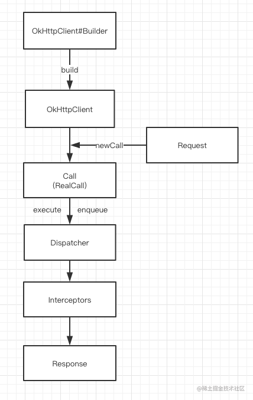

# OKhttp原理

> 不陷于茫茫源码之中，只取其核心

## 1. 总览

Okhttp是目前最流行的 Android 网络库，它还被 Google 加入到 Android 系统内部，为广大开发者提供网络服务。

那网络库究竟承担着一个什么样的角色呢？在我看来，它屏蔽了下层复杂的网络接口，让我们可以更高效地使用网络请求。


.webp)

如上图所示，一个网络库的核心作用主要有以下三点：

* **统一编程接口**。无论是同步还是异步请求，接口都非常简单易用。同时我们可以统一做策略管理，统一进行流解析（JSON、XML、Protocol Buffers）等。
* **全局网络控制**。在网络库内部我们可以做统一的网络调度、流量监控以及容灾管理等工作。
* **高性能**。既然我们把所有的网络请求都交给了网络库，那网络库是否实现高性能就至关重要。既然要实现高性能，那我会非常关注速度，CPU、内存、I/O 的使用，以及失败率、崩溃率、协议的兼容性等方面。

接下来我们一起来看下OkHttp的内部实现。


## 2. OKHttp请求整体流程介绍

首先来看一个最简单的Http请求是如何发送的。

```kotlin
   val okHttpClient = OkHttpClient()
   val request: Request = Request.Builder()
       .url("https://www.google.com/")
       .build()

   okHttpClient.newCall(request).enqueue(object :Callback{
       override fun onFailure(call: Call, e: IOException) {
       }

       override fun onResponse(call: Call, response: Response) {
       }
   })
```

这段代码看起来比较简单,OkHttp请求过程中最少只需要接触`OkHttpClient`、`Request`、`Call`、 `Response`，

整个网络请求过程大致如下图所示



1. 通过建造者模式构建OKHttpClient与 Request
2. OKHttpClient通过newCall发起一个新的请求
3. 通过分发器维护请求队列与线程池，完成请求调配
4. 通过五大默认拦截器完成请求重试，缓存处理，建立连接等一系列操作
5. 得到网络请求结果


# 参考
[Android开发高手课](https://time.geekbang.org/column/article/77990)
[OkHttp 原理 8 连问](https://juejin.cn/post/7020027832977850381)


