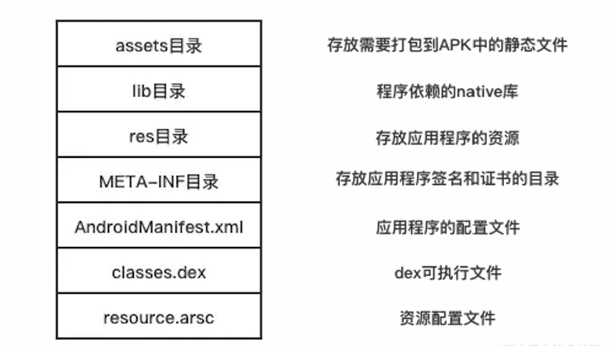

# 抖音 Android 包体积优化探索：从 Class 字节码入手精简 DEX 体积     

## 前言

众所周知，应用安装包的体积会十分影响用户的应用下载速度和安装速度。据 GooglePlay 平台对外发布相关的包大小对转化率影响的数据，我们可以看到随着包大小的增加，安装转化率总体呈下降的趋势。


因此对于我们的应用来说，为了提升我们用户下载的转化率（即下载安装激活用户与潜在用户的比例），我们对包体积必须给予一定的优化和管控。

我们应用商店中提供给用户下载的安装包，是 Android 定义的 APK 格式，其实质则是一个包含应用所有所需资源的 zip 包，它包含了如下所示的几个组成部分：



这其中最主要的组成部分便是 DEX 文件，它们都是由 Java/Kotlin 代码编译而成。过去的两年中，抖音的 DEX 的个数从 8 个涨到了 21 个，DEX 的总大小从 26M 涨到了 48M，增长十分迅猛。诚然，随着抖音的快速发展，业务复杂度的提高，代码量级一定是在增加的，但如何在业务无感的情况下，对代码进行通用优化，也是我们一个很重要的优化方向。

在介绍具体优化手段之前，我们首先需要了解下针对 DEX 整体上的优化思路。

## DEX 通用优化思路

在 AGP 的构建过程中，Java 或 Kotlin 源代码在经过编译之后会生成 Class 字节码文件，在这个阶段 AGP 提供了 Transform 来做字节码的处理，我们非常熟悉的 Proguard 就是在这个阶段工作的，之后 Class 文件经由 dexBuilder 生成一堆较小的 DEX 文件，再经由 mergeDex 合并成最终的 DEX 文件，然后打入 APK 中。具体过程如下图所示：


因此，我们针对 DEX 文件的优化时机可以从分别从三个阶段切入，分别是.kt 或.java 源文件、class 文件、DEX 文件：

- 在源文件进行处理也就是手动改造代码，这种方式对程序设计本身有侵入，并且有较强的局限性；
- 在 class 字节码阶段对开发者无感知，而且基本上能完成大多数的优化，但对于像跨 DEX 引用优化这样涉及 DEX 格式本身的优化无法完成；
- 在 DEX 文件阶段进行优化是最理想的，在这个阶段我们除了能对 DEX 字节码本身进行优化，也可对 DEX 文件格式进行操作。

优化的手段总体上来说也就是冗余去除、内容精简、格式优化等方式。

由于早期抖音 class 字节码修改工具建设比较成熟，我们很多包体积的优化都是通过修改 class 字节码完成的，随着优化的深入，后期也有很多优化是在 DEX 文件阶段处理的。关于 DEX 阶段相关的优化我们后续会有相关文章介绍，这里主要介绍 Class 字节码阶段进行的相关优化，主要分为两大类：

- 单纯去除无用的代码指令，包括 **去除冗余赋值，无副作用代码删除** 等
- 除了能减少代码指令数量外，同时减少方法和字段的数量，从而有效减少 DEX 的数量。我们知道 DEX 中引用方法数、引用字段数等不能超过 65535，超过之后就需要新开一个 DEX 文件，因此减少 DEX 中方法数、字段数可以减少 DEX 文件数量，像 **短方法内联、常量字段消除、R 常量内联** 就属于这类优化。

接下来我们会针对每一项优化的背景、优化思路和收益进行详细介绍。

## 去除冗余赋值

在我们平时的代码开发中，我们可能会写出以下的代码：

```csharp
class MyClass {
     private boolean aBoolean = false;

     private static boolean aBooleanStatic = false;

     private void boo() {
         if (!aBoolean) {
             System.out.println("in aBoolean false!");
         }

         if (!aBooleanStatic) {
             System.out.println("in aBooleanStatic false!");
         }
     }
}
```

我们常常为了保证一个 Class 的成员变量的初始满足我们期望的值，手动对其进行一次赋值，如上述代码里的 aBoolean 和 aBooleanStatic。这是一种逻辑上非常安全的做法，但这真是必须的吗？

其实 Java 官方在虚拟机规范（[docs.oracle.com/javase/spec…](https://link.juejin.cn?target=https%3A%2F%2Fdocs.oracle.com%2Fjavase%2Fspecs%2Fjvms%2Fse7%2Fhtml%2Fjvms-2.html%23jvms-2.3) ） 中定义了，Class对象在虚拟机中加载时，所有的静态字段（也就是静态成员变量，下面统称为Field）都会首先加载一个默认值。

> **2.3. Primitive Types and Values**
>
> > ...
> >
> > The integral types are:
> >
> > - `byte`, whose values are 8-bit signed two's-complement integers, and whose default value is zero
> > - `short`... whose default value is zero
> > - `int`... whose default value is zero
> > - `long`... whose default value is zero
> > - `char`... whose default value is the null code point (`'\u0000'`)
> >
> > The floating-point types are:
> >
> > - `float`... whose default value is positive zero
> > - `double`... whose default value is positive zero
> >
> > **2.4. Reference Types and Values**
> >
> > ...The `null` reference initially has no run-time type, but may be cast to any type. The default value of a `reference` type is `null`.

总结来说，在 Java 中的基本类型和引用类型的 Field 都会在 Class 被加载的同时赋予一个默认值，`byte`、`short`、`int`、`long`、`float`、`double`类型都会被赋为 0， char 类型会被赋为`'\u0000'`，引用类型会被赋为 null。

我们将开头那段代码通过命令行`java -p -v`转化为字节码：

```csharp
public com.bytedance.android.dexoptimizer.MyClass();
    Code:
         0: aload_0
         1: invokespecial #1                  // Method java/lang/Object."<init>":()V
         4: aload_0
         5: iconst_0
         6: putfield      #2                  // Field aBoolean:Z
         9: return

   static {};
    Code:
         0: iconst_0
         1: putstatic     #6                  // Field aBooleanStatic:Z
         4: return

  private void boo();
    Code:
         0: aload_0
         1: getfield      #2                  // Field aBoolean:Z
         4: ifne          15
         7: getstatic     #4                  // Field java/lang/System.out:Ljava/io/PrintStream;
        10: ldc           #5                  // String in aBoolean false!
        12: invokevirtual #6                  // Method java/io/PrintStream.println:(Ljava/lang/String;)V
        15: aload_0
        16: getfield      #3                  // Field aBooleanStatic:Z
        19: ifne          30
        22: getstatic     #4                  // Field java/lang/System.out:Ljava/io/PrintStream;
        25: ldc           #7                  // String in aBooleanStatic false!
        27: invokevirtual #6                  // Method java/io/PrintStream.println:(Ljava/lang/String;)V
        30: return
```

通过上述字节码发现，虽然 JVM 会在运行时将 aBoolean 赋值为 0，但是我们在字节码中仍然会再赋值一次 0 给到 aBoolean，aBooleanStatic 同理。

```kotlin
public com.bytedance.android.dexoptimizer.MyClass();
    Code:
         0: aload_0
         1: invokespecial #1                  // Method java/lang/Object."<init>":()V
         4: aload_0
         5: iconst_0
         6: putfield      #2                  // Field aBoolean:Z
         9: return
```

以上标红部分出现了重复赋值，去除了不影响运行时逻辑。因此，我们考虑在 Class 字节码处理阶段，将这种冗余的字节码移除来获取包大小收益。

### 优化思路

理解了问题产生的原因后，就很容易得到对应的解决方案。首先，能够被优化的 Field 赋值，需要满足这三个条件：

1. Field 是属于其直接定义的 Class 的，而非在父类定义过的；
2. Field 赋值是在 Class 的`clinit`、`init`方法中，这样做很大程度是为了降低复杂度（因为只在这两个方法中调用的 private 方法也是能做这样的优化，但分析这样的方法复杂度很高）；
3. Field 赋值是默认值，当出现多个赋值时，在非默认赋值后的赋值都无法被优化。

我们结合下面的代码，具体说明一下各种情况是否可以被优化：

```java
Class MyClass {
     // 可以优化，直接定义的，且是默认值
     private boolean aBoolean = false;
     // 不可优化，因为赋值为非默认值
     private boolean bBoolean = true;
     // 可以优化，直接定义的，且是默认值
     private static boolean aBooleanStatic = false;

     static {
         // 可以优化，第一处出现，且是默认值
         aBooleanStatic = false;

         // 其他代码
         ...

         // 可以优化，前面没有非默认值赋值，且是默认值
         aBooleanStatic = false;

         // 其他代码
         ...

         // 不可优化，因为赋值为非默认值
         aBooleanStatic = true;

         // 其他代码
         ...

         // 不可优化，因为之前出现了非默认值的赋值
         aBooleanStatic = false;
     }

     private void boo() {
         // 不可优化，因为函数为非clinit或init
         aBoolean = false;
     }
}
```

具体实现上，我们的优化思路是这样的：

- 遍历 Class 所有方法，找到`<clinit>`和`<init>`方法，从上往下进行字节码指令遍历

- 遍历这两种方法的所有字节码指令，找到所有的 putfield 指令，将 putfield 指令的目标 ClassName 和 FieldName 使用`-` 连接，构建一个唯一的 Key，如果
  - putfield 目标 Class 不是当前 Class，跳过
  - putfield 前的 load 指令不为`iconst_0`，`fconst_0`，`dconst_0`，`lconst_0`，`aconst_null`，并将该 putfield 所关联的唯一的 Key 放入已经遍历过的 Key 的集合中
  - putfield 前的 load 指令为`iconst_0`，`fconst_0`，`dconst_0`，`lconst_0`，`aconst_null`，且该 putfield 所关联的唯一的 Key 没有在遍历过的 Key 的集合出现过，则标记为可清除的字节码指令

- 遍历完成后，删除所有被标记为可清除的字节码指令

我们用一个简单的例子来说明下我们的思路：

```c#
public com.bytedance.android.dexoptimizer.MyClass();  // 1. 判断是<init>方法，进入优化逻辑
    Code: // 2. 从上往下进行代码遍历
         0: aload_0
         1: invokespecial #Method java/lang/Object."<init>":()V
         4: aload_0
         5: iconst_0
         6: putfield      #Field MyClass.aBoolean:Z. // 3.发现是该Class的域，且赋值为iconst_0，标记往上三个指令可以删除
         7: aload_0
         8: iconst_1
         9: putfield      #Field MyClass.aBoolean:Z  // 4.发现是该Class的域，且赋值不为iconst_0，则在遍历过的Key的集合中添加MyClass-aBoolean，继续往下
         10: aload_0
         11: iconst_0
         12: putfield     #Field MyClass.aBoolean:Z  // 5.发现是该Class的域，但在遍历过的Key的集合中发现存在MyClass-aBoolean，继续往下
         15: return
```

最终发现上述字节码中，标红的部分可以删除，删除对应的字节码指令，优化完成。

使用抖音之前开源的字节码处理框架 ByteX，可以比较方便地获取 Field 的 Class，遍历 Class 的所有方法，以及所有方法的字节码。我们也已经将此方案进行了开源，有兴趣的同学可以前往查看详细代码:

- [github.com/bytedance/B…](https://link.juejin.cn?target=https%3A%2F%2Fgithub.com%2Fbytedance%2FByteX%2Fblob%2Fmaster%2Ffield-assign-opt-plugin)

## 删除无副作用代码

冗余赋值是利用了虚拟机在类加载时为字段默认赋值的特性，从而删除多余的的赋值指令，而我们代码中本身也有一些对线上包是没有作用的，最常见的就是日志打印，除了占用包体积之外，还会造成性能问题以及安全风险，因此一般都会将其移除掉，接下来我们以 Log.i 调用为例来介绍如何删除代码中的无用函数调用。比如下面代码中的日志打印语句：

```csharp
public static void click() {
    clickSelf();
    Log.i("Logger", "click time:" + System.currentTimeMillis());
}
```

一开始我们尝试了 proguard 的 -assumenosideeffects，这个指令需要我们假定要删除的方法调用没有任何的副作用，并且从程序分析的角度来说这个方法是不会修改堆上某个对象或者栈上方法参数的值。使用如下配置，proguard 就会在 optimize 阶段帮我们删除 Log 相关的方法调用。

```arduino
-assumenosideeffects class android.util.Log {
    public static boolean isLoggable(java.lang.String, int);
    public static int v(...);
    public static int i(...);
    public static int w(...);
    public static int d(...);
    public static int e(...);
}
```

但是这种删除并不彻底，它只会删除方法调用指令本身，比如上面的代码中删除 Log.i 方法调用之后，会遗留一个 StringBuilder 对象的创建：

```scss
public static void click() {
    clickSelf();
    new StringBuilder("click time:")).append(System.currentTimeMillis();
}
```

这个对象的创建我们人为判断的话也是无用的，但是仅从简单的静态程序指令分析的角度并不能判定其是无用的，因此 proguard 并没有将其删除。

既然 assumenosideeffects 删除不干净，我们就自己来实现更加彻底的优化方案。

### 优化思路

```less
 public static void click();
    Code:
       0: invokestatic  #6                  // Method clickSelf:()V
       3: ldc           #7                  // String Logger
       5: new           #8                  // class java/lang/StringBuilder
       8: dup
       9: invokespecial #9                  // Method java/lang/StringBuilder."<init>":()V
      12: ldc           #10                 // String click time:
      14: invokevirtual #11                 // Method java/lang/StringBuilder.append:(Ljava/lang/String;)Ljava/lang/StringBuilder;
      17: invokestatic  #12                 // Method java/lang/System.currentTimeMillis:()J
      20: invokevirtual #13                 // Method java/lang/StringBuilder.append:(J)Ljava/lang/StringBuilder;
      23: invokevirtual #14                 // Method java/lang/StringBuilder.toString:()Ljava/lang/String;
      26: invokestatic  #2                  // Method android/util/Log.i:(Ljava/lang/String;Ljava/lang/String;)I
      29: pop
```

如上可以看到一行`Log.i("Logger", "click time:" + System.currentTimeMillis());`在编译完成之后会生成多条指令（从 ldc 到 pop），除了目标方法 Log.i 调用 invokestatic 指令外，还有很多参数创建和入栈指令。

我们要删除相关方法的调用的话，主要是就是找到这行代码所产生的起始指令和终止指令，然后起始到终止位置之间的指令就是我们要删除的全部指令。

 **1. 查找终止指令位置**

终止指令的查找相对简单，主要就是找到要删除的目标方法调用指令，再根据方法的返回值类型确定是否要包含其后的 pop 或 pop2 指令。

比如上述代码我们通过遍历就能找到目标方法调用`invokestatic #2` 的位置，因为 Log.i 的返回值类型是 int，终止指令就是下一条的 pop。

注意 pop 指令的作用是主动让 int 类型的值出栈，也就是不会使用该方法的返回值，只有这种情况下我们才能安全删除目标方法，否则不能删除。当然如果方法的返回值类型是 void，就不会有 pop 指令。

**2. 查找起始指令位置**

起始指令的查找则需要我们对于 java 字码指令设计有基本的认识: java 字节码指令是基于堆栈设计的，每一条字节码指令会对应操作数栈的若干参数的入栈和出栈，并且一个完整独立代码/代码块执行前和执行后操作数栈应该是一样的。

因此我们找到终止指令后，倒序遍历指令，根据指令的作用进行反向的入栈和出栈操作，当我们的栈中 size 减为 0 时，就找到了起始指令的位置。注意在入栈时候要记录参数的类型，并在出栈时候做类型匹配校验。如上面的示例：

- pop 指令效果是单 slot 参数(像 int，float)出栈 ,那我们就在栈存入一个 slot 类型的参数
- invokestatic 要看方法的参数和返回值，正常效果是对应方法的参数从右至左依次出栈，方返回值 int 入栈。我们就根据方法返回值出栈一个 int 类型的参数，发现栈顶目前是 slot，类型匹配。然后按照方法参数从左至右依次入栈两个 String 类型的参数。
- invokevirtual 指令正常方法调用参数依次从右至左依次出栈，然后 this 对象出栈，最后方法返回值 String 入栈。我们弹出栈顶一个参数，发现其和 String 匹配，然后依次入栈 this 对应的类型 StringBuilder，这里调用的是 toString 方法没有参数就不用再入栈。
- 中间其他的指令类似，直到 ldc 指令，本身是向栈中放入一个 int,float 或 String 常量，我们这里弹出一个参数，发现其是 String 匹配，并且此时栈的大小变为 0，也就找到了起始指令的位置。

### 方案缺陷

不过上述方案存在两个缺陷：

1. 因为分析只在单个方法内分析，针对 Log 方法封装的情况，必须需要配置封装方法作为目标方法，才能删除完全删除，比如下面的方法需要配置 AccountLog.d 才能删除其调用处的 StringBuilder 创建。

```kotlin
object AccountLog {
    @JvmStatic
    fun d(tag: String, msg: String) = Log.d(tag, msg)
}

```

1. 可能会误删除一些有用的指令，因为无法认为 Log.i 的两个参数的构建指令都是没有用的，我们只能确定 StringBuilder 的创建是没用的，但是一些其他的方法调用可能会改变一些对象的状态，因此存在一定风险。

### Proguard 方案

在我们上述方案在线上运行一年之后，尝试针对上述弊端进行优化，然后发现 proguard 还提供了 assumenoexternalsideeffects 指令，它可以让我们指定没有任何外部副作用的方法。

指定了以后，它只会修改调用这个方法的实例本身，但不会修改其他的对象。通过如下的配置可以删除无用的 StringBuilder 创建。

```arduino
-assumenoexternalsideeffects class java.lang.StringBuilder {
    public java.lang.StringBuilder();
    public java.lang.StringBuilder(int);
    public java.lang.StringBuilder(java.lang.String);
    public java.lang.StringBuilder append(java.lang.Object);
    public java.lang.StringBuilder append(java.lang.String);
    public java.lang.StringBuilder append(java.lang.StringBuffer);
    public java.lang.StringBuilder append(char[]);
    public java.lang.StringBuilder append(char[], int, int);
    public java.lang.StringBuilder append(boolean);
    public java.lang.StringBuilder append(char);
    public java.lang.StringBuilder append(int);
    public java.lang.StringBuilder append(long);
    public java.lang.StringBuilder append(float);
    public java.lang.StringBuilder append(double);
    public java.lang.String toString();
}
-assumenoexternalreturnvalues public final class java.lang.StringBuilder {
    public java.lang.StringBuilder append(java.lang.Object);
    public java.lang.StringBuilder append(java.lang.String);
    public java.lang.StringBuilder append(java.lang.StringBuffer);
    public java.lang.StringBuilder append(char[]);
    public java.lang.StringBuilder append(char[], int, int);
    public java.lang.StringBuilder append(boolean);
    public java.lang.StringBuilder append(char);
    public java.lang.StringBuilder append(int);
    public java.lang.StringBuilder append(long);
    public java.lang.StringBuilder append(float);
    public java.lang.StringBuilder append(double);
}
```

不过，这个配置只适用于 Log 里只传入 String 的情况。如果是`int Log.w (String tag, Throwable tr)`这种情况，就无法把`Throwable`参数也一起去掉。那还是应该采用我们自己实现的插件才能优化干净。

> 此优化对抖音包体积收益，约为 520KB。

## 短方法内联

上面介绍的两个优化是从去除无用的指令的角度出发，开篇 DEX 优化思路中我们有讲过，减少定义方法或者字段数从而减少 DEX 数量也是我们常用优化思路之一，短方法内联就是精简代码指令的情况下，同时减少定义方法数。

在和海外竞品的对比过程中，我们发现单个 DEX 文件中的定义方法数远比竞品要多，进一步对 DEX 进行分析，发现抖音的 DEX 中有大量的 access，getter-setter 方法，而竞品中几乎没有。因此我们打算针对短方法做一些内联优化，减少定义方法数。

在介绍优化方案前，先来了解下内联的基础知识，内联作为最常见的代码优化手段，被称为优化之母。一些语言像 C++、Kotlin 提供了 inline 关键字给程序员做函数的内联，而 Java 语言本身并没有给程序员提供控制或建议 inline 的机会，甚至 javac 编译过程中也没有做方法内联。为了便于理解，我们通过一个简单的例子来看内联是如何工作的，如下代码中 callMethod 调用 print 函数：

```csharp
public class InlineTest {

    public static void callMethod(int a) {
        int result = a + 5;
        print(result);

    }
    public static void print(int result) {
        System.out.println(result);
    }
}

```

在内联之后 inlineMethod 的内容直接被展开到 callMethod 中, 从字节码的角度看变化如下：

内联前：

```arduino
public static void callMethod(int);
    Code:
       0: iload_0
       1: iconst_5
       2: iadd
       3: istore_1
       4: iload_1
       5: invokestatic  #2                  // Method print:(I)V
       8: return

```

内联后：

```arduino
public static void callMethod(int);
    Code:
       0: iload_0
       1: iconst_5
       2: iadd
       3: dup
       4: istore_0
       5: istore_0
       6: getstatic     #5                  // Field java/lang/System.out:Ljava/io/PrintStream;
       9: iload_0
      10: invokevirtual #6                  // Method java/io/PrintStream.println:(I)V
      13: return

```

从执行时间的角度看，减少了一次函数调用，从而提升了执行性能。从空间占用角度看，减少了一处函数声明，从而减少了代码体积。

那是不是所有的方法都适合内联呢？

显然不是的，对于单次调用的方法说内联能同时取得时间和空间的收益；对于多次调用的的方法则需要考虑方法本身的长短，比如上面的 print 方法展开之后的指令是比 invokestatic 指令本身要长很多的，但是像 access、getter-setter 方法本身比较短就很适合内联。

### access 方法内联

```csharp
public class Foo {
    private int mValue;

    private void doStuff(int value) {
        System.out.println("Value is " + value);
    }

    private class Inner {
        void stuff() {
            Foo.this.doStuff(Foo.this.mValue);
        }
    }
}

```

如上述代码，大家都知道 Java 可以在内部类 Foo$Inner 中直接访问外部类 Foo 的私有成员，但是 JVM 并没有什么内部类外部类的概念，认为一个类直接访问另一个类的私有成员是非法的。编译器为了能实现这种语法糖，会在编译期生成以下静态方法:

```arduino
static int Foo.access$100(Foo foo) {
    return foo.mValue;
}
 static void Foo.access$200(Foo foo, int value) {
    foo.doStuff(value);
}

```

内部类对象创建时候会传入外部类的引用，这样当内部类需要访问外部类的`mValue` 或调用`doStuff()`方法时，会通过调用这些静态方法来实现。这里需要生成静态的方法的原因，是因为被访问的成员是私有的，而私有访问控制更多地是在源码层面去约束，防止破坏程序的设计。在字节码层面只要不破坏语法逻辑，因此我们完全可以将这些私有成员改成 public 的，直接删除掉编译器生成的桥接静态方法。

#### 优化思路

具体的优化分为分为以下几步：

1. 收集字节码中的 access 方法。

```arduino
static int access$000(com.bytedance.android.demo.inline.Foo);
    descriptor: (Lcom/bytedance/android/demo/inline/Foo;)I
    flags: ACC_STATIC, ACC_SYNTHETIC
    Code:
      stack=1, locals=1, args_size=1
         0: aload_0
         1: getfield      #2                  // Field mValue:I
         4: ireturn


static void access$100(com.bytedance.android.demo.inline.Foo, int);
    descriptor: (Lcom/bytedance/android/demo/inline/Foo;I)V
    flags: ACC_STATIC, ACC_SYNTHETIC
    Code:
      stack=2, locals=2, args_size=2
         0: aload_0
         1: iload_1
         2: invokespecial #1                  // Method doStuff:(I)V
         5: return

```

如上面的字节码所示，它的特征非常明显，因为是编译生成的方法，它有 synthetic 标记，并且是静态方法，方法名字以"access$"开头，通过这些特征在 ClassVisitor visitMethod 时就很容易匹配到相关方法。

2. 分析并记录 access 方法调用处要替换的目标指令。

access 桥接的访问只有字段和方法两种，相对应的指令是方法访问指令(invokvirtual, invokspecial 等）和字段访问指令(getfield, putfield 等) ，只需遍历方法找到相应的指令，同时解析出指令访问的字段或方法信息，然后再将对应的 private 成员改为 public。比如 access$000 方法会找到如下指令，访问的字段是类 Foo 的 mValue。

```less
getfield      #2                  // Field mValue:I

```

3. 替换 access 方法调用处的 invokestatic 为对应的目标指令，并删除 access 方法的定义。

遍历查找所有对 access 方法的调用点，如下面的 invokestatic 指令，其调用方法在我们第一步收集的 access 方法中，将它替换为 getfield，然后便可以删除 Foo.access$000 方法本身。

```css
invokestatic  #3                  // Method com/bytedance/android/demo/inline/Foo.access$000:(Lcom/bytedance/android/demo/inline/Foo;)I

```

### getter-setter 内联

封装是面向对象编程(OOP)的基本特性之一，使用 getter 和 setter 方法是在程序设计中常见的封装方法之一。在日常开发中，我们常常会为一些类写一些 getter-setter 方法，如下代码所示：

```csharp
public class People {
    private int age;
    public int getAge() {
        return this.age;
    }
    public void setAge(int age) {
        this.age = age;
    }
}

```

这些方法完全就是短方法内联的最佳 case。

#### 优化思路

getter-setter 内联整体实现和 access 方法大同小异，整体也分为收集、分析和删除三步。

```arduino
public int getAge();
    descriptor: ()I
    flags: ACC_PUBLIC
    Code:
      stack=1, locals=1, args_size=1
         0: aload_0
         1: getfield      #2                  // Field age:I
         4: ireturn

public void setAge(int);
    descriptor: (I)V
    flags: ACC_PUBLIC
    Code:
      stack=2, locals=2, args_size=2
         0: aload_0
         1: iload_1
         2: putfield      #2                  // Field age:I
         5: return

```

1. 收集代码中要内联的 getter-setter 方法信息。参考上面的字节码指令，主要是找出只有参数入栈(LOAD 类指令）、字段访问（GETFIELD, PUTFIELD)、RETURN 指令 的方法。这里需要注意的是要过滤被 proguard 规则 keep 的方法，这些删除风险很大，因为可能会有插件内调用或者反射调用。
2. 记录每个方法访问字段的指令以及目标字段，如果字段访问权限是非 public 的话，修改成 public 的。
3. 针对调用 getter-setter 的方法的地方，直接替换为相应的字段访问指令，并删除 getter-setter 的方法的定义。

### 为什么不用 Proguard

Proguard 除了混淆、shrink 无用代码之外，也会对代码进行诸多的优化，其中就包括短方法内联，唯一方法内联等。那我们的 App 为什么没有直接使用呢？主要还是因为使用了 robust 热修，auto-patch 对内联层级过高以及像 builder 方法这种情况支持的不好，会导致 Patch 生成失败。但是 access 方法、getter-setter 方法本身很短，至多也就有一层内联层级，不会影响 Patch 的生成，proguard 又无法配置哪些方法内联，因此我们打算自己来实现。

> 抖音上两个短方法内联减少定义方法数 7 万+，DEX 文件减少一个，包体积收益达到了 1.7M。

## 常量字段消除

上面短方法内联是将方法内容展开到调用处去，我们代码中的一些常量也类似，可以将常量值替换使用处，从而减少字段的声明，这种优化就是常量字段消除的最简单表现。

我们知道 javac 会做一些 final 类型变量的常量字段消除优化，比如下面的代码：

```arduino
public class ConstJava {
    public static final int INTEGER = 1024;
    public static final String STRING = "this is long  str";

    public static void constPropagation() {
        System.out.println("integer:" + INTEGER);
        System.out.println("string:" + STRING);
    }
}

```

在编译之后 constPropagation 方法就会变成如下内容，常量直接替换成了字面值，这样相应的 final 字段就变成了无用字段，proguard 就可以将其 shrink 掉。

```csharp
public static void constPropagation() {
    System.out.println("integer:1024");
    System.out.println("string:this is long  str");
}

```

但是比如下面的一些一些 kotlin 代码，编译之后如下, 并未进行传播优化。当然这里如果添加 const 关键字修改，对应地会进行优化。

```kotlin
class ConstKotlin {
    companion object {
        val INTEGER = 1024
        val STRING = "this is long str"
    }

    private val b = 6

    fun constPropagation(){
        println("a:$INTEGER")
        println("s:$STRING")
    }

}

```

编译后代码：

```ini
private static final int INTEGER = 1024;
@NotNull
private static final String STRING = "this is long str";

public final void constPropagation() {
   String var1 = "a:" + INTEGER;
   System.out.println(var1);
   var1 = "s:" + STRING;
   System.out.println(var1);
}

```

因此我们可以针对这种 case 进行优化。

另外我们上面说常量字段消除优化之后，对应的字段声明就可以被 proguard 删除，但是项目中有很多 keep 过度的情况，比如下面的规则会导致常量字段声明被保留，这种情况我们可以将字段删除。

```arduino
-keep class com.bytedance.android.demo.ConstJava{*;}

```

#### 优化思路

1. 收集 static final 类型的变量，并记录其字面值，这里需要排除一些特殊的字段，然后最终确定能删除的字段。需要排除的字段主要有下面两种：

- 用来表示序列化对象版本的 serialVersionUID 字段；
- 有反射使用到的字段，一般来说不太会有反射访问 final 类型变量的情况，但这里还是会尝试分析代码中对字段的反射调用，如果有对应的访问则保留。

1. 针对代码中 getstatic 指令的访问，分析其访问的字段，如果在第一步收集到的字段中，就把对应的指令改为 l 对应的常量入栈指令，并删除对应的字段。如下为对 INTEGER 的访 getstatic 指令，其在第一步收集到的 final 类型变量中，字面值为 1。

```less
getstatic     #48                 // Field STRING:Ljava/lang/String;
```

修改为 ldc 指令：

```vbnet
ldc           #25                 // String s:this is long str
```

这里些同学会有疑问，比如一个大的字符串传播到多个类里面不是反而会增大包体积么？

的确存在这种可能，不过由于一个 Dex 中所有的类共用一个常量池，所以传播过去如果两个类在同一个 Dex 文件中的话是不会有负向的，反之则会有负向。

> 常量字段消除优化总体带来 400KB 左右的包体收益。

## R.class 常量内联

常量字段消除优化的是常规的 final static 类型，但在我们的代码中，还有另一种类型的常量也可以内联优化。

在我们 Android 的开发中，常常会用到 R 这个类，它是我们使用资源的最平常的方式。但实际上，R 文件的生成有着许多不合理的地方，对我们的性能和包大小都造成了极大的影响。但是要理解这个问题，首先我们需要再理解一次 R 文件是什么。

我们在平时的代码开发中，常常会写出以下平常的代码：

```less
public class MainActivity extends AppCompatActivity {

    @Override
    protected void onCreate(@Nullable Bundle savedInstanceState) {
        super.onCreate(savedInstanceState);

        // 此处我们使用R中的id来获取MainActivity的layout资源
        setContentView(R.layout.activity_main);
    }
}
```

我们在该例中使用`R.layout.activity_main`来获取了 MainActivity 的 layout 资源，那我们将其转化为字节码会是如何呢？这需要分两种情况讨论：

- 当 MainActivity 在 application module 下时，其字节码为：

```arduino
protected void onCreate(android.os.Bundle);
    Code:
         0: aload_0
         1: aload_1
         2: invokespecial #2                  // Method android/support/v7/app/AppCompatActivity.onCreate:(Landroid/os/Bundle;)V
         5: aload_0
         6: ldc           #4                  // int 2131296285
         8: invokevirtual #5                  // Method setContentView:(I)V
        11: return
```

可以看到使用`R.layout.activity_main`直接被替换成了常量。

- 然而，当 MainActivity 在 library module 下时，其字节码为：

```arduino
protected void onCreate(android.os.Bundle);
    Code:
         0: aload_0
         1: aload_1
         2: invokespecial #2                  // Method android/support/v7/app/AppCompatActivity.onCreate:(Landroid/os/Bundle;)V
         5: aload_0
         6: getstatic     #3                  // Field com/bytedance/android/R$layout.activity_main:I
         9: invokevirtual #4                  // Method setContentView:(I)V
        12: return
```

可以看到其从使用 ldc 指令导入常量，变成了使用 getstatic 指令访问 R$layout 的 activity_main 域。

### 为什么会出现差别

我们知道，library module 在提供给 application module 的时候一般是通过 aar 的形式提供的，因此为了在 library module 打包时，javac 能够编译通过，AGP 默认会给 library module 提供一个临时的 R.java 文件(最终不会打入 library module 的包中)，并且为了防止被 javac 内联，会将 R 中 field 的修饰符限定为`public static`，这样就使得 R 的域都不为常量，最终逃过 javac 内联保留到了 application module 的编译中。

### 为什么 library module 不内联

在 Android 中，我们每个资源 id 都是唯一的，因此我们在打包的时候需要保证不会出现重复 id 的资源。如果我们在 library module 就已经指定了资源 id，那我们就和容易和其他 library module 出现资源 id 的冲突。因此 AGP 提供了一种方案，在 library module 编译时，使用资源 id 的地方仍然采用访问域的方式，并记录使用的资源在 R.txt 中。在 application module 编译时，收集所有 library module 的 R.txt，加上 application module R 文件输入给 aapt，aapt 在获得全局的输入后，按序给每个资源生成唯一不重复的资源 id，从而避免这种冲突。但此时，library module 已经编译完成，因此只能生成 R.java 文件，来满足 library module 的运行时资源获取。

### 为什么 ProGuard 没有优化

我们在使用 ProGuard 的时候，Google 官方建议我们带上一些 keep 规则，这也是新建 application 默认会生成的模版代码

```arduino
buildTypes {
    release {
        proguardFiles getDefaultProguardFile('proguard-android-optimize.txt')
    }
}
```

官方给的 keep 规则([android.googlesource.com/platform/sd…](https://android.googlesource.com/platform/sdk/+/master/files/proguard-android-optimize.txt) R class 的字段），所以加了下面这条规则：

```arduino
-keepclassmembers class **.R$* {
    public static <fields>;
}
```

该 keep 规则的作用是，将所有 R 以及 R 内部类的以 public static 修饰的域保留，使其不被优化。因此在我们最终的 APK 中，R.class 仍然存在，这造成了我们包体积的膨胀。

> 实际上，造成我们包体积膨胀的原因不止 R 的域的定义和赋值，在 Android 中，一个 DEX 可放置的 field 的数量上限固定是 65536，超过这个限制则我们需要将一个 DEX 拆分为两个。多个 DEX 会导致 DEX 中的复用数据变少，从而进一步提升了包体积的膨胀。因此我们对于 R 的优化，在 DEX 层面上也会有很大的收益。

### 解决方法

了解问题根源后，解决方案也十分简单。既然 R.class 中各个域的值确认后就不再改变，那我们完全可以将通过 R 获取资源 id 的调用处内联，并删除对应的域，来获取收益。

优化思路大概如下：

1. 遍历所有的方法，定位所有的`getstatic`指令

2. 如果该`getstatic`指令的目标 Class name 的为**.R 或者**.R$* 形式的 Class

   a. 如果 `getstatic`指令的目标 Field 为`public static int`类型，则使用 `ldc`指令将`getstatic`替换，直接将 Field 的实际值导入；

   b. 如果`getstatic`指令的目标 Field 为`public static int[]`类型，则使用`newarray`指令将`getstatic`替换，将`<clinit>`中 Field 的数组赋值导入。

3. 遍历完成后，判断 R.class 中的是否所有域都被删除，如果全部被删除，则将该 R.class 也移除。

我们使用前文的 case 来说明如下：

```less
protected void onCreate(android.os.Bundle);
    Code:
         0: aload_0
         1: aload_1
         2: invokespecial #2                  // Method android/support/v7/app/AppCompatActivity.onCreate:(Landroid/os/Bundle;)V
         5: aload_0
        // 判断是R.class的Field调用，使用ldc替换
         6: getstatic     #3                  // Field com/bytedance/android/R$layout.activity_main:I
         6: ldc           #4                  // int 2131296285

         8: invokevirtual #5                  // Method setContentView:(I)V
        11: return

```

实际上，我们并不是所有 id 都能内联，如果我们运行时通过反射 R.class 来获取某些指定名字的资源时，如果我们将其内联了，会导致运行时找不到 id 的异常。为了防止这种情况的发生，我们可以在方案中增加一个白名单的概念，在白名单中的域将不会被内联，对应的，方案中的步骤 2，需要修改为

1. 如果该`getstatic`指令的目标 Class name 的为**.R 或者**.R$* 形式的 Class

   a.  如果`getstatic`指令的目标 Field 在白名单中，则跳过；

   b.  如果`getstatic`指令的目标 Field 为`public static int`类型，则使用`ldc`指令将`getstatic`替换，直接将 Field 的实际值导入；

   c.  如果`getstatic`指令的目标 Field 为`public static int[]`类型，则使用`newarray`指令将`getstatic`替换，将`<clinit>`中 Field 的数组赋值导入。

> 抖音上线此优化后减少包体积约 30.5M。抖音能产生这么大的收益是因为抖音的 R 十分巨大，包含的 field 非常多，同时由于单个 DEX 能定义的 field 最多为 65536 个，如果不做精简则会导致 DEX 数量的剧增，从而出现 DEX 总体积暴涨的情况。

## 参考

转自 https://juejin.cn/post/7052614577216815134