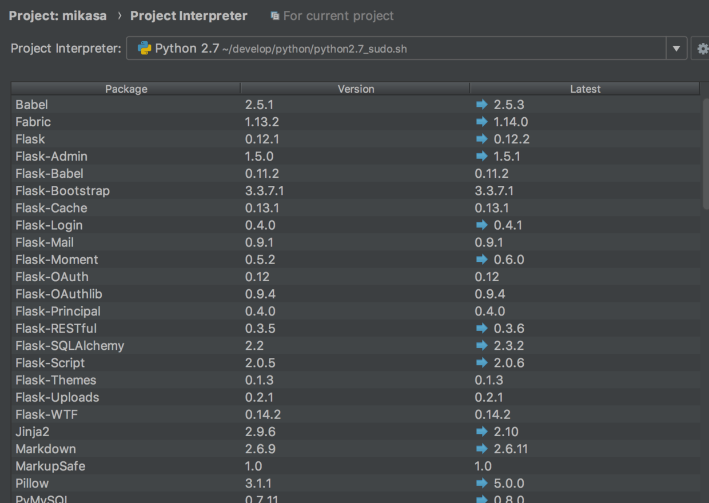

# 以 Root权限运行/调试 PyCharm

有时，python有可能需要su权限，如配置 ssl，当然你可以在命令行执行 `sudo`,但在Pycharm 这样的集成式开发环境中，你要是希望使用它的一些特性，如牛叉闪闪的断点调试，可能需要把整个项目以 root 权限运行，即`sudo /Applications/PyCharm.app/Contents/MacOS/pycharm`，但这样会导致用户目录发生了变化（用户目录变成了/root），从而导致运行环境变化，所以更理想的情况应该是以普通用户启动pycharm，运行/调试时 使用root权限，下面说下怎么实现：

### 1.设置python解释器默认以sudo方式启动，且免密码输入：

```python
sudo visudo -f /etc/sudoers.d/python
```

在文件中输入如下文字

```python
<user> <host> = (root) NOPASSWD: <full path to python>
```

这里因为我使用的虚拟环境，所以我 python 路径是虚拟环境的路径，这个根据自己实际情况而定就好

```python
adison ALL = (root) NOPASSWD: xxx/venv/bin/python
```

>  注：编辑sudoers.d中的文件一定要用visodu，它带安全检查功能．其它编辑工具可能导致文件解析失败，从而无法使用sudo命令．出现sudo解析失败,无法初始化策略插件错误(可通过系统恢复模式进行修复，方法在[这里](http://www.cnblogs.com/davidsky/p/3175655.html))

### 2.创建一个脚本文件（如python2.7_sudo.sh），以sudo方式启动python解释器,文件内容参考如下：

```python
#!/bin/bash
sudo xxx/venv/bin/python "$@"
```

修改文件权限为可执行

```python
chmod +x python2.7_sudon.sh
```

### 3.使用python2.7_sudon.sh作为pycharm的解释器．

   启动pycharm，打开工程，选择菜单命令Preferences — Project Interpreter,选择Project Interpreter右边的齿轮图标，在弹出菜单中选择Add Local，然后在文件选择对话框中选中刚刚创建的python2.7_sudon.sh，确定后即可




经过上面的设置后，该项目将以su权限启动python解释器运行和调试代码文件．

### 参考文章

[rundebug-as-root-in-pycharm](https://esmithy.net/2015/05/05/rundebug-as-root-in-pycharm/)