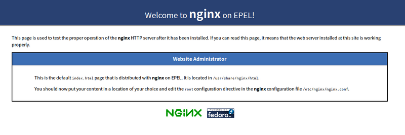

# CentOS 部署 flask项目

最近在学习 python，使用 flask 实现了个个人博客程序，完了想部署到服务器上。因为是新手，一路磕磕绊绊最终把它基本搞定。网上资料对新手感觉都不太友好，都是零零碎碎的，所以我整理了一下，一方面作为我自己的记录，方便以后查阅，另一方面也希望能帮助到跟我一样的新手。

## 前提

1. 有一个服务器（不然搞毛），购买可以参考[优质国外vps推荐](https://www.hostmama.cc/%E4%BC%98%E8%B4%A8%E5%9B%BD%E5%A4%96vps%E6%8E%A8%E8%8D%90/)

2. 有个人域名（当然，你可以直接使用 IP访问，但有点奇怪不是？购买域名可以去GoDaddy)

## 1.安装git 

可以选择 github 或者Bitbucket，当然你也可以自己搭建 git服务器，但我觉得没啥必要，我选择Bitbucket，主要是因为它私有库免费

```python
sudo yum install git
```

后续就跟我们本地开发没什么区别了，配置 ssh key，clone代码，就不展开了，项目目录建议放在 `/home/www/` 下


## 2. 安装 Mysql

### 添加 MySQL YUM 源

```python
$wget 'https://dev.mysql.com/get/mysql57-community-release-el7-11.noarch.rpm'
$sudo rpm -Uvh mysql57-community-release-el7-11.noarch.rpm
$yum repolist all | grep mysql

mysql-connectors-community/x86_64 MySQL Connectors Community                  36
mysql-tools-community/x86_64      MySQL Tools Community                       47
mysql57-community/x86_64          MySQL 5.7 Community Server                 187

```

### 安装最新版本

```python
$sudo yum install mysql-community-server
```

### 启动 MySQL 服务

```mysql
$sudo service mysqld start 
$sudo systemctl start mysqld #CentOS 7
$sudo systemctl status mysqld
● mysqld.service - MySQL Community Server
   Loaded: loaded (/usr/lib/systemd/system/mysqld.service; enabled; vendor preset: disabled)
   Active: active (running) since Sat 2017-05-27 12:56:26 CST; 15s ago
  Process: 2482 ExecStartPost=/usr/bin/mysql-systemd-start post (code=exited, status=0/SUCCESS)
  Process: 2421 ExecStartPre=/usr/bin/mysql-systemd-start pre (code=exited, status=0/SUCCESS)
 Main PID: 2481 (mysqld_safe)
   CGroup: /system.slice/mysqld.service
           ├─2481 /bin/sh /usr/bin/mysqld_safe --basedir=/usr
           └─2647 /usr/sbin/mysqld --basedir=/usr --datadir=/var/lib/mysql --plugin-dir=/usr/...
```

说明已经正在运行中了

### 修改密码

```mysql
$ mysql -uroot -p 
```

这里有要求你输入密码，Mysql安装时会生成一个默认密码，使用 `grep "temporary password" /var/log/mysqld.log `命令，返回结果最后引号后面的字符串就是root的默认密码

```mysql
mysql> ALTER USER 'root'@'localhost' IDENTIFIED BY 'NewPassword';
```

### 修改编码

在 /etc/my.cnf 中设置默认的编码

```
[client]

default-character-set = utf8

[mysqld]

default-storage-engine = INNODB

character-set-server = utf8

collation-server = utf8_general_ci #不区分大小写

collation-server = utf8_bin #区分大小写

collation-server = utf8_unicode_ci #比 utf8_general_ci 更准确

```

### 创建数据库

```mysql
mysql> CREATE DATABASE <datebasename> CHARACTER SET utf8;
```


## 3. 安装python3 pip3

CentOS 7 默认安装了 Python 2，当需要使用 Python 3 的时候，可以手动下载 Python 源码后编译安装。

### 安装 Python 3

```python
sudo mkdir /usr/local/python3 # 创建安装目录
$ wget --no-check-certificate https://www.python.org/ftp/python/3.6.2/Python-3.6.2.tgz # 下载 Python 源文件 
# 注意：wget获取https的时候要加上：--no-check-certifica
$ tar -xzvf Python-3.6.2.tgz # 解压缩包
$ cd Python-3.6.2 # 进入解压目录
sudo ./configure --prefix=/usr/local/python3 # 指定创建的目录
sudo make
sudo make install # 编译安装
```

> 执行./configure时可能会报错，configure: error: no acceptable C compiler found in $PATH，这是因为未安装合适的编译器，安装下就好了，
>
> `sudo yum install gcc-c++`
> (使用sudo yum install gcc-c++时会自动安装/升级gcc及其他依赖的包。)

#### 配置两个版本共存

创建 python3 的软链接：

```python
$ sudo ln -s /usr/local/python3/bin/python3 /usr/bin/python3
```

这样就可以通过 `python` 命令使用 Python 2，`python3` 来使用 Python 3。

### 安装 pip

```python
$ sudo yum -y install epel-release # 首先安装 epel 扩展源
$ sudo yum -y install python-pip # 安装 python-pip
$ sudo yum clean all # 清除 cache
```

通过这种方式貌似只能安装 pip2，想要安装 Python 3 的 pip，可以通过以下的源代码安装方式。

```python
# 下载源代码
$ wget --no-check-certificate https://github.com/pypa/pip/archive/9.0.1.tar.gz

$ tar -zvxf 9.0.1.tar.gz    # 解压文件

$ cd pip-9.0.1

$ python3 setup.py install # 使用 Python 3 安装
```

创建链接：

```python
$ sudo ln -s /usr/local/python3/bin/pip /usr/bin/pip3
```
升级 pip

```python
$ pip install --upgrade pip
```


## 4. 安装 gunicorn

[Gunicorn](http://gunicorn.org/) (独角兽)是一个高效的Python WSGI Server,通常用它来运行 wsgi application(由我们自己编写遵循WSGI application的编写规范) 或者 wsgi framework(如Django,Paster),地位相当于Java中的Tomcat。
WSGI就是这样的一个协议：它是一个Python程序和用户请求之间的接口。WSGI服务器的作用就是接受并分析用户的请求，调用相应的python对象完成对请求的处理，然后返回相应的结果。
简单来说gunicorn封装了HTTP的底层实现，我们通过gunicorn启动服务，用户请求与服务相应都经过gunicorn传输

#### 创建虚拟环境

```python
cd /home/www/blog
mkdir venv
python3 -m venv venv
```

#### 激活虚拟环境：

```python
source venv/bin/activate
```

然后根据`requirements.txt`文件安装依赖包：

```python
pip3 install -r requirements.txt
```

#### 安装gunicorn 

```python
pip3 install gunicorn
```

在项目根目录创建一个wsgi.py文件

```python
from app import create_app

application = create_app('production')

if __name__ == '__main__':
    application.run()
```

不再通过manage.py启动服务，那只在开发的时候使用

启动服务：

```python
gunicorn -w 4 -b 127.0.0.1:8000 wsgi:application
```


## 5. 安装 Nginx

nginx 是一个高性能的web服务器。通常用来在前端做反向代理服务器。所谓正向与反向（reverse），只是英文说法翻译。代理服务，简而言之，一个请求经过代理服务器从局域网发出，然后到达互联网上服务器，这个过程的代理为正向代理。如果一个请求，从互联网过来，先进入代理服务器，再由代理服务器转发给局域网的目标服务器，这个时候，代理服务器为反向代理（相对正向而言）。

> 正向代理：{ 客户端 ---》 代理服务器 } ---》 服务器

> 反向代理：客户端 ---》 { 代理服务器 ---》 服务器 }
>
> {} 表示局域网

nginx既可以做正向，也可以做反向。

```python
$ yum -y install nginx
```

### 启动 nginx 服务

```python
$ service nginx start
```

### 停止 nginx 服务

```python
$ service nginx stop
```

### 重启 nginx 服务

```python
$ service nginx restart
```

### 平滑重启

> nginx配置改动了，可以重新加载而不用先关闭再打开

```python
$ nginx -s reload
```


启动后 ，在浏览器中 输入服务器的 ip 地址，就可以看到




到这里 `yum` 安装 `nginx` 就完成了


####  添加配置

nginx的配置文件为：`/etc/nginx/nginx.conf`

```python
server {
        listen 80;
        server_name adisonhyh.com;

        location / {
                proxy_pass http://127.0.0.1:8000;
                proxy_set_header Host $host;
                proxy_set_header X-Forwarded-For $proxy_add_x_forwarded_for;
        }
}
```

- 监听http默认的端口号80
- server_name：个人网站域名
- 把请求代理到本机的8000端口（gunicorn启动服务指定的端口）
  剩下proxy_set_header照抄

gunicorn和nginx关系：

> gunicorn 可以单独提供服务，但生产环境一般不这样做。首先静态资源（jscssimg）会占用不少的请求资源，而对于 gunicorn 来讲它本身更应该关注实际业务的请求与处理而不应该把资源浪费在静态资源请求上；此外，单独运行 gunicorn 是没有办法起多个进程多个端口来负载均衡的。
>
> nginx 的作用就是弥补以上问题，首先作为前端服务器它可以处理一切静态文件请求，此时 gunicorn 作为后端服务器，nginx 将会把动态请求转发给后端服务器，因此我们可以起多个 gunicorn 进程，然后让 nginx 作均衡负载转发请求给多个 gunicorn 进程从而提升服务器处理效率与处理能力。最后，nginx 还可以配置很多安全相关、认证相关等很多处理，可以让你的网站更专注业务的编写，把一些转发规则等其它业务无关的事情交给 nginx 做。

配置好后打开本地浏览器，输入域名，应该就能访问了。

## 6.supervisor

如果你需要进程一直执行，若该进程因各种原因中断，也会自动重启的话，supervisor是一个很好的选择。
supervisor管理进程，是通过fork/exec的方式将这些被管理的进程当作supervisor的子进程来启动，所以我们只需要将要管理进程的可执行文件的路径添加到supervisor的配置文件中就好了。此时被管理进程被视为supervisor的子进程，若该子进程异常终端，则父进程可以准确的获取子进程异常终端的信息，通过在配置文件中设置autostart=true，可以实现对异常中断的子进程的自动重启。

### 安装 supervisor

```python
$ pip install supervisor
$ echo_supervisord_conf > supervisor.conf   # 生成 supervisor 默认配置文件
$ vim supervisor.conf                       # 修改 supervisor 配置文件，添加 gunicorn 进程管理
```

在blog supervisor.conf 配置文件底部添加 (注意我的工作路径是` www/home/blog/`)

```shell
[program:blog]
command=/home/www/blog/venv/bin/gunicorn -w4 -b0.0.0.0:8000 wsgi:application    ;supervisor启动命令
directory=/home/www/blog                                                 ; 项目的文件夹路径
startsecs=0                                                               ; 启动时间
stopwaitsecs=0                                                            ; 终止等待时间
autostart=false                                                           ; 是否自动启动
autorestart=false                                                         ; 是否自动重启
stdout_logfile=/home/www/blog/logs/gunicorn.log                            ; log 日志
stderr_logfile=/home/www/blog/logs/gunicorn.err                            ; 错误日志
```

使用 supervsior 启动 gunicorn

```shell
$ sudo supervisord -c supervisor.conf  
$ sudo supervisorctl start blog
```

在浏览器地址栏输入配置的地址即可访问网站。

## 7. fabric

最后一步，我们使用fabric实现远程操作和部署。[Fabric](http://fabfile.org/) 是一个 Python 下类似于 Makefiles 的工具，但是能够在远程服务器上执行命令。

### 安装 fabric

```python
pip install fabric
```


在 blog 目录下新建一个fabfile.py文件

```python
import os
from fabric.api import local, env, run, cd, sudo, prefix, settings, execute, task, put
from fabric.contrib.files import exists
from contextlib import contextmanager

env.hosts = ['204.152.201.69']
env.user = 'root'
env.password = '****'#密码
env.group = "root"

DEPLOY_DIR = '/home/www/blog'
VENV_DIR = os.path.join(DEPLOY_DIR, 'venv')
VENV_PATH = os.path.join(VENV_DIR, 'bin/activate')


@contextmanager
def source_virtualenv():
    with prefix("source {}".format(VENV_PATH)):
        yield


def update():
    with cd('/home/www/blog/'):
        sudo('git pull')


def restart():
    with cd(DEPLOY_DIR):
        if not exists(VENV_DIR):
            run("virtualenv {}".format(VENV_DIR))
        with settings(warn_only=True):
            with source_virtualenv():
                run("pip install -r {}/requirements.txt".format(DEPLOY_DIR))
                with settings(warn_only=True):
                    stop_result = sudo("supervisorctl -c {}/supervisor.conf stop all".format(DEPLOY_DIR))
                    if not stop_result.failed:
                        kill_result = sudo("pkill supervisor")
                        if not kill_result:
                            sudo("supervisord -c {}/supervisor.conf".format(DEPLOY_DIR))
                            sudo("supervisorctl -c {}/supervisor.conf reload".format(DEPLOY_DIR))
                            sudo("supervisorctl -c {}/supervisor.conf status".format(DEPLOY_DIR))
                            sudo("supervisorctl -c {}/supervisor.conf start all".format(DEPLOY_DIR))


@task
def deploy():
    execute(update)
    execute(restart)

```

现在代码如果更新了，可以直接在本地执行远程部署了

```shell
fab deploy
```

