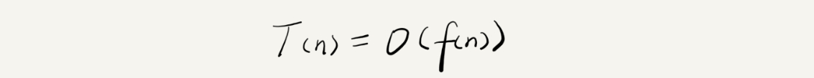
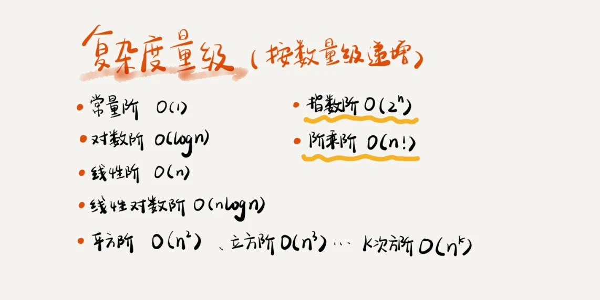

# 数据结构与算法

##1. 概述

*  **广义**

  数据结构就是指一组数据的存储结构，算法就是操作数据的一组方法。

*  **狭义**

  指某些著名的数据结构和算法，比如队列、栈、堆、二分查找、动态规划等

> 数据结构是为算法服务的，算法要作用在特定的数据结构之上。 因此，我们无法孤立数据结构来讲算法，也无法孤立算法来讲数据结构。

## 2. 复杂度分析

### 2.1 为什么需要复杂度分析？

你可能会有些疑惑，我把代码跑一遍，通过统计、监控，就能得到算法执行的时间和占用的内存大小。为什么还要做时间、空间复杂度分析呢？这种分析方法能比我实实在在跑一遍得到的数据更准确吗？首先，我可以肯定地说，你这种评估算法执行效率的方法是正确的。很多数据结构和算法书籍还给这种方法起了一个名字，叫 **事后统计法**。但是，这种统计方法有非常大的局限性。

* **测试结果非常依赖测试环境**

   测试环境中硬件的不同会对测试结果有很大的影响。比如，我们拿同样一段代码，分别用 Intel Core i9 处理器和 Intel Core i3 处理器来运行，不用说，i9 处理器要比 i3 处理器执行的速度快很多。还有，比如原本在这台机器上 a 代码执行的速度比 b 代码要快，等我们换到另一台机器上时，可能会有截然相反的结果。

* **测试结果受数据规模的影响很大**

   后面我们会讲排序算法，我们先拿它举个例子。对同一个排序算法，待排序数据的有序度不一样，排序的执行时间就会有很大的差别。极端情况下，如果数据已经是有序的，那排序算法不需要做任何操作，执行时间就会非常短。除此之外，如果测试数据规模太小，测试结果可能无法真实地反映算法的性能。比如，对于小规模的数据排序，插入排序可能反倒会比快速排序要快！

所以，**我们需要一个不用具体的测试数据来测试，就可以粗略地估计算法的执行效率的方法**。这就是我们今天要讲的时间、空间复杂度分析方法。

### 2.2 大 O 复杂度表示法

算法的执行效率，粗略地讲，就是算法代码执行的时间。但是，如何在不运行代码的情况下，用“肉眼”得到一段代码的执行时间呢？

这里有段非常简单的代码，求 1,2,3...n 的累加和。现在，我就带你一块来估算一下这段代码的执行时间。

```java

 int cal(int n) {
   int sum = 0;
   int i = 1;
   for (; i <= n; ++i) {
     sum = sum + i;
   }
   return sum;
 }
```


从 CPU 的角度来看，这段代码的每一行都执行着类似的操作： **读数据-运算-写数据**。尽管每行代码对应的 CPU 执行的个数、执行的时间都不一样，但是，我们这里只是粗略估计，所以可以假设每行代码执行的时间都一样，为 unit_time。在这个假设的基础之上，这段代码的总执行时间是多少呢？

第 2、3 行代码分别需要 1 个 unit_time 的执行时间，第 4、5 行都运行了 n 遍，所以需要 2n*unit_time 的执行时间，所以这段代码总的执行时间就是 (2n+2)*unit_time。可以看出来，所有代码的执行时间 T(n) 与每行代码的执行次数成正比。

按照这个分析思路，我们再来看这段代码。

 ```java
 
  int cal(int n) {
    int sum = 0;
    int i = 1;
    int j = 1;
    for (; i <= n; ++i) {
      j = 1;
      for (; j <= n; ++j) {
        sum = sum +  i * j;
      }
    }
  }
 ```


我们依旧假设每个语句的执行时间是 unit_time。那这段代码的总执行时间 T(n) 是多少呢？第 2、3、4 行代码，每行都需要 1 个 unit_time 的执行时间，第 5、6 行代码循环执行了 n 遍，需要 2n * unit_time 的执行时间，第 7、8 行代码循环执行了 n2遍，所以需要 2n2 * unit_time 的执行时间。所以，整段代码总的执行时间 T(n) = (2n2+2n+3)*unit_time。尽管我们不知道 unit_time 的具体值，但是通过这两段代码执行时间的推导过程，我们可以得到一个非常重要的规律，那就是， **所有代码的执行时间 T(n) 与每行代码的执行次数 f(n) 成正比**。我们可以把这个规律总结成一个公式。



其中，T(n) 我们已经讲过了，它表示代码执行的时间；n 表示数据规模的大小；f(n) 表示每行代码执行的次数总和。因为这是一个公式，所以用 f(n) 来表示。公式中的 O，表示代码的执行时间 T(n) 与 f(n) 表达式成正比。

所以，第一个例子中的 T(n) = O(2n+2)，第二个例子中的 T(n) = O(2n2+2n+3)。这就是 **大 O 时间复杂度表示**法。大 O 时间复杂度实际上并不具体表示代码真正的执行时间，而是表示 **代码执行时间随数据规模增长的变化趋势**，所以，也叫作**渐进时间复杂度**（asymptotic time complexity），简称 **时间复杂度**。

当 n 很大时，你可以把它想象成 10000、100000。而公式中的低阶、常量、系数三部分并不左右增长趋势，所以都可以忽略。我们只需要记录一个最大量级就可以了，如果用大 O 表示法表示刚讲的那两段代码的时间复杂度，就可以记为：T(n) = O(n)； T(n) = O(n2)。

### 2.3 时间复杂度分析

 * **只关注循环执行次数最多的一段代码**

大 O 这种复杂度表示方法只是表示一种变化趋势。我们通常会忽略掉公式中的常量、低阶、系数，只需要记录一个最大阶的量级就可以了。所以，我们在分析一个算法、一段代码的时间复杂度的时候，也只关注循环执行次数最多的那一段代码就可以了。这段核心代码执行次数的 n 的量级，就是整段要分析代码的时间复杂度。

* **加法法则：总复杂度等于量级最大的那段代码的复杂度**

  如果 T1(n)=O(f(n))，T2(n)=O(g(n))；那么 T(n)=T1(n)+T2(n)=max(O(f(n)), O(g(n))) =O(max(f(n), g(n))).

* **乘法法则：嵌套代码的复杂度等于嵌套内外代码复杂度的乘积**

  如果 T1(n)=O(f(n))，T2(n)=O(g(n))；那么 T(n)=T1(n)*T2(n)=O(f(n))*O(g(n))=O(f(n)*g(n)).

  也就是说，假设 T1(n) = O(n)，T2(n) = O(n2)，则 T1(n) * T2(n) = O(n3)。落实到具体的代码上，我们可以把乘法法则看成是嵌套循环

#### 2.3.1 几种常见时间复杂度



对于刚罗列的复杂度量级，我们可以粗略地分为两类，**多项式量级和非多项式量级**。

其中，非多项式量级只有两个：**O(2n) 和 O(n!)**。我们把时间复杂度为非多项式量级的算法问题叫作 **NP（Non-Deterministic Polynomial，非确定多项式）问题**。当数据规模 n 越来越大时，非多项式量级算法的执行时间会急剧增加，求解问题的执行时间会无限增长。所以，非多项式时间复杂度的算法其实是非常低效的算法。

只要代码的执行时间不随 n 的增大而增长，这样代码的时间复杂度我们都记作 O(1)。或者说，一般情况下，**只要算法中不存在循环语句、递归语句，即使有成千上万行的代码，其时间复杂度也是Ο(1)**。

#### 2.3.2 特殊时间复杂度分析

* 最好情况时间复杂度

  在最理想的情况下，执行代码的时间复杂度

* 最坏情况时间复杂度

  在最糟糕的情况下，执行代码的时间复杂度

* 平均情况时间复杂度

  把每种情况发生的概率也考虑进去，这个值就是概率论中的加权平均值，也叫作期望值，所以平均时间复杂度的全称应该叫加权平均时间复杂度或者期望时间复杂度。

* 均摊时间复杂度

  均摊时间复杂度就是一种特殊的平均时间复杂度，对一个数据结构进行一组连续操作中，大部分情况下时间复杂度都很低，只有个别情况下时间复杂度比较高，而且这些操作之间存在前后连贯的时序关系，这个时候，我们就可以将这一组操作放在一块儿分析，看是否能将较高时间复杂度那次操作的耗时，平摊到其他那些时间复杂度比较低的操作上。而且，在能够应用均摊时间复杂度分析的场合，一般均摊时间复杂度就等于最好情况时间复杂度。

### 2.4 空间复杂度分析

时间复杂度的全称是 **渐进时间复杂度，表示算法的执行时间与数据规模之间的增长关系**。类比一下，空间复杂度全称就是 **渐进空间复杂度**（asymptotic space complexity），表示 **算法的存储空间与数据规模之间的增长关系**。


