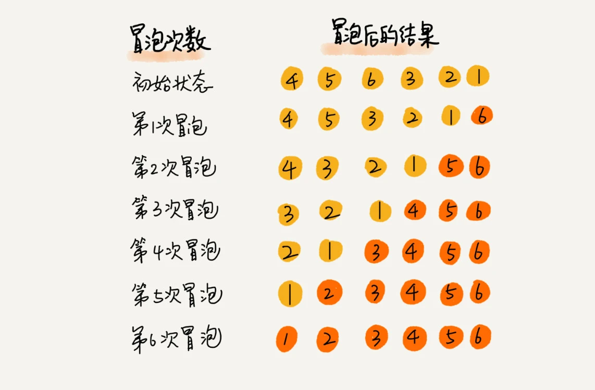
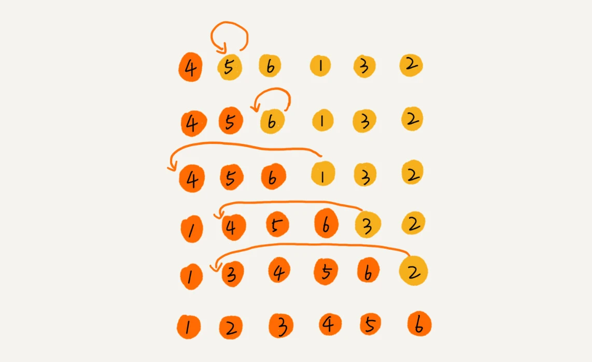
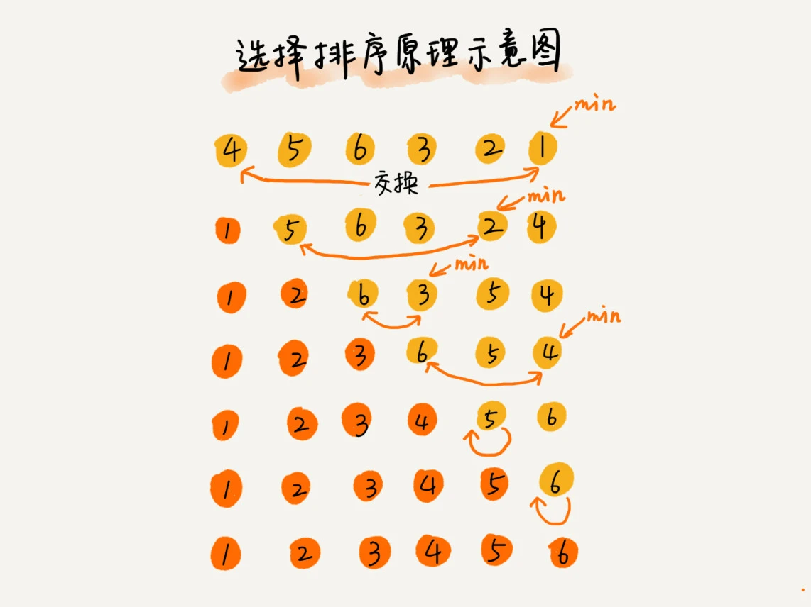
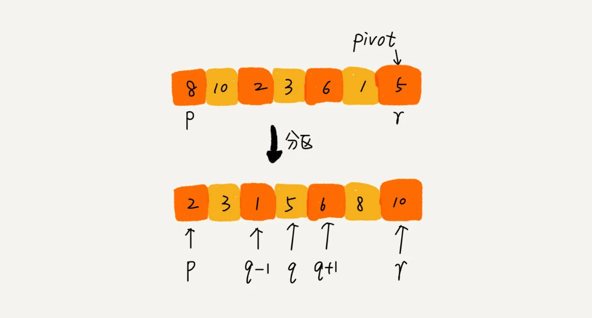
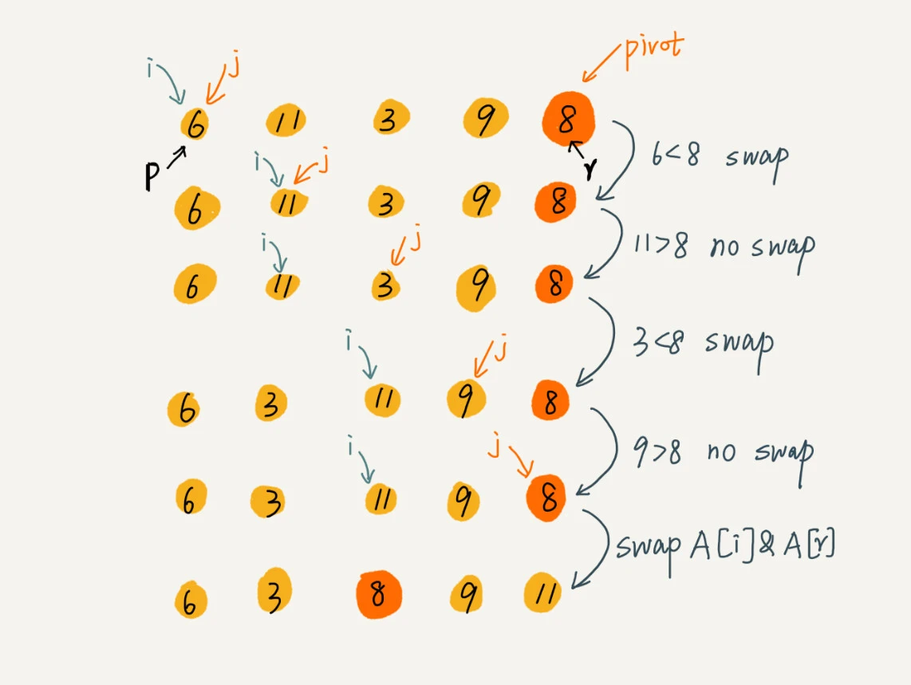

# 排序基础方法

## 如何分析一个“排序算法”？

### 排序算法的执行效率

1. 最好情况、最坏情况、平均情况时间复杂度

2. 时间复杂度的系数、常数 、低阶

   我们知道，时间复杂度反映的是数据规模 n 很大的时候的一个增长趋势，所以它表示的时候会忽略系数、常数、低阶。但是实际的软件开发中，我们排序的可能是 10 个、100 个、1000 个这样规模很小的数据，所以，在对同一阶时间复杂度的排序算法性能对比的时候，我们就要把系数、常数、低阶也考虑进来。

3. 比较次数和交换（或移动）次数

​		基于比较的排序算法的执行过程，会涉及两种操作，一种是元素比较大小，另一种是元素交换或移动。所以，如果我们在分析排序算法的执行效率的时候，应该把比较次数和交换（或移动）次数也考虑进去。

### 排序算法的内存消耗

> **原地排序（Sorted in place ）**: 特指空间复杂度是 O(1) 的排序算法。

### 排序算法的稳定性

> **稳定性** : 如果待排序的序列中存在值相等的元素，经过排序之后，相等元素之间原有的先后顺序不变。

## 冒泡排序（Bubble Sort）

### 原理

冒泡排序只会操作相邻的两个数据。每次冒泡操作都会对相邻的两个元素进行比较，看是否满足大小关系要求。如果不满足就让它俩互换。一次冒泡会让至少一个元素移动到它应该在的位置，重复 n 次，就完成了 n 个数据的排序工作。

举个例子，我们要对一组数据 4，5，6，3，2，1，从小到大进行排序。第一次冒泡操作的详细过程就是这样：


可以看出，经过一次冒泡操作之后，6 这个元素已经存储在正确的位置上。要想完成所有数据的排序，我们只要进行 6 次这样的冒泡操作就行了。



#### 动画演示


### 实现

```java

// 冒泡排序，a表示数组，n表示数组大小
public void bubbleSort(int[] a, int n) {
  if (n <= 1) return;
 
 for (int i = 0; i < n; ++i) {
    // 提前退出冒泡循环的标志位
    boolean flag = false;
    for (int j = 0; j < n - i - 1; ++j) {
      if (a[j] > a[j+1]) { // 交换
        int tmp = a[j];
        a[j] = a[j+1];
        a[j+1] = tmp;
        flag = true;  // 表示有数据交换      
      }
    }
    if (!flag) break;  // 没有数据交换，提前退出
  }
}
```

#### 分析

1. 冒泡排序是原地排序算法

   冒泡的过程只涉及相邻数据的交换操作，只需要常量级的临时空间，所以它的空间复杂度为 O(1)，是一个原地排序算法。

2. 冒泡排序是稳定的排序算法

   在冒泡排序中，只有交换才可以改变两个元素的前后顺序。为了保证冒泡排序算法的稳定性，当有相邻的两个元素大小相等的时候，我们不做交换，相同大小的数据在排序前后不会改变顺序，所以冒泡排序是稳定的排序算法。

3. 冒泡排序的时间复杂度是O(n^2)

   最好情况下，要排序的数据已经是有序的了，我们只需要进行一次冒泡操作，就可以结束了，所以最好情况时间复杂度是 O(n)。而最坏的情况是，要排序的数据刚好是倒序排列的，我们需要进行 n 次冒泡操作，所以最坏情况时间复杂度为 O(n^2)。平均情况下的时间复杂度是 O(n^2)

​	

## 插入排序（Insertion Sort）

### 原理

首先，我们将数组中的数据分为两个区间，**已排序区间和未排序区间**。初始已排序区间只有一个元素，就是数组的第一个元素。插入算法的核心思想是取未排序区间中的元素，在已排序区间中找到合适的插入位置将其插入，并保证已排序区间数据一直有序。重复这个过程，直到未排序区间中元素为空，算法结束。

如图所示，要排序的数据是 4，5，6，1，3，2，其中左侧为已排序区间，右侧是未排序区间。



插入排序也包含两种操作，一种是元素的比较，一种是元素的移动。当我们需要将一个数据 a 插入到已排序区间时，需要拿 a 与已排序区间的元素依次比较大小，找到合适的插入位置。找到插入点之后，我们还需要将插入点之后的元素顺序往后移动一位，这样才能腾出位置给元素 a 插入。

#### 动画演示


### 实现

```java

// 插入排序，a表示数组，n表示数组大小
public void insertionSort(int[] a, int n) {
  if (n <= 1) return;

  for (int i = 1; i < n; ++i) {
    int value = a[i];
    int j = i - 1;
    // 查找插入的位置
    for (; j >= 0; --j) {
      if (a[j] > value) {
        a[j+1] = a[j];  // 数据移动
      } else {
        break;
      }
    }
    a[j+1] = value; // 插入数据
  }
}
```

#### 分析

1. 插入排序是原地排序算法

   从实现过程可以很明显地看出，插入排序算法的运行并不需要额外的存储空间，所以空间复杂度是 O(1)，也就是说，这是一个原地排序算法。

2. 插入排序是稳定的排序算法

   在插入排序中，对于值相同的元素，我们可以选择将后面出现的元素，插入到前面出现元素的后面，这样就可以保持原有的前后顺序不变，所以插入排序是稳定的排序算法。

3. 插入排序的时间复杂度是O(n^2)

## 选择排序（Selection Sort）

选择排序算法的实现思路有点类似插入排序，也分已排序区间和未排序区间。但是选择排序每次会从未排序区间中找到最小的元素，将其放到已排序区间的末尾。



#### 动画演示


### 分析

选择排序空间复杂度为 O(1)，是一种原地排序算法。选择排序的最好情况时间复杂度、最坏情况和平均情况时间复杂度都为 O(n^2)。

**选择排序不是稳定的排序算法**

从前面画的那张图中，你可以看出来，选择排序每次都要找剩余未排序元素中的最小值，并和前面的元素交换位置，这样破坏了稳定性。

比如 5，8，5，2，9 这样一组数据，使用选择排序算法来排序的话，第一次找到最小元素 2，与第一个 5 交换位置，那第一个 5 和中间的 5 顺序就变了，所以就不稳定了。正是因此，相对于冒泡排序和插入排序，选择排序就稍微逊色了。


## 归并排序（Merge Sort）

### 原理

归并排序的核心思想还是蛮简单的。如果要排序一个数组，我们先把数组从中间分成前后两部分，然后对前后两部分分别排序，再将排好序的两部分合并在一起，这样整个数组就都有序了。


归并排序使用的就是**分治思想**。分治，顾名思义，就是分而治之，将一个大问题分解成小的子问题来解决。小的子问题解决了，大问题也就解决了。分治算法一般都是用递归来实现的。**分治是一种解决问题的处理思想，递归是一种编程技巧。**

#### 动画演示


### 实现

1. 首先， 先写出归并排序的递推公式

```java
递推公式：
merge_sort(p…r) = merge(merge_sort(p…q), merge_sort(q+1…r))

终止条件：
p >= r 不用再继续分解
```

> merge_sort(p…r) 表示，给下标从 p 到 r 之间的数组排序。我们将这个排序问题转化为了两个子问题，merge_sort(p…q) 和 merge_sort(q+1…r)，其中下标 q 等于 p 和 r 的中间位置，也就是 (p+r)/2。当下标从 p 到 q 和从 q+1 到 r 这两个子数组都排好序之后，我们再将两个有序的子数组合并在一起，这样下标从 p 到 r 之间的数据就也排好序了。

2. 转化成伪代码

```java

// 归并排序算法, A是数组，n表示数组大小
merge_sort(A, n) {
  merge_sort_c(A, 0, n-1)
}

// 递归调用函数
merge_sort_c(A, p, r) {
  // 递归终止条件
  if p >= r  then return

  // 取p到r之间的中间位置q
  q = (p+r) / 2
  // 分治递归
  merge_sort_c(A, p, q)
  merge_sort_c(A, q+1, r)
  // 将A[p...q]和A[q+1...r]合并为A[p...r]
  merge(A[p...r], A[p...q], A[q+1...r])
}
```

merge(A[p...r], A[p...q], A[q+1...r]) 这个函数的作用就是，将已经有序的 A[p...q]和 A[q+1....r]合并成一个有序的数组，并且放入 A[p....r]

```java

merge(A[p...r], A[p...q], A[q+1...r]) {
  var i := p，j := q+1，k := 0 // 初始化变量i, j, k
  var tmp := new array[0...r-p] // 申请一个大小跟A[p...r]一样的临时数组
  while i<=q AND j<=r do {
    if A[i] <= A[j] {
      tmp[k++] = A[i++] // i++等于i:=i+1
    } else {
      tmp[k++] = A[j++]
    }
  }
  
  // 判断哪个子数组中有剩余的数据
  var start := i，end := q
  if j<=r then start := j, end:=r
  
  // 将剩余的数据拷贝到临时数组tmp
  while start <= end do {
    tmp[k++] = A[start++]
  }
  
  // 将tmp中的数组拷贝回A[p...r]
  for i:=0 to r-p do {
    A[p+i] = tmp[i]
  }
}
```

### 分析

* **归并排序是稳定的排序算法**

  归并排序稳不稳定关键要看 merge() 函数，也就是两个有序子数组合并成一个有序数组的那部分代码。在合并的过程中，如果 A[p...q]和 A[q+1...r]之间有值相同的元素，那我们可以像伪代码中那样，先把 A[p...q]中的元素放入 tmp 数组。这样就保证了值相同的元素，在合并前后的先后顺序不变。所以，归并排序是一个稳定的排序算法。

* **归并排序的时间复杂度是 O(nlogn)**

  归并排序的执行效率与要排序的原始数组的有序程度无关，所以其时间复杂度是非常稳定的，不管是最好情况、最坏情况，还是平均情况，时间复杂度都是 O(nlogn)。

* **归并排序的空间复杂度是O(n)**

  尽管每次合并操作都需要申请额外的内存空间，但在合并完成之后，临时开辟的内存空间就被释放掉了。在任意时刻，CPU 只会有一个函数在执行，也就只会有一个临时的内存空间在使用。临时内存空间最大也不会超过 n 个数据的大小，所以空间复杂度是 O(n)。

## 快速排序（Quicksort）

### 原理

快排的思想是这样的：如果要排序数组中下标从 p 到 r 之间的一组数据，我们选择 p 到 r 之间的任意一个数据作为 pivot（分区点）。

我们遍历 p 到 r 之间的数据，将小于 pivot 的放到左边，将大于 pivot 的放到右边，将 pivot 放到中间。经过这一步骤之后，数组 p 到 r 之间的数据就被分成了三个部分，前面 p 到 q-1 之间都是小于 pivot 的，中间是 pivot，后面的 q+1 到 r 之间是大于 pivot 的。



根据分治、递归的处理思想，我们可以用递归排序下标从 p 到 q-1 之间的数据和下标从 q+1 到 r 之间的数据，直到区间缩小为 1，就说明所有的数据都有序了。		

#### 动画演示


### 实现

1. 递推公式

   ```java
   
   递推公式：
   quick_sort(p…r) = quick_sort(p…q-1) + quick_sort(q+1… r)
   
   终止条件：
   p >= r
   ```

   

2. 伪代码

   ```java
   
   // 快速排序，A是数组，n表示数组的大小
   quick_sort(A, n) {
     quick_sort_c(A, 0, n-1)
   }
   // 快速排序递归函数，p,r为下标
   quick_sort_c(A, p, r) {
     if p >= r then return
     
     q = partition(A, p, r) // 获取分区点
     quick_sort_c(A, p, q-1)
     quick_sort_c(A, q+1, r)
   }
   ```

   归并排序中有一个 merge() 合并函数，我们这里有一个 partition() 分区函数。partition() 分区函数实际上我们前面已经讲过了，就是随机选择一个元素作为 pivot（一般情况下，可以选择 p 到 r 区间的最后一个元素），然后对 A[p...r]分区，函数返回 pivot 的下标。

   ```java
   
   partition(A, p, r) {
     pivot := A[r]
     i := p
     for j := p to r-1 do {
       if A[j] < pivot {
         swap A[i] with A[j]
         i := i+1
       }
     }
     swap A[i] with A[r]
     return i
   
   ```

   原地分区函数的实现思路非常巧妙，这里的处理有点类似选择排序。我们通过游标 i 把 A[p...r-1]分成两部分。A[p...i-1]的元素都是小于 pivot 的，我们暂且叫它“已处理区间”，A[i...r-1]是“未处理区间”。我们每次都从未处理的区间 A[i...r-1]中取一个元素 A[j]，与 pivot 对比，如果小于 pivot，则将其加入到已处理区间的尾部，也就是 A[i]的位置。

   

### 分析

* **快速排序不是一个稳定的排序算法。**

  因为分区的过程涉及交换操作，如果数组中有两个相同的元素，比如序列 6，8，7，6，3，5，9，4，在经过第一次分区操作之后，两个 6 的相对先后顺序就会改变。所以，快速排序并不是一个稳定的排序算法。

* **快排是原地排序算法**

  分区函数借助交换思想，只需要将 A[i]与 A[j]交换，就可以在 O(1) 时间复杂度内将 A[j]放到下标为 i 的位置。

* **快速排序时间复杂度是O(nlogn)**

  大部分情况下的时间复杂度都可以做到 O(nlogn)，只有在极端情况下，才会退化到 O(n2)

### 快排和归并的区别

快排和归并用的都是分治思想，递推公式和递归代码也非常相似，那它们的区别在哪里呢？

1. 归并排序的处理过程是由下到上的，先处理子问题，然后再合并。而快排正好相反，它的处理过程是由上到下的，先分区，然后再处理子问题。
2. 归并排序虽然是稳定的、时间复杂度为 O(nlogn) 的排序算法，但是它是非原地排序算法。归并之所以是非原地排序算法，主要原因是合并函数无法在原地执行。快速排序通过设计巧妙的原地分区函数，可以实现原地排序，解决了归并排序占用太多内存的问题。**正因为此，归并排序也没有快排应用广泛。**

​	