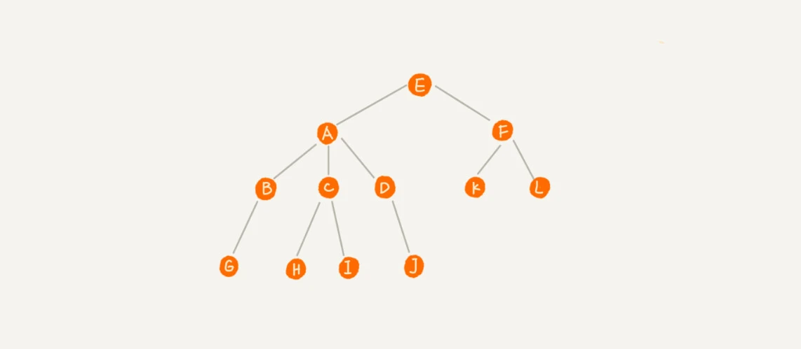
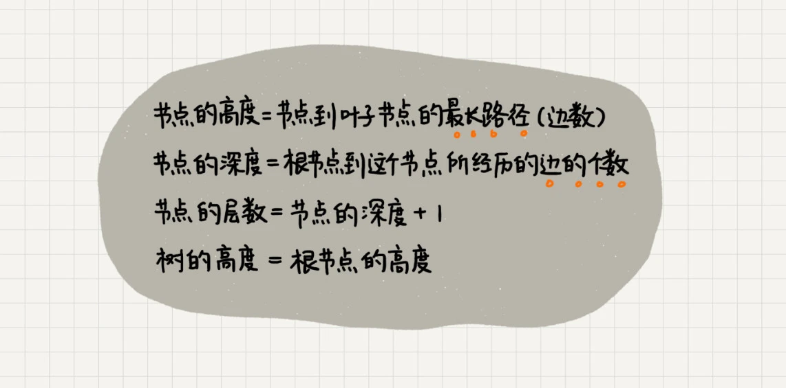
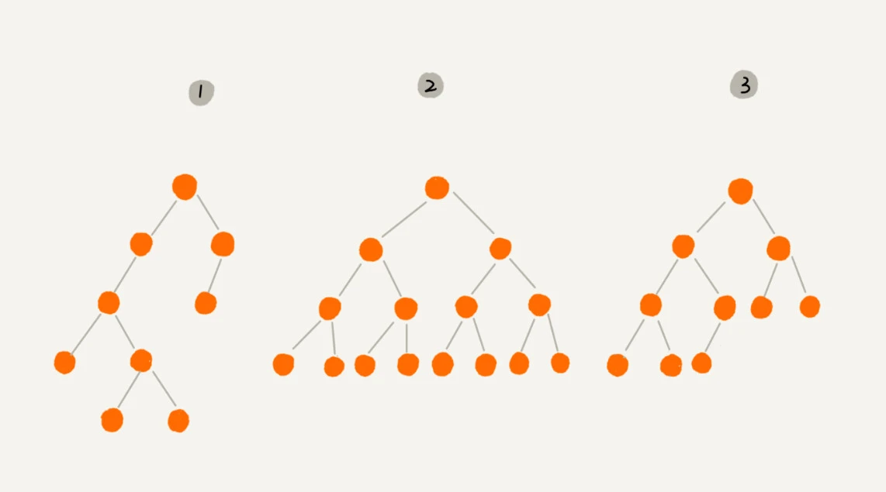
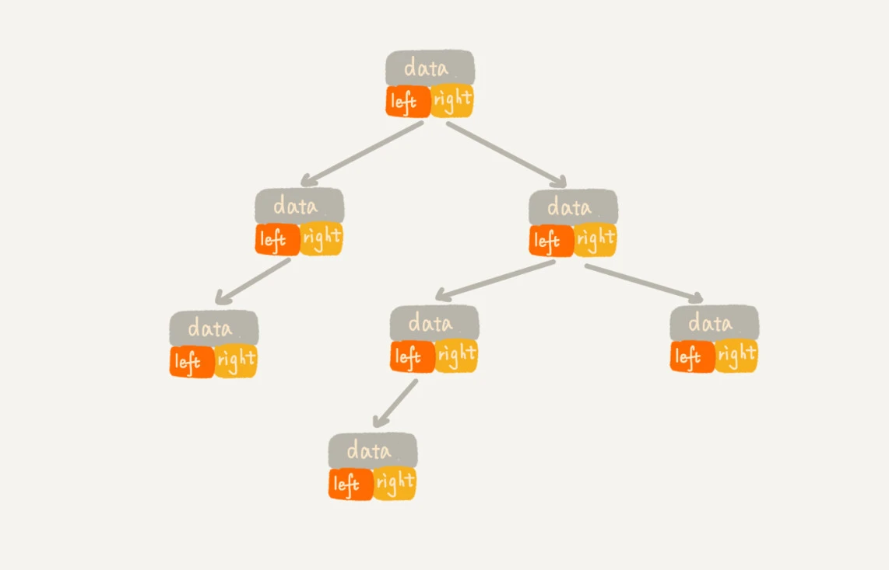
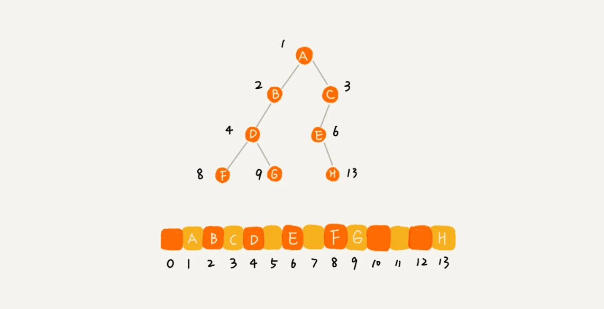
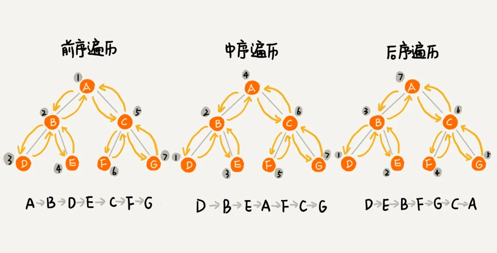
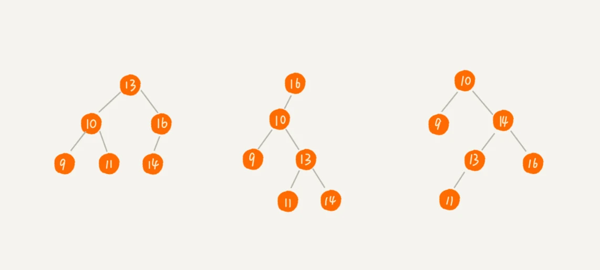

# 二叉树

## 树（Tree）

树是一种非线性的数据结构，它是由 n(n>=0) 个有限节点组成一个具有层次关系的集合。 


这里面每个元素我们叫做“节点”；用来连接相邻节点之间的关系，我们叫做“父子关系”。

比如下面这幅图，A 节点就是 B 节点的父节点，B 节点是 A 节点的子节点。B、C、D 这三个节点的父节点是同一个节点，所以它们之间互称为兄弟节点。我们把没有父节点的节点叫做根节点，也就是图中的节点 E。我们把没有子节点的节点叫做叶子节点或者叶节点，比如图中的 G、H、I、J、K、L 都是叶子节点。



除此之外，关于“树”，还有三个比较相似的概念：高度（Height）、深度（Depth）、层（Level）。它们的定义是这样的：



举例来说，如下图


## 二叉树（Binary Tree）

树结构多种多样，不过我们最常用还是二叉树。

二叉树是每个节点最多有两个子树的树结构。通常子树被称作“左子树”（left subtree）和“右子树”（right subtree）。



* **满二叉树（Full Binary Tree）**

如果一棵二叉树的所有非叶子节点都有左右两个子节点，并且所有叶子节点都在同一层上，那么这棵二叉树就是满二叉树。如上面的编号 2


* **完全二叉树（Complete Binary Tree）**

如果一棵二叉树的所有叶子节点都在最后两层上，并且最后一层的叶子节点都集中在该层最左边的若干位置的二叉树，那么这棵二叉树就是完全二叉树。如上面的编号 3


### 如何表示（或者存储）一棵二叉树

想要存储一棵二叉树，我们有两种方法，一种是 **基于指针或者引用的二叉链式存储法**，一种是 **基于数组的顺序存储法**。

#### 链式存储法

链式存储法是我们最常用的方法，也是最简单的方法。我们只需要定义一个二叉树的节点类，然后用指针或者引用来连接这些节点就可以了。




#### 基于数组的顺序存储法

顺序存储法是一种比较特殊的存储方法，它**只适用于完全二叉树**。我们把根节点存储在下标 i = 1 的位置，那左子节点存储在下标 2 * i = 2 的位置，右子节点存储在 2 * i + 1 = 3 的位置。以此类推，B 节点的左子节点存储在 2 * i = 2 * 2 = 4 的位置，右子节点存储在 2 * i + 1 = 2 * 2 + 1 = 5 的位置。


通过这种方式，我们只要知道根节点存储的位置（一般情况下，为了方便计算子节点，根节点会存储在下标为 1 的位置），这样就可以通过下标计算，把整棵树都串起来。


如果是完全二叉树，仅仅“浪费”了一个下标为 0 的存储位置。如果是非完全二叉树，其实会浪费比较多的数组存储空间。 



> 所以，如果某棵二叉树是一棵完全二叉树，那用数组存储无疑是最节省内存的一种方式。因为数组的存储方式并不需要像链式存储法那样，要存储额外的左右子节点的指针。这也是为什么完全二叉树会单独拎出来的原因，也是为什么完全二叉树要求最后一层的子节点都靠左的原因。

### 二叉树的遍历


二叉树的遍历是指，从根节点出发，按照某种次序依次访问二叉树中所有节点，使得每个节点被访问一次且仅被访问一次。二叉树的遍历有三种方式，分别是前序遍历、中序遍历和后序遍历。

* 前序遍历是指，对于树中的任意节点来说，先打印这个节点，然后再打印它的左子树，最后打印它的右子树。

* 中序遍历是指，对于树中的任意节点来说，先打印它的左子树，然后再打印它本身，最后打印它的右子树。

* 后序遍历是指，对于树中的任意节点来说，先打印它的左子树，然后再打印它的右子树，最后打印这个节点本身。



**实际上，二叉树的前、中、后序遍历就是一个递归的过程。** 实现如下：
    
```java
void preOrder(Node* root) {
  if (root == null) return;
  print root // 此处为伪代码，表示打印root节点
  preOrder(root->left);
  preOrder(root->right);
}

void inOrder(Node* root) {
  if (root == null) return;
  inOrder(root->left);
  print root // 此处为伪代码，表示打印root节点
  inOrder(root->right);
}

void postOrder(Node* root) {
  if (root == null) return;
  postOrder(root->left);
  postOrder(root->right);
  print root // 此处为伪代码，表示打印root节点
}
```

从前面画的前、中、后序遍历的顺序图，可以看出来，每个节点最多会被访问两次，所以遍历操作的时间复杂度，跟节点的个数 n 成正比，也就是说二叉树遍历的时间复杂度是 O(n)。

### 二叉查找树（Binary Search Tree）

二叉查找树（Binary Search Tree），也称二叉搜索树、有序二叉树（Ordered Binary Tree）、排序二叉树（Sorted Binary Tree），是指一棵空树或者具有下列性质的二叉树：

* 左子树上所有节点的值均小于它的根节点的值；

* 右子树上所有节点的值均大于它的根节点的值；

* 以此类推：左、右子树也分别为二叉查找树。



顾名思义，二叉查找树是为了实现快速查找而生的。不过，它不仅仅支持快速查找一个数据，还支持快速插入、删除一个数据。

#### 二叉查找树的查找操作

首先，我们看如何在二叉查找树中查找一个节点。我们先取根节点，如果它等于我们要查找的数据，那就返回。如果要查找的数据比根节点的值小，那就在左子树中递归查找；如果要查找的数据比根节点的值大，那就在右子树中递归查找。

代码实现如下：
        
```java
 public static class Node { 
    private int data; 
    private Node left; 
    private Node right;
     public Node(int data) { 
        this.data = data; 
        }
 }
   //递归实现
    Node searchBST(Node root, int val) {
        if (root == null) return null;
        if (root.data == val) return root;
        else if (val < root.data) return searchBST(root.left, val);
        else return searchBST(root.right, val);
    }
    
    //非递归实现
    Node searchBST(Node root, int val) {
        while (root != null) {
            if (root.data == val) return root;
            else if (val < root.data) root = root.left;
            else root = root.right;
        }
        return null;
    }
    
```

#### 二叉查找树的插入操作

首先，我们需要找到插入的位置，也就是找到一个空的位置，将新的节点插入进去。如果要插入的数据比根节点的值小，那就在左子树中递归查找；如果要插入的数据比根节点的值大，那就在右子树中递归查找。

代码实现如下：
            
```java
    // 递归实现
    Node insertIntoBST(Node root, int val) {
        if (root == null) return new Node(val);
        if (val < root.data) root.left = insertIntoBST(root.left, val);
        else root.right = insertIntoBST(root.right, val);
        return root;
    }

    // 非递归实现
    Node insertIntoBST(Node root, int val) {
        if (root == null) return new Node(val);
        Node cur = root;
        while (cur != null) {
            if (val < cur.data) {
                if (cur.left == null) {
                    cur.left = new Node(val);
                    break;
                } else {
                    cur = cur.left;
                }
            } else {
                if (cur.right == null) {
                    cur.right = new Node(val);
                    break;
                } else {
                    cur = cur.right;
                }
            }
        }
        return root;
    }
```

#### 二叉查找树的删除操作

首先，我们需要找到要删除的节点，如果找不到，那就什么都不做。如果找到了，我们需要考虑三种情况：

* 要删除的节点是叶子节点，直接删除即可；

* 要删除的节点只有一个子节点，那就让它的子节点替代它的位置；

* 要删除的节点有两个子节点，那就让它的右子树中的最小节点替代它的位置。然后再删除掉这个最小节点，因为最小节点肯定没有左子节点（如果有左子结点，那就不是最小节点了）

代码实现如下：
            
```java
public void delete(int data) {
  Node p = tree; // p指向要删除的节点，初始化指向根节点
  Node pp = null; // pp记录的是p的父节点
  while (p != null && p.data != data) {
    pp = p;
    if (data > p.data) p = p.right;
    else p = p.left;
  }
  if (p == null) return; // 没有找到

  // 要删除的节点有两个子节点
  if (p.left != null && p.right != null) { // 查找右子树中最小节点
    Node minP = p.right;
    Node minPP = p; // minPP表示minP的父节点
    while (minP.left != null) {
      minPP = minP;
      minP = minP.left;
    }
    p.data = minP.data; // 将minP的数据替换到p中
    p = minP; // 下面就变成了删除minP了
    pp = minPP;
  }

  // 删除节点是叶子节点或者仅有一个子节点
  Node child; // p的子节点
  if (p.left != null) child = p.left;
  else if (p.right != null) child = p.right;
  else child = null;

  if (pp == null) tree = child; // 删除的是根节点
  else if (pp.left == p) pp.left = child;
  else pp.right = child;
}
```

> 实际上，关于二叉查找树的删除操作，还有个非常简单、取巧的方法，就是单纯将要删除的节点标记为“已删除”，但是并不真正从树中将这个节点去掉。这样原本删除的节点还需要存储在内存中，比较浪费内存空间，但是删除操作就变得简单了很多。而且，这种处理方法也并没有增加插入、查找操作代码实现的难度。

#### 二叉查找树的其他操作

* 查找最大值：从根节点开始，一直向右走，直到走到最右边的节点，就是最大值。

* 查找最小值：从根节点开始，一直向左走，直到走到最左边的节点，就是最小值。

* 查找前驱节点：中序遍历的前一个节点。

* 查找后继节点：中序遍历的后一个节点。

二叉查找树除了支持上面几个操作之外，还有一个重要的特性，就是**中序遍历二叉查找树，可以输出有序的数据序列，时间复杂度是 O(n)，非常高效。因此，二叉查找树也叫作二叉排序树**。

#### 支持重复数据的二叉查找树

上面讲的二叉查找树，都是不支持重复数据的。如果要支持重复数据，这里有两种解决方法:

* 第一种方法是，将二叉查找树中的每个节点，都改成一个链表，这样每个节点就可以存储多个数据。这样的话，插入、查找、删除操作的时间复杂度就会变成 O(n)。

* 第二种方法是，将每个节点仍然只存储一个数据。在查找插入位置的过程中，如果碰到一个节点的值，与要插入数据的值相同，我们就将这个要插入的数据放到这个节点的右子树，也就是说，把这个新插入的数据当作大于这个节点的值来处理。 当要查找数据的时候，遇到值相同的节点，我们并不停止查找操作，而是继续在右子树中查找，直到遇到叶子节点，才停止。这样就可以把键值等于要查找值的所有节点都找出来。对于删除操作，我们也需要先查找到每个要删除的节点，然后再按前面讲的删除操作的方法，依次删除。


> 二叉查找树在比较平衡的情况下，插入、删除、查找操作时间复杂度是 O(logn)

#### 有了散列表，为什么还要用二叉查找树？

散列表的查找效率是 O(1)，比二叉查找树的 O(logn) 要高得多。为什么还要用二叉查找树呢？

* 散列表中的数据是无序存储的，如果要输出有序的数据，需要先进行排序。而对于二叉查找树来说，我们只需要中序遍历，就可以在 O(n) 的时间复杂度内，输出有序的数据序列。

* 散列表扩容耗时很多，而且当遇到散列冲突时，性能不稳定，尽管二叉查找树的性能不稳定，但是在工程中，我们最常用的平衡二叉查找树的性能非常稳定，时间复杂度稳定在 O(logn)。

* 笼统地来说，尽管散列表的查找等操作的时间复杂度是常量级的，但因为哈希冲突的存在，这个常量不一定比 logn 小，所以实际的查找速度可能不一定比 O(logn) 快。加上哈希函数的耗时，也不一定就比平衡二叉查找树的效率高。

* 散列表的构造比二叉查找树要复杂，需要考虑的东西很多。比如散列函数的设计、冲突解决办法、扩容、缩容等。平衡二叉查找树只需要考虑平衡性这一个问题，而且这个问题的解决方案比较成熟、固定。

* 为了避免过多的散列冲突，散列表装载因子不能太大，特别是基于开放寻址法解决冲突的散列表，不然会浪费一定的存储空间。

综合这几点，平衡二叉查找树在某些方面还是优于散列表的，所以，这两者的存在并不冲突。我们在实际的开发过程中，需要结合具体的需求来选择使用哪一个。


