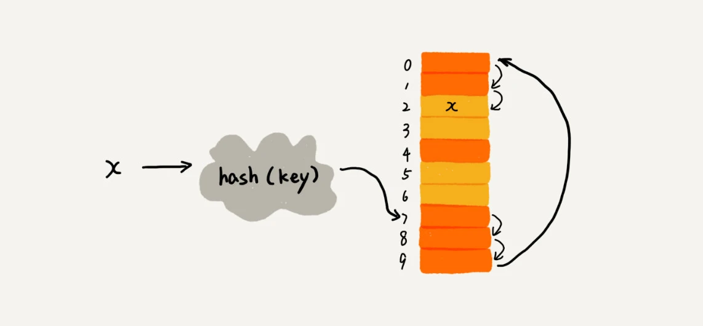
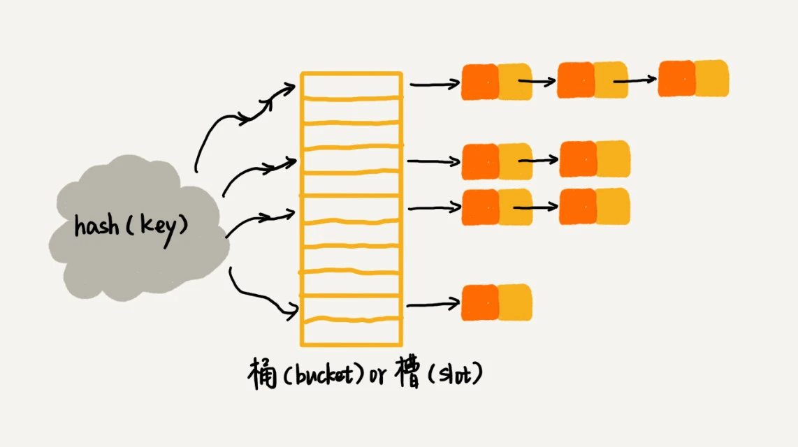
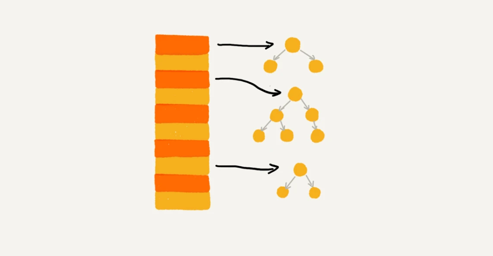

# 散列表

## 1. 定义

散列表（Hash table，也叫哈希表），是根据关键码值（Key value）而直接进行访问的数据结构。也就是说，它通过把关键码值映射到表中一个位置来访问记录，以加快查找的速度。这个映射函数叫做散列函数，存放记录的数组叫做散列表。
> 散列表用的就是数组支持按照下标随机访问的时候，时间复杂度是 O(1) 的特性。我们通过散列函数把元素的键值映射为下标，然后将数据存储在数组中对应下标的位置。当我们按照键值查询元素时，我们用同样的散列函数，将键值转化数组下标，从对应的数组下标的位置取数据。

## 2. 散列函数

散列函数是散列表的核心，也是散列表存储和读取数据的基础。散列函数的作用是给定一个键值，然后返回值在表中的地址。

散列函数设计的基本要求：

1. 散列函数计算得到的散列值是一个非负整数；

2. 如果 key1 = key2，那 hash(key1) == hash(key2)；

3. 如果 key1 ≠ key2，那 hash(key1) ≠ hash(key2)。

### 2.1 如何设计散列函数？

* 首先，**散列函数的设计不能太复杂** , 过于复杂的散列函数，势必会消耗很多计算时间，也就间接地影响到散列表的性能。

* 其次，**散列函数生成的值要尽可能随机并且均匀分布**，这样才能避免或者最小化散列冲突，而且即便出现冲突，散列到每个槽里的数据也会比较平均，不会出现某个槽内数据特别多的情况。

> 实际工作中，我们还需要综合考虑各种因素。这些因素有关键字的长度、特点、分布、还有散列表的大小等。

散列函数的设计方法有很多种，比如`直接定址法`、`数字分析法`、`平方取中法`、`折叠法`、`除留余数法`、`随机数法`等。


## 3. 散列冲突

散列函数的设计要尽可能地避免冲突，也就是不同的键值经过散列函数映射到散列表的同一个位置。如果散列表中的存储空间比较紧张，那么冲突就会比较严重，这样就会影响散列表的性能。所以，散列函数设计的越好，冲突就越少，散列表的性能就越好。

散列冲突的解决方法有很多种，比如开放寻址法、链表法、再哈希法等。

### 3.1 开放寻址法

开放寻址法的基本思想是：如果出现了散列冲突，就重新探测一个空闲位置，将其插入。探测的方法有线性探测、二次探测、再哈希法等。 

#### 3.1.1 线性探测

线性探测的基本思想是：**当我们往散列表中插入数据时，如果某个数据经过散列函数散列之后，存储位置已经被占用了，我们就从当前位置开始，依次往后查找，看是否有空闲位置，直到找到为止。**


线性探测法其实存在很大问题。当散列表中插入的数据越来越多时，散列冲突发生的可能性就会越来越大，空闲位置会越来越少，线性探测的时间就会越来越久。极端情况下，我们可能需要探测整个散列表，所以最坏情况下的时间复杂度为 O(n)。同理，在删除和查找时，也有可能会线性探测整张散列表，才能找到要查找或者删除的数据。

#### 3.1.2 二次探测

二次探测的基本思想是：**所谓二次探测，跟线性探测很像，线性探测每次探测的步长是 1，那它探测的下标序列就是 hash(key)+0，hash(key)+1，hash(key)+2……而二次探测探测的步长就变成了原来的“二次方”，也就是说，它探测的下标序列就是 hash(key)+0，hash(key)+12，hash(key)+22……**

二次探测法的时间复杂度分析跟线性探测法一样，最坏情况下的时间复杂度为 O(n)。

#### 3.1.3 再哈希法/双重散列

再哈希法的基本思想是：**所谓双重散列，意思就是不仅要使用一个散列函数。我们使用一组散列函数 hash1(key)，hash2(key)，hash3(key)……我们先用第一个散列函数，如果计算得到的存储位置已经被占用，再用第二个散列函数，依次类推，直到找到空闲的存储位置。**


### 3.2 链表法

链表法的基本思想是：**我们把散列表的每个槽位当成一个链表的头结点，当多个数据散列到同一个槽位时，我们把它们添加到链表中。**



当插入的时候，我们只需要通过散列函数计算出对应的散列槽位，将其插入到对应链表中即可，所以插入的时间复杂度是 O(1)。当查找、删除一个元素时，我们同样通过散列函数计算出对应的槽，然后遍历链表查找或者删除。实际上，这两个操作的时间复杂度跟链表的长度 k 成正比，也就是 O(k)。对于散列比较均匀的散列函数来说，理论上讲，k=n/m，其中 n 表示散列中数据的个数，m 表示散列表中“槽”的个数。

### 3.3 如何选择冲突解决方法？

`开放寻址法`和`链表法`这两种冲突解决办法在实际的软件开发中都非常常用。比如，Java 中 LinkedHashMap 就采用了链表法解决冲突，ThreadLocalMap 是通过线性探测的开放寻址法来解决冲突。那你知道，这两种冲突解决方法各有什么优势和劣势，又各自适用哪些场景吗？
#### 3.3.1 开放寻址法优缺点
*优点*
开放寻址法不像链表法，需要拉很多链表。散列表中的数据都存储在数组中，可以有效地利用 CPU 缓存加快查询速度。而且，这种方法实现的散列表，序列化起来比较简单。链表法包含指针，序列化起来就没那么容易。

*缺点*
用开放寻址法解决冲突的散列表，删除数据的时候比较麻烦，需要特殊标记已经删除掉的数据。而且，在开放寻址法中，所有的数据都存储在一个数组中，比起链表法来说，冲突的代价更高。所以，使用开放寻址法解决冲突的散列表，装载因子的上限不能太大。这也导致这种方法比链表法更浪费内存空间。

**当数据量比较小、装载因子小的时候，适合采用开放寻址法。这也是 Java 中的ThreadLocalMap使用开放寻址法解决散列冲突的原因。**

#### 3.3.2 链表法优缺点
*优点*
1. 链表法对内存的利用率比开放寻址法要高。因为链表结点可以在需要的时候再创建，并不需要像开放寻址法那样事先申请好
2. 链表法比起开放寻址法，对大装载因子的容忍度更高。开放寻址法只能适用装载因子小于 1 的情况。接近 1 时，就可能会有大量的散列冲突，导致大量的探测、再散列等，性能会下降很多。但是对于链表法来说，只要散列函数的值随机均匀，即便装载因子变成 10，也就是链表的长度变长了而已，虽然查找效率有所下降，但是比起顺序查找还是快很多。

*缺点*
1. 链表因为要存储指针，所以对于比较小的对象的存储，是比较消耗内存的，还有可能会让内存的消耗翻倍。
2. 因为链表中的结点是零散分布在内存中的，不是连续的，所以对 CPU 缓存是不友好的，这方面对于执行效率也有一定的影响。

> 当然，如果我们存储的是大对象，也就是说要存储的对象的大小远远大于一个指针的大小（4 个字节或者 8 个字节），那链表中指针的内存消耗在大对象面前就可以忽略了。

实际上，我们对链表法稍加改造，可以实现一个更加高效的散列表。那就是，我们将链表法中的链表改造为其他高效的动态数据结构，比如跳表、红黑树。这样，即便出现散列冲突，极端情况下，所有的数据都散列到同一个桶内，那最终退化成的散列表的查找时间也只不过是 O(logn)。这样也就有效避免了前面讲到的散列碰撞攻击。


**基于链表的散列冲突处理方法比较适合存储大对象、大数据量的散列表，而且，比起开放寻址法，它更加灵活，支持更多的优化策略，比如用红黑树代替链表。**


## 4 装载因子

不管采用哪种探测方法，当散列表中空闲位置不多的时候，散列冲突的概率就会大大提高。为了尽可能保证散列表的操作效率，一般情况下，我们会尽可能保证散列表中有一定比例的空闲槽位。我们用装载因子（load factor）来表示空位的多少。

装载因子的计算公式是：
```java
装载因子 = 填入表中的元素个数 / 散列表的长度
```

装载因子越大，说明空闲位置越少，冲突越多，散列表的性能会下降。


### 4.1 装载因子过大了怎么办？

装载因子越大，说明散列表中的元素越多，空闲位置越少，散列冲突的概率就越大。不仅插入数据的过程要多次寻址或者拉很长的链，查找的过程也会因此变得很慢。

所以，当装载因子过大的时候，我们就需要扩容，重新散列。

针对数组的扩容，数据搬移操作比较简单。但是，针对散列表的扩容，数据搬移操作要复杂很多。因为散列表的大小变了，数据的存储位置也变了，所以我们需要通过散列函数重新计算每个数据的存储位置。

*对于支持动态扩容的散列表，插入操作的时间复杂度是多少呢？*

插入一个数据，最好情况下，不需要扩容，最好时间复杂度是 O(1)。最坏情况下，散列表装载因子过高，启动扩容，我们需要重新申请内存空间，重新计算哈希位置，并且搬移数据，所以时间复杂度是 O(n)。用摊还分析法，均摊情况下，时间复杂度接近最好情况，就是 O(1)。

实际上，对于动态散列表，随着数据的删除，散列表中的数据会越来越少，空闲空间会越来越多。如果我们对空间消耗非常敏感，我们可以在装载因子小于某个值之后，启动动态缩容。当然，如果我们更加在意执行效率，能够容忍多消耗一点内存空间，那就可以不用费劲来缩容了。

当散列表的装载因子超过某个阈值时，就需要进行扩容。装载因子阈值需要选择得当。如果太大，会导致冲突过多；如果太小，会导致内存浪费严重。


装载因子阈值的设置要权衡时间、空间复杂度。如果内存空间不紧张，对执行效率要求很高，可以降低负载因子的阈值；相反，如果内存空间紧张，对执行效率要求又不高，可以增加负载因子的值，甚至可以大于 1。

### 4.2 如何避免低效的扩容？

大部分情况下，动态扩容的散列表插入一个数据都很快，但是在特殊情况下，当装载因子已经到达阈值，需要先进行扩容，再插入数据。这个时候，插入数据就会变得很慢，甚至会无法接受。

**为了解决一次性扩容耗时过多的情况，我们可以将扩容操作穿插在插入操作的过程中，分批完成。**

当有新数据要插入时，我们将新数据插入新散列表中，并且从老的散列表中拿出一个数据放入到新散列表。每次插入一个数据到散列表，我们都重复上面的过程。经过多次插入操作之后，老的散列表中的数据就一点一点全部搬移到新散列表中了。这样没有了集中的一次性数据搬移，插入操作就都变得很快了。

这期间的查询操作怎么来做呢？对于查询操作，为了兼容了新、老散列表中的数据，我们先从新散列表中查找，如果没有找到，再去老的散列表中查找。

通过这样均摊的方法，将一次性扩容的代价，均摊到多次插入操作中，就避免了一次性扩容耗时过多的情况。这种实现方式，任何情况下，插入一个数据的时间复杂度都是 O(1)。

## 5. 小结
### 5.1 工业级的散列表应该具有哪些特性

* 支持快速地查询、插入、删除操作；
* 内存占用合理，不能浪费过多的内存空间；
* 性能稳定，极端情况下，散列表的性能也不会退化到无法接受的情况。

### 5.2 如何实现这样一个散列表

* 设计一个合适的散列函数；
* 定义装载因子阈值，并且设计动态扩容策略；
* 选择合适的散列冲突解决方法。

## 6. 散列表和链表结合使用

散列表这种数据结构虽然支持非常高效的数据插入、删除、查找操作，但是散列表中的数据都是通过散列函数打乱之后无规律存储的。也就说，它无法支持按照某种顺序快速地遍历数据。如果希望按照顺序遍历散列表中的数据，那我们需要将散列表中的数据拷贝到数组中，然后排序，再遍历。

因为散列表是动态数据结构，不停地有数据的插入、删除，所以每当我们希望按顺序遍历散列表中的数据的时候，都需要先排序，那效率势必会很低。为了解决这个问题，我们将散列表和链表（或者跳表）结合在一起使用。

### 6.1 应用实例
* LRU 缓存淘汰算法
* Redis 有序集合
* LinkedHashMap
