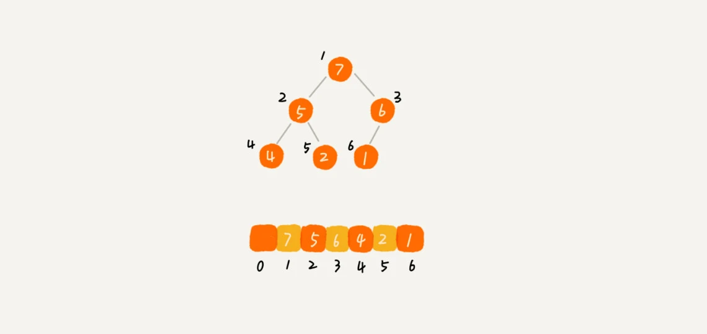

# 堆
## 定义

堆是一种特殊的树，它满足下列性质：

1. 是一棵完全二叉树
2. 树中任意节点的值总是不大于（或不小于）其子树中每个节点的值

> 关于第二点， 实际上，我们还可以换一种说法，堆中每个节点的值都大于等于（或者小于等于）其左右子节点的值。这两种表述是等价的。

堆分为大顶堆和小顶堆，**大顶堆中每个节点的值都大于等于其左右子节点的值，小顶堆中每个节点的值都小于等于其左右子节点的值**。

## 实现

前面讲过，完全二叉树比较适合用数组来存储。用数组来存储完全二叉树是非常节省存储空间的。



数组中下标为 i 的节点的左子节点，就是下标为 `i∗2` 的节点，右子节点就是下标为 `i∗2+1` 的节点，父节点就是下标为 `i/2`​ 的节点。

> 堆化（heapify）是指将一个无序的完全二叉树调整成堆的过程。堆化实际上有两种，从下往上和从上往下。 堆化非常简单，就是顺着节点所在的路径，向上或者向下，对比，然后交换。

### 往堆中插入一个元素

往堆中插入一个元素，实际上就是往完全二叉树中插入一个节点，然后从下往上堆化。


```java

public class Heap {
  private int[] a; // 数组，从下标1开始存储数据
  private int n;  // 堆可以存储的最大数据个数
  private int count; // 堆中已经存储的数据个数

  public Heap(int capacity) {
    a = new int[capacity + 1];
    n = capacity;
    count = 0;
  }

  public void insert(int data) {
    if (count >= n) return; // 堆满了
    ++count;
    a[count] = data;
    int i = count;
    while (i/2 > 0 && a[i] > a[i/2]) { // 自下往上堆化
      swap(a, i, i/2); // swap()函数作用：交换下标为i和i/2的两个元素
      i = i/2;
    }
  }
 }
```

### 删除堆顶元素

删除堆顶元素，实际上就是删除完全二叉树的根节点，然后将最后一个节点放到根节点的位置，然后从上往下堆化。

```java

public void removeMax() {
  if (count == 0) return -1; // 堆中没有数据
  a[1] = a[count];
  --count;
  heapify(a, count, 1);
}

private void heapify(int[] a, int n, int i) { // 自上往下堆化
  while (true) {
    int maxPos = i;
    if (i*2 <= n && a[i] < a[i*2]) maxPos = i*2;
    if (i*2+1 <= n && a[maxPos] < a[i*2+1]) maxPos = i*2+1;
    if (maxPos == i) break;
    swap(a, i, maxPos);
    i = maxPos;
  }
}
```


> 我们知道，一个包含 n 个节点的完全二叉树，树的高度不会超过 log2​n。堆化的过程是顺着节点所在路径比较交换的，所以堆化的时间复杂度跟树的高度成正比，也就是 O(logn)。插入数据和删除堆顶元素的主要逻辑就是堆化，所以，往堆中插入一个元素和删除堆顶元素的时间复杂度都是 O(logn)。


## 堆排序

堆排序是利用堆这种数据结构所设计的一种排序算法。这种排序方法的时间复杂度非常稳定，是 O(nlogn)，并且它还是原地排序算法，空间复杂度为 O(1)。堆排序不是稳定的排序算法。

### 实现

堆排序的思路非常简单，就是先将待排序的数组构建成一个堆，然后再依次将堆顶元素和堆的最后一个元素交换，然后再从上往下堆化，直到堆中只剩下一个元素为止。

大致分解成两个大的步骤，建堆和排序。

#### 建堆

建堆的过程就是从下往上堆化，从第一个非叶子节点开始，依次向上堆化。

```java


private static void buildHeap(int[] a, int n) {
  for (int i = n/2; i >= 1; --i) {
    heapify(a, n, i);
  }
}

private static void heapify(int[] a, int n, int i) {
  while (true) {
    int maxPos = i;
    if (i*2 <= n && a[i] < a[i*2]) maxPos = i*2;
    if (i*2+1 <= n && a[maxPos] < a[i*2+1]) maxPos = i*2+1;
    if (maxPos == i) break;
    swap(a, i, maxPos);
    i = maxPos;
  }
}
```

我们对下标从 2n​ 开始到 1 的数据进行堆化，下标是 2n​+1 到 n 的节点是叶子节点，我们不需要堆化。实际上，对于完全二叉树来说，下标从 2n​+1 到 n 的节点都是叶子节点。

!!! question "为什么从 2n​ 开始堆化？"

    使用数组存储表示完全二叉树时，从数组下标为1开始存储数据，数组下标为i的节点，左子节点为2i, 右子节点为2i + 1.  这个结论很重要（可以用数学归纳法证明)，将此结论记为『原理1』，以下证明会用到这个原理。

    为什么，对于完全二叉树来说，下标从n/2 + 1 到 n的节点都是叶子节点？ 使用反证法证明即可：

    如果下标为n/2 + 1的节点不是叶子节点，即它存在子节点，按照『原理1』，它的左子节点为：2(n/2  + 1)  = n + 2，大家明显可以看出，这个数字已经大于n + 1，超出了实现完全二叉树所用数组的大小（数组下标从1开始记录数据，对于n个节点来说，数组大小是n + 1），左子节点都已经超出了数组容量，更何况右子节点。以此类推，很容易得出：下标大于n/2 + 1的节点肯定都是也叶子节点了，故而得出结论：对于完全二叉树来说，下标从n/2 + 1 到 n的节点都是叶子节点


> 建堆的时间复杂度就是 O(n)。

#### 排序

排序的过程就是不断地将堆顶元素和堆尾元素交换，然后对堆顶元素进行堆化，直到堆中只剩下一个元素。

```java
// n表示数据的个数，数组a中的数据从下标1到n的位置。
public static void sort(int[] a, int n) {
  buildHeap(a, n);
  int k = n;
  while (k > 1) {
    swap(a, 1, k);
    --k;
    heapify(a, k, 1);
  }
}
```

> 整个堆排序的过程，都只需要极个别临时存储空间，所以堆排序是原地排序算法。堆排序包括建堆和排序两个操作，建堆过程的时间复杂度是 O(n)，排序过程的时间复杂度是 O(nlogn)，所以，堆排序整体的时间复杂度是 O(nlogn)。


### 为什么快速排序要比堆排序性能好

前面我们学过快速排序，平均情况下，它的时间复杂度为 O(nlogn)。尽管这两种排序算法的时间复杂度都是 O(nlogn)，甚至堆排序比快速排序的时间复杂度还要稳定，但是，在实际的软件开发中，快速排序的性能要比堆排序好。

**第一点，堆排序数据访问的方式没有快速排序友好。** 

对于快速排序来说，数据是顺序访问的。而对于堆排序来说，数据是跳着访问的。在 CPU 缓存中，顺序访问的数据会被缓存起来，而随机访问的数据不会被缓存。所以，对于 CPU 缓存来说，顺序访问的数据访问效率要比随机访问的数据访问效率高。

**第二点对于同样的数据，在排序过程中，堆排序算法的数据交换次数要多于快速排序。**

对于基于比较的排序算法来说，整个排序过程就是由两个基本的操作组成的，比较和交换（或移动）。快速排序数据交换的次数不会比逆序度多。但是堆排序的第一步是建堆，建堆的过程会打乱数据原有的相对先后顺序，导致原数据的有序度降低。比如，对于一组已经有序的数据来说，经过建堆之后，数据反而变得更无序了。

## 应用

### 优先级队列

在优先级队列中，数据的出队顺序不是先进先出，而是按照优先级来，优先级最高的，最先出队。 用堆来实现是最直接、最高效的。这是因为，堆和优先级队列非常相似。一个堆就可以看作一个优先级队列。很多时候，它们只是概念上的区分而已。往优先级队列中插入一个元素，就相当于往堆中插入一个元素；从优先级队列中取出优先级最高的元素，就相当于取出堆顶元素。

它的应用场景非常多, 比如，`赫夫曼编码`、`图的最短路径`、`最小生成树算法`等等。不仅如此，很多语言中，都提供了优先级队列的实现，比如，Java 的 `PriorityQueue`，C++ 的 `priority_queue` 等。

具体例子：合并有序小文件、定时任务等。

#### 代码实现

```java
public class PriorityQueue<T extends Comparable<T>> {
    private T[] items;
    private int N;

    public PriorityQueue(int capacity) {
        items = (T[]) new Comparable[capacity + 1];
        N = 0;
    }

    public boolean isEmpty() {
        return N == 0;
    }

    public int size() {
        return N;
    }

    public void insert(T t) {
        items[++N] = t;
        swim(N);
    }

    public T delMax() {
        T max = items[1];
        exch(1, N--);
        sink(1);
        return max;
    }

    private void swim(int k) {
        while (k > 1 && less(k / 2, k)) {
            exch(k / 2, k);
            k = k / 2;
        }
    }

    private void sink(int k) {
        while (2 * k <= N) {
            int j = 2 * k;
            if (j < N && less(j, j + 1)) j++;
            if (!less(k, j)) break;
            exch(k, j);
            k = j;
        }
    }

    private boolean less(int i, int j) {
        return items[i].compareTo(items[j]) < 0;
    }

    private void exch(int i, int j) {
        T t = items[i];
        items[i] = items[j];
        items[j] = t;
    }
}
```

### Top K 问题

我把这种求 Top K 的问题抽象成两类。一类是针对静态数据集合，也就是说数据集合事先确定，不会再变。另一类是针对动态数据集合，也就是说数据集合事先并不确定，有数据动态地加入到集合中。


针对静态数据，如何在一个包含 n 个数据的数组中，查找前 K 大数据呢？我们可以维护一个大小为 K 的小顶堆，顺序遍历数组，从数组中取出数据与堆顶元素比较。如果比堆顶元素大，我们就把堆顶元素删除，并且将这个元素插入到堆中；如果比堆顶元素小，则不做处理，继续遍历数组。这样等数组中的数据都遍历完之后，堆中的数据就是前 K 大数据了。

遍历数组需要 O(n) 的时间复杂度，一次堆化操作需要 O(logK) 的时间复杂度，所以最坏情况下，n 个元素都入堆一次，时间复杂度就是 O(nlogK)。

针对动态数据求得 Top K 就是实时 Top K。怎么理解呢？我举一个例子。一个数据集合中有两个操作，一个是添加数据，另一个询问当前的前 K 大数据。

如果每次询问前 K 大数据，我们都基于当前的数据重新计算的话，那时间复杂度就是 O(nlogK)，n 表示当前的数据的大小。实际上，我们可以一直都维护一个 K 大小的小顶堆，当有数据被添加到集合中时，我们就拿它与堆顶的元素对比。如果比堆顶元素大，我们就把堆顶元素删除，并且将这个元素插入到堆中；如果比堆顶元素小，则不做处理。这样，无论任何时候需要查询当前的前 K 大数据，我们都可以立刻返回给他。

#### 代码实现

```java
public class TopK {
    public static void main(String[] args) {
        int[] arr = {1, 2, 3, 4, 5, 6, 7, 8, 9};
        int k = 3;
        int[] topK = topK(arr, k);
        for (int i = 0; i < topK.length; i++) {
            System.out.println(topK[i]);
        }
    }

    private static int[] topK(int[] arr, int k) {
        int[] topK = new int[k];
        for (int i = 0; i < k; i++) {
            topK[i] = arr[i];
        }
        buildHeap(topK);
        for (int i = k; i < arr.length; i++) {
            if (arr[i] > topK[0]) {
                topK[0] = arr[i];
                heapify(topK, 0, k);
            }
        }
        return topK;
    }

    private static void buildHeap(int[] arr) {
        for (int i = arr.length / 2 - 1; i >= 0; i--) {
            heapify(arr, i, arr.length);
        }
    }

    private static void heapify(int[] arr, int i, int length) {
        int left = 2 * i + 1;
        int right = 2 * i + 2;
        int min = i;
        if (left < length && arr[left] < arr[min]) {
            min = left;
        }
        if (right < length && arr[right] < arr[min]) {
            min = right;
        }
        if (min != i) {
            swap(arr, i, min);
            heapify(arr, min, length);
        }
    }

    private static void swap(int[] arr, int i, int j) {
        int temp = arr[i];
        arr[i] = arr[j];
        arr[j] = temp;
    }
}
```


### 利用堆求中位数

中位数是统计学中的一个概念，顾名思义，就是处在中间位置的那个数。如果数据的个数是奇数，把数据从小到大排列，那第 2n​+1 个数据就是中位数（注意：假设数据是从 0 开始编号的）；如果数据的个数是偶数的话，那处于中间位置的数据有两个，第 2n​ 个和第 2n​+1 个数据，这个时候，我们可以随意取一个作为中位数，比如取两个数中靠前的那个，就是第 2n​ 个数据。

我们可以利用堆求中位数。我们维护两个堆，一个是大顶堆，一个是小顶堆。大顶堆中的元素都小于小顶堆中的元素。我们把数据分成两部分，一部分放在大顶堆中，一部分放在小顶堆中。如果数据的个数是奇数，那么我们就把数据放在大顶堆中，否则就放在小顶堆中。这样，大顶堆中的元素个数就是小顶堆中的元素个数，或者比小顶堆中的元素个数多 1。这样，大顶堆中的堆顶元素就是中位数。


插入数据因为需要涉及堆化，所以时间复杂度变成了 O(logn)，但是求中位数我们只需要返回大顶堆的堆顶元素就可以了，所以时间复杂度就是 O(1)。

#### 代码实现

```java
public class MedianFinder {
    private PriorityQueue<Integer> minHeap = new PriorityQueue<>();
    private PriorityQueue<Integer> maxHeap = new PriorityQueue<>(new Comparator<Integer>() {
        @Override
        public int compare(Integer o1, Integer o2) {
            return o2 - o1;
        }
    });

    public void addNum(int num) {
        if (minHeap.size() == maxHeap.size()) {
            maxHeap.offer(num);
            minHeap.offer(maxHeap.poll());
        } else {
            minHeap.offer(num);
            maxHeap.offer(minHeap.poll());
        }
    }

    public double findMedian() {
        if (minHeap.size() == maxHeap.size()) {
            return (minHeap.peek() + maxHeap.peek()) / 2.0;
        } else {
            return minHeap.peek();
        }
    }
}
```


