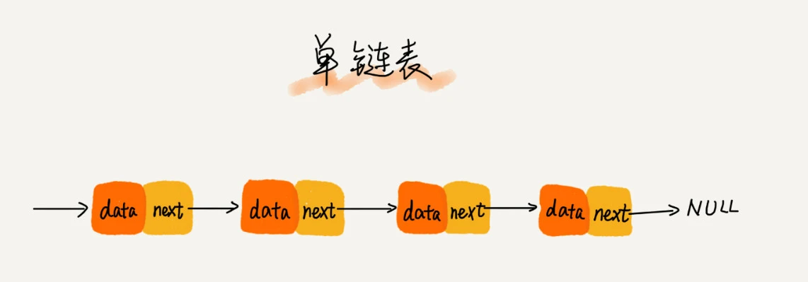
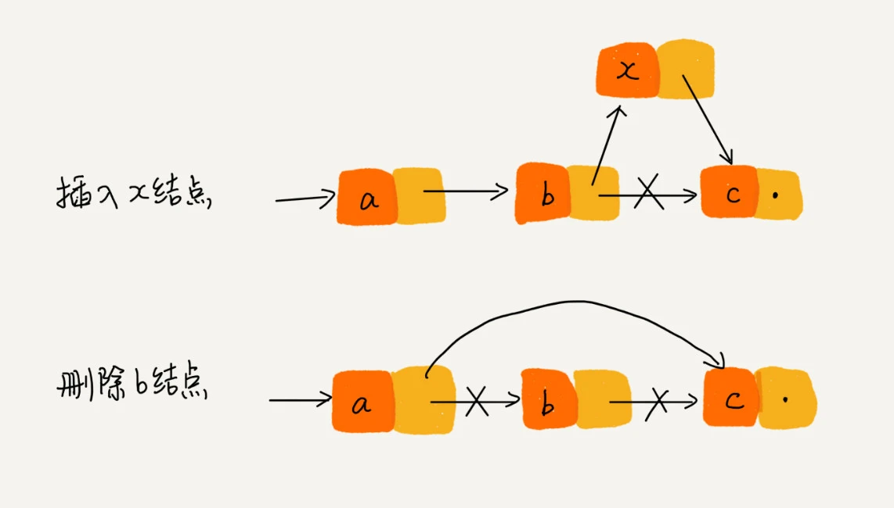
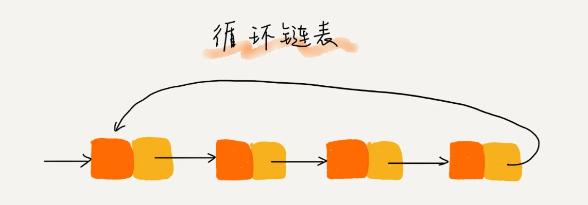
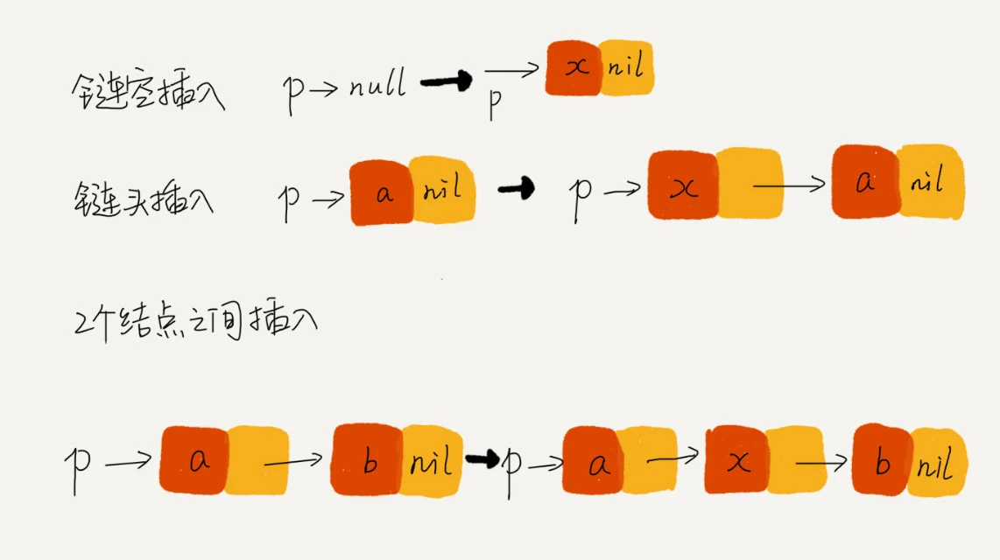

# 链表

**链表**（Linked list）是一种常见的基础数据结构，是一种[线性表](https://zh.wikipedia.org/wiki/线性表)，但是并不会按线性的顺序存储数据，而是在每一个节点里存到下一个节点的[指针](https://zh.wikipedia.org/wiki/指標_(電腦科學))(Pointer)，链表通过“指针”将一组零散的内存块串联起来使用。

## 1. 单链表



其中有两个结点是比较特殊的，它们分别是第一个结点和最后一个结点。我们习惯性地把第一个结点叫作 **头结点**，把最后一个结点叫作 **尾结点**。其中，头结点用来记录链表的基地址。有了它，我们就可以遍历得到整条链表。而尾结点特殊的地方是：指针不是指向下一个结点，而是指向一个 **空地址 NULL**，表示这是链表上最后一个结点。

### 1.1 插入、删除、查找

我们知道，在进行数组的插入、删除操作时，为了保持内存数据的连续性，需要做大量的数据搬移，所以时间复杂度是 O(n)。而在链表中插入或者删除一个数据，我们并不需要为了保持内存的连续性而搬移结点，因为链表的存储空间本身就不是连续的。所以，在链表中插入和删除一个数据是非常快速的。**针对链表的插入和删除操作，我们只需要考虑相邻结点的指针改变，所以对应的时间复杂度是 O(1)。**



但是，有利就有弊。链表要想随机访问第 k 个元素，就没有数组那么高效了。因为链表中的数据并非连续存储的，所以无法像数组那样，根据首地址和下标，通过寻址公式就能直接计算出对应的内存地址，而是需要根据指针一个结点一个结点地依次遍历，直到找到相应的结点。**所以，链表随机访问的性能没有数组好，需要 O(n) 的时间复杂度。**


## 2. 循环链表

**循环链表是一种特殊的单链表**。实际上，循环链表也很简单。它跟单链表唯一的区别就在尾结点。我们知道，单链表的尾结点指针指向空地址，表示这就是最后的结点了。而循环链表的尾结点指针是指向链表的头结点。



循环链表的优点是从链尾到链头比较方便。**当要处理的数据具有环型结构特点时，就特别适合采用循环链表**。


## 3.双向链表

单向链表只有一个方向，结点只有一个后继指针 next 指向后面的结点。而双向链表，顾名思义，它支持两个方向，每个结点不止有一个后继指针 next 指向后面的结点，还有一个前驱指针 prev 指向前面的结点。


> 双向链表需要额外的两个空间来存储后继结点和前驱结点的地址。所以，如果存储同样多的数据，双向链表要比单链表占用更多的内存空间。虽然两个指针比较浪费存储空间，但可以支持双向遍历，这样也带来了双向链表操作的灵活性

### 3.1 优势

从结构上来看，**双向链表可以支持 O(1) 时间复杂度的情况下找到前驱结点**，正是这样的特点，也使双向链表在某些情况下的插入、删除等操作都要比单链表简单、高效。

* **删除给定指针指向的结点。**

  删除某个结点 q 需要知道其前驱结点，而单链表并不支持直接获取前驱结点，所以，为了找到前驱结点，我们还是要从头结点开始遍历链表，直到 p->next=q，说明 p 是 q 的前驱结点。但是对于双向链表来说，这种情况就比较有优势了。因为双向链表中的结点已经保存了前驱结点的指针，不需要像单链表那样遍历。所以，**单链表删除操作需要 O(n) 的时间复杂度，而双向链表只需要在 O(1) 的时间复杂度内就搞定了！**

  同理，如果我们希望在链表的某个指定结点前面插入一个结点，双向链表比单链表有很大的优势。

* **有序链表按值查询**

  对于双向链表来说，我们可以记录上次查找的位置 p，每次查询时，根据要查找的值与 p 的大小关系，决定是往前还是往后查找，所以平均只需要查找一半的数据。
  
### 4 数组 VS 链表
* 插入、删除、随机访问操作的时间复杂度正好相反
 
* 数组简单易用，在实现上使用的是连续的内存空间，可以借助 CPU 的缓存机制，预读数组中的数据，所以访问效率更高
* 链表在内存中并不是连续存储，所以对 CPU 缓存不友好，没办法有效预读。
* 数组的缺点是大小固定，一经声明就要占用整块连续内存空间
* 链表本身没有大小的限制，天然地支持动态扩容

!!!note ""
    如果你的代码对内存的使用非常苛刻，那数组就更适合你。因为链表中的每个结点都需要消耗额外的存储空间去存储一份指向下一个结点的指针，所以内存消耗会翻倍。而且，对链表进行频繁的插入、删除操作，还会导致频繁的内存申请和释放，容易造成内存碎片，如果是 Java 语言，就有可能会导致频繁的 GC（Garbage Collection，垃圾回收）。


## 5. 如何轻松写出正确的链表代码？

### 技巧一：理解指针或引用的含义

我们知道，有些语言有“指针”的概念，比如 C 语言；有些语言没有指针，取而代之的是“引用”，比如 Java、Python。不管是“指针”还是“引用”，实际上，它们的意思都是一样的，都是存储所指对象的内存地址。

**将某个变量赋值给指针，实际上就是将这个变量的地址赋值给指针，或者反过来说，指针中存储了这个变量的内存地址，指向了这个变量，通过指针就能找到这个变量。**

```java
p->next=p->next->next
```

上面这行代码表示，p 结点的 next 指针存储了 p 结点的下下一个结点的内存地址。

### 技巧二：警惕指针丢失和内存泄漏

在结点 p 后面插入一个新的结点 x  **错误写法**

```java
p->next = x;  // 将p的next指针指向x结点；
x->next = p->next;  // 将x的结点的next指针指向原来结点；
```

`p->next` 指针在完成第一步操作之后，已经不再指向原来结点 了，而是指向结点 x。第 2 行代码相当于将 x 赋值给 `x->next`，自己指向自己。因此，整个链表也就断成了两半，从原来结点 往后的所有结点都无法访问到了。对于有些语言来说，比如 C 语言，内存管理是由程序员负责的，如果没有手动释放结点对应的内存空间，就会产生内存泄露。所以，**我们插入结点时，一定要注意操作的顺序**

插入结点 x  **正确写法**

```java
x->next = p->next;  // 将x的结点的next指针指向原来结点；
p->next = x;  // 将p的next指针指向x结点；
```

同理，**删除链表结点时，也一定要记得手动释放内存空间**，否则，也会出现内存泄漏的问题。当然，对于像 Java 这种虚拟机自动管理内存的编程语言来说，就不需要考虑这么多了。

### 技巧三：利用哨兵简化实现难度

**针对链表的插入、删除操作，需要对插入第一个结点和删除最后一个结点的情况进行特殊处理。**

```java
//插入
if (head == null) {
  head = new_node;
}


//删除
if (head->next == null) {
   head = null;
}
```

如果我们引入哨兵结点，在任何时候，不管链表是不是空，head 指针都会一直指向这个哨兵结点。我们也把这种有哨兵结点的链表叫带头链表。相反，没有哨兵结点的链表就叫作不带头链表。**因为哨兵结点一直存在，所以插入第一个结点和插入其他结点，删除最后一个结点和删除其他结点，都可以统一为相同的代码实现逻辑了。**

### 技巧四：重点留意边界条件处理

经常用来检查链表代码是否正确的边界条件有这样几个：

* 如果链表为空时，代码是否能正常工作？
* 如果链表只包含一个结点时，代码是否能正常工作？
* 如果链表只包含两个结点时，代码是否能正常工作？
* 代码逻辑在处理头结点和尾结点的时候，是否能正常工作？


### 技巧五：举例画图，辅助思考

你可以找一个具体的例子，把它画在纸上，释放一些脑容量，留更多的给逻辑思考，这样就会感觉到思路清晰很多。比如往单链表中插入一个数据这样一个操作，一般都是把各种情况都举一个例子，画出插入前和插入后的链表变化，如图所示：




### 技巧六：多写多练，没有捷径

**常用的链表操作**

* 单链表反转
* 链表中环的检测
* 两个有序的链表合并
* 删除链表倒数第 n 个结点
* 求链表的中间结点
