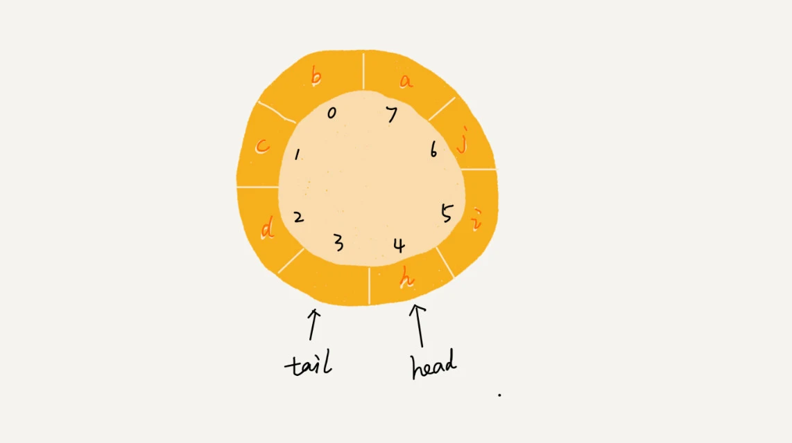

# 队列

## 定义
`队列（queue）`是一种先进先出的、操作受限的线性表。

我们知道，栈只支持两个基本操作：`入栈 push()`和`出栈 pop()`。队列跟栈非常相似，支持的操作也很有限，最基本的操作也是两个：`入队 enqueue()`，放一个数据到队列尾部；`出队 dequeue()`，从队列头部取一个元素。

## 实现
队列的实现有很多种，比如用数组实现，用链表实现，用循环数组实现等等。用数组实现的队列叫作顺序队列，用链表实现的队列叫作链式队列。

### 顺序队列
这里我们用数组实现一个队列。

```java

public class ArrayQueue {
    private String[] items; // 数组
    private int n = 0; // 数组大小
    private int head = 0; // 队头下标
    private int tail = 0; // 队尾下标

    // 申请一个大小为capacity的数组
    public ArrayQueue(int capacity) {
        items = new String[capacity];
        n = capacity;
    }

    // 入队操作，将item放入队尾
    public boolean enqueue(String item) {
        // 如果tail == n 表示队列已经满了
        if (tail == n) return false;
        items[tail] = item;
        ++tail;
        return true;
    }

    // 出队操作，将队头元素返回
    public String dequeue() {
        // 如果head == tail 表示队列为空
        if (head == tail) return null;
        String ret = items[head];
        ++head;
        return ret;
    }
}

```
!!!question "随着不停地进行入队、出队操作，head 和 tail 都会持续往后移动。当 tail 移动到最右边，即使数组中还有空闲空间，也无法继续往队列中添加数据了,这个问题该如何解决呢？"
    如果没有空闲空间了，我们只需要在入队时，再集中触发一次数据的搬移操作
    ```java
    // 入队操作，将item放入队尾
    public boolean enqueue(String item) {
        // tail == n表示队列末尾没有空间了
        if (tail == n) {
        // tail ==n && head==0，表示整个队列都占满了
        if (head == 0) return false;
        // 数据搬移
        for (int i = head; i < tail; ++i) {
            items[i-head] = items[i];
        }
        // 搬移完之后重新更新head和tail
        tail -= head;
        head = 0;
        }
        
        items[tail] = item;
        ++tail;
        return true;
    }
    ```
    
### 链式队列
链式队列的实现跟链表很像，只不过它是单向链表，而且只能从队尾插入元素，从队头删除元素。

```java
public class LinkedQueue {
    // 队列的队头和队尾
    private Node head = null;
    private Node tail = null;

    // 入队
    public void enqueue(String value) {
        if (tail == null) {
            Node newNode = new Node(value, null);
            head = newNode;
            tail = newNode;
        } else {
            tail.next = new Node(value, null);
            tail = tail.next;
        }
    }

    // 出队
    public String dequeue() {
        if (head == null) return null;

        String value = head.data;
        head = head.next;
        if (head == null) {
            tail = null;
        }
        return value;
    }
}

public class Node {
    public String data;
    public Node next;

    public Node(String data, Node next) {
        this.data = data;
        this.next = next;
    }
}

```

### 循环队列

我们刚才用数组来实现队列的时候，在 tail==n 时，会有数据搬移操作，这样入队操作性能就会受到影响。那有没有办法能够避免数据搬移呢？我们来看看循环队列的解决思路。

循环队列是一种特殊的队列，它支持动态扩容。当队列满了之后，我们可以选择将数据搬移到数组的头部，这样就可以继续往队列中添加数据了。

```java
public class CircularQueue {
    // 数组：items，数组大小：n
    private String[] items;
    private int n = 0;
    // head表示队头下标，tail表示队尾下标
    private int head = 0;
    private int tail = 0;

    // 申请一个大小为capacity的数组
    public CircularQueue(int capacity) {
        items = new String[capacity];
        n = capacity;
    }

    // 入队
    public boolean enqueue(String item) {
        // 队列满了当队满时，(tail+1)%n=head
        if ((tail + 1) % n == head) return false;
        items[tail] = item;
        tail = (tail + 1) % n;
        return true;
    }

    // 出队
    public String dequeue() {
        // 如果head == tail 表示队列为空
        if (head == tail) return null;
        String ret = items[head];
        head = (head + 1) % n;
        return ret;
    }
}

```

> 当队列满时，tail 指向的位置实际上是没有存储数据的。所以，循环队列会浪费一个数组的存储空间，如下图：



## 应用

队列这种数据结构很基础，平时的业务开发不大可能从零实现一个队列，甚至都不会直接用到。而一些具有特殊特性的队列应用却比较广泛，比如`阻塞队列`和`并发队列`。

### 阻塞队列

`阻塞队列`其实就是在队列基础上增加了阻塞操作。简单来说，就是在队列为空的时候，从队头取数据会被阻塞。因为此时还没有数据可取，直到队列中有了数据才能返回；如果队列已经满了，那么插入数据的操作就会被阻塞，直到队列中有空闲位置后再插入数据，然后再返回。

我们可以使用阻塞队列，轻松实现一个`“生产者 - 消费者模型”`！这种基于阻塞队列实现的`“生产者 - 消费者模型”`，可以有效地协调生产和消费的速度。当“生产者”生产数据的速度过快，“消费者”来不及消费时，存储数据的队列很快就会满了。这个时候，生产者就阻塞等待，直到“消费者”消费了数据，“生产者”才会被唤醒继续“生产”。


### 并发队列

线程安全的队列我们叫作`并发队列`。最简单直接的实现方式是直接在 enqueue()、dequeue() 方法上加锁，但是锁粒度大并发度会比较低，同一时刻仅允许一个存或者取操作。实际上，**基于数组的循环队列，利用 CAS 原子操作，可以实现非常高效的并发队列。这也是循环队列比链式队列应用更加广泛的原因。**

> 对于大部分资源有限的场景，当没有空闲资源时，基本上都可以通过“队列”这种数据结构来实现请求排队。比如，操作系统中的进程调度、数据库连接池、线程池、消息队列等等，都是典型的“队列”应用场景。