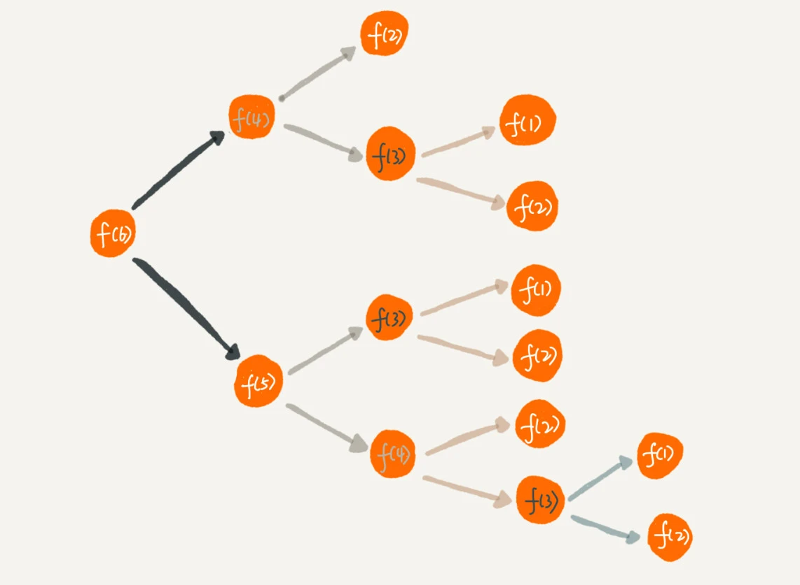

# 递归

## 定义

在数学与计算机科学中，是指在**函数的定义中使用函数自身的方法**

### 递归需要满足的三个条件

1. 一个问题的解可以分解为几个子问题的解
2. 这个问题与分解之后的子问题，除了数据规模不同，求解思路完全一样
3. 存在递归终止条件

## 递归的实现

写递归代码最关键的是 **写出递推公式，找到终止条件**，另外还要注意 **防止堆栈溢出和重复计算**

!!! warning ""
    编写递归代码的关键是，只要遇到递归，我们就把它抽象成一个递推公式，**不用想一层层的调用关系，不要试图用人脑去分解递归的每个步骤**。

    计算机擅长做重复的事情，所以递归正合它的胃口。而我们人脑更喜欢平铺直叙的思维方式。当我们看到递归时，我们总想把递归平铺展开，脑子里就会循环，一层一层往下调，然后再一层一层返回，试图想搞清楚计算机每一步都是怎么执行的，这样就很容易被绕进去。

### 实例

假如这里有 n 个台阶，每次你可以跨 1 个台阶或者 2 个台阶，请问走这 n 个台阶有多少种走法？如果有 7 个台阶，你可以 2，2，2，1 这样子上去，也可以 1，2，1，1，2 这样子上去，总之走法有很多，那如何用编程求得总共有多少种走法呢？

**1. 递推公式**

实际上，可以根据第一步的走法把所有走法分为两类，第一类是第一步走了 1 个台阶，另一类是第一步走了 2 个台阶。所以 n 个台阶的走法就等于先走 1 阶后，n-1 个台阶的走法 加上先走 2 阶后，n-2 个台阶的走法。用公式表示就是：

```java
f(n) = f(n-1) + f(n-2)
```

**2. 终止条件**

当有一个台阶时，只有一种走法;当有两个台阶时，有两种走法，一步走完或者分两步来走

```java
f(1) = 1
f(2) = 2
```

**3.代码实现**

```java
public class ClimbStairs {
    public int climbStairs(int n) {
        if (n == 1) {
            return 1;
        }
        if (n == 2) {
            return 2;
        }
        return climbStairs(n - 1) + climbStairs(n - 2);
    }
}
```

**4. 重复计算**

如果我们把整个递归过程分解一下的话，那就是这样的：


从图中，我们可以直观地看到，想要计算 f(5)，需要先计算 f(4) 和 f(3)，而计算 f(4) 还需要计算 f(3)，因此，f(3) 就被计算了很多次，这就是重复计算问题。

为了避免重复计算，我们可以通过一个数据结构（比如散列表）来保存已经求解过的 f(k)。当递归调用到 f(k) 时，先看下是否已经求解过了。如果是，则直接从散列表中取值返回，不需要重复计算，这样就能避免刚讲的问题了。

```java
public class ClimbStairs {
    private Map<Integer, Integer> cache = new HashMap<>();

    public int climbStairs(int n) {
        if (n == 1) {
            return 1;
        }
        if (n == 2) {
            return 2;
        }
        if (cache.containsKey(n)) {
            return cache.get(n);
        }
        int result = climbStairs(n - 1) + climbStairs(n - 2);
        cache.put(n, result);
        return result;
    }
}
```

**5. 防止堆栈溢出**

如果 n 很大，比如 10000，那么递归调用就会有 10000 层，这样就会导致堆栈溢出。

为了避免这个问题，我们可以通过在代码中限制递归调用的最大深度的方式来解决这个问题。

```java
public class ClimbStairs {
    private Map<Integer, Integer> cache = new HashMap<>();
    // 全局变量，表示递归的深度。
    int depth = 0;
    public int climbStairs(int n) {
        ++depth；
        if (depth > 1000) {
            //伪代码，抛出异常
            throw exception;    
        }
        if (n == 1) {
            return 1;
        }
        if (n == 2) {
            return 2;
        }
        if (cache.containsKey(n)) {
            return cache.get(n);
        }
        int result = climbStairs(n - 1) + climbStairs(n - 2);
        cache.put(n, result);
        return result;
    }
}
```

另外， 我们也可以把递归改写成迭代循环，这样就不会有堆栈溢出的问题了。

```java
public class ClimbStairs {
    public int climbStairs(int n) {
        if (n == 1) {
            return 1;
        }
        int first = 1;
        int second = 2;
        for (int i = 3; i <= n; i++) {
            int third = first + second;
            first = second;
            second = third;
        }
        return second;
    }
}
```

!!! question "是不是所有的递归代码都可以改为这种迭代循环的非递归写法呢？"
    笼统地讲，是的。因为递归本身就是借助栈来实现的，只不过我们使用的栈是系统或者虚拟机本身提供的，我们没有感知罢了。如果我们自己在内存堆上实现栈，手动模拟入栈、出栈过程，这样任何递归代码都可以改写成看上去不是递归代码的样子。
    
    但是这种思路实际上是将递归改为了“手动”递归，本质并没有变，而且也并没有解决前面讲到的某些问题，徒增了实现的复杂度。


## 题外话

我们平时调试代码喜欢使用 IDE 的单步跟踪功能，像规模比较大、递归层次很深的递归代码，几乎无法使用这种调试方式。对于递归代码，有什么好的调试方法呢？

1. 打印日志发现，递归值。
2. 结合条件断点进行调试。
