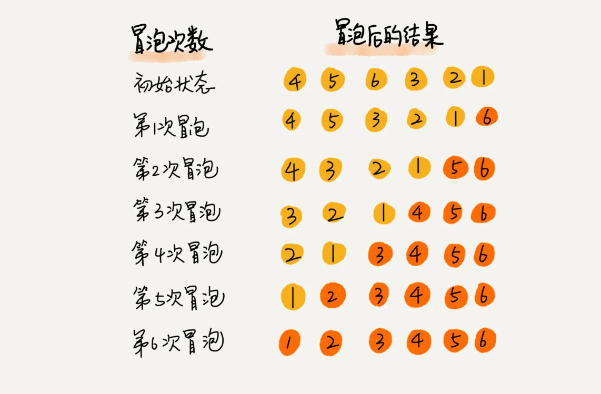

# 排序

## 如何分析一个“排序算法”？

### 排序算法的执行效率

1. 最好情况、最坏情况、平均情况时间复杂度

2. 时间复杂度的系数、常数 、低阶

   我们知道，时间复杂度反映的是数据规模 n 很大的时候的一个增长趋势，所以它表示的时候会忽略系数、常数、低阶。但是实际的软件开发中，我们排序的可能是 10 个、100 个、1000 个这样规模很小的数据，所以，在对同一阶时间复杂度的排序算法性能对比的时候，我们就要把系数、常数、低阶也考虑进来。

3. 比较次数和交换（或移动）次数

​		基于比较的排序算法的执行过程，会涉及两种操作，一种是元素比较大小，另一种是元素交换或移动。所以，如果我们在分析排序算法的执行效率的时候，应该把比较次数和交换（或移动）次数也考虑进去。

### 排序算法的内存消耗

> **原地排序（Sorted in place ）**: 特指空间复杂度是 O(1) 的排序算法。

### 排序算法的稳定性

> **稳定性** : 如果待排序的序列中存在值相等的元素，经过排序之后，相等元素之间原有的先后顺序不变。

## 冒泡排序（Bubble Sort）

### 定义

冒泡排序只会操作相邻的两个数据。每次冒泡操作都会对相邻的两个元素进行比较，看是否满足大小关系要求。如果不满足就让它俩互换。一次冒泡会让至少一个元素移动到它应该在的位置，重复 n 次，就完成了 n 个数据的排序工作。

举个例子，我们要对一组数据 4，5，6，3，2，1，从小到大进行排序。第一次冒泡操作的详细过程就是这样：


可以看出，经过一次冒泡操作之后，6 这个元素已经存储在正确的位置上。要想完成所有数据的排序，我们只要进行 6 次这样的冒泡操作就行了。



### 实现

```java

// 冒泡排序，a表示数组，n表示数组大小
public void bubbleSort(int[] a, int n) {
  if (n <= 1) return;
 
 for (int i = 0; i < n; ++i) {
    // 提前退出冒泡循环的标志位
    boolean flag = false;
    for (int j = 0; j < n - i - 1; ++j) {
      if (a[j] > a[j+1]) { // 交换
        int tmp = a[j];
        a[j] = a[j+1];
        a[j+1] = tmp;
        flag = true;  // 表示有数据交换      
      }
    }
    if (!flag) break;  // 没有数据交换，提前退出
  }
}
```

#### 分析

1. 冒泡排序是原地排序算法

   冒泡的过程只涉及相邻数据的交换操作，只需要常量级的临时空间，所以它的空间复杂度为 O(1)，是一个原地排序算法。

2. 冒泡排序是稳定的排序算法

   在冒泡排序中，只有交换才可以改变两个元素的前后顺序。为了保证冒泡排序算法的稳定性，当有相邻的两个元素大小相等的时候，我们不做交换，相同大小的数据在排序前后不会改变顺序，所以冒泡排序是稳定的排序算法。

3. 冒泡排序的时间复杂度是O(n2)

   最好情况下，要排序的数据已经是有序的了，我们只需要进行一次冒泡操作，就可以结束了，所以最好情况时间复杂度是 O(n)。而最坏的情况是，要排序的数据刚好是倒序排列的，我们需要进行 n 次冒泡操作，所以最坏情况时间复杂度为 O(n2)。平均情况下的时间复杂度是 O(n2)

​	