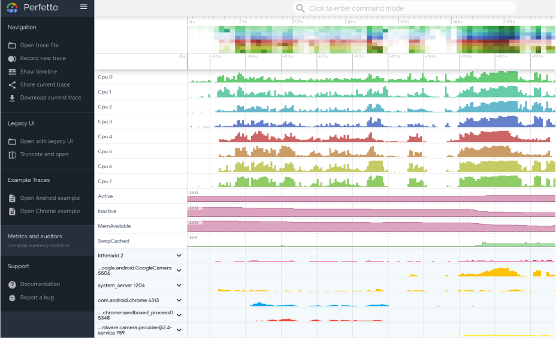

# Perfetto 简介
## 什么是 Perfetto
Perfetto 是 Android 10 中引入的平台级跟踪工具。这是适用于 Android、Linux 和 Chrome 的成熟开源跟踪项目。与 Systrace 不同，它提供数据源超集，可让您以协议缓冲区二进制流形式记录任意长度的跟踪记录。您可以在 [Perfetto 界面](https://ui.perfetto.dev/#!/)中打开这些跟踪记录。

Systrace 是平台提供的旧版命令行工具，可记录短时间内的设备活动，并保存在压缩的文本文件中。该工具会生成一份报告，其中汇总了 Android 内核中的数据，例如 CPU 调度程序、磁盘活动和应用线程。Systrace 适用于 Android 4.3（API 级别 18）及更高版本的所有平台版本，但建议将 Perfetto 用于运行 Android 10 及更高版本的设备。

下面是Perfetto 跟踪记录视图示例，其中显示了与某个应用之间大约 20 秒的交互情况

下面 是Systrace HTML 报告示例，其中显示了与某个应用之间 5 秒的交互情况

这两份报告都提供了 Android 设备在给定时间段内的系统进程的总体情况。该报告还检查了捕获到的跟踪信息，以突出显示发现的问题（例如界面卡顿或耗电量高）。

Perfetto 和 Systrace 可交互使用：

在 Perfetto 界面中打开 Perfetto 文件和 Systrace 文件。在 Perfetto 界面中使用旧版 Systrace 查看器打开 Systrace 文件（使用 Open with legacy UI 链接）。
使用 `traceconv` 工具将 [Perfetto 跟踪记录转换为旧版 Systrace 文本格式](https://perfetto.dev/docs/quickstart/traceconv)。

### Perfetto 的优势
Perfetto 提供了 Systrace 的所有功能，还提供了以下功能：

* 与 Systrace 不同，Perfetto 可以记录任意长度的跟踪记录。您可以在设备上运行跟踪记录，直到您认为已收集到足够的数据为止。
* Perfetto 提供了更多的数据源，包括 GPU、内存、网络、电池和更多。
* Perfetto 提供了更多的跟踪记录格式，包括 JSON、HTML 和 Protocol Buffer。
* Perfetto 提供了更多的跟踪记录分析工具，包括 [命令行工具](https://developer.android.com/studio/command-line/perfetto)、 [Perfetto UI](https://ui.perfetto.dev/#!/)、
  [通过设备直接捕捉记录](https://developer.android.com/topic/performance/tracing/on-device)。

### Perfetto 的限制

* Perfetto 不支持 Android 4.3（API 级别 18）及更低版本的设备。

## 使用 Perfetto

### Perfetto UI

[Perfetto UI](https://ui.perfetto.dev/#!/) 是一个 Web 应用程序，可在浏览器中使用。您可以使用 Perfetto UI 查看 Perfetto 跟踪记录，以及使用 Perfetto UI 生成跟踪记录。

> 需要先停止adb server(执行`adb kill-server`)
> 关掉Android Studio或者其他使用adb的程序

